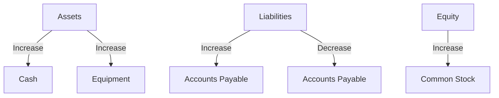

## 1.2 The Accounting Equation

The accounting equation is the cornerstone of the double-entry bookkeeping system, which is fundamental to modern accounting practices. This equation, expressed as **Assets = Liabilities + Equity**, provides a snapshot of a company's financial position at any given time. Understanding this equation is crucial for anyone preparing for Canadian accounting exams, as it forms the basis for all financial reporting and analysis.

### Understanding the Components

#### Assets

Assets are resources owned by a company that are expected to provide future economic benefits. They are classified into two main categories:

1. **Current Assets**: These are assets that are expected to be converted into cash or used up within one year. Examples include cash, accounts receivable, inventory, and short-term investments.

2. **Non-current Assets**: These are assets that are expected to provide economic benefits beyond one year. They include property, plant, and equipment (PPE), intangible assets, and long-term investments.

#### Liabilities

Liabilities represent obligations that a company owes to external parties. They are also divided into two categories:

1. **Current Liabilities**: These are obligations that are expected to be settled within one year. Examples include accounts payable, short-term debt, and accrued expenses.

2. **Non-current Liabilities**: These are obligations that are due beyond one year. They include long-term debt, lease obligations, and pension liabilities.

#### Equity

Equity, also known as shareholders' equity or owners' equity, represents the residual interest in the assets of a company after deducting liabilities. It is essentially what the owners of the company own. Equity is composed of:

1. **Common Stock**: Represents ownership in a company and a claim on a portion of profits.

2. **Preferred Stock**: A type of equity that has a higher claim on assets and earnings than common stock.

3. **Retained Earnings**: The accumulated net income that has been retained in the company rather than distributed to shareholders as dividends.

4. **Additional Paid-in Capital**: The amount received from shareholders in excess of the par value of the stock.

5. **Accumulated Other Comprehensive Income**: Includes unrealized gains and losses that are not included in net income.

### The Equation in Action

The accounting equation must always balance, meaning the total value of a company's assets must equal the sum of its liabilities and equity. This balance is maintained through the double-entry system, where every transaction affects at least two accounts. For example, when a company takes out a loan, its assets (cash) increase, and its liabilities (loan payable) also increase, keeping the equation balanced.

#### Example

Consider a company, ABC Corp., with the following financial position:

- Assets: $500,000
- Liabilities: $300,000
- Equity: $200,000

The accounting equation for ABC Corp. is:

 \text{Assets} = \text{Liabilities} + \text{Equity} 

 \$500,000 = \$300,000 + \$200,000 

This equation is balanced, reflecting the company's financial position accurately.

### Practical Applications

Understanding the accounting equation is essential for preparing financial statements, analyzing financial health, and making informed business decisions. It is also crucial for compliance with Canadian accounting standards, such as IFRS and ASPE.

#### Financial Statements

The accounting equation is the foundation of the balance sheet, which provides a snapshot of a company's financial position at a specific point in time. The balance sheet is divided into three sections: assets, liabilities, and equity, each reflecting the components of the accounting equation.

#### Financial Analysis

Analysts use the accounting equation to assess a company's financial health. Ratios such as the debt-to-equity ratio and the current ratio are derived from the equation and provide insights into a company's leverage and liquidity.

### Real-world Example: Canadian Context

In Canada, companies adhere to IFRS or ASPE, depending on their size and nature. For instance, a large publicly traded company like Shopify Inc. uses IFRS to prepare its financial statements. The accounting equation plays a crucial role in ensuring that Shopify's financial statements are accurate and comply with regulatory requirements.

### Case Study: Impact of Transactions

Let's examine how different transactions affect the accounting equation for a hypothetical Canadian company, Maple Leaf Enterprises.

1. **Issuing Common Stock**: Maple Leaf issues $50,000 of common stock. This increases both assets (cash) and equity (common stock).

    \text{Assets} = \text{Liabilities} + \text{Equity} 

    \text{Increase in Cash} = \text{Increase in Common Stock} 

2. **Purchasing Equipment**: The company buys equipment worth $30,000 on credit. This increases assets (equipment) and liabilities (accounts payable).

    \text{Increase in Equipment} = \text{Increase in Accounts Payable} 

3. **Paying Off Debt**: Maple Leaf pays off $10,000 of its accounts payable. This decreases both assets (cash) and liabilities (accounts payable).

    \text{Decrease in Cash} = \text{Decrease in Accounts Payable} 

### Diagrams and Visuals

To better understand the flow of transactions and their impact on the accounting equation, consider the following diagram:

This diagram illustrates how different transactions affect the components of the accounting equation.

### Best Practices and Common Pitfalls

#### Best Practices

- **Regularly Reconcile Accounts**: Ensure that all accounts are reconciled regularly to maintain the balance of the accounting equation.
- **Accurate Record-keeping**: Maintain accurate records of all transactions to prevent discrepancies in financial statements.
- **Understand the Impact of Transactions**: Analyze how each transaction affects the accounting equation and the overall financial position.

#### Common Pitfalls

- **Ignoring Non-cash Transactions**: Non-cash transactions, such as depreciation, can affect the accounting equation and should not be overlooked.
- **Misclassifying Accounts**: Proper classification of accounts is essential to maintain the integrity of the accounting equation.
- **Overlooking Adjustments**: Adjustments, such as accrued expenses, must be accounted for to ensure accurate financial reporting.

### Regulatory Considerations

In Canada, companies must adhere to specific accounting standards, such as IFRS for public companies and ASPE for private enterprises. These standards provide guidelines on how to apply the accounting equation in financial reporting.

#### IFRS and ASPE

- **IFRS**: International Financial Reporting Standards are used by publicly accountable enterprises in Canada. They provide a global framework for financial reporting.
- **ASPE**: Accounting Standards for Private Enterprises are designed for private companies in Canada, offering a simplified framework compared to IFRS.

### Exam Preparation and Tips

For Canadian accounting exams, understanding the accounting equation is crucial. Here are some tips to help you prepare:

- **Practice with Real-world Scenarios**: Apply the accounting equation to real-world scenarios to deepen your understanding.
- **Use Mnemonics**: Create mnemonics to remember the components of the accounting equation and their relationships.
- **Review Past Exam Questions**: Practice with past exam questions to familiarize yourself with the format and types of questions.

### Summary

The accounting equation is a fundamental concept in accounting that provides the foundation for financial reporting and analysis. By understanding how assets, liabilities, and equity interact, you can gain insights into a company's financial health and make informed decisions. This knowledge is essential for success in Canadian accounting exams and professional practice.

## **Ready to Test Your Knowledge?**



### What is the accounting equation?

- [x] Assets = Liabilities + Equity
- [ ] Assets = Liabilities - Equity
- [ ] Assets = Equity - Liabilities
- [ ] Assets = Liabilities x Equity

> **Explanation:** The accounting equation is Assets = Liabilities + Equity, representing the relationship between a company's resources and claims on those resources.

### Which of the following is a current asset?

- [x] Inventory
- [ ] Long-term investments
- [ ] Equipment
- [ ] Goodwill

> **Explanation:** Inventory is a current asset because it is expected to be converted into cash or used up within one year.

### What happens to the accounting equation when a company issues common stock?

- [x] Assets increase, and equity increases
- [ ] Assets decrease, and equity decreases
- [ ] Liabilities increase, and equity decreases
- [ ] Liabilities decrease, and equity increases

> **Explanation:** Issuing common stock increases both assets (cash) and equity (common stock).

### How does purchasing equipment on credit affect the accounting equation?

- [x] Assets increase, and liabilities increase
- [ ] Assets decrease, and liabilities decrease
- [ ] Assets increase, and equity increases
- [ ] Liabilities decrease, and equity decreases

> **Explanation:** Purchasing equipment on credit increases assets (equipment) and liabilities (accounts payable).

### What is the impact of paying off a debt on the accounting equation?

- [x] Assets decrease, and liabilities decrease
- [ ] Assets increase, and liabilities increase
- [ ] Assets decrease, and equity decreases
- [ ] Liabilities increase, and equity increases

> **Explanation:** Paying off debt decreases both assets (cash) and liabilities (accounts payable).

### Which financial statement is based on the accounting equation?

- [x] Balance Sheet
- [ ] Income Statement
- [ ] Statement of Cash Flows
- [ ] Statement of Retained Earnings

> **Explanation:** The balance sheet is based on the accounting equation, showing a company's financial position at a specific point in time.

### What is the role of retained earnings in the accounting equation?

- [x] Part of equity
- [ ] Part of liabilities
- [ ] Part of assets
- [ ] Not part of the accounting equation

> **Explanation:** Retained earnings are part of equity, representing accumulated net income retained in the company.

### Which accounting standard is used by publicly accountable enterprises in Canada?

- [x] IFRS
- [ ] ASPE
- [ ] GAAP
- [ ] FASB

> **Explanation:** IFRS (International Financial Reporting Standards) is used by publicly accountable enterprises in Canada.

### What is the effect of depreciation on the accounting equation?

- [x] Decreases assets and equity
- [ ] Increases assets and liabilities
- [ ] Decreases liabilities and equity
- [ ] Increases equity and liabilities

> **Explanation:** Depreciation decreases assets (accumulated depreciation) and equity (retained earnings).

### True or False: The accounting equation must always balance.

- [x] True
- [ ] False

> **Explanation:** The accounting equation must always balance to ensure accurate financial reporting and analysis.


