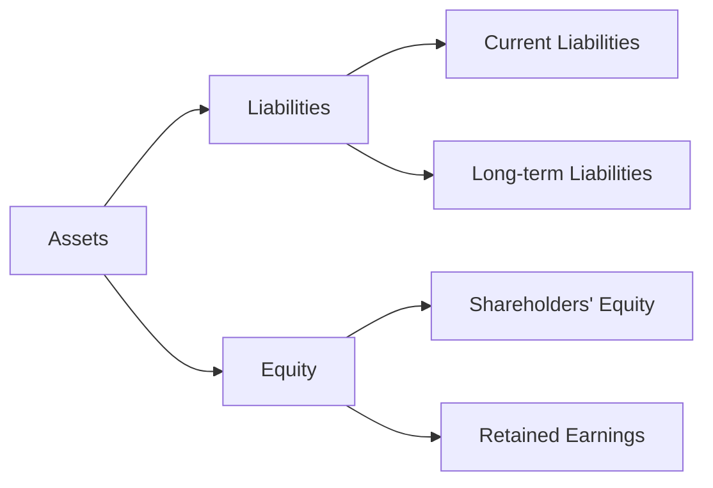

## 1.3 Definitions of Liabilities and Equities

Understanding the definitions of liabilities and equities is fundamental for anyone preparing for Canadian accounting exams. These concepts are not only pivotal in financial reporting but also form the backbone of the accounting equation. This section provides a detailed exploration of liabilities and equities, distinguishing between current and long-term liabilities, and various equity instruments. By the end of this section, you will have a clear understanding of these concepts, supported by practical examples and real-world applications.

### Understanding Liabilities

Liabilities are obligations that a company owes to external parties. They represent future sacrifices of economic benefits that the entity is required to make to other entities as a result of past transactions or events. Liabilities are classified into two main categories: current liabilities and long-term liabilities.

#### Current Liabilities

Current liabilities are obligations that are expected to be settled within one year or the entity's operating cycle, whichever is longer. They are crucial in assessing a company's short-term financial health and liquidity. Here are some common types of current liabilities:

- **Accounts Payable:** Amounts owed to suppliers for goods or services purchased on credit. For example, if a company buys office supplies on credit, the amount due is recorded as accounts payable.

- **Short-term Notes Payable:** These are written promises to pay a certain amount of money on a specified future date, usually within a year. An example is a short-term bank loan.

- **Accrued Expenses and Liabilities:** These are expenses that have been incurred but not yet paid. For instance, wages payable to employees for work performed but not yet paid.

- **Unearned Revenues:** Money received before services are performed or goods are delivered. An example is a subscription service payment received in advance.

- **Dividends Payable:** Dividends that have been declared by a company but not yet paid to shareholders.

- **Payroll Liabilities:** Amounts owed to employees for salaries and wages, including deductions for taxes and other withholdings.

- **Taxes Payable:** Taxes owed to the government that have not yet been paid.

- **Current Maturities of Long-term Debt:** The portion of long-term debt that is due within the next year.

- **Customer Advances and Deposits:** Payments received from customers before the delivery of goods or services.

- **Warranty Obligations:** Estimated costs associated with future warranty claims.

- **Contingent Liabilities (Current Portion):** Potential liabilities that may arise depending on the outcome of a future event.

- **Bank Overdrafts:** Negative balances in bank accounts that are repayable on demand.

- **Notes Payable Discounting:** The process of selling a note payable at a discount to raise cash.

- **Sales Taxes Payable:** Sales taxes collected from customers on behalf of the government.

- **Interest Payable:** Interest that has accrued on loans or other borrowings but has not yet been paid.

- **Other Current Liabilities:** Miscellaneous obligations that do not fit into the above categories.

#### Long-term Liabilities

Long-term liabilities are obligations that are not expected to be settled within one year or the operating cycle. They are important for understanding a company's long-term financial stability and capital structure. Common types of long-term liabilities include:

- **Bonds Payable:** Long-term debt securities issued by a company to raise capital. They typically have a fixed interest rate and maturity date.

- **Long-term Notes Payable:** Similar to short-term notes payable but with a maturity date beyond one year.

- **Lease Obligations:** Long-term commitments to lease property or equipment.

- **Pension Liabilities:** Obligations to pay future pension benefits to employees.

- **Post-retirement Benefits Other Than Pensions:** Obligations to provide benefits such as healthcare to retirees.

- **Deferred Tax Liabilities:** Taxes that are owed but not yet payable, often due to differences between accounting and tax treatment of certain items.

- **Asset Retirement Obligations:** Obligations to dismantle or remove long-lived assets at the end of their useful lives.

- **Contingent Liabilities:** Potential liabilities that depend on the outcome of uncertain future events.

- **Debenture Issuance:** Unsecured debt instruments issued by a company.

- **Covenants and Restrictions:** Conditions imposed by lenders to protect their interests.

- **Convertible Debt:** Debt that can be converted into equity at the option of the holder.

- **Sinking Fund Requirements:** Obligations to set aside funds for the repayment of debt.

- **Fair Value Option for Liabilities:** An option to measure liabilities at their fair value.

- **Off-Balance Sheet Financing:** Financing arrangements that do not appear on the balance sheet.

- **Loan Covenants Compliance:** Adherence to conditions set by lenders.

- **Eurobonds and Foreign Debt:** Debt issued in a currency other than the issuer's domestic currency.

### Understanding Equities

Equity represents the residual interest in the assets of an entity after deducting liabilities. It is essentially the ownership interest of shareholders in a company. Equity is divided into several components, each representing different aspects of ownership and financial performance.

#### Components of Shareholders' Equity

- **Common Stock:** Represents ownership interests in a company. Holders of common stock have voting rights and may receive dividends.

- **Preferred Stock:** A class of stock with preferential rights over common stock, often including fixed dividends and priority in liquidation.

- **Additional Paid-in Capital:** The excess amount paid by investors over the par value of the stock.

- **Retained Earnings:** Cumulative net income that has been retained in the company rather than distributed as dividends.

- **Treasury Stock:** Shares that have been repurchased by the company and are held in its treasury.

- **Accumulated Other Comprehensive Income:** Includes unrealized gains and losses on certain investments and foreign currency translation adjustments.

- **Stock Dividends and Stock Splits:** Distributions of additional shares to shareholders, which do not affect the overall value of equity.

- **Equity Instruments with Debt Features:** Hybrid instruments that have characteristics of both equity and debt.

- **Non-controlling Interests:** The portion of equity in a subsidiary not attributable to the parent company.

- **Quasi-Reorganizations:** Accounting adjustments to eliminate deficits in retained earnings.

- **Book Value per Share:** A measure of the net asset value per share of stock.

- **Callable and Redeemable Shares:** Shares that can be repurchased by the company at a specified price.

- **Equity-based Compensation:** Compensation to employees in the form of stock options or shares.

- **Liquidation Preferences:** The order of priority in which shareholders receive distributions in the event of liquidation.

- **Equity-method Investments:** Investments in which the investor has significant influence over the investee.

- **Disclosure Requirements for Equity:** Information that must be disclosed in financial statements regarding equity transactions.

### Practical Examples and Case Studies

#### Example 1: Accounting for Current Liabilities

Consider a company, ABC Ltd., that purchases inventory worth $50,000 on credit. The transaction is recorded as follows:

- **Debit Inventory:** $50,000
- **Credit Accounts Payable:** $50,000

This entry reflects the company's obligation to pay the supplier in the future, classifying it as a current liability.

#### Example 2: Accounting for Long-term Liabilities

XYZ Corp. issues bonds with a face value of $1,000,000, a 5% interest rate, and a maturity of 10 years. The accounting entry at issuance is:

- **Debit Cash:** $1,000,000
- **Credit Bonds Payable:** $1,000,000

This entry recognizes the long-term obligation to bondholders.

#### Example 3: Equity Transactions

LMN Inc. issues 10,000 shares of common stock with a par value of $1 at $10 per share. The entry is:

- **Debit Cash:** $100,000
- **Credit Common Stock:** $10,000
- **Credit Additional Paid-in Capital:** $90,000

This transaction reflects the equity raised and the additional paid-in capital.

### Real-world Applications and Regulatory Scenarios

In Canada, the recognition and measurement of liabilities and equities are governed by the International Financial Reporting Standards (IFRS) as adopted by the Canadian Accounting Standards Board (AcSB). For private enterprises, the Accounting Standards for Private Enterprises (ASPE) apply. These standards provide guidance on the classification, measurement, and disclosure of liabilities and equities.

#### IFRS and ASPE Considerations

- **IFRS:** Under IFRS, liabilities and equities are defined and measured based on the substance of the transaction rather than its legal form. This approach ensures that financial statements reflect the economic reality of transactions.

- **ASPE:** ASPE provides a simplified framework for private enterprises, focusing on cost-effective financial reporting. It allows for certain exemptions and simplifications compared to IFRS.

### Diagrams and Visual Aids

To enhance understanding, let's visualize the relationship between liabilities, equities, and the accounting equation:

This diagram illustrates how assets are financed through liabilities and equity, emphasizing the balance maintained by the accounting equation.

### Best Practices and Common Pitfalls

- **Best Practices:** Ensure accurate classification of liabilities and equities to reflect the true financial position of the company. Regularly review and update financial statements to comply with current standards.

- **Common Pitfalls:** Misclassification of liabilities and equities can lead to inaccurate financial reporting. Be cautious of contingent liabilities and ensure they are properly disclosed.

### References and Further Reading

- **CPA Canada:** Offers resources and guidance on Canadian accounting standards.
- **IFRS Foundation:** Provides comprehensive information on IFRS standards.
- **Canadian Accounting Standards Board (AcSB):** Responsible for setting accounting standards in Canada.

### Summary

Understanding the definitions and classifications of liabilities and equities is crucial for accurate financial reporting and analysis. By distinguishing between current and long-term liabilities and various equity instruments, you can better assess a company's financial health and performance. This knowledge is essential for success in Canadian accounting exams and professional practice.

## **Ready to Test Your Knowledge?**



### Which of the following is considered a current liability?

- [x] Accounts Payable
- [ ] Bonds Payable
- [ ] Deferred Tax Liabilities
- [ ] Retained Earnings

> **Explanation:** Accounts payable are obligations due within one year, making them a current liability.

### What is the primary characteristic of long-term liabilities?

- [ ] They are settled within one year.
- [x] They are obligations not expected to be settled within one year.
- [ ] They are always interest-bearing.
- [ ] They are contingent on future events.

> **Explanation:** Long-term liabilities are obligations that are not expected to be settled within one year.

### Which component of equity represents cumulative net income retained in the company?

- [ ] Common Stock
- [ ] Preferred Stock
- [x] Retained Earnings
- [ ] Treasury Stock

> **Explanation:** Retained earnings represent the cumulative net income retained in the company rather than distributed as dividends.

### What is the accounting entry for issuing common stock above par value?

- [x] Debit Cash, Credit Common Stock, Credit Additional Paid-in Capital
- [ ] Debit Common Stock, Credit Cash
- [ ] Debit Additional Paid-in Capital, Credit Common Stock
- [ ] Debit Cash, Credit Retained Earnings

> **Explanation:** Issuing common stock above par value involves debiting cash and crediting both common stock and additional paid-in capital.

### Which of the following is an example of a contingent liability?

- [ ] Accounts Payable
- [ ] Bonds Payable
- [x] Warranty Obligations
- [ ] Retained Earnings

> **Explanation:** Warranty obligations are contingent liabilities as they depend on future events.

### What is the purpose of the fair value option for liabilities?

- [ ] To increase liabilities on the balance sheet
- [x] To measure liabilities at their fair value
- [ ] To decrease liabilities on the balance sheet
- [ ] To eliminate liabilities from the balance sheet

> **Explanation:** The fair value option allows liabilities to be measured at their fair value, reflecting current market conditions.

### How are treasury stocks reported in the financial statements?

- [ ] As an asset
- [x] As a reduction in equity
- [ ] As a liability
- [ ] As an expense

> **Explanation:** Treasury stocks are reported as a reduction in equity since they represent shares repurchased by the company.

### Which of the following is a characteristic of preferred stock?

- [ ] Voting rights
- [x] Fixed dividends
- [ ] No priority in liquidation
- [ ] Convertible to common stock

> **Explanation:** Preferred stock often has fixed dividends and priority in liquidation over common stock.

### What is the accounting treatment for dividends payable?

- [x] Recognized as a current liability
- [ ] Recognized as an expense
- [ ] Recognized as an asset
- [ ] Recognized as equity

> **Explanation:** Dividends payable are recognized as a current liability as they represent amounts owed to shareholders.

### True or False: Equity represents the ownership interest of shareholders in a company.

- [x] True
- [ ] False

> **Explanation:** Equity represents the ownership interest of shareholders in a company, reflecting their residual claim on the company's assets after liabilities are deducted.


