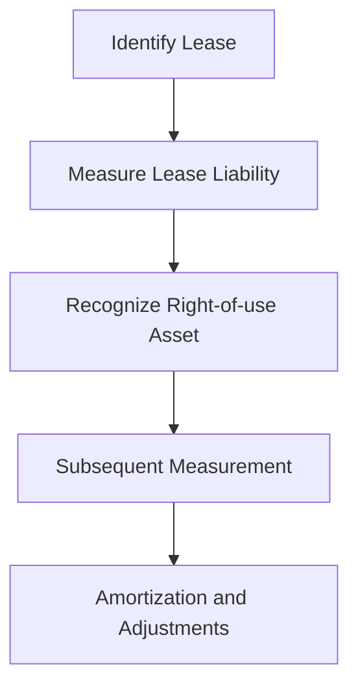

## 1.5 Regulatory Framework

Understanding the regulatory framework that governs the accounting treatment of liabilities and equities is crucial for anyone preparing for the Canadian Accounting Exams. This section delves into the key accounting standards, primarily focusing on Generally Accepted Accounting Principles (GAAP) and International Financial Reporting Standards (IFRS), which are instrumental in shaping the financial reporting landscape in Canada and globally. 

### Overview of Accounting Standards

Accounting standards are essential guidelines that dictate how financial transactions should be recorded and reported. They ensure consistency, reliability, and transparency in financial statements, making them comprehensible to investors, regulators, and other stakeholders. In Canada, the primary accounting frameworks are:

- **International Financial Reporting Standards (IFRS):** Adopted by publicly accountable enterprises in Canada, IFRS is a globally recognized set of standards developed by the International Accounting Standards Board (IASB).
- **Accounting Standards for Private Enterprises (ASPE):** Tailored for private enterprises in Canada, ASPE provides an alternative to IFRS, focusing on the needs of smaller, non-publicly accountable entities.

### Generally Accepted Accounting Principles (GAAP)

GAAP encompasses a broad set of accounting standards and principles used in financial reporting. In Canada, GAAP has evolved to incorporate IFRS for publicly accountable enterprises, while ASPE serves as the GAAP for private enterprises. Key components of GAAP include:

1. **Consistency:** Ensures that financial statements are comparable across periods.
2. **Relevance:** Financial information must be pertinent to the decision-making needs of users.
3. **Reliability:** Financial data should be accurate and verifiable.
4. **Comparability:** Enables users to compare financial statements of different entities.

#### Canadian GAAP Transition to IFRS

The transition from Canadian GAAP to IFRS marked a significant shift in the accounting landscape. This transition aimed to enhance the comparability of Canadian financial statements with those of international peers. Key differences between Canadian GAAP and IFRS include:

- **Revenue Recognition:** IFRS provides a more principles-based approach compared to the rules-based approach of Canadian GAAP.
- **Financial Instruments:** IFRS offers more detailed guidance on the classification and measurement of financial instruments.
- **Leases:** IFRS 16 requires lessees to recognize most leases on the balance sheet, unlike the previous Canadian GAAP.

### International Financial Reporting Standards (IFRS)

IFRS is a set of accounting standards developed by the IASB, designed to bring transparency, accountability, and efficiency to financial markets worldwide. IFRS is principles-based, providing a framework that requires professional judgment in its application. Key IFRS standards relevant to liabilities and equities include:

- **IFRS 9 - Financial Instruments:** Governs the classification, measurement, and impairment of financial assets and liabilities.
- **IFRS 16 - Leases:** Addresses the recognition, measurement, presentation, and disclosure of leases.
- **IAS 37 - Provisions, Contingent Liabilities, and Contingent Assets:** Provides guidance on recognizing and measuring provisions and contingencies.

#### IFRS Adoption in Canada

Canada adopted IFRS in 2011 for publicly accountable enterprises, aligning its financial reporting with international standards. This adoption aimed to improve the global comparability of Canadian financial statements, facilitating cross-border investment and trade. The transition to IFRS involved significant changes in accounting policies and practices, particularly in areas such as:

- **Revenue Recognition:** IFRS 15 introduced a five-step model for revenue recognition, emphasizing the transfer of control.
- **Leases:** IFRS 16 requires a single lessee accounting model, eliminating the distinction between operating and finance leases.

### Key Differences Between GAAP and IFRS

While both GAAP and IFRS aim to provide a framework for financial reporting, they differ in several key areas:

- **Principles vs. Rules:** IFRS is principles-based, allowing for more interpretation and judgment, while GAAP is more rules-based, providing detailed guidance.
- **Revenue Recognition:** IFRS focuses on the transfer of control, whereas GAAP emphasizes the realization principle.
- **Inventory Valuation:** IFRS prohibits the use of the Last In, First Out (LIFO) method, which is permitted under GAAP.
- **Financial Statement Presentation:** IFRS requires a statement of comprehensive income, while GAAP allows flexibility in presentation.

### Regulatory Bodies and Their Roles

Several regulatory bodies oversee the development and enforcement of accounting standards in Canada and internationally:

- **International Accounting Standards Board (IASB):** Develops and issues IFRS, aiming to bring transparency and comparability to financial reporting worldwide.
- **Canadian Accounting Standards Board (AcSB):** Responsible for setting accounting standards in Canada, including ASPE and the adoption of IFRS.
- **CPA Canada:** Provides guidance and resources for accounting professionals, ensuring compliance with standards and promoting best practices.

### Ethical Considerations in Financial Reporting

Ethics play a crucial role in financial reporting, ensuring that financial statements provide a true and fair view of an entity's financial position. Key ethical considerations include:

- **Integrity:** Accountants must present financial information honestly and transparently.
- **Objectivity:** Financial reporting should be free from bias and undue influence.
- **Professional Competence:** Accountants must maintain their skills and knowledge to ensure accurate financial reporting.

### Practical Examples and Case Studies

To illustrate the application of accounting standards, consider the following scenarios:

- **Lease Accounting under IFRS 16:** A Canadian company leases office space for five years. Under IFRS 16, the company must recognize a right-of-use asset and a lease liability on its balance sheet, reflecting the present value of lease payments.
- **Revenue Recognition under IFRS 15:** A software company sells a subscription service with a one-year contract. Under IFRS 15, revenue is recognized over time as the service is provided, rather than upfront.

### Real-world Applications and Compliance

In practice, compliance with accounting standards is crucial for maintaining investor confidence and avoiding regulatory penalties. Companies must ensure that their financial statements adhere to the relevant standards, providing accurate and transparent information to stakeholders. This involves:

- **Regular Training:** Ensuring that accounting staff are up-to-date with the latest standards and practices.
- **Internal Controls:** Implementing robust systems to prevent errors and fraud in financial reporting.
- **External Audits:** Engaging independent auditors to verify the accuracy and compliance of financial statements.

### Step-by-step Guidance for Applying Standards

Applying accounting standards requires a systematic approach. Consider the following steps for recognizing a lease under IFRS 16:

1. **Identify the Lease:** Determine whether a contract contains a lease by assessing whether there is an identified asset and the right to control its use.
2. **Measure the Lease Liability:** Calculate the present value of lease payments, using the interest rate implicit in the lease or the lessee's incremental borrowing rate.
3. **Recognize the Right-of-use Asset:** Measure the asset at the amount of the lease liability, adjusted for any lease incentives received.
4. **Subsequent Measurement:** Amortize the right-of-use asset and adjust the lease liability for interest and payments.

### Diagrams and Visual Aids

To enhance understanding, consider the following diagram illustrating the lease accounting process under IFRS 16:

### Best Practices and Common Pitfalls

When applying accounting standards, consider the following best practices:

- **Stay Informed:** Regularly review updates to accounting standards and guidance from regulatory bodies.
- **Document Judgments:** Clearly document any judgments or estimates made in applying standards, providing a rationale for decisions.
- **Seek Professional Advice:** Consult with accounting professionals or auditors when faced with complex transactions or uncertainties.

Common pitfalls to avoid include:

- **Misinterpretation of Standards:** Ensure a thorough understanding of the standards to avoid errors in application.
- **Inadequate Disclosure:** Provide comprehensive disclosures in financial statements to enhance transparency and compliance.

### References and Additional Resources

For further exploration of accounting standards and regulatory frameworks, consider the following resources:

- **CPA Canada:** Offers a wealth of resources, including guidance on IFRS and ASPE, professional development courses, and publications.
- **IASB Website:** Provides access to the full text of IFRS standards, as well as updates and interpretations.
- **AcSB Website:** Offers information on Canadian accounting standards, including exposure drafts and consultation papers.

### Summary and Key Points

In summary, understanding the regulatory framework for accounting liabilities and equities is essential for accurate and transparent financial reporting. Key points to remember include:

- **IFRS and ASPE are the primary accounting frameworks in Canada.**
- **GAAP provides a comprehensive set of principles for financial reporting.**
- **Ethical considerations are crucial in ensuring the integrity of financial statements.**

### Practice Questions and Exam Tips

To reinforce your understanding, consider the following practice questions:

- **How does IFRS 16 differ from previous lease accounting standards in Canada?**
- **What are the key differences between GAAP and IFRS in revenue recognition?**

### Ready to Test Your Knowledge?



### What is the primary accounting framework for publicly accountable enterprises in Canada?

- [x] IFRS
- [ ] ASPE
- [ ] GAAP
- [ ] None of the above

> **Explanation:** IFRS is the primary framework for publicly accountable enterprises in Canada, ensuring global comparability.

### Which standard governs the recognition and measurement of financial instruments under IFRS?

- [ ] IFRS 15
- [x] IFRS 9
- [ ] IAS 37
- [ ] IFRS 16

> **Explanation:** IFRS 9 addresses the classification, measurement, and impairment of financial instruments.

### What is a key difference between GAAP and IFRS?

- [x] GAAP is rules-based, while IFRS is principles-based.
- [ ] GAAP is principles-based, while IFRS is rules-based.
- [ ] Both are principles-based.
- [ ] Both are rules-based.

> **Explanation:** GAAP is more rules-based, providing detailed guidance, whereas IFRS is principles-based, allowing for professional judgment.

### Which body develops IFRS?

- [ ] CPA Canada
- [ ] AcSB
- [x] IASB
- [ ] FASB

> **Explanation:** The IASB develops IFRS, aiming to bring transparency and comparability to global financial reporting.

### What is the focus of IFRS 15?

- [ ] Lease accounting
- [x] Revenue recognition
- [ ] Financial instruments
- [ ] Provisions and contingencies

> **Explanation:** IFRS 15 provides a comprehensive framework for revenue recognition, emphasizing the transfer of control.

### What is a common pitfall in applying accounting standards?

- [x] Misinterpretation of standards
- [ ] Documenting judgments
- [ ] Seeking professional advice
- [ ] Staying informed

> **Explanation:** Misinterpretation of standards can lead to errors in financial reporting, highlighting the importance of thorough understanding.

### Which standard addresses lease accounting under IFRS?

- [ ] IFRS 9
- [ ] IFRS 15
- [x] IFRS 16
- [ ] IAS 37

> **Explanation:** IFRS 16 provides guidance on the recognition, measurement, and disclosure of leases.

### What is the role of CPA Canada?

- [ ] Develops IFRS
- [ ] Sets Canadian accounting standards
- [x] Provides guidance and resources for accounting professionals
- [ ] Enforces compliance with accounting standards

> **Explanation:** CPA Canada offers guidance and resources, supporting accounting professionals in maintaining compliance and best practices.

### What is a key ethical consideration in financial reporting?

- [ ] Flexibility
- [x] Integrity
- [ ] Complexity
- [ ] Profitability

> **Explanation:** Integrity ensures that financial information is presented honestly and transparently, maintaining stakeholder trust.

### True or False: IFRS prohibits the use of the LIFO method for inventory valuation.

- [x] True
- [ ] False

> **Explanation:** IFRS prohibits LIFO, promoting consistency and comparability in inventory valuation.


