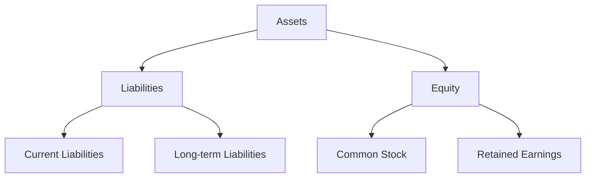

## 1.8 Key Concepts and Terminology

Understanding the key concepts and terminology related to liabilities and equities is fundamental for anyone preparing for Canadian accounting exams. This section will provide a comprehensive overview of these essential terms, helping you build a solid foundation for further study and application in professional practice. We will explore definitions, applications, practical examples, and real-world scenarios to ensure clarity and comprehension.

### Liabilities: An Overview

**Liabilities** are obligations that a company must settle in the future, typically involving the transfer of assets, provision of services, or other economic benefits. They are classified into two main categories: current liabilities and long-term liabilities.

#### Current Liabilities

Current liabilities are obligations expected to be settled within one year or the operating cycle, whichever is longer. Key terms include:

- **Accounts Payable:** Amounts owed to suppliers for goods or services received.
- **Short-term Notes Payable:** Written promises to pay a specified amount within a year.
- **Accrued Expenses:** Expenses incurred but not yet paid, such as wages and utilities.
- **Unearned Revenues:** Payments received before delivering goods or services.
- **Dividends Payable:** Declared dividends not yet paid to shareholders.

#### Long-term Liabilities

Long-term liabilities are obligations not due within the next year. Key terms include:

- **Bonds Payable:** Long-term debt securities issued to investors.
- **Lease Obligations:** Long-term commitments under lease agreements.
- **Pension Liabilities:** Obligations to provide retirement benefits to employees.
- **Deferred Tax Liabilities:** Taxes owed in the future due to temporary differences.

### Equities: An Overview

**Equity** represents the residual interest in the assets of an entity after deducting liabilities. It is the ownership interest held by shareholders in a corporation. Key components include:

- **Common Stock:** Represents ownership shares in a company with voting rights.
- **Preferred Stock:** Equity with preferential rights over common stock, often without voting rights.
- **Retained Earnings:** Accumulated net income not distributed as dividends.
- **Treasury Stock:** Shares repurchased by the company, reducing total equity.

### Key Accounting Concepts

#### The Accounting Equation

The accounting equation is the foundation of double-entry bookkeeping and financial reporting:

 \text{Assets} = \text{Liabilities} + \text{Equity} 

This equation ensures that the balance sheet remains balanced, reflecting a company's financial position accurately.

#### Recognition and Measurement

Recognition involves determining when a transaction should be recorded, while measurement determines the amount to be recorded. Key concepts include:

- **Historical Cost:** Recording assets and liabilities at their original purchase price.
- **Fair Value:** Estimating the price at which an asset could be exchanged or a liability settled in an orderly transaction.

#### Financial Reporting Standards

In Canada, financial reporting is governed by International Financial Reporting Standards (IFRS) for public companies and Accounting Standards for Private Enterprises (ASPE) for private companies. Key standards include:

- **IFRS 9:** Financial Instruments
- **IFRS 16:** Leases
- **IAS 19:** Employee Benefits

### Practical Examples and Case Studies

#### Example 1: Accounting for Bonds Payable

A company issues $1,000,000 in bonds at a 5% interest rate, payable annually, with a maturity of 10 years. The bonds are issued at a discount, meaning the company receives less than the face value. The accounting entries would include:

1. **Issuance of Bonds:**

   - Debit Cash for the amount received.
   - Debit Discount on Bonds Payable for the difference between the face value and cash received.
   - Credit Bonds Payable for the face value.

2. **Interest Payment:**

   - Debit Interest Expense for the interest paid.
   - Credit Cash for the interest payment.

3. **Amortization of Discount:**

   - Debit Interest Expense for the amortized discount.
   - Credit Discount on Bonds Payable.

#### Example 2: Lease Accounting under IFRS 16

A company leases equipment for five years, with annual payments of $20,000. Under IFRS 16, the lease is recognized as a right-of-use asset and a lease liability. The accounting entries include:

1. **Initial Recognition:**

   - Debit Right-of-Use Asset for the present value of lease payments.
   - Credit Lease Liability for the same amount.

2. **Subsequent Measurement:**

   - Debit Depreciation Expense for the right-of-use asset.
   - Credit Accumulated Depreciation.

3. **Lease Payment:**

   - Debit Lease Liability for the principal portion.
   - Debit Interest Expense for the interest portion.
   - Credit Cash for the total payment.

### Real-World Applications and Regulatory Scenarios

#### Regulatory Framework

Understanding the regulatory framework is crucial for compliance and accurate financial reporting. Key regulatory bodies include:

- **CPA Canada:** Sets accounting and auditing standards in Canada.
- **International Accounting Standards Board (IASB):** Develops IFRS.
- **Financial Accounting Standards Board (FASB):** Develops U.S. GAAP.

#### Ethical Considerations

Ethical considerations in accounting involve maintaining integrity, objectivity, and professional competence. Accountants must adhere to ethical guidelines and avoid conflicts of interest, ensuring transparency and accountability in financial reporting.

### Step-by-Step Guidance and Practical Exercises

#### Exercise 1: Preparing a Balance Sheet

Prepare a balance sheet for a hypothetical company with the following information:

- Cash: $50,000
- Accounts Receivable: $30,000
- Inventory: $20,000
- Accounts Payable: $15,000
- Long-term Debt: $40,000
- Common Stock: $20,000
- Retained Earnings: $25,000

**Solution:**

1. **Assets:**

   - Cash: $50,000
   - Accounts Receivable: $30,000
   - Inventory: $20,000
   - **Total Assets:** $100,000

2. **Liabilities:**

   - Accounts Payable: $15,000
   - Long-term Debt: $40,000
   - **Total Liabilities:** $55,000

3. **Equity:**

   - Common Stock: $20,000
   - Retained Earnings: $25,000
   - **Total Equity:** $45,000

4. **Balance Sheet:**

   
   \begin{array}{c|c}
   \text{Assets} & \text{Liabilities and Equity} \\
   \hline
   \text{Cash} & \text{Accounts Payable} \\
   \text{Accounts Receivable} & \text{Long-term Debt} \\
   \text{Inventory} & \text{Common Stock} \\
   & \text{Retained Earnings} \\
   \hline
   \text{Total Assets} & \text{Total Liabilities and Equity} \\
   \end{array}
   

### Diagrams and Visual Aids

Below is a diagram illustrating the relationship between assets, liabilities, and equity:

### Best Practices and Common Pitfalls

#### Best Practices

- **Regularly Review Standards:** Stay updated with changes in IFRS and ASPE.
- **Maintain Accurate Records:** Ensure all transactions are recorded accurately and timely.
- **Conduct Regular Audits:** Perform internal audits to ensure compliance and accuracy.

#### Common Pitfalls

- **Misclassification of Liabilities:** Ensure liabilities are correctly classified as current or long-term.
- **Ignoring Disclosure Requirements:** Provide all necessary disclosures to avoid regulatory issues.
- **Overlooking Ethical Guidelines:** Adhere to ethical standards to maintain trust and credibility.

### References and Additional Resources

- **CPA Canada:** [CPA Canada Website](https://www.cpacanada.ca)
- **IFRS Foundation:** [IFRS Website](https://www.ifrs.org)
- **Financial Accounting Standards Board:** [FASB Website](https://www.fasb.org)

### Summary

In this section, we covered the key concepts and terminology related to liabilities and equities, providing a foundation for further study and application. Understanding these terms is crucial for accurate financial reporting and compliance with Canadian accounting standards.

## **Ready to Test Your Knowledge?**



### What is the accounting equation?

- [x] Assets = Liabilities + Equity
- [ ] Assets = Liabilities - Equity
- [ ] Assets + Liabilities = Equity
- [ ] Assets - Liabilities = Equity

> **Explanation:** The accounting equation is Assets = Liabilities + Equity, which ensures that the balance sheet remains balanced.

### Which of the following is a current liability?

- [x] Accounts Payable
- [ ] Bonds Payable
- [ ] Lease Obligations
- [ ] Pension Liabilities

> **Explanation:** Accounts Payable is a current liability as it is expected to be settled within one year.

### What does IFRS stand for?

- [x] International Financial Reporting Standards
- [ ] International Financial Regulation Standards
- [ ] International Fiscal Reporting Standards
- [ ] International Financial Reconciliation Standards

> **Explanation:** IFRS stands for International Financial Reporting Standards, which are used for financial reporting.

### What is treasury stock?

- [x] Shares repurchased by the company
- [ ] Shares issued to employees
- [ ] Shares sold to the public
- [ ] Shares held by creditors

> **Explanation:** Treasury stock refers to shares that have been repurchased by the company, reducing total equity.

### Which of the following is a component of equity?

- [x] Retained Earnings
- [ ] Accounts Payable
- [ ] Short-term Notes Payable
- [ ] Deferred Tax Liabilities

> **Explanation:** Retained Earnings is a component of equity, representing accumulated net income not distributed as dividends.

### What does ASPE stand for?

- [x] Accounting Standards for Private Enterprises
- [ ] Accounting Standards for Public Entities
- [ ] Accounting Standards for Professional Enterprises
- [ ] Accounting Standards for Personal Entities

> **Explanation:** ASPE stands for Accounting Standards for Private Enterprises, used by private companies in Canada.

### Which of the following is a long-term liability?

- [x] Bonds Payable
- [ ] Accounts Payable
- [ ] Dividends Payable
- [ ] Accrued Expenses

> **Explanation:** Bonds Payable is a long-term liability, as it is not due within the next year.

### What is the purpose of retained earnings?

- [x] To accumulate net income not distributed as dividends
- [ ] To represent shares repurchased by the company
- [ ] To account for preferred stock
- [ ] To record short-term liabilities

> **Explanation:** Retained Earnings accumulate net income not distributed as dividends, representing reinvested profits.

### Which of the following is an ethical consideration in accounting?

- [x] Maintaining integrity and objectivity
- [ ] Maximizing profits at any cost
- [ ] Ignoring disclosure requirements
- [ ] Misclassifying liabilities

> **Explanation:** Maintaining integrity and objectivity is an ethical consideration, ensuring transparency and accountability.

### True or False: Deferred tax liabilities are considered current liabilities.

- [ ] True
- [x] False

> **Explanation:** Deferred tax liabilities are considered long-term liabilities, as they are taxes owed in the future due to temporary differences.


