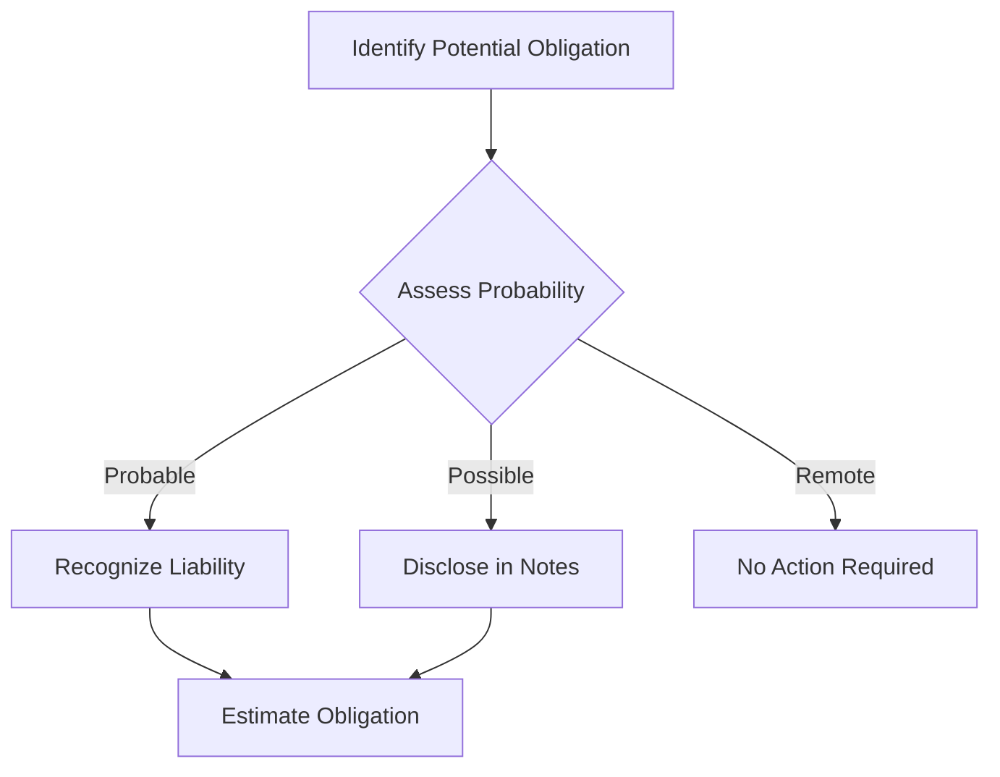

## 10.1 Recognizing Contingent Liabilities

Recognizing contingent liabilities is a critical aspect of financial accounting, particularly in the context of Canadian accounting standards. This section delves into the criteria for recognizing potential obligations based on the likelihood of future events, offering a comprehensive understanding essential for Canadian accounting exams. 

### Understanding Contingent Liabilities

**Contingent liabilities** are potential obligations that may arise depending on the outcome of a future event. Unlike direct liabilities, contingent liabilities are not certain and depend on the occurrence or non-occurrence of one or more future events. They are a crucial part of financial reporting as they provide insight into potential risks and uncertainties that a company may face.

#### Key Characteristics of Contingent Liabilities

1. **Uncertainty**: The existence of the liability is uncertain and depends on the outcome of a future event.
2. **Potential Obligation**: There is a potential obligation to pay or perform a service.
3. **Future Event**: The obligation is contingent upon the occurrence of a future event.

### Criteria for Recognizing Contingent Liabilities

The recognition of contingent liabilities is governed by specific criteria outlined in accounting standards such as International Financial Reporting Standards (IFRS) and Accounting Standards for Private Enterprises (ASPE) in Canada. The key criteria include:

1. **Probability of Occurrence**: The likelihood of the future event occurring must be assessed. This is typically categorized as probable, possible, or remote.
2. **Reliable Estimate**: A reliable estimate of the amount of the obligation must be possible.

#### Probability Assessment

- **Probable**: The future event is likely to occur. In this case, the liability is recognized in the financial statements.
- **Possible**: The future event might occur, but it is not probable. Disclosure in the notes to the financial statements is required.
- **Remote**: The chance of the event occurring is slight. No recognition or disclosure is generally required.

#### Reliable Estimate

A contingent liability can only be recognized if a reliable estimate of the obligation can be made. If an estimate cannot be made, the liability is disclosed in the notes to the financial statements.

### Accounting Standards and Guidelines

#### International Financial Reporting Standards (IFRS)

Under IFRS, contingent liabilities are addressed in IAS 37 - Provisions, Contingent Liabilities and Contingent Assets. IAS 37 requires that contingent liabilities should not be recognized in the financial statements but should be disclosed unless the possibility of an outflow of resources is remote.

#### Accounting Standards for Private Enterprises (ASPE)

ASPE Section 3290 provides guidance on the treatment of contingent liabilities. Similar to IFRS, ASPE requires disclosure of contingent liabilities unless the likelihood of occurrence is remote.

### Practical Examples and Scenarios

#### Example 1: Legal Claims

Consider a company facing a lawsuit. The outcome is uncertain, but the company's legal team believes there is a 70% chance of losing the case, with an estimated payout of $500,000. According to accounting standards, since the likelihood is probable and a reliable estimate can be made, the liability should be recognized in the financial statements.

#### Example 2: Product Warranties

A company offers a one-year warranty on its products. Based on past experience, the company estimates that 5% of products sold will require warranty repairs, costing $100 per product. This is a probable event with a reliable estimate, thus the liability should be recognized.

### Real-world Applications and Regulatory Scenarios

In practice, recognizing contingent liabilities involves judgment and estimation, often requiring collaboration between accountants, legal advisors, and management. Companies must carefully assess the probability and potential impact of contingent liabilities to ensure accurate financial reporting.

#### Regulatory Considerations

- **CPA Canada**: Provides guidelines and resources to help accountants understand and apply the standards related to contingent liabilities.
- **Securities Regulations**: Public companies must adhere to disclosure requirements set by securities regulators, ensuring transparency and accountability.

### Step-by-Step Guidance for Recognizing Contingent Liabilities

1. **Identify Potential Obligations**: Review all potential obligations that could arise from past events.
2. **Assess Probability**: Determine the likelihood of the future event occurring.
3. **Estimate Obligation**: Calculate a reliable estimate of the potential obligation.
4. **Recognize or Disclose**: Based on the probability and estimate, decide whether to recognize the liability in the financial statements or disclose it in the notes.

### Diagrams and Visual Aids

To enhance understanding, consider the following diagram illustrating the decision-making process for recognizing contingent liabilities:

### Best Practices and Common Pitfalls

#### Best Practices

- **Regular Review**: Continuously review and update assessments of contingent liabilities.
- **Collaboration**: Work closely with legal and management teams to gather accurate information.
- **Documentation**: Maintain thorough documentation of assessments and decisions.

#### Common Pitfalls

- **Overlooking Potential Liabilities**: Failing to identify all possible contingent liabilities.
- **Inaccurate Estimates**: Providing unreliable estimates due to lack of information or poor judgment.
- **Inconsistent Application**: Applying criteria inconsistently across different liabilities.

### References to Official Standards and Resources

- **IAS 37 - Provisions, Contingent Liabilities and Contingent Assets**: Provides comprehensive guidance on recognizing and measuring contingent liabilities.
- **ASPE Section 3290**: Offers guidelines for private enterprises in Canada.
- **CPA Canada**: Offers resources and support for understanding and applying accounting standards.

### Sample Problems and Exercises

To reinforce learning, consider the following practice problem:

**Problem**: A company is involved in environmental litigation. The legal team estimates a 60% chance of losing, with potential damages of $1 million. How should the company account for this potential liability?

**Solution**: Since the likelihood is probable and a reliable estimate can be made, the company should recognize a liability of $1 million in its financial statements.

### Summary of Key Points

- Contingent liabilities are potential obligations dependent on future events.
- Recognition depends on the probability of occurrence and the ability to make a reliable estimate.
- Disclosure is required for possible liabilities, while remote liabilities generally require no action.
- Adherence to IFRS and ASPE standards is crucial for accurate financial reporting.

### Ready to Test Your Knowledge?



### What is a contingent liability?

- [x] A potential obligation dependent on a future event
- [ ] A certain obligation that must be paid
- [ ] An asset that may be realized in the future
- [ ] A liability that is recognized immediately

> **Explanation:** A contingent liability is a potential obligation that depends on the outcome of a future event.

### Under IFRS, when should a contingent liability be recognized?

- [ ] Always recognized in financial statements
- [x] Recognized when the event is probable and a reliable estimate can be made
- [ ] Recognized only when the event is possible
- [ ] Never recognized, only disclosed

> **Explanation:** Under IFRS, a contingent liability is recognized when the event is probable and a reliable estimate can be made.

### What is the probability assessment for a contingent liability that is "remote"?

- [ ] Likely to occur
- [ ] Possible to occur
- [x] Slight chance of occurring
- [ ] Certain to occur

> **Explanation:** A "remote" probability assessment indicates a slight chance of the event occurring.

### Which accounting standard addresses contingent liabilities under IFRS?

- [ ] IAS 16
- [ ] IFRS 9
- [x] IAS 37
- [ ] IFRS 15

> **Explanation:** IAS 37 addresses provisions, contingent liabilities, and contingent assets under IFRS.

### In which section of ASPE are contingent liabilities addressed?

- [ ] Section 1000
- [x] Section 3290
- [ ] Section 3856
- [ ] Section 3051

> **Explanation:** ASPE Section 3290 provides guidance on contingent liabilities for private enterprises in Canada.

### What should be done if a contingent liability is possible but not probable?

- [ ] Recognize in financial statements
- [x] Disclose in notes to the financial statements
- [ ] No action required
- [ ] Recognize as an asset

> **Explanation:** If a contingent liability is possible but not probable, it should be disclosed in the notes to the financial statements.

### What is required for a contingent liability to be recognized?

- [ ] Only a probable event
- [x] A probable event and a reliable estimate
- [ ] Only a reliable estimate
- [ ] Neither a probable event nor a reliable estimate

> **Explanation:** Both a probable event and a reliable estimate are required for a contingent liability to be recognized.

### How should a contingent liability be treated if it is remote?

- [ ] Recognize in financial statements
- [ ] Disclose in notes
- [x] No action required
- [ ] Recognize as an asset

> **Explanation:** If a contingent liability is remote, no action is generally required.

### What is the key difference between contingent liabilities and direct liabilities?

- [x] Contingent liabilities depend on future events
- [ ] Direct liabilities depend on future events
- [ ] Contingent liabilities are certain
- [ ] Direct liabilities are uncertain

> **Explanation:** Contingent liabilities depend on the outcome of future events, whereas direct liabilities are certain.

### True or False: A contingent liability can be recognized without a reliable estimate.

- [ ] True
- [x] False

> **Explanation:** A contingent liability cannot be recognized without a reliable estimate of the obligation.


