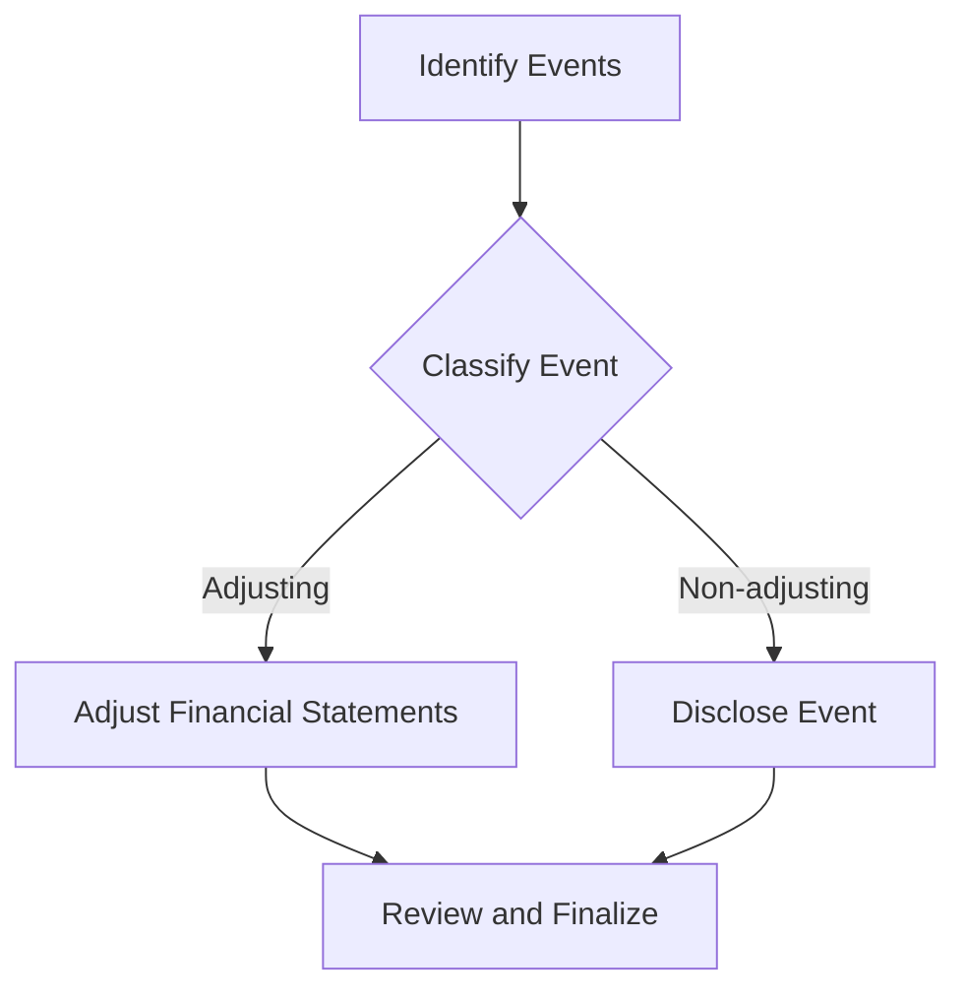

## 10.16 Subsequent Events

Subsequent events are critical considerations in financial reporting, as they can significantly impact the presentation and disclosure of financial statements. These events occur after the balance sheet date but before the financial statements are issued or available for issuance. Understanding how to identify, classify, and disclose subsequent events is essential for accurate financial reporting and compliance with Canadian accounting standards, such as International Financial Reporting Standards (IFRS) and Accounting Standards for Private Enterprises (ASPE).

### Understanding Subsequent Events

Subsequent events are categorized into two main types:

1. **Adjusting Events**: These are events that provide additional evidence about conditions that existed at the balance sheet date. They require adjustments to the financial statements to reflect the new information. For example, if a company discovers that a customer was insolvent at the balance sheet date, and this is confirmed after the date, an adjustment to the accounts receivable and bad debt expense is necessary.

2. **Non-adjusting Events**: These events are indicative of conditions that arose after the balance sheet date. They do not require adjustments to the financial statements but may require disclosure if they are material. For instance, a natural disaster occurring after the balance sheet date that affects the company's operations would be a non-adjusting event.

### Importance in Financial Reporting

Subsequent events can have a significant impact on a company's financial statements. They can affect the valuation of assets and liabilities, influence the assessment of going concern, and alter the presentation of financial results. Properly accounting for subsequent events ensures that financial statements provide a true and fair view of the company's financial position and performance.

### Canadian Accounting Standards and Subsequent Events

In Canada, the treatment of subsequent events is guided by IFRS and ASPE. Both frameworks emphasize the need for transparency and accuracy in financial reporting.

#### IFRS Guidelines

Under IFRS, IAS 10 "Events after the Reporting Period" provides guidance on subsequent events. It requires entities to adjust their financial statements for adjusting events and to disclose non-adjusting events if they are material. The standard also emphasizes the importance of assessing the entity's ability to continue as a going concern in light of subsequent events.

#### ASPE Guidelines

ASPE Section 3820 "Subsequent Events" outlines the requirements for recognizing and disclosing subsequent events for private enterprises in Canada. Similar to IFRS, ASPE distinguishes between adjusting and non-adjusting events and requires appropriate adjustments and disclosures.

### Identifying Subsequent Events

Identifying subsequent events involves a thorough review of events occurring after the balance sheet date. This process requires collaboration between management, accountants, and auditors to ensure all relevant events are considered. Key steps in identifying subsequent events include:

- Reviewing board meeting minutes and management reports.
- Analyzing legal correspondence for potential litigation or claims.
- Monitoring economic and industry developments that may impact the company.
- Communicating with key stakeholders, such as creditors and investors, to identify potential issues.

### Classifying Subsequent Events

Once identified, subsequent events must be classified as either adjusting or non-adjusting. This classification determines the appropriate accounting treatment and disclosure requirements.

#### Adjusting Events

Adjusting events provide evidence of conditions that existed at the balance sheet date. Examples include:

- Settlement of a lawsuit that confirms a liability existed at the balance sheet date.
- Bankruptcy of a customer that indicates a receivable was impaired.
- Discovery of errors or fraud that affect the financial statements.

#### Non-adjusting Events

Non-adjusting events relate to conditions that arose after the balance sheet date. Examples include:

- Significant business combinations or acquisitions.
- Major changes in market conditions affecting the valuation of assets.
- Natural disasters impacting the company's operations.

### Disclosing Subsequent Events

Disclosure of subsequent events is crucial for providing users of financial statements with relevant information. Disclosures should include:

- A description of the nature of the event.
- An estimate of the financial impact, if possible.
- A statement that the event does not require adjustment to the financial statements, if applicable.

### Practical Examples and Case Studies

#### Example 1: Adjusting Event

A company discovers after the balance sheet date that a major customer has filed for bankruptcy, confirming that the receivable was impaired at the balance sheet date. The company must adjust its financial statements to reflect the impairment loss.

#### Example 2: Non-adjusting Event

A company experiences a significant decline in market value due to a natural disaster occurring after the balance sheet date. While no adjustment is required, the company must disclose the event and its potential impact on future operations.

### Real-world Applications and Regulatory Scenarios

Subsequent events are not only theoretical concepts but have real-world implications. Companies must navigate regulatory requirements and ensure compliance with accounting standards to avoid potential legal and financial repercussions.

#### Regulatory Compliance

Canadian companies must adhere to IFRS or ASPE guidelines when accounting for subsequent events. Non-compliance can lead to regulatory scrutiny and damage to the company's reputation.

#### Audit Procedures

Auditors play a critical role in assessing subsequent events. They must evaluate the company's procedures for identifying and disclosing subsequent events and ensure that financial statements are free from material misstatement.

### Step-by-step Guidance for Accounting Procedures

1. **Identify Potential Subsequent Events**: Review all relevant information and communications to identify events occurring after the balance sheet date.

2. **Classify Events**: Determine whether each event is adjusting or non-adjusting based on the criteria outlined in IFRS or ASPE.

3. **Adjust Financial Statements**: For adjusting events, make the necessary adjustments to the financial statements to reflect the new information.

4. **Disclose Non-adjusting Events**: Prepare disclosures for non-adjusting events, ensuring they provide sufficient information for users of the financial statements.

5. **Review and Finalize**: Collaborate with auditors and management to review the treatment of subsequent events and finalize the financial statements.

### Diagrams and Visual Aids

To enhance understanding, the following diagram illustrates the process of identifying and classifying subsequent events:

### Best Practices and Common Pitfalls

#### Best Practices

- Establish a robust process for identifying and assessing subsequent events.
- Maintain open communication between management, accountants, and auditors.
- Ensure timely and accurate disclosures to maintain transparency.

#### Common Pitfalls

- Failing to identify significant subsequent events due to inadequate review processes.
- Misclassifying events, leading to incorrect financial statement adjustments or disclosures.
- Delaying disclosures, resulting in a lack of transparency for financial statement users.

### References to Canadian Accounting Standards

For further exploration of subsequent events, refer to the following resources:

- **IAS 10 "Events after the Reporting Period"**: Provides guidance on accounting for subsequent events under IFRS.
- **ASPE Section 3820 "Subsequent Events"**: Outlines the requirements for subsequent events for private enterprises in Canada.
- **CPA Canada Handbook**: Offers comprehensive guidance on accounting standards and best practices.

### Encouraging Application through Practice Questions

To reinforce your understanding of subsequent events, consider the following practice questions:

1. What is the difference between adjusting and non-adjusting subsequent events?
2. How should a company account for a lawsuit settlement that occurs after the balance sheet date but relates to conditions existing at that date?
3. What are the disclosure requirements for a significant acquisition occurring after the balance sheet date?

### Summary of Key Points

- Subsequent events occur after the balance sheet date but before the financial statements are issued.
- They are classified as adjusting or non-adjusting based on whether they provide evidence of conditions existing at the balance sheet date.
- Proper identification, classification, and disclosure of subsequent events are essential for accurate financial reporting.

### Sample Exam-style Questions

To further test your knowledge, here are some sample exam-style questions:

1. Explain the impact of subsequent events on the assessment of going concern.
2. Discuss the role of auditors in evaluating subsequent events.
3. How do subsequent events influence the valuation of contingent liabilities?

### Exam Strategies and Practical Tips

- Familiarize yourself with the criteria for classifying subsequent events.
- Practice identifying and disclosing subsequent events using real-world scenarios.
- Review relevant accounting standards and guidelines to ensure compliance.

### Global Accounting Concepts

While the focus is on Canadian standards, understanding global accounting concepts can enhance your knowledge. Consider how subsequent events are treated under different accounting frameworks and the implications for multinational companies.

### Conclusion

Subsequent events are a vital aspect of financial reporting, requiring careful consideration and accurate disclosure. By understanding the principles and guidelines for subsequent events, you can ensure compliance with Canadian accounting standards and provide reliable financial information to stakeholders.

## **Ready to Test Your Knowledge?**



### What is an adjusting subsequent event?

- [x] An event that provides evidence of conditions that existed at the balance sheet date.
- [ ] An event that occurs after the financial statements are issued.
- [ ] An event that is unrelated to the company's operations.
- [ ] An event that does not require any disclosure.

> **Explanation:** Adjusting subsequent events provide evidence about conditions that existed at the balance sheet date and require adjustments to the financial statements.

### Which standard provides guidance on subsequent events under IFRS?

- [x] IAS 10
- [ ] IAS 16
- [ ] IFRS 9
- [ ] IFRS 15

> **Explanation:** IAS 10 "Events after the Reporting Period" provides guidance on subsequent events under IFRS.

### What is a non-adjusting subsequent event?

- [x] An event indicative of conditions that arose after the balance sheet date.
- [ ] An event that requires adjustment to the financial statements.
- [ ] An event that occurred before the balance sheet date.
- [ ] An event that is not material.

> **Explanation:** Non-adjusting subsequent events are indicative of conditions that arose after the balance sheet date and do not require adjustments to the financial statements.

### How should a company disclose a non-adjusting subsequent event?

- [x] Describe the nature of the event and its financial impact, if possible.
- [ ] Make adjustments to the financial statements.
- [ ] Ignore the event as it occurred after the balance sheet date.
- [ ] Only disclose if it affects the company's going concern.

> **Explanation:** Non-adjusting subsequent events should be disclosed by describing the nature of the event and its potential financial impact.

### What role do auditors play in subsequent events?

- [x] Evaluate the company's procedures for identifying and disclosing subsequent events.
- [ ] Ignore subsequent events as they occur after the audit period.
- [ ] Ensure all subsequent events are adjusted in the financial statements.
- [ ] Only focus on events that affect the company's liquidity.

> **Explanation:** Auditors evaluate the company's procedures for identifying and disclosing subsequent events to ensure the financial statements are free from material misstatement.

### What is the primary purpose of disclosing subsequent events?

- [x] To provide users with relevant information about events occurring after the balance sheet date.
- [ ] To adjust the financial statements for all events after the balance sheet date.
- [ ] To highlight management's future plans.
- [ ] To predict future financial performance.

> **Explanation:** The primary purpose of disclosing subsequent events is to provide users with relevant information about events occurring after the balance sheet date.

### Which of the following is an example of an adjusting subsequent event?

- [x] Settlement of a lawsuit confirming a liability existed at the balance sheet date.
- [ ] Acquisition of a new subsidiary after the balance sheet date.
- [ ] Announcement of a new product line after the balance sheet date.
- [ ] Change in tax rates after the balance sheet date.

> **Explanation:** Settlement of a lawsuit confirming a liability existed at the balance sheet date is an adjusting subsequent event as it provides evidence of conditions existing at the balance sheet date.

### What is the impact of subsequent events on the assessment of going concern?

- [x] Subsequent events can affect the assessment of the company's ability to continue as a going concern.
- [ ] Subsequent events have no impact on the going concern assessment.
- [ ] Only adjusting events affect the going concern assessment.
- [ ] Only non-adjusting events affect the going concern assessment.

> **Explanation:** Subsequent events can affect the assessment of the company's ability to continue as a going concern, requiring management to consider these events when making their assessment.

### How should a company account for a natural disaster occurring after the balance sheet date?

- [x] Disclose the event and its potential impact on future operations.
- [ ] Adjust the financial statements to reflect the damage.
- [ ] Ignore the event as it occurred after the balance sheet date.
- [ ] Only disclose if it affects the company's current assets.

> **Explanation:** A natural disaster occurring after the balance sheet date is a non-adjusting subsequent event that should be disclosed with its potential impact on future operations.

### True or False: All subsequent events require adjustments to the financial statements.

- [ ] True
- [x] False

> **Explanation:** False. Only adjusting subsequent events require adjustments to the financial statements. Non-adjusting events require disclosure if they are material.


