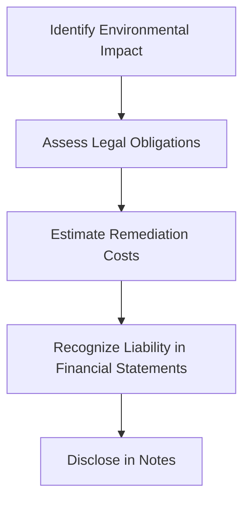

## 10.3 Environmental Liabilities

Environmental liabilities are a critical aspect of accounting, particularly for organizations that operate in industries with significant environmental impacts. These liabilities arise from the obligation to remediate environmental damage or comply with environmental regulations. Understanding how to account for these liabilities is essential for accurate financial reporting and compliance with Canadian accounting standards.

### Understanding Environmental Liabilities

Environmental liabilities refer to the legal obligations of a company to address the environmental impacts of its operations. These obligations can arise from various sources, including:

- **Regulatory Requirements:** Laws and regulations that mandate environmental protection and remediation.
- **Contractual Obligations:** Agreements that require specific environmental actions.
- **Litigation:** Legal actions that result in the requirement to pay for environmental damages.

### Key Concepts and Terminology

- **Environmental Remediation:** The process of cleaning up contaminated sites to meet regulatory standards.
- **Asset Retirement Obligation (ARO):** A legal obligation associated with the retirement of a tangible long-lived asset that results from the acquisition, construction, development, or normal operation of the asset.
- **Contingent Liability:** A potential obligation that may arise depending on the outcome of a future event.
- **Accrual Accounting:** Recognizing expenses and liabilities when they are incurred, regardless of when cash transactions occur.

### Regulatory Framework in Canada

In Canada, environmental liabilities are governed by a combination of federal, provincial, and territorial regulations. Key regulatory bodies include:

- **Environment and Climate Change Canada (ECCC):** Responsible for federal environmental policies and regulations.
- **Provincial and Territorial Ministries:** Each province and territory has its own environmental regulations and enforcement bodies.

### Accounting Standards for Environmental Liabilities

The recognition and measurement of environmental liabilities are guided by specific accounting standards. In Canada, these include:

- **International Financial Reporting Standards (IFRS):** Adopted by publicly accountable enterprises in Canada.
- **Accounting Standards for Private Enterprises (ASPE):** Applicable to private companies in Canada.

#### Recognition of Environmental Liabilities

Under IFRS, environmental liabilities are recognized when:

1. There is a present obligation (legal or constructive) as a result of a past event.
2. It is probable that an outflow of resources embodying economic benefits will be required to settle the obligation.
3. A reliable estimate can be made of the amount of the obligation.

#### Measurement of Environmental Liabilities

The measurement of environmental liabilities involves estimating the cost of remediation and other related expenses. Key considerations include:

- **Discounting Future Costs:** Present value calculations are used to account for the time value of money.
- **Uncertainty and Estimation:** The inherent uncertainty in estimating future costs requires careful judgment and the use of best estimates.

### Practical Examples and Case Studies

#### Example: Oil Spill Remediation

Consider a company that experiences an oil spill, resulting in contamination of a nearby water body. The company is legally obligated to clean up the spill and restore the environment. The steps involved in accounting for this liability include:

1. **Recognition:** The company recognizes a liability for the estimated cleanup costs.
2. **Measurement:** The liability is measured based on the expected costs of remediation, discounted to present value.
3. **Disclosure:** The company discloses the nature and amount of the liability in its financial statements.

#### Case Study: Mining Industry

In the mining industry, companies often face significant environmental liabilities related to the closure and reclamation of mining sites. These liabilities are recognized as Asset Retirement Obligations (AROs) and require detailed estimation of future costs, including:

- **Site Closure Activities:** Costs associated with dismantling infrastructure and restoring the site.
- **Long-term Monitoring:** Ongoing environmental monitoring and maintenance costs.

### Real-world Applications and Compliance

#### Best Practices for Managing Environmental Liabilities

- **Proactive Risk Assessment:** Regularly assess environmental risks and potential liabilities.
- **Accurate Record-keeping:** Maintain detailed records of environmental impacts and remediation activities.
- **Engagement with Regulators:** Collaborate with regulatory bodies to ensure compliance and address potential issues early.

#### Challenges and Strategies

- **Estimating Costs:** Accurately estimating future remediation costs can be challenging due to uncertainties in environmental conditions and regulatory changes.
- **Legal and Regulatory Compliance:** Staying up-to-date with evolving environmental regulations is essential for compliance and risk management.

### Diagrams and Visual Aids

Below is a diagram illustrating the process of recognizing and measuring environmental liabilities:

### Common Pitfalls and Exam Strategies

- **Underestimating Liabilities:** Avoid the common mistake of underestimating environmental liabilities by using conservative estimates and considering potential future changes in regulations.
- **Lack of Documentation:** Ensure thorough documentation of all environmental impacts and remediation efforts to support financial reporting and audits.

### References and Further Reading

- **CPA Canada:** Provides resources and guidance on accounting for environmental liabilities.
- **IFRS Standards:** Detailed information on the recognition and measurement of liabilities.
- **Environment and Climate Change Canada:** Regulatory information and updates on environmental policies.

### Conclusion

Understanding and accurately accounting for environmental liabilities is crucial for organizations to meet regulatory requirements and provide transparent financial reporting. By following best practices and staying informed about regulatory changes, companies can effectively manage these obligations and minimize their environmental impact.

## **Ready to Test Your Knowledge?**



### What is an environmental liability?

- [x] A legal obligation to address environmental impacts
- [ ] A voluntary commitment to environmental sustainability
- [ ] An asset related to environmental improvements
- [ ] A tax incentive for environmental initiatives

> **Explanation:** An environmental liability is a legal obligation to address the environmental impacts of an organization's operations.

### Which accounting standard is used for publicly accountable enterprises in Canada?

- [x] IFRS
- [ ] ASPE
- [ ] GAAP
- [ ] CPA Canada Standards

> **Explanation:** In Canada, publicly accountable enterprises use International Financial Reporting Standards (IFRS) for financial reporting.

### What is the first step in recognizing an environmental liability?

- [x] Identifying a present obligation as a result of a past event
- [ ] Estimating the cost of remediation
- [ ] Discounting future costs to present value
- [ ] Disclosing the liability in financial statements

> **Explanation:** The first step in recognizing an environmental liability is identifying a present obligation as a result of a past event.

### How are future remediation costs accounted for in environmental liabilities?

- [x] By discounting them to present value
- [ ] By recording them at face value
- [ ] By ignoring them until they occur
- [ ] By estimating them without discounting

> **Explanation:** Future remediation costs are accounted for by discounting them to present value to reflect the time value of money.

### What is an Asset Retirement Obligation (ARO)?

- [x] A legal obligation associated with the retirement of a tangible long-lived asset
- [ ] A voluntary commitment to retire assets
- [ ] An asset related to environmental improvements
- [ ] A tax incentive for asset retirement

> **Explanation:** An Asset Retirement Obligation (ARO) is a legal obligation associated with the retirement of a tangible long-lived asset.

### Which regulatory body is responsible for federal environmental policies in Canada?

- [x] Environment and Climate Change Canada (ECCC)
- [ ] Provincial Ministries
- [ ] CPA Canada
- [ ] Canadian Securities Administrators

> **Explanation:** Environment and Climate Change Canada (ECCC) is responsible for federal environmental policies and regulations.

### What is a common challenge in estimating environmental liabilities?

- [x] Uncertainty in future costs
- [ ] Lack of legal obligations
- [ ] Overestimation of liabilities
- [ ] Consistent regulatory requirements

> **Explanation:** A common challenge in estimating environmental liabilities is the uncertainty in future costs due to changing environmental conditions and regulations.

### What is the purpose of disclosing environmental liabilities in financial statements?

- [x] To provide transparency and inform stakeholders
- [ ] To hide potential financial risks
- [ ] To comply with tax regulations
- [ ] To increase company valuation

> **Explanation:** Disclosing environmental liabilities in financial statements provides transparency and informs stakeholders about potential financial risks.

### Which of the following is NOT a source of environmental liabilities?

- [ ] Regulatory requirements
- [ ] Contractual obligations
- [ ] Litigation
- [x] Tax incentives

> **Explanation:** Tax incentives are not a source of environmental liabilities; they are benefits provided to encourage certain activities.

### True or False: Environmental liabilities only arise from voluntary actions by a company.

- [ ] True
- [x] False

> **Explanation:** Environmental liabilities arise from legal obligations, not just voluntary actions by a company.


