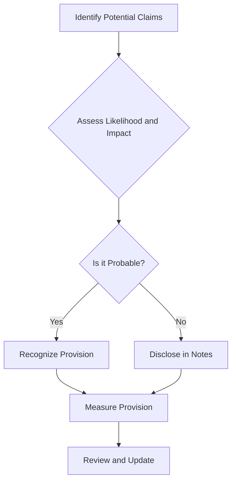

## 10.4 Litigation and Legal Claims

In the realm of accounting, litigation and legal claims present unique challenges that require careful consideration and precise handling. This section delves into the accounting treatment of litigation and legal claims, focusing on recognition, measurement, and disclosure requirements. Understanding these concepts is crucial for preparing accurate financial statements and ensuring compliance with Canadian accounting standards, including IFRS and ASPE.

### Understanding Litigation and Legal Claims in Accounting

Litigation and legal claims refer to disputes that arise from legal proceedings or potential legal actions against a company. These claims can significantly impact a company's financial position and performance, necessitating proper accounting treatment to reflect potential liabilities and risks accurately.

#### Key Concepts and Terminology

- **Contingent Liability:** A potential obligation that may arise depending on the outcome of a future event, such as a lawsuit.
- **Provision:** A liability of uncertain timing or amount, recognized when a company has a present obligation as a result of a past event.
- **Disclosure:** The process of providing relevant information about litigation and legal claims in the financial statements.

### Recognition and Measurement of Litigation and Legal Claims

The recognition and measurement of litigation and legal claims involve assessing the likelihood of an unfavorable outcome and estimating the potential financial impact. This process is guided by specific accounting standards, which dictate when and how these claims should be recorded in the financial statements.

#### Recognition Criteria

Under IFRS, a provision for litigation and legal claims is recognized when:

1. There is a present obligation (legal or constructive) as a result of a past event.
2. It is probable that an outflow of resources embodying economic benefits will be required to settle the obligation.
3. A reliable estimate can be made of the amount of the obligation.

In contrast, ASPE requires the recognition of a contingent liability when it is likely that a future event will confirm a liability and the amount can be reasonably estimated.

#### Measurement of Provisions

The measurement of provisions for litigation and legal claims involves estimating the expenditure required to settle the obligation. This estimate should reflect the best available information, considering factors such as:

- The nature of the claim
- Legal advice and expert opinions
- Past experience with similar claims
- Potential outcomes and their probabilities

### Disclosure Requirements

Disclosure is a critical aspect of accounting for litigation and legal claims, providing stakeholders with insights into the potential impact of these claims on the company's financial position. The disclosure requirements vary depending on the accounting framework but generally include:

- A description of the nature of the claim
- The amount recognized as a provision, if any
- An estimate of the potential financial impact, if determinable
- Any uncertainties related to the claim
- The expected timing of any outflows

### Practical Examples and Case Studies

To illustrate the application of these principles, consider the following scenarios:

#### Example 1: Product Liability Claim

A company faces a lawsuit alleging that one of its products caused harm to a consumer. The company's legal team advises that there is a 60% chance of losing the case, with potential damages estimated at $500,000. Based on this assessment, the company recognizes a provision for the expected liability in its financial statements.

#### Example 2: Environmental Litigation

A manufacturing company is involved in a legal dispute over alleged environmental damage caused by its operations. The case is complex, with multiple potential outcomes. The company discloses the nature of the litigation and the range of possible financial impacts in its notes to the financial statements, providing transparency to stakeholders.

### Real-World Applications and Regulatory Scenarios

Accounting for litigation and legal claims is not only about compliance but also about managing risk and maintaining stakeholder trust. Companies must navigate various regulatory scenarios, including:

- **Compliance with Canadian Accounting Standards:** Ensuring that financial statements accurately reflect potential liabilities and risks.
- **Managing Investor Relations:** Providing clear and transparent disclosures to maintain investor confidence.
- **Addressing Regulatory Inquiries:** Responding to inquiries from regulatory bodies regarding the treatment of litigation and legal claims.

### Step-by-Step Guidance for Accounting Procedures

The following steps outline the process for accounting for litigation and legal claims:

1. **Identify Potential Claims:** Regularly review legal proceedings and potential claims with legal counsel.
2. **Assess Likelihood and Impact:** Evaluate the probability of an unfavorable outcome and estimate the potential financial impact.
3. **Recognize Provisions:** Record a provision if the recognition criteria are met, ensuring accurate measurement.
4. **Disclose Relevant Information:** Provide comprehensive disclosures in the financial statements, including the nature and potential impact of claims.
5. **Review and Update:** Continuously monitor legal developments and update provisions and disclosures as necessary.

### Diagrams and Visual Aids

To enhance understanding, consider the following diagram illustrating the decision-making process for recognizing and measuring litigation and legal claims:

### Best Practices, Common Pitfalls, and Challenges

**Best Practices:**

- Engage legal counsel early in the process to assess potential claims.
- Maintain clear documentation of all assessments and decisions.
- Provide transparent and comprehensive disclosures to stakeholders.

**Common Pitfalls:**

- Failing to recognize provisions for probable claims.
- Underestimating the potential financial impact of claims.
- Inadequate disclosure of uncertainties and risks.

**Challenges:**

- Estimating the financial impact of complex legal disputes.
- Balancing transparency with confidentiality in disclosures.
- Navigating differing requirements under IFRS and ASPE.

### References to Canadian Accounting Standards and Resources

For further exploration, consider the following resources:

- **IFRS Standards:** IAS 37 Provisions, Contingent Liabilities, and Contingent Assets
- **ASPE Standards:** Section 3290 Contingencies
- **CPA Canada:** Guidance on accounting for litigation and legal claims

### Encouraging Application Through Practice Questions

To reinforce your understanding, consider the following practice questions:

1. What are the recognition criteria for a provision under IFRS?
2. How should a company measure a provision for litigation and legal claims?
3. What information should be disclosed in the financial statements regarding legal claims?

### Summary and Key Points

In summary, accounting for litigation and legal claims involves careful consideration of recognition, measurement, and disclosure requirements. By understanding these principles and applying them effectively, you can ensure accurate financial reporting and maintain stakeholder trust.

### Ready to Test Your Knowledge?



### What is a contingent liability?

- [x] A potential obligation that may arise depending on the outcome of a future event
- [ ] A definite obligation that must be settled in the current period
- [ ] An asset that is expected to generate future economic benefits
- [ ] A liability that has already been settled

> **Explanation:** A contingent liability is a potential obligation that may arise depending on the outcome of a future event, such as a lawsuit.

### When should a provision for litigation be recognized under IFRS?

- [x] When there is a present obligation, it is probable that an outflow of resources will be required, and a reliable estimate can be made
- [ ] Only when the lawsuit is settled
- [ ] When the company receives a legal notice
- [ ] When the financial statements are prepared

> **Explanation:** Under IFRS, a provision is recognized when there is a present obligation, it is probable that an outflow of resources will be required, and a reliable estimate can be made.

### What should be included in the disclosure of litigation and legal claims?

- [x] A description of the nature of the claim, the amount recognized, and any uncertainties
- [ ] Only the amount recognized as a provision
- [ ] The names of the parties involved in the litigation
- [ ] The expected date of court hearings

> **Explanation:** Disclosure should include a description of the nature of the claim, the amount recognized, and any uncertainties related to the claim.

### What is the main challenge in accounting for litigation and legal claims?

- [x] Estimating the financial impact of complex legal disputes
- [ ] Recording the provision in the financial statements
- [ ] Communicating with legal counsel
- [ ] Preparing the financial statements

> **Explanation:** Estimating the financial impact of complex legal disputes is a significant challenge due to uncertainties and varying potential outcomes.

### Which standard governs the accounting for litigation and legal claims under IFRS?

- [x] IAS 37
- [ ] IAS 16
- [ ] IFRS 9
- [ ] IFRS 15

> **Explanation:** IAS 37 Provisions, Contingent Liabilities, and Contingent Assets governs the accounting for litigation and legal claims under IFRS.

### What is a provision?

- [x] A liability of uncertain timing or amount
- [ ] A definite liability that must be settled in the current period
- [ ] An asset that is expected to generate future economic benefits
- [ ] A revenue that has been deferred

> **Explanation:** A provision is a liability of uncertain timing or amount, recognized when a company has a present obligation as a result of a past event.

### How should a company handle a legal claim that is not probable but possible?

- [x] Disclose the claim in the notes to the financial statements
- [ ] Recognize a provision
- [ ] Ignore the claim
- [ ] Record it as an asset

> **Explanation:** If a legal claim is possible but not probable, it should be disclosed in the notes to the financial statements.

### What is the role of legal counsel in accounting for litigation?

- [x] To assess the likelihood and potential impact of legal claims
- [ ] To prepare the financial statements
- [ ] To disclose the claims in the financial statements
- [ ] To audit the financial statements

> **Explanation:** Legal counsel assesses the likelihood and potential impact of legal claims, providing critical information for accounting purposes.

### What is the difference between a provision and a contingent liability?

- [x] A provision is recognized in the financial statements, while a contingent liability is disclosed
- [ ] A provision is an asset, while a contingent liability is a liability
- [ ] A provision is a definite obligation, while a contingent liability is a potential obligation
- [ ] A provision is a revenue, while a contingent liability is an expense

> **Explanation:** A provision is recognized in the financial statements when certain criteria are met, while a contingent liability is disclosed if it is not probable but possible.

### True or False: A company must disclose the names of the parties involved in litigation in the financial statements.

- [ ] True
- [x] False

> **Explanation:** The names of the parties involved in litigation are not typically disclosed in the financial statements; instead, the nature and potential impact of the claim are disclosed.



By mastering the accounting for litigation and legal claims, you can enhance your financial reporting skills and prepare effectively for the Canadian Accounting Exams. Remember to review the relevant standards and practice applying these principles to real-world scenarios.
