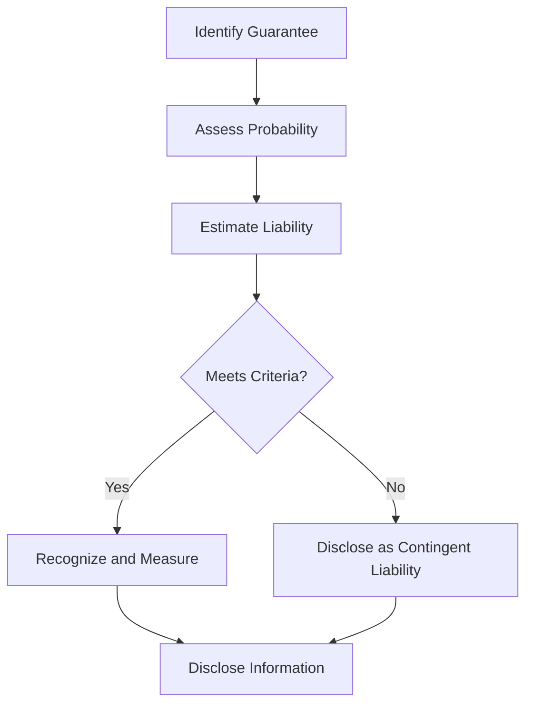

## 10.5 Guarantee Obligations

Guarantee obligations are a crucial aspect of accounting for liabilities, representing commitments made by a company to assume responsibility for another party's debt or performance under certain conditions. This section provides an in-depth exploration of guarantee obligations, focusing on their recognition, measurement, and reporting as per Canadian accounting standards. Understanding these obligations is essential for both financial reporting and exam preparation, as they can significantly impact a company's financial statements and risk profile.

### Understanding Guarantee Obligations

Guarantee obligations arise when a company agrees to fulfill the financial or performance responsibilities of another entity if that entity fails to meet its obligations. These guarantees can take various forms, including loan guarantees, performance bonds, and standby letters of credit. They are often used to support subsidiaries, joint ventures, or third-party transactions.

#### Types of Guarantee Obligations

1. **Loan Guarantees:** A promise to pay a borrower's debt if the borrower defaults.
2. **Performance Guarantees:** Assurance that a contractor will complete a project as per the contract terms.
3. **Standby Letters of Credit:** A bank's promise to pay a beneficiary if the applicant fails to fulfill contractual obligations.
4. **Product Warranties:** Guarantees that a product will perform as specified for a certain period.
5. **Indemnity Agreements:** Contracts that protect against losses or damages.

### Recognition and Measurement

The recognition and measurement of guarantee obligations depend on the likelihood of the guarantee being called upon and the ability to estimate the potential liability. Under IFRS and ASPE, a guarantee obligation is recognized when it is probable that an outflow of resources will be required to settle the obligation and the amount can be reliably estimated.

#### Recognition Criteria

- **Probable Outflow:** The obligation is recognized if it is more likely than not that the guarantee will be called upon.
- **Reliable Estimate:** The amount of the obligation can be reasonably estimated.

#### Measurement

Guarantee obligations are measured at the best estimate of the expenditure required to settle the obligation. This involves considering the likelihood of default, the financial condition of the guaranteed party, and any collateral or security arrangements.

### Accounting Standards and Guidelines

#### IFRS (International Financial Reporting Standards)

Under IFRS, guarantee obligations are typically accounted for under IAS 37, "Provisions, Contingent Liabilities, and Contingent Assets." The standard requires entities to recognize a provision if the obligation meets the recognition criteria.

#### ASPE (Accounting Standards for Private Enterprises)

In Canada, ASPE Section 3290, "Contingencies," provides guidance on recognizing and measuring guarantee obligations. Similar to IFRS, ASPE requires recognition when the obligation is likely and can be estimated.

### Reporting and Disclosure

Proper reporting and disclosure of guarantee obligations are essential for providing transparent financial information to stakeholders. Key disclosures include:

- **Nature and Terms:** Description of the guarantee, including the parties involved and the terms.
- **Amount and Timing:** The estimated amount of the obligation and the expected timing of any payments.
- **Risk Factors:** Any factors that could affect the likelihood of the guarantee being called upon.
- **Collateral and Security:** Information about any collateral or security arrangements.

### Practical Examples and Case Studies

#### Example 1: Loan Guarantee

Company A guarantees a $1 million loan for its subsidiary, Company B. If Company B defaults, Company A is obligated to pay the lender. Company A assesses the likelihood of default and estimates the potential liability based on Company B's financial condition and collateral provided.

#### Example 2: Performance Guarantee

A construction company provides a performance guarantee for a project, ensuring completion by a specified date. The company estimates the cost of potential delays and recognizes a provision based on the likelihood of incurring additional costs.

### Real-World Applications

Guarantee obligations are common in various industries, including construction, manufacturing, and finance. Companies often use guarantees to support business relationships and facilitate transactions. Understanding the accounting treatment of these obligations is crucial for accurate financial reporting and risk management.

### Step-by-Step Guidance

1. **Identify the Guarantee:** Determine the nature and terms of the guarantee obligation.
2. **Assess Probability:** Evaluate the likelihood of the guarantee being called upon.
3. **Estimate Liability:** Calculate the best estimate of the expenditure required to settle the obligation.
4. **Recognize and Measure:** Record the obligation in the financial statements if it meets the recognition criteria.
5. **Disclose Information:** Provide detailed disclosures in the notes to the financial statements.

### Diagrams and Visuals

Below is a flowchart illustrating the process of recognizing and measuring guarantee obligations:

### Best Practices and Common Pitfalls

#### Best Practices

- **Thorough Assessment:** Conduct a comprehensive assessment of the financial condition of the guaranteed party.
- **Regular Review:** Continuously review and update estimates based on changing circumstances.
- **Clear Documentation:** Maintain detailed records of the terms and conditions of the guarantee.

#### Common Pitfalls

- **Underestimating Risk:** Failing to adequately assess the likelihood of the guarantee being called upon.
- **Inadequate Disclosure:** Providing insufficient information in the financial statements.

### References and Resources

- **IFRS Standards:** IAS 37 - Provisions, Contingent Liabilities, and Contingent Assets
- **ASPE Standards:** Section 3290 - Contingencies
- **CPA Canada:** Guidance on accounting for guarantee obligations

### Summary and Key Points

Guarantee obligations represent significant commitments that can impact a company's financial position and risk profile. Understanding the recognition, measurement, and reporting requirements is essential for accurate financial reporting and exam preparation. By following best practices and avoiding common pitfalls, you can effectively manage and report guarantee obligations.

## **Ready to Test Your Knowledge?**



### What is the primary accounting standard for guarantee obligations under IFRS?

- [x] IAS 37
- [ ] IFRS 9
- [ ] IAS 16
- [ ] IFRS 15

> **Explanation:** IAS 37 covers provisions, contingent liabilities, and contingent assets, which include guarantee obligations.

### When should a guarantee obligation be recognized in the financial statements?

- [x] When it is probable that an outflow of resources will be required and the amount can be reliably estimated.
- [ ] Only when the guarantee is called upon.
- [ ] When the guarantee is issued.
- [ ] When the financial statements are prepared.

> **Explanation:** Recognition occurs when it is probable that an outflow will occur and the amount can be reliably estimated.

### Which of the following is a type of guarantee obligation?

- [x] Loan Guarantee
- [x] Performance Guarantee
- [ ] Equity Investment
- [ ] Revenue Recognition

> **Explanation:** Loan and performance guarantees are common types of guarantee obligations, whereas equity investment and revenue recognition are not.

### What should be disclosed in the financial statements regarding guarantee obligations?

- [x] Nature and terms of the guarantee
- [x] Estimated amount and timing
- [ ] Internal audit findings
- [ ] Marketing strategies

> **Explanation:** Disclosures should include the nature, terms, estimated amount, and timing of the guarantee.

### How are guarantee obligations measured?

- [x] At the best estimate of the expenditure required to settle the obligation.
- [ ] At the face value of the guarantee.
- [ ] At the market value of the guarantee.
- [ ] At the historical cost of the guarantee.

> **Explanation:** Guarantee obligations are measured at the best estimate of the expenditure required to settle them.

### Which Canadian accounting standard provides guidance on guarantee obligations for private enterprises?

- [x] ASPE Section 3290
- [ ] IFRS 9
- [ ] ASPE Section 3856
- [ ] IAS 16

> **Explanation:** ASPE Section 3290 covers contingencies, including guarantee obligations, for private enterprises.

### What is a common pitfall in accounting for guarantee obligations?

- [x] Underestimating the risk of the guarantee being called upon.
- [ ] Overestimating the company's revenue.
- [ ] Misclassifying assets and liabilities.
- [ ] Ignoring marketing expenses.

> **Explanation:** A common pitfall is underestimating the risk associated with guarantee obligations.

### What is a standby letter of credit?

- [x] A bank's promise to pay a beneficiary if the applicant fails to fulfill contractual obligations.
- [ ] A guarantee of a company's equity value.
- [ ] A type of performance guarantee for construction projects.
- [ ] An insurance policy for product warranties.

> **Explanation:** A standby letter of credit is a bank's promise to pay if the applicant defaults on contractual obligations.

### What is the role of collateral in guarantee obligations?

- [x] It reduces the risk of loss for the guarantor.
- [ ] It increases the liability of the guarantor.
- [ ] It is not relevant to guarantee obligations.
- [ ] It determines the market value of the guarantee.

> **Explanation:** Collateral can reduce the risk of loss for the guarantor by providing security.

### True or False: All guarantee obligations must be recognized in the financial statements.

- [ ] True
- [x] False

> **Explanation:** Only those guarantee obligations that are probable and can be reliably estimated are recognized; others are disclosed as contingent liabilities.


