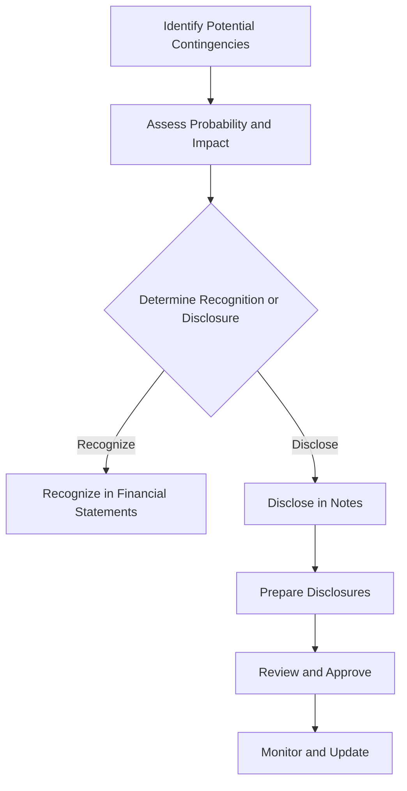

## 10.8 Disclosure of Contingencies

In the realm of financial accounting, the disclosure of contingencies is a critical aspect of transparent and accurate financial reporting. Contingencies, which encompass potential liabilities or gains that depend on future events, must be carefully evaluated and disclosed to ensure stakeholders have a clear understanding of a company's financial position. This section delves into the principles, standards, and practices surrounding the disclosure of contingencies, with a focus on Canadian accounting standards.

### Understanding Contingencies

Contingencies are potential liabilities or assets that may arise depending on the outcome of a future event. They are inherently uncertain, and their resolution can significantly impact a company's financial statements. In accounting, contingencies are typically classified into two categories:

1. **Contingent Liabilities**: These are potential obligations that may arise from past events, but their existence will be confirmed only by the occurrence or non-occurrence of one or more uncertain future events not wholly within the control of the entity. Examples include pending lawsuits, product warranties, and environmental cleanup costs.

2. **Contingent Assets**: These are potential assets that may arise from past events, but their existence will be confirmed only by the occurrence or non-occurrence of one or more uncertain future events not wholly within the control of the entity. Contingent assets are generally not recognized in financial statements due to the principle of conservatism.

### Importance of Disclosure

The disclosure of contingencies is crucial for several reasons:

- **Transparency**: It provides stakeholders with a clear view of potential risks and uncertainties that could affect the company's financial health.
- **Decision-Making**: Investors, creditors, and other stakeholders rely on this information to make informed decisions.
- **Compliance**: Adhering to accounting standards and regulations ensures that financial statements are prepared in accordance with legal and professional requirements.

### Canadian Accounting Standards for Contingencies

In Canada, the disclosure of contingencies is governed by two primary sets of accounting standards:

1. **International Financial Reporting Standards (IFRS)**: Adopted by publicly accountable enterprises in Canada, IFRS provides guidelines for recognizing and disclosing contingencies. IAS 37, "Provisions, Contingent Liabilities and Contingent Assets," is the key standard that addresses these issues.

2. **Accounting Standards for Private Enterprises (ASPE)**: For private enterprises, ASPE Section 3290, "Contingencies," outlines the requirements for recognizing and disclosing contingencies.

### Recognition and Measurement of Contingent Liabilities

Under both IFRS and ASPE, a contingent liability is recognized in the financial statements if it is probable that an outflow of resources embodying economic benefits will be required to settle the obligation, and a reliable estimate of the amount can be made. If these conditions are not met, the contingent liability is disclosed in the notes to the financial statements.

#### Key Considerations for Recognition

- **Probability of Occurrence**: The likelihood of the contingent event occurring must be assessed. Under IFRS, "probable" is interpreted as more likely than not, whereas ASPE uses a similar threshold.
- **Reliable Estimate**: A reliable estimate of the potential financial impact must be possible. If a range of possible outcomes exists, the best estimate within that range should be used.

### Disclosure Requirements

When a contingent liability does not meet the criteria for recognition, it must be disclosed in the notes to the financial statements. The disclosure should include:

- **Nature of the Contingency**: A description of the nature of the contingency, including the uncertainties involved.
- **Financial Impact**: An estimate of the potential financial impact, or a statement that such an estimate cannot be made.
- **Expected Timing**: Information about the expected timing of any outflow of resources.
- **Any Possible Reimbursement**: Details of any potential reimbursement from third parties.

#### Example of Contingent Liability Disclosure

Consider a company facing a lawsuit with a potential liability of $500,000. If the outcome is uncertain and the liability is not recognized, the company should disclose:

- The nature of the lawsuit.
- The estimated financial impact of $500,000.
- The expected timing of resolution.
- Any insurance coverage or other reimbursement arrangements.

### Contingent Assets

While contingent assets are not recognized in financial statements, they are disclosed when it is probable that an inflow of economic benefits will occur. The disclosure should include:

- **Nature of the Asset**: A description of the nature of the contingent asset.
- **Financial Impact**: An estimate of the potential financial impact, if possible.
- **Expected Timing**: Information about the expected timing of the inflow of benefits.

### Practical Examples and Case Studies

#### Case Study: Environmental Liability

A mining company is facing potential environmental cleanup costs due to past operations. The company must evaluate whether these costs are probable and can be reliably estimated. If so, a provision is recognized. If not, the company discloses the potential liability, including the nature of the environmental issue, the estimated financial impact, and any regulatory requirements.

#### Practical Example: Product Warranty

A manufacturing company offers a one-year warranty on its products. Based on historical data, the company estimates that 5% of products sold will require repairs or replacements. The company recognizes a provision for warranty costs and discloses the basis for the estimate and any uncertainties involved.

### Regulatory Scenarios and Compliance

In Canada, companies must comply with both national and international regulations regarding the disclosure of contingencies. This includes adhering to CPA Canada guidelines and ensuring that financial statements are prepared in accordance with IFRS or ASPE, as applicable.

### Best Practices for Disclosure

- **Comprehensive Assessment**: Regularly assess potential contingencies and update disclosures as new information becomes available.
- **Clear Communication**: Ensure that disclosures are clear, concise, and provide sufficient detail for stakeholders to understand the nature and potential impact of contingencies.
- **Consistency**: Maintain consistency in the approach to recognizing and disclosing contingencies across reporting periods.

### Common Pitfalls and Challenges

- **Underestimating Liabilities**: Failing to recognize or disclose significant contingent liabilities can lead to misleading financial statements.
- **Inadequate Disclosure**: Providing insufficient detail in disclosures can result in non-compliance with accounting standards and regulations.
- **Overreliance on Legal Opinions**: While legal opinions are valuable, companies should also consider other factors, such as historical data and industry trends, when assessing contingencies.

### Strategies to Overcome Challenges

- **Regular Review**: Implement a process for regularly reviewing and updating contingent liabilities and assets.
- **Cross-Functional Collaboration**: Engage legal, financial, and operational teams in the assessment and disclosure process.
- **Training and Education**: Provide ongoing training for accounting and finance professionals on the latest standards and best practices for disclosing contingencies.

### Step-by-Step Guidance for Disclosure

1. **Identify Potential Contingencies**: Review all potential liabilities and assets that may arise from past events.
2. **Assess Probability and Impact**: Determine the likelihood of occurrence and estimate the potential financial impact.
3. **Determine Recognition or Disclosure**: Decide whether the contingency should be recognized in the financial statements or disclosed in the notes.
4. **Prepare Disclosures**: Draft clear and comprehensive disclosures, including all required information.
5. **Review and Approve**: Ensure that disclosures are reviewed and approved by senior management and the board of directors, if applicable.
6. **Monitor and Update**: Continuously monitor contingencies and update disclosures as new information becomes available.

### Diagrams and Visuals

To enhance understanding, consider the following diagram illustrating the process of assessing and disclosing contingencies:

### References and Additional Resources

- **CPA Canada**: Offers resources and guidelines on financial reporting standards.
- **IFRS Foundation**: Provides access to IFRS standards and interpretations.
- **ASPE Handbook**: Available through CPA Canada, detailing standards for private enterprises.

### Summary and Key Points

- Contingencies are potential liabilities or assets dependent on future events.
- Disclosure is essential for transparency, decision-making, and compliance.
- Canadian standards (IFRS and ASPE) provide guidelines for recognizing and disclosing contingencies.
- Regular assessment, clear communication, and consistency are key to effective disclosure.

### Practice Questions and Exercises

To reinforce your understanding, consider the following practice questions and scenarios related to the disclosure of contingencies.

## **Ready to Test Your Knowledge?**



### Which of the following is a key standard for disclosing contingencies under IFRS?

- [x] IAS 37
- [ ] IAS 16
- [ ] IFRS 9
- [ ] IFRS 15

> **Explanation:** IAS 37, "Provisions, Contingent Liabilities and Contingent Assets," is the key standard for disclosing contingencies under IFRS.

### Under ASPE, when should a contingent liability be recognized in the financial statements?

- [x] When it is probable and can be reliably estimated
- [ ] When it is possible but not reliably estimated
- [ ] When it is remote and not reliably estimated
- [ ] When it is probable but not reliably estimated

> **Explanation:** Under ASPE, a contingent liability should be recognized when it is probable that an outflow of resources will be required and a reliable estimate can be made.

### What should be included in the disclosure of a contingent liability?

- [x] Nature of the contingency
- [x] Financial impact estimate
- [x] Expected timing
- [ ] Management's opinion

> **Explanation:** Disclosures should include the nature of the contingency, an estimate of the financial impact, and the expected timing of any outflow of resources.

### Which of the following is NOT typically disclosed for contingent assets?

- [ ] Nature of the asset
- [ ] Financial impact estimate
- [ ] Expected timing
- [x] Legal opinions

> **Explanation:** Legal opinions are not typically disclosed for contingent assets, as the focus is on the nature, financial impact, and timing.

### In the context of contingencies, what does "probable" mean under IFRS?

- [x] More likely than not
- [ ] Less than 50% chance
- [ ] Certain to occur
- [ ] Unlikely to occur

> **Explanation:** Under IFRS, "probable" means more likely than not, indicating a greater than 50% chance of occurrence.

### Which of the following is a common pitfall in disclosing contingencies?

- [x] Underestimating liabilities
- [ ] Overestimating assets
- [ ] Providing excessive detail
- [ ] Ignoring legal advice

> **Explanation:** Underestimating liabilities can lead to misleading financial statements, making it a common pitfall in disclosing contingencies.

### What is the purpose of disclosing contingencies in financial statements?

- [x] To provide transparency and inform stakeholders
- [ ] To comply with tax regulations
- [ ] To increase company valuation
- [ ] To reduce audit fees

> **Explanation:** The purpose of disclosing contingencies is to provide transparency and inform stakeholders about potential risks and uncertainties.

### How should a company handle a contingent liability that cannot be reliably estimated?

- [x] Disclose in the notes to the financial statements
- [ ] Recognize in the financial statements
- [ ] Ignore until more information is available
- [ ] Record as an asset

> **Explanation:** If a contingent liability cannot be reliably estimated, it should be disclosed in the notes to the financial statements.

### What is a key challenge in disclosing contingencies?

- [x] Estimating the financial impact accurately
- [ ] Finding legal representation
- [ ] Calculating tax implications
- [ ] Identifying stakeholders

> **Explanation:** Estimating the financial impact accurately is a key challenge in disclosing contingencies, as it involves uncertainty and judgment.

### True or False: Contingent assets are recognized in financial statements when they are probable.

- [ ] True
- [x] False

> **Explanation:** Contingent assets are not recognized in financial statements, even when probable, due to the principle of conservatism.



By understanding the principles and practices of disclosing contingencies, you can effectively prepare for the Canadian Accounting Exams and enhance your professional skills in financial reporting.
