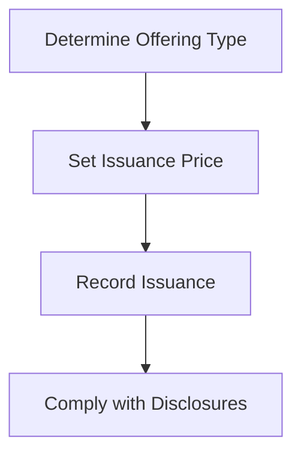

## 11.1 Issuance of Stock

Issuing stock is a fundamental process for corporations seeking to raise capital. This section will guide you through the procedures and accounting entries associated with issuing new shares, focusing on both public offerings and private placements. Understanding these concepts is crucial for Canadian accounting exams and professional practice.

### Overview of Stock Issuance

Stock issuance refers to the process by which a corporation sells new shares to investors to raise capital. This can be done through public offerings, where shares are sold to the general public, or private placements, where shares are sold to a select group of investors. The issuance of stock is a critical aspect of corporate finance and requires careful accounting to ensure compliance with financial reporting standards.

### Types of Stock Issuance

#### 1. Public Offerings

Public offerings involve selling shares to the general public through a stock exchange. This process is highly regulated and requires the company to file a prospectus with the relevant securities commission. There are two main types of public offerings:

- **Initial Public Offering (IPO):** The first time a company offers its shares to the public.
- **Follow-on Public Offering (FPO):** Subsequent offerings after the IPO.

#### 2. Private Placements

Private placements involve selling shares to a select group of investors, such as institutional investors or accredited individuals. This method is less regulated than public offerings and does not require a prospectus.

### Accounting for Stock Issuance

The accounting for stock issuance involves several key steps, including determining the issuance price, recording the issuance in the financial statements, and complying with disclosure requirements.

#### Determining the Issuance Price

The issuance price is the price at which the shares are sold to investors. It is determined based on various factors, including the company's financial performance, market conditions, and investor demand.

#### Recording the Issuance

The accounting entries for stock issuance depend on whether the shares are issued at par, above par, or below par.

- **At Par:** When shares are issued at their nominal or face value.
- **Above Par:** When shares are issued at a price higher than their nominal value, resulting in additional paid-in capital.
- **Below Par:** When shares are issued at a price lower than their nominal value, which is less common and may require regulatory approval.

##### Example: Issuance of Shares at Par

Suppose a company issues 1,000 shares at a par value of $10 per share. The accounting entry would be:

```
Debit: Cash $10,000
Credit: Common Stock $10,000
```

##### Example: Issuance of Shares Above Par

If the same company issues 1,000 shares at $15 per share, the entry would be:

```
Debit: Cash $15,000
Credit: Common Stock $10,000
Credit: Additional Paid-in Capital $5,000
```

#### Disclosure Requirements

Companies must disclose stock issuance details in their financial statements, including the number of shares issued, the issuance price, and any associated costs.

### Regulatory Framework

In Canada, stock issuance is governed by securities regulations, which require companies to provide accurate and timely information to investors. The Canadian Securities Administrators (CSA) oversee these regulations, ensuring transparency and fairness in the market.

### Ethical Considerations

Issuing stock involves ethical considerations, such as ensuring accurate disclosure and avoiding conflicts of interest. Companies must adhere to ethical standards to maintain investor trust and comply with regulatory requirements.

### Practical Examples and Case Studies

#### Case Study: ABC Corporation's IPO

ABC Corporation, a Canadian tech company, decided to go public to raise capital for expansion. The company filed a prospectus with the CSA and set an IPO price of $20 per share. The IPO was successful, raising $50 million.

**Accounting Entries:**

```
Debit: Cash $50,000,000
Credit: Common Stock $25,000,000
Credit: Additional Paid-in Capital $25,000,000
```

#### Scenario: Private Placement by XYZ Ltd.

XYZ Ltd., a private manufacturing company, opted for a private placement to raise $10 million. The company issued shares at $25 each to a group of institutional investors.

**Accounting Entries:**

```
Debit: Cash $10,000,000
Credit: Common Stock $5,000,000
Credit: Additional Paid-in Capital $5,000,000
```

### Real-World Applications

Understanding stock issuance is crucial for accountants involved in corporate finance, mergers and acquisitions, and financial reporting. It enables them to accurately record transactions, comply with regulations, and provide valuable insights to stakeholders.

### Step-by-Step Guidance

#### Step 1: Determine the Type of Offering

Decide whether to pursue a public offering or a private placement based on the company's capital needs and regulatory considerations.

#### Step 2: Set the Issuance Price

Determine the issuance price by considering market conditions, investor demand, and the company's financial performance.

#### Step 3: Record the Issuance

Prepare the necessary accounting entries to record the issuance in the financial statements.

#### Step 4: Comply with Disclosure Requirements

Ensure all necessary disclosures are made in the financial statements and regulatory filings.

### Diagrams and Visuals

Below is a flowchart illustrating the stock issuance process:



### Best Practices and Common Pitfalls

- **Best Practices:**
  - Conduct thorough market research before setting the issuance price.
  - Ensure accurate and timely disclosures to maintain investor trust.
  - Engage with legal and financial advisors to navigate regulatory requirements.

- **Common Pitfalls:**
  - Underestimating the costs associated with public offerings.
  - Failing to comply with disclosure requirements, leading to regulatory penalties.
  - Issuing shares below par without proper approval.

### References and Additional Resources

- **International Financial Reporting Standards (IFRS):** Refer to IFRS 9 for guidance on financial instruments and equity transactions.
- **CPA Canada:** Visit the CPA Canada website for resources and guidance on accounting standards and practices.
- **Canadian Securities Administrators (CSA):** Access the CSA's website for information on securities regulations and compliance.

### Summary

Issuing stock is a complex process that requires careful planning, accurate accounting, and compliance with regulatory requirements. By understanding the procedures and accounting entries involved, you can effectively manage stock issuance and contribute to your company's financial success.

## **Ready to Test Your Knowledge?**



### What is the primary purpose of issuing stock?

- [x] To raise capital for the company
- [ ] To decrease the company's liabilities
- [ ] To reduce the number of shareholders
- [ ] To increase the company's debt

> **Explanation:** The primary purpose of issuing stock is to raise capital for the company, which can be used for expansion, research and development, or other corporate purposes.


### Which of the following is a characteristic of a public offering?

- [x] Shares are sold to the general public
- [ ] Shares are sold to a select group of investors
- [ ] It does not require a prospectus
- [ ] It is less regulated than private placements

> **Explanation:** In a public offering, shares are sold to the general public, and the process is highly regulated, requiring a prospectus.


### What is the accounting entry for issuing shares at par value?

- [x] Debit: Cash; Credit: Common Stock
- [ ] Debit: Common Stock; Credit: Cash
- [ ] Debit: Additional Paid-in Capital; Credit: Cash
- [ ] Debit: Cash; Credit: Additional Paid-in Capital

> **Explanation:** When shares are issued at par value, the entry is to debit Cash and credit Common Stock for the par value amount.


### What is a key advantage of a private placement?

- [x] It is less regulated than a public offering
- [ ] It requires a prospectus
- [ ] It is open to the general public
- [ ] It involves more disclosure requirements

> **Explanation:** A private placement is less regulated than a public offering and does not require a prospectus, making it a quicker and more flexible option for raising capital.


### In a follow-on public offering, what happens?

- [x] A company issues additional shares after an IPO
- [ ] A company issues shares for the first time
- [ ] A company repurchases its own shares
- [ ] A company issues bonds instead of shares

> **Explanation:** In a follow-on public offering, a company issues additional shares after its initial public offering (IPO).


### What is the role of the Canadian Securities Administrators (CSA) in stock issuance?

- [x] To oversee securities regulations and ensure transparency
- [ ] To set the issuance price for companies
- [ ] To manage the company's financial statements
- [ ] To provide loans to companies

> **Explanation:** The CSA oversees securities regulations in Canada, ensuring transparency and fairness in the market.


### How is additional paid-in capital recorded when shares are issued above par?

- [x] As a credit entry in the equity section
- [ ] As a debit entry in the equity section
- [ ] As a credit entry in the liabilities section
- [ ] As a debit entry in the liabilities section

> **Explanation:** Additional paid-in capital is recorded as a credit entry in the equity section when shares are issued above par.


### What is the significance of a prospectus in a public offering?

- [x] It provides detailed information about the offering to investors
- [ ] It is used to set the stock price
- [ ] It is required for private placements
- [ ] It reduces the company's tax liabilities

> **Explanation:** A prospectus provides detailed information about the offering to investors, ensuring they have the necessary information to make informed decisions.


### Which of the following is a common pitfall in stock issuance?

- [x] Failing to comply with disclosure requirements
- [ ] Conducting thorough market research
- [ ] Engaging with legal and financial advisors
- [ ] Ensuring accurate and timely disclosures

> **Explanation:** Failing to comply with disclosure requirements can lead to regulatory penalties and damage investor trust.


### True or False: Issuing shares below par is common and requires no special approval.

- [ ] True
- [x] False

> **Explanation:** Issuing shares below par is less common and may require regulatory approval, as it can affect the company's financial position and investor perceptions.


