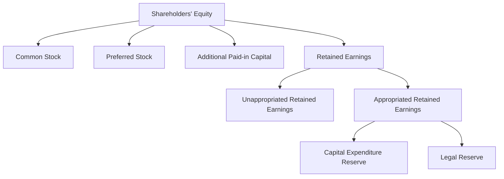

## 11.12 Retained Earnings Appropriations

### Introduction

Retained earnings appropriations are a fundamental aspect of financial management and reporting, particularly in the context of corporate accounting. This section delves into the concept of retained earnings appropriations, exploring why companies set aside portions of their retained earnings for specific purposes, the accounting entries involved, and the implications for financial reporting. Understanding these appropriations is crucial for accounting professionals, especially those preparing for Canadian accounting exams, as it reflects a company's strategic financial planning and compliance with regulatory standards.

### Understanding Retained Earnings

Retained earnings represent the cumulative amount of net income that a company has retained, rather than distributed to shareholders as dividends. They are a key component of shareholders' equity on the balance sheet and indicate the company's ability to reinvest in its operations, pay down debt, or distribute dividends in the future.

#### Key Concepts and Terminology

- **Retained Earnings:** The portion of net income not paid out as dividends but retained by the company for reinvestment or debt repayment.
- **Appropriation:** The act of setting aside funds for a specific purpose, often to ensure financial stability or compliance with legal requirements.
- **Unappropriated Retained Earnings:** The portion of retained earnings not designated for specific purposes.

### Purpose of Retained Earnings Appropriations

Appropriating retained earnings serves several strategic and operational purposes:

1. **Legal and Regulatory Compliance:** Companies may be required by law or regulatory bodies to set aside funds for specific obligations, such as debt covenants or environmental liabilities.
2. **Financial Stability:** Appropriations can provide a financial cushion to safeguard against future uncertainties or economic downturns.
3. **Capital Expenditure Planning:** Companies may appropriate funds for future capital projects, ensuring that resources are available when needed.
4. **Dividend Policy Management:** Appropriations can help manage dividend policies by earmarking funds for future distributions, balancing shareholder expectations with financial prudence.

### Accounting for Retained Earnings Appropriations

The process of appropriating retained earnings involves specific accounting entries and disclosures. It is essential to understand these entries to accurately reflect appropriations in financial statements.

#### Journal Entries for Appropriations

When a company decides to appropriate retained earnings, the following journal entry is typically made:

- **Debit:** Retained Earnings
- **Credit:** Appropriated Retained Earnings

This entry reduces the unappropriated retained earnings and increases the appropriated retained earnings, reflecting the allocation of funds for a specific purpose.

#### Example

Consider a company, ABC Corp, which decides to appropriate $500,000 of its retained earnings for future capital expenditures. The journal entry would be:

- **Debit:** Retained Earnings $500,000
- **Credit:** Appropriated Retained Earnings $500,000

This entry indicates that $500,000 of the retained earnings is now set aside for capital expenditures, reducing the amount available for dividends or other uses.

### Financial Statement Presentation

Retained earnings appropriations must be clearly presented in the financial statements, typically within the equity section of the balance sheet. Companies should disclose the nature and purpose of the appropriations in the notes to the financial statements, providing transparency and insight into the company's financial strategy.

#### Example of Balance Sheet Presentation

### Regulatory Considerations

In Canada, companies must adhere to specific accounting standards and regulations when appropriating retained earnings. The International Financial Reporting Standards (IFRS) and Accounting Standards for Private Enterprises (ASPE) provide guidelines on the recognition, measurement, and disclosure of retained earnings appropriations.

#### IFRS and ASPE Guidelines

- **IFRS:** Under IFRS, companies must disclose the nature and purpose of appropriations in the notes to the financial statements, ensuring transparency and compliance with financial reporting standards.
- **ASPE:** Similar to IFRS, ASPE requires clear disclosure of appropriations, emphasizing the importance of transparency and accountability in financial reporting.

### Practical Examples and Case Studies

#### Case Study: XYZ Ltd.

XYZ Ltd., a Canadian manufacturing company, decided to appropriate $1 million of its retained earnings to establish an environmental reserve. This decision was driven by regulatory requirements and the company's commitment to sustainability.

**Accounting Entries:**

- **Debit:** Retained Earnings $1,000,000
- **Credit:** Appropriated Retained Earnings - Environmental Reserve $1,000,000

**Financial Statement Impact:**

The appropriated retained earnings are presented in the equity section of the balance sheet, with detailed disclosures in the notes explaining the purpose and regulatory requirements of the environmental reserve.

#### Practical Example: Dividend Policy Management

A company may appropriate retained earnings to manage its dividend policy effectively. By setting aside funds for future dividend payments, the company can ensure consistent distributions to shareholders, even during periods of fluctuating earnings.

**Scenario:**

ABC Corp. appropriates $200,000 of its retained earnings for future dividend payments. This appropriation helps stabilize dividend distributions, aligning with shareholder expectations and maintaining investor confidence.

### Challenges and Best Practices

#### Common Challenges

1. **Regulatory Compliance:** Ensuring compliance with complex regulatory requirements can be challenging, particularly for multinational companies operating in different jurisdictions.
2. **Financial Planning:** Appropriating retained earnings requires careful financial planning and forecasting to balance current needs with future obligations.
3. **Transparency:** Providing clear and comprehensive disclosures in financial statements is essential to maintain transparency and stakeholder trust.

#### Best Practices

1. **Regular Review:** Companies should regularly review their appropriations to ensure they align with strategic objectives and regulatory requirements.
2. **Clear Disclosures:** Providing detailed disclosures in financial statements enhances transparency and helps stakeholders understand the company's financial strategy.
3. **Stakeholder Communication:** Engaging with stakeholders, including shareholders and regulatory bodies, ensures alignment and compliance with expectations and requirements.

### Exam Preparation Tips

1. **Understand Key Concepts:** Familiarize yourself with the fundamental concepts of retained earnings and appropriations, including the accounting entries and financial statement presentation.
2. **Practice Journal Entries:** Work through practical examples and scenarios to reinforce your understanding of the accounting entries involved in appropriations.
3. **Review Regulatory Guidelines:** Study the relevant IFRS and ASPE guidelines to ensure compliance with Canadian accounting standards.
4. **Analyze Case Studies:** Examine real-world case studies to understand the practical application of retained earnings appropriations in different industries and contexts.

### Conclusion

Retained earnings appropriations are a vital aspect of financial management and reporting, reflecting a company's strategic financial planning and compliance with regulatory standards. By understanding the purpose, accounting entries, and financial statement presentation of appropriations, accounting professionals can effectively manage retained earnings and ensure transparency and accountability in financial reporting.

---

## **Ready to Test Your Knowledge?**



### What is the primary purpose of appropriating retained earnings?

- [x] To set aside funds for specific future purposes
- [ ] To increase the company's net income
- [ ] To distribute dividends to shareholders
- [ ] To reduce the company's tax liability

> **Explanation:** Appropriating retained earnings involves setting aside funds for specific future purposes, such as capital expenditures or legal reserves, rather than distributing them as dividends.

### Which of the following is a typical journal entry for appropriating retained earnings?

- [x] Debit Retained Earnings, Credit Appropriated Retained Earnings
- [ ] Debit Appropriated Retained Earnings, Credit Retained Earnings
- [ ] Debit Retained Earnings, Credit Cash
- [ ] Debit Cash, Credit Retained Earnings

> **Explanation:** The journal entry for appropriating retained earnings involves debiting Retained Earnings and crediting Appropriated Retained Earnings to reflect the allocation of funds for a specific purpose.

### Under IFRS, where should appropriated retained earnings be disclosed?

- [x] In the notes to the financial statements
- [ ] In the income statement
- [ ] In the cash flow statement
- [ ] In the auditor's report

> **Explanation:** Under IFRS, appropriated retained earnings should be disclosed in the notes to the financial statements, providing transparency and insight into the company's financial strategy.

### What is a common reason for a company to appropriate retained earnings?

- [x] To comply with legal or regulatory requirements
- [ ] To increase the company's market share
- [ ] To reduce employee salaries
- [ ] To enhance customer satisfaction

> **Explanation:** Companies often appropriate retained earnings to comply with legal or regulatory requirements, such as establishing reserves for environmental liabilities or debt covenants.

### How does appropriating retained earnings affect the balance sheet?

- [x] It reallocates funds within shareholders' equity
- [ ] It increases total assets
- [x] It decreases unappropriated retained earnings
- [ ] It affects the company's liabilities

> **Explanation:** Appropriating retained earnings reallocates funds within shareholders' equity, decreasing unappropriated retained earnings and increasing appropriated retained earnings.

### What is an example of a specific purpose for which retained earnings might be appropriated?

- [x] Capital expenditure reserve
- [ ] Employee bonuses
- [ ] Marketing campaigns
- [ ] Office supplies

> **Explanation:** Retained earnings might be appropriated for specific purposes such as a capital expenditure reserve, ensuring funds are available for future investments in the company's infrastructure or operations.

### Which accounting standard provides guidelines on retained earnings appropriations in Canada?

- [x] IFRS
- [ ] GAAP
- [x] ASPE
- [ ] SOX

> **Explanation:** In Canada, both IFRS and ASPE provide guidelines on the recognition, measurement, and disclosure of retained earnings appropriations.

### What is a best practice for managing retained earnings appropriations?

- [x] Regularly reviewing appropriations to align with strategic objectives
- [ ] Minimizing disclosures in financial statements
- [ ] Avoiding communication with stakeholders
- [ ] Increasing dividend distributions

> **Explanation:** A best practice for managing retained earnings appropriations is to regularly review them to ensure they align with the company's strategic objectives and regulatory requirements.

### Why is transparency important in the disclosure of retained earnings appropriations?

- [x] To maintain stakeholder trust and confidence
- [ ] To increase the company's tax liability
- [ ] To reduce the company's net income
- [ ] To enhance employee satisfaction

> **Explanation:** Transparency in the disclosure of retained earnings appropriations is important to maintain stakeholder trust and confidence, providing insight into the company's financial strategy and compliance with regulatory standards.

### True or False: Appropriating retained earnings reduces the company's total equity.

- [x] False
- [ ] True

> **Explanation:** Appropriating retained earnings does not reduce the company's total equity; it reallocates funds within the equity section, affecting the composition but not the total amount.


