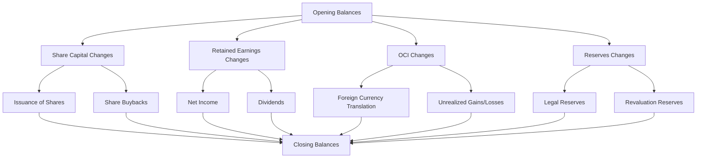

## 11.8 Statement of Changes in Equity

The **Statement of Changes in Equity** is a critical component of financial reporting, providing a detailed account of the changes in a company's equity over a specific period. This statement is essential for understanding how various equity components, such as share capital, retained earnings, and other reserves, evolve due to business activities and financial transactions. In this section, we will explore the preparation, presentation, and analysis of the Statement of Changes in Equity, focusing on Canadian accounting standards and practices.

### Understanding the Statement of Changes in Equity

The Statement of Changes in Equity is a financial statement that reconciles the opening and closing balances of equity accounts. It highlights the movements in equity components, including:

- **Share Capital**: Changes due to the issuance or repurchase of shares.
- **Retained Earnings**: Adjustments for net income, dividends, and prior period adjustments.
- **Other Comprehensive Income (OCI)**: Items that bypass the income statement but affect equity, such as foreign currency translation adjustments and unrealized gains/losses on available-for-sale securities.
- **Reserves**: Transfers to and from various reserves, such as legal reserves or revaluation reserves.

### Importance in Financial Reporting

The Statement of Changes in Equity provides stakeholders with insights into the company's financial health and management's decisions regarding profit distribution, capital structure, and strategic investments. It enhances transparency and accountability, allowing investors, creditors, and regulators to assess the company's performance and sustainability.

### Regulatory Framework

In Canada, the preparation and presentation of the Statement of Changes in Equity are governed by the **International Financial Reporting Standards (IFRS)** as adopted by the Canadian Accounting Standards Board (AcSB). For private enterprises, the **Accounting Standards for Private Enterprises (ASPE)** may apply. Key standards include:

- **IAS 1 - Presentation of Financial Statements**: Outlines the requirements for presenting financial statements, including the Statement of Changes in Equity.
- **IAS 8 - Accounting Policies, Changes in Accounting Estimates and Errors**: Addresses adjustments to equity due to changes in accounting policies or corrections of errors.

### Key Components of the Statement of Changes in Equity

#### Share Capital

**Share Capital** represents the funds raised by issuing shares to shareholders. Changes in share capital occur due to:

- **Issuance of New Shares**: Increases in share capital when a company issues additional shares.
- **Share Buybacks**: Decreases in share capital when a company repurchases its own shares.

#### Retained Earnings

**Retained Earnings** are the cumulative profits retained in the business after distributing dividends. Key changes include:

- **Net Income**: Increases retained earnings when the company earns a profit.
- **Dividends**: Decreases retained earnings when dividends are declared and paid to shareholders.
- **Prior Period Adjustments**: Corrections of errors or changes in accounting policies affecting prior periods.

#### Other Comprehensive Income (OCI)

**Other Comprehensive Income** includes items that affect equity but are not recognized in the income statement. Common OCI items are:

- **Foreign Currency Translation Adjustments**: Arising from translating foreign operations' financial statements.
- **Unrealized Gains/Losses on Financial Instruments**: Such as available-for-sale securities or cash flow hedges.

#### Reserves

**Reserves** are portions of equity set aside for specific purposes, such as:

- **Legal Reserves**: Required by law to protect creditors.
- **Revaluation Reserves**: Arising from the revaluation of assets to fair value.

### Preparing the Statement of Changes in Equity

The preparation of the Statement of Changes in Equity involves the following steps:

1. **Determine Opening Balances**: Start with the opening balances of each equity component.
2. **Record Transactions and Adjustments**: Include all transactions affecting equity, such as share issuances, dividends, and OCI items.
3. **Calculate Closing Balances**: Sum the opening balances and changes to determine the closing balances for each equity component.

### Presentation of the Statement of Changes in Equity

The Statement of Changes in Equity is typically presented as a separate financial statement or as part of the notes to the financial statements. It should include:

- **Columns for Each Equity Component**: Such as share capital, retained earnings, and reserves.
- **Rows for Each Type of Change**: Including net income, dividends, and OCI items.
- **Reconciliation of Opening and Closing Balances**: Clearly showing the movements in each equity component.

### Practical Example

Let's consider a practical example of preparing a Statement of Changes in Equity for a Canadian company, ABC Corp, for the year ended December 31, 2023.

#### Opening Balances (January 1, 2023)

- Share Capital: $500,000
- Retained Earnings: $200,000
- Revaluation Reserve: $50,000
- Foreign Currency Translation Reserve: $10,000

#### Transactions During the Year

- Issued 10,000 new shares at $10 each: $100,000 increase in Share Capital.
- Net Income for the year: $150,000 increase in Retained Earnings.
- Dividends declared and paid: $50,000 decrease in Retained Earnings.
- Revaluation of assets: $20,000 increase in Revaluation Reserve.
- Foreign currency translation loss: $5,000 decrease in Foreign Currency Translation Reserve.

#### Closing Balances (December 31, 2023)

- Share Capital: $600,000
- Retained Earnings: $300,000
- Revaluation Reserve: $70,000
- Foreign Currency Translation Reserve: $5,000

#### Statement of Changes in Equity for ABC Corp

| Equity Component                  | Share Capital | Retained Earnings | Revaluation Reserve | Foreign Currency Translation Reserve |
|-----------------------------------|---------------|-------------------|---------------------|--------------------------------------|
| **Opening Balance (Jan 1, 2023)** | $500,000      | $200,000          | $50,000             | $10,000                              |
| Issuance of Shares                | $100,000      |                   |                     |                                      |
| Net Income                        |               | $150,000          |                     |                                      |
| Dividends                         |               | ($50,000)         |                     |                                      |
| Revaluation Surplus               |               |                   | $20,000             |                                      |
| Foreign Currency Translation      |               |                   |                     | ($5,000)                             |
| **Closing Balance (Dec 31, 2023)**| $600,000      | $300,000          | $70,000             | $5,000                               |

### Analyzing the Statement of Changes in Equity

The Statement of Changes in Equity provides valuable insights into a company's financial strategy and performance. Key analysis points include:

- **Capital Structure**: Assessing the proportion of equity financing through share capital versus retained earnings.
- **Profit Distribution**: Evaluating the company's dividend policy and its impact on retained earnings.
- **Reserves Management**: Understanding the purpose and adequacy of reserves, such as revaluation reserves.
- **Comprehensive Income**: Analyzing the impact of OCI items on equity and overall financial performance.

### Common Pitfalls and Best Practices

#### Common Pitfalls

- **Omitting Transactions**: Failing to include all transactions affecting equity, such as prior period adjustments or OCI items.
- **Incorrect Classification**: Misclassifying transactions between equity components, such as treating dividends as expenses.
- **Inadequate Disclosures**: Providing insufficient disclosures regarding changes in equity, affecting transparency and compliance.

#### Best Practices

- **Comprehensive Record-Keeping**: Maintain detailed records of all equity transactions and adjustments.
- **Accurate Classification**: Ensure correct classification of transactions to reflect their true nature and impact on equity.
- **Clear Disclosures**: Provide clear and comprehensive disclosures in the notes to the financial statements, explaining significant changes in equity.

### Real-World Applications and Regulatory Scenarios

In practice, the Statement of Changes in Equity is used by various stakeholders to make informed decisions:

- **Investors**: Assess the company's financial health, dividend policy, and growth potential.
- **Creditors**: Evaluate the company's capital structure and ability to meet financial obligations.
- **Regulators**: Ensure compliance with accounting standards and transparency in financial reporting.

### Step-by-Step Guidance for Preparing the Statement

1. **Gather Financial Data**: Collect all relevant financial data, including opening balances, transactions, and adjustments.
2. **Classify Transactions**: Classify each transaction according to its impact on equity components.
3. **Prepare the Statement**: Use a structured format to present the changes in equity, ensuring clarity and accuracy.
4. **Review and Disclose**: Review the statement for accuracy and provide necessary disclosures in the notes to the financial statements.

### Diagrams and Visual Aids

To enhance understanding, we can use a **Mermaid.js diagram** to illustrate the flow of transactions affecting equity:

### References and Additional Resources

- **CPA Canada**: Offers resources and guidance on financial reporting and accounting standards.
- **IFRS Foundation**: Provides access to IFRS standards and interpretations.
- **AcSB**: The Canadian Accounting Standards Board, which adopts and maintains accounting standards in Canada.

### Summary and Key Takeaways

The Statement of Changes in Equity is a vital financial statement that provides a comprehensive view of changes in a company's equity over a period. It enhances transparency and accountability, allowing stakeholders to assess the company's financial health and strategic decisions. By understanding the preparation, presentation, and analysis of this statement, you can effectively interpret financial reports and make informed decisions.

### Practice Questions and Exam Strategies

To reinforce your understanding, practice preparing the Statement of Changes in Equity using sample data. Focus on accurately classifying transactions and providing clear disclosures. Remember to review the relevant Canadian accounting standards and guidelines to ensure compliance and accuracy.

## **Ready to Test Your Knowledge?**



### What is the primary purpose of the Statement of Changes in Equity?

- [x] To reconcile the opening and closing balances of equity accounts
- [ ] To calculate the company's net income
- [ ] To assess the company's liquidity position
- [ ] To determine the company's cash flow

> **Explanation:** The primary purpose of the Statement of Changes in Equity is to reconcile the opening and closing balances of equity accounts, providing insights into changes in share capital, retained earnings, and other reserves.

### Which of the following items is typically included in Other Comprehensive Income (OCI)?

- [x] Foreign currency translation adjustments
- [ ] Dividends paid
- [ ] Net income
- [ ] Share issuance

> **Explanation:** Foreign currency translation adjustments are typically included in Other Comprehensive Income (OCI), affecting equity without passing through the income statement.

### How does the issuance of new shares affect the Statement of Changes in Equity?

- [x] Increases share capital
- [ ] Decreases retained earnings
- [ ] Increases dividends payable
- [ ] Decreases other comprehensive income

> **Explanation:** The issuance of new shares increases the share capital component of equity, reflecting the funds raised from shareholders.

### What is the impact of declaring dividends on retained earnings?

- [x] Decreases retained earnings
- [ ] Increases share capital
- [ ] Increases other comprehensive income
- [ ] Decreases share capital

> **Explanation:** Declaring dividends decreases retained earnings, as profits are distributed to shareholders.

### Which standard governs the presentation of the Statement of Changes in Equity in Canada?

- [x] IAS 1 - Presentation of Financial Statements
- [ ] IAS 8 - Accounting Policies, Changes in Accounting Estimates and Errors
- [ ] IFRS 9 - Financial Instruments
- [ ] ASPE 1000 - Financial Statement Concepts

> **Explanation:** IAS 1 - Presentation of Financial Statements governs the presentation of the Statement of Changes in Equity, outlining the requirements for financial statement presentation.

### What is the effect of a revaluation surplus on the Statement of Changes in Equity?

- [x] Increases revaluation reserve
- [ ] Decreases retained earnings
- [ ] Increases share capital
- [ ] Decreases other comprehensive income

> **Explanation:** A revaluation surplus increases the revaluation reserve, reflecting the upward revaluation of assets to fair value.

### Which component of equity is affected by net income?

- [x] Retained earnings
- [ ] Share capital
- [ ] Other comprehensive income
- [ ] Revaluation reserve

> **Explanation:** Net income affects retained earnings, increasing the cumulative profits retained in the business.

### How are prior period adjustments reflected in the Statement of Changes in Equity?

- [x] Adjustments to opening retained earnings
- [ ] Adjustments to current period net income
- [ ] Adjustments to share capital
- [ ] Adjustments to dividends payable

> **Explanation:** Prior period adjustments are reflected as adjustments to opening retained earnings, correcting errors or changes in accounting policies affecting prior periods.

### What is the role of reserves in the Statement of Changes in Equity?

- [x] To set aside portions of equity for specific purposes
- [ ] To calculate net income
- [ ] To determine cash flow
- [ ] To assess liquidity

> **Explanation:** Reserves are portions of equity set aside for specific purposes, such as legal reserves or revaluation reserves, and are reflected in the Statement of Changes in Equity.

### True or False: The Statement of Changes in Equity is optional for Canadian companies.

- [ ] True
- [x] False

> **Explanation:** False. The Statement of Changes in Equity is a required financial statement for Canadian companies under IFRS and ASPE, providing essential information on changes in equity components.


