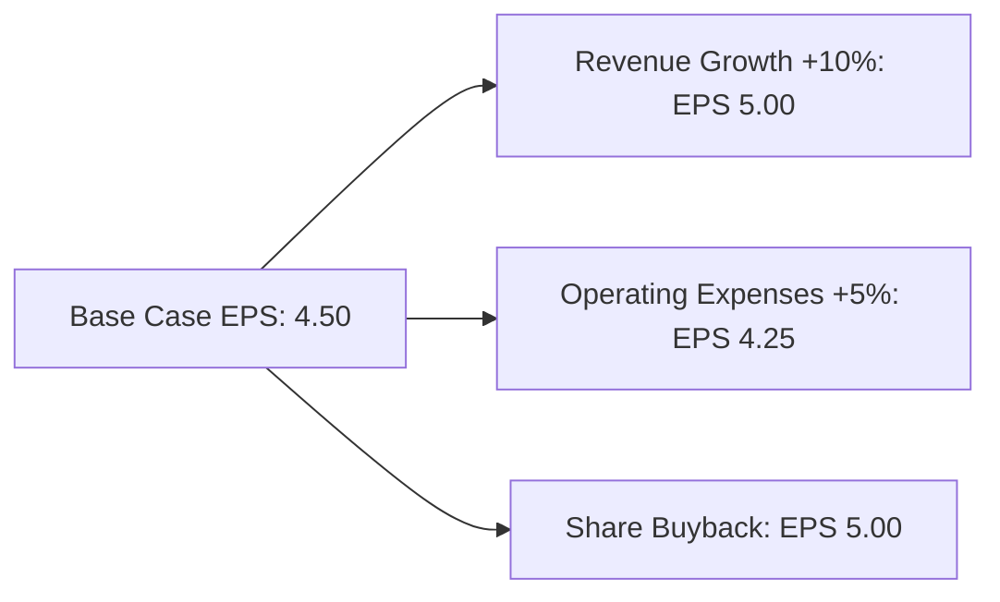

## 12.16 EPS Sensitivity Analysis

Earnings Per Share (EPS) is a critical financial metric used by investors, analysts, and stakeholders to assess a company's profitability on a per-share basis. EPS Sensitivity Analysis is a technique that evaluates how changes in various assumptions impact EPS calculations. This analysis is crucial for understanding the robustness of EPS figures and for making informed investment decisions. In this section, we will explore the methods, importance, and practical applications of EPS Sensitivity Analysis, with a focus on the Canadian accounting context.

### Understanding EPS and Its Importance

EPS is calculated as:

 \text{EPS} = \frac{\text{Net Income} - \text{Preferred Dividends}}{\text{Weighted Average Number of Common Shares Outstanding}} 

EPS provides insight into a company's profitability and is often used in valuation ratios such as the Price-to-Earnings (P/E) ratio. It is essential for:

- **Investment Decisions:** Investors use EPS to compare profitability across companies and industries.
- **Performance Measurement:** Companies track EPS to gauge financial performance over time.
- **Valuation:** Analysts use EPS in various valuation models to determine a company's market value.

### Key Concepts in EPS Sensitivity Analysis

EPS Sensitivity Analysis involves assessing the impact of changes in key variables on EPS. These variables include:

- **Revenue Growth Rates:** Changes in sales forecasts can significantly affect EPS.
- **Cost Structures:** Variations in cost of goods sold (COGS) or operating expenses impact net income and EPS.
- **Interest Rates:** Fluctuations in interest rates affect interest expenses and net income.
- **Tax Rates:** Changes in corporate tax rates influence net income and EPS.
- **Share Count:** Issuance or repurchase of shares alters the denominator in the EPS formula.

### Conducting EPS Sensitivity Analysis

#### Step 1: Identify Key Assumptions

Begin by identifying the assumptions that most significantly impact EPS. These typically include revenue growth, cost structures, interest rates, tax rates, and share count. Understanding the sensitivity of EPS to these variables is crucial for accurate forecasting and analysis.

#### Step 2: Develop a Base Case Scenario

Create a base case scenario using current financial data and realistic assumptions. This scenario serves as the benchmark against which changes in assumptions will be measured.

#### Step 3: Perform Sensitivity Testing

Test the impact of changes in each key assumption on EPS. This involves adjusting one variable at a time while holding others constant to isolate its effect on EPS. Use percentage changes or specific value adjustments to assess sensitivity.

#### Step 4: Analyze Results

Analyze the results to determine which assumptions have the most significant impact on EPS. This analysis helps identify potential risks and opportunities for the company.

#### Step 5: Communicate Findings

Effectively communicate the findings of the EPS Sensitivity Analysis to stakeholders. Use visual aids such as charts and graphs to illustrate the impact of changes in assumptions on EPS.

### Practical Example of EPS Sensitivity Analysis

Consider a Canadian company, MapleTech Inc., with the following base case assumptions:

- **Net Income:** $5,000,000
- **Preferred Dividends:** $500,000
- **Weighted Average Shares Outstanding:** 1,000,000

**Base Case EPS Calculation:**

 \text{EPS} = \frac{5,000,000 - 500,000}{1,000,000} = 4.50 

**Scenario 1: Revenue Growth Increase**

Assume a 10% increase in revenue growth, leading to a $500,000 increase in net income.

 \text{New Net Income} = 5,500,000 

 \text{New EPS} = \frac{5,500,000 - 500,000}{1,000,000} = 5.00 

**Scenario 2: Increase in Operating Expenses**

Assume a 5% increase in operating expenses, reducing net income by $250,000.

 \text{New Net Income} = 4,750,000 

 \text{New EPS} = \frac{4,750,000 - 500,000}{1,000,000} = 4.25 

**Scenario 3: Share Buyback**

Assume a buyback of 100,000 shares, reducing the weighted average shares outstanding to 900,000.

 \text{New EPS} = \frac{5,000,000 - 500,000}{900,000} = 5.00 

### Visualizing EPS Sensitivity

To effectively communicate the results of EPS Sensitivity Analysis, visual aids such as graphs and charts are invaluable. Below is a simple representation of how EPS changes with variations in key assumptions.

### Best Practices for EPS Sensitivity Analysis

- **Use Realistic Assumptions:** Ensure that assumptions are based on historical data and realistic projections.
- **Consider Multiple Scenarios:** Analyze a range of scenarios to capture potential outcomes.
- **Communicate Clearly:** Present findings in a clear and concise manner to facilitate decision-making.
- **Regularly Update Analysis:** Revisit and update the analysis as new data becomes available.

### Common Pitfalls and Challenges

- **Over-reliance on Historical Data:** While historical data is useful, it may not always predict future performance.
- **Ignoring External Factors:** Consider external factors such as economic conditions and industry trends that may impact assumptions.
- **Complexity in Calculations:** Ensure that calculations are accurate and that assumptions are clearly documented.

### Regulatory Considerations

In Canada, EPS calculations and disclosures are governed by International Financial Reporting Standards (IFRS) as adopted by the Canadian Accounting Standards Board (AcSB). Key standards include:

- **IAS 33 - Earnings Per Share:** Provides guidance on the calculation and presentation of EPS.
- **IFRS 9 - Financial Instruments:** Addresses the impact of financial instruments on EPS calculations.

### Conclusion

EPS Sensitivity Analysis is a powerful tool for understanding the impact of changes in assumptions on EPS. By conducting thorough sensitivity analyses, companies can better anticipate potential risks and opportunities, leading to more informed decision-making. For those preparing for Canadian accounting exams, mastering EPS Sensitivity Analysis is essential for success.

### Ready to Test Your Knowledge?



### Which of the following is most likely to affect EPS calculations?

- [x] Changes in revenue growth rates
- [ ] Changes in employee headcount
- [ ] Changes in office location
- [ ] Changes in company logo

> **Explanation:** Changes in revenue growth rates directly affect net income, which in turn impacts EPS calculations.

### What is the primary purpose of EPS Sensitivity Analysis?

- [x] To assess how changes in assumptions affect EPS
- [ ] To determine the company's market value
- [ ] To calculate tax liabilities
- [ ] To evaluate employee performance

> **Explanation:** EPS Sensitivity Analysis is used to evaluate how different assumptions impact EPS, aiding in risk assessment and decision-making.

### In EPS Sensitivity Analysis, which variable is adjusted to isolate its effect?

- [x] One variable at a time
- [ ] All variables simultaneously
- [ ] Only revenue
- [ ] Only expenses

> **Explanation:** Adjusting one variable at a time helps isolate its specific impact on EPS, providing clearer insights.

### How does a share buyback affect EPS?

- [x] It increases EPS by reducing the number of shares outstanding
- [ ] It decreases EPS by increasing the number of shares outstanding
- [ ] It has no effect on EPS
- [ ] It only affects the company's market value

> **Explanation:** A share buyback reduces the number of shares outstanding, increasing EPS as the same net income is spread over fewer shares.

### Which standard governs EPS calculations in Canada?

- [x] IAS 33
- [ ] IFRS 16
- [ ] ASPE 12
- [ ] GAAP 101

> **Explanation:** IAS 33 provides guidance on the calculation and presentation of EPS under IFRS as adopted in Canada.

### What is the effect of a 5% increase in operating expenses on EPS?

- [x] It decreases EPS by reducing net income
- [ ] It increases EPS by increasing net income
- [ ] It has no effect on EPS
- [ ] It only affects the company's cash flow

> **Explanation:** An increase in operating expenses reduces net income, which in turn decreases EPS.

### Why is it important to use realistic assumptions in EPS Sensitivity Analysis?

- [x] To ensure accurate and reliable results
- [ ] To simplify calculations
- [ ] To meet regulatory requirements
- [ ] To impress stakeholders

> **Explanation:** Realistic assumptions ensure that the analysis reflects potential real-world outcomes, providing accurate insights.

### What is a common pitfall in conducting EPS Sensitivity Analysis?

- [x] Over-reliance on historical data
- [ ] Including too many variables
- [ ] Ignoring financial statements
- [ ] Focusing only on qualitative factors

> **Explanation:** Over-reliance on historical data can lead to inaccurate predictions if future conditions differ significantly.

### How often should EPS Sensitivity Analysis be updated?

- [x] Regularly, as new data becomes available
- [ ] Once a year
- [ ] Every five years
- [ ] Only when required by regulators

> **Explanation:** Regular updates ensure that the analysis remains relevant and reflects the latest financial data and assumptions.

### True or False: EPS Sensitivity Analysis is only useful for large corporations.

- [ ] True
- [x] False

> **Explanation:** EPS Sensitivity Analysis is valuable for companies of all sizes as it helps assess financial performance and risk.


