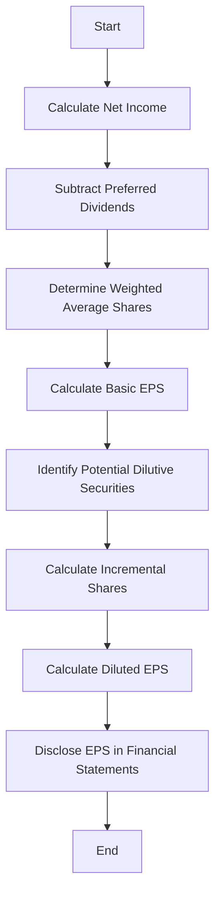

## 12.5 EPS Reporting Requirements

Earnings per Share (EPS) is a critical metric in financial reporting, providing insights into a company's profitability on a per-share basis. For those preparing for Canadian accounting exams, understanding the EPS reporting requirements is essential. This section delves into the presentation and disclosure requirements for EPS in financial statements, aligning with the International Financial Reporting Standards (IFRS) as adopted in Canada and the Accounting Standards for Private Enterprises (ASPE).

### Understanding EPS: A Brief Overview

EPS is a measure used to indicate the portion of a company's profit allocated to each outstanding share of common stock. It is a key indicator of a company's financial health and is widely used by investors to assess profitability and make informed investment decisions.

#### Key Components of EPS

1. **Net Income**: The total profit of a company after all expenses, taxes, and costs have been deducted from total revenue.
2. **Preferred Dividends**: Dividends that must be paid to preferred shareholders before any dividends can be paid to common shareholders.
3. **Weighted Average Shares Outstanding**: The average number of shares outstanding during a reporting period, adjusted for stock splits and stock dividends.

### EPS Calculation Methods

EPS can be calculated using two primary methods:

1. **Basic EPS**: This is calculated by dividing the net income available to common shareholders by the weighted average number of common shares outstanding during the period.

   
   \text{Basic EPS} = \frac{\text{Net Income} - \text{Preferred Dividends}}{\text{Weighted Average Shares Outstanding}}
   

2. **Diluted EPS**: This considers the impact of all potential dilutive securities, such as stock options, warrants, and convertible securities, which could increase the total number of outstanding shares.

   
   \text{Diluted EPS} = \frac{\text{Net Income} - \text{Preferred Dividends} + \text{Adjustments for Dilutive Securities}}{\text{Weighted Average Shares Outstanding} + \text{Dilutive Securities}}
   

### EPS Reporting Requirements under IFRS and ASPE

#### IFRS Requirements

Under IFRS, specifically IAS 33 - Earnings per Share, companies are required to present both basic and diluted EPS on the face of the income statement for each class of common stock. Key points include:

- **Presentation**: EPS must be presented for profit or loss from continuing operations and net profit or loss attributable to the ordinary equity holders of the parent entity.
- **Disclosure**: Companies must disclose the amounts used as the numerators in calculating basic and diluted EPS, along with a reconciliation of these amounts to the net profit or loss.
- **Potential Dilution**: Entities must disclose the instruments that could potentially dilute basic EPS in the future but were not included in the calculation of diluted EPS because they were anti-dilutive for the period(s) presented.

#### ASPE Requirements

For private enterprises reporting under ASPE, Section 3500 - Earnings per Share, outlines similar requirements:

- **Presentation**: Basic EPS must be presented on the face of the income statement for each period presented.
- **Disclosure**: The method used to calculate EPS and the reconciliation of the numerators and denominators of the basic and diluted EPS computations must be disclosed.
- **Dilutive Securities**: Disclosure of securities that could potentially dilute basic EPS in the future is required.

### Practical Examples and Scenarios

#### Example 1: Basic EPS Calculation

**Scenario**: A company reports a net income of $500,000 for the year. It has 100,000 common shares outstanding and pays $20,000 in preferred dividends.

**Calculation**:


\text{Basic EPS} = \frac{\$500,000 - \$20,000}{100,000} = \$4.80


#### Example 2: Diluted EPS Calculation

**Scenario**: Continuing from Example 1, assume the company has 10,000 stock options outstanding, exercisable at $10 per share. The average market price during the year was $15.

**Calculation**:

- **Incremental Shares from Options**: 
  
  \text{Incremental Shares} = \frac{\text{Number of Options} \times (\text{Market Price} - \text{Exercise Price})}{\text{Market Price}} = \frac{10,000 \times (15 - 10)}{15} = 3,333
  

- **Diluted EPS**:
  
  \text{Diluted EPS} = \frac{\$500,000 - \$20,000}{100,000 + 3,333} = \$4.65
  

### Regulatory Scenarios and Compliance

Understanding the regulatory environment is crucial for accurate EPS reporting. Companies must comply with both national and international standards, ensuring transparency and consistency in financial reporting.

#### Canadian Regulatory Framework

- **CPA Canada**: Provides guidelines and resources for understanding and implementing EPS reporting requirements.
- **Securities Regulations**: Public companies must adhere to additional disclosure requirements set by securities regulators, such as the Canadian Securities Administrators (CSA).

### Common Pitfalls and Best Practices

#### Common Pitfalls

1. **Incorrect Calculation of Weighted Average Shares**: Failing to adjust for stock splits or dividends can lead to inaccurate EPS figures.
2. **Ignoring Anti-dilutive Securities**: Including anti-dilutive securities in diluted EPS calculations can misrepresent a company's financial position.
3. **Inadequate Disclosure**: Failing to provide sufficient disclosure can lead to regulatory scrutiny and potential penalties.

#### Best Practices

1. **Regular Review of Outstanding Securities**: Regularly review and update the list of potential dilutive securities to ensure accurate EPS calculations.
2. **Comprehensive Disclosure**: Provide detailed disclosures, including reconciliation of numerators and denominators, to enhance transparency.
3. **Use of Technology**: Leverage accounting software to automate EPS calculations and reduce the risk of human error.

### Real-World Applications

EPS is not just a theoretical concept but a practical tool used by investors, analysts, and management to assess a company's performance. Understanding EPS reporting requirements helps ensure that financial statements provide a true and fair view of a company's profitability.

#### Case Study: EPS in Action

Consider a Canadian technology firm that has experienced rapid growth. By accurately reporting EPS, the firm can attract investors by demonstrating its profitability and growth potential. The firm must ensure compliance with IFRS and ASPE standards, providing clear and transparent disclosures to maintain investor confidence.

### Diagrams and Visuals

To enhance understanding, let's visualize the EPS calculation process using a flowchart:

### Conclusion

Understanding EPS reporting requirements is crucial for those preparing for Canadian accounting exams. By mastering the calculation methods, presentation, and disclosure requirements, you can ensure compliance with Canadian accounting standards and provide valuable insights into a company's financial performance.

### Additional Resources

- **CPA Canada**: Offers comprehensive resources and guidelines for EPS reporting.
- **IFRS Foundation**: Provides detailed standards and interpretations for EPS calculations.
- **Canadian Securities Administrators (CSA)**: Offers guidance on securities regulations and disclosure requirements.

## **Ready to Test Your Knowledge?**



### What is the formula for calculating Basic EPS?

- [x] \(\frac{\text{Net Income} - \text{Preferred Dividends}}{\text{Weighted Average Shares Outstanding}}\)
- [ ] \(\frac{\text{Net Income}}{\text{Total Shares Outstanding}}\)
- [ ] \(\frac{\text{Net Income} + \text{Preferred Dividends}}{\text{Weighted Average Shares Outstanding}}\)
- [ ] \(\frac{\text{Net Income} - \text{Preferred Dividends}}{\text{Total Shares Issued}}\)

> **Explanation:** Basic EPS is calculated by subtracting preferred dividends from net income and dividing by the weighted average shares outstanding.

### Under IFRS, where must EPS be presented?

- [x] On the face of the income statement for each class of common stock
- [ ] In the notes to the financial statements
- [ ] Only for the current reporting period
- [ ] Only for the previous reporting period

> **Explanation:** IFRS requires EPS to be presented on the face of the income statement for each class of common stock.

### What is the impact of stock options on Diluted EPS?

- [x] They increase the number of shares, potentially lowering EPS
- [ ] They decrease the number of shares, potentially increasing EPS
- [ ] They have no impact on Diluted EPS
- [ ] They only affect Basic EPS

> **Explanation:** Stock options can increase the number of shares, thus potentially lowering Diluted EPS.

### What must be disclosed regarding potential dilutive securities?

- [x] Instruments that could potentially dilute basic EPS in the future
- [ ] Only those that are currently dilutive
- [ ] Instruments that are anti-dilutive
- [ ] No disclosure is required

> **Explanation:** Companies must disclose instruments that could potentially dilute basic EPS in the future.

### Which standard outlines EPS reporting requirements under IFRS?

- [x] IAS 33
- [ ] IAS 16
- [ ] IFRS 9
- [ ] IFRS 15

> **Explanation:** IAS 33 specifically addresses the reporting requirements for EPS under IFRS.

### How does ASPE differ from IFRS in EPS presentation?

- [x] ASPE requires only Basic EPS on the face of the income statement
- [ ] ASPE requires both Basic and Diluted EPS on the face of the income statement
- [ ] ASPE does not require EPS presentation
- [ ] ASPE requires EPS in the notes only

> **Explanation:** ASPE requires only Basic EPS to be presented on the face of the income statement.

### What is a common pitfall in EPS calculation?

- [x] Incorrect calculation of weighted average shares
- [ ] Overstating net income
- [ ] Understating preferred dividends
- [ ] Ignoring net income

> **Explanation:** Incorrect calculation of weighted average shares can lead to inaccurate EPS figures.

### Why is comprehensive disclosure important in EPS reporting?

- [x] It enhances transparency and investor confidence
- [ ] It reduces the need for detailed financial statements
- [ ] It eliminates the need for external audits
- [ ] It simplifies the financial reporting process

> **Explanation:** Comprehensive disclosure enhances transparency and investor confidence.

### What role does CPA Canada play in EPS reporting?

- [x] Provides guidelines and resources for understanding EPS requirements
- [ ] Sets international accounting standards
- [ ] Regulates securities markets
- [ ] Conducts financial audits

> **Explanation:** CPA Canada provides guidelines and resources for understanding EPS reporting requirements.

### True or False: Diluted EPS considers the impact of all potential dilutive securities.

- [x] True
- [ ] False

> **Explanation:** Diluted EPS accounts for the impact of all potential dilutive securities, such as stock options and convertible securities.


