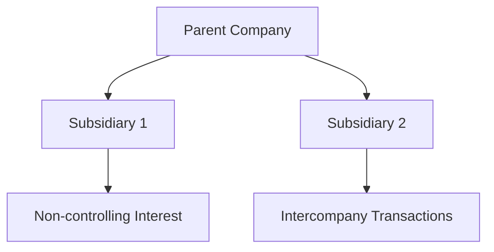

## 13.13 Consolidation after Acquisition Date

Consolidation after the acquisition date is a critical aspect of financial reporting, particularly for entities with subsidiaries. This section delves into the intricacies of accounting for subsidiaries in periods following acquisition, focusing on the principles and practices that govern post-acquisition consolidation. Understanding these concepts is essential for professionals preparing for Canadian accounting exams, as they form a significant part of the curriculum and are crucial for real-world financial reporting.

### Understanding Post-Acquisition Consolidation

Post-acquisition consolidation involves integrating the financial statements of a parent company and its subsidiaries into a single set of financial statements. This process requires careful consideration of various accounting standards and principles, particularly those outlined in the International Financial Reporting Standards (IFRS) as adopted in Canada, and the Accounting Standards for Private Enterprises (ASPE).

#### Key Concepts and Terminology

- **Parent Company:** The entity that controls one or more subsidiaries.
- **Subsidiary:** An entity controlled by the parent company.
- **Control:** The ability to direct the relevant activities of the subsidiary, typically through ownership of more than 50% of the voting rights.
- **Non-controlling Interest (NCI):** The portion of equity in a subsidiary not attributable to the parent company.
- **Goodwill:** The excess of the purchase price over the fair value of the identifiable net assets acquired.

### Regulatory Framework

In Canada, the consolidation of financial statements is primarily governed by IFRS 10, "Consolidated Financial Statements," which provides guidance on the principles of control and the preparation of consolidated financial statements. For private enterprises, ASPE Section 1591, "Subsidiaries," outlines similar requirements, albeit with some differences in application and disclosure.

### Steps in Post-Acquisition Consolidation

The consolidation process involves several key steps, each of which must be carefully executed to ensure accurate financial reporting:

1. **Identify the Parent-Subsidiary Relationship:** Confirm the existence of control by the parent over the subsidiary, typically through ownership of voting rights or other means of control.

2. **Prepare Consolidated Financial Statements:** Combine the financial statements of the parent and subsidiary, eliminating intercompany transactions and balances.

3. **Adjust for Non-controlling Interests:** Recognize the share of the subsidiary's net assets and profit or loss attributable to non-controlling interests.

4. **Account for Goodwill:** Recognize and test for impairment of goodwill arising from the acquisition.

5. **Eliminate Intercompany Transactions:** Remove transactions between the parent and subsidiary to prevent double counting.

6. **Adjust for Fair Value Changes:** Reflect any fair value adjustments made at the acquisition date in subsequent periods.

### Practical Example: Consolidation Process

Consider a scenario where Company A acquires 80% of Company B. The following steps illustrate the consolidation process:

#### Step 1: Identify Control

Company A holds 80% of the voting rights in Company B, establishing control and necessitating consolidation.

#### Step 2: Prepare Consolidated Financial Statements

- **Combine Financial Statements:** Aggregate the financial statements of Company A and Company B.
- **Eliminate Intercompany Balances:** Remove any intercompany receivables and payables.
- **Adjust for Non-controlling Interests:** Recognize the 20% non-controlling interest in Company B's net assets and profit or loss.

#### Step 3: Account for Goodwill

- **Calculate Goodwill:** Determine the excess of the purchase price over the fair value of Company B's identifiable net assets.
- **Test for Impairment:** Annually assess goodwill for impairment and adjust if necessary.

#### Step 4: Eliminate Intercompany Transactions

- **Sales and Purchases:** Remove sales and purchases between Company A and Company B.
- **Dividends:** Eliminate any dividends paid by Company B to Company A.

#### Step 5: Adjust for Fair Value Changes

- **Revalue Assets and Liabilities:** Reflect any fair value adjustments made at the acquisition date in subsequent periods.

### Challenges and Best Practices

#### Common Challenges

- **Complex Intercompany Transactions:** Managing and eliminating complex intercompany transactions can be challenging, particularly in large, multinational corporations.
- **Goodwill Impairment Testing:** Accurately assessing goodwill for impairment requires significant judgment and estimation.
- **Non-controlling Interests:** Properly accounting for and disclosing non-controlling interests can be complex, especially when ownership structures are intricate.

#### Best Practices

- **Regular Review and Reconciliation:** Regularly review and reconcile intercompany transactions and balances to ensure accuracy.
- **Comprehensive Documentation:** Maintain comprehensive documentation of all consolidation adjustments and assumptions.
- **Continuous Training and Education:** Stay updated on changes in accounting standards and best practices through continuous training and education.

### Exam Strategies and Tips

- **Understand Key Concepts:** Focus on understanding the key concepts and terminology related to consolidation, as these are frequently tested on exams.
- **Practice with Real-World Scenarios:** Engage with practical examples and case studies to apply theoretical knowledge to real-world scenarios.
- **Utilize Visual Aids:** Use diagrams and charts to visualize the consolidation process and relationships between entities.

### Sample Problems and Exercises

#### Problem 1: Consolidation Adjustments

Company X acquires 70% of Company Y. Prepare the consolidation adjustments required to eliminate intercompany sales of $100,000 and intercompany receivables of $50,000.

#### Problem 2: Goodwill Calculation

Calculate the goodwill arising from the acquisition of Company Z, given the purchase price of $500,000 and the fair value of identifiable net assets of $400,000.

### Diagrams and Visual Aids

### References and Further Reading

- **IFRS 10, "Consolidated Financial Statements"**: Provides guidance on the principles of control and consolidation.
- **ASPE Section 1591, "Subsidiaries"**: Outlines requirements for private enterprises in Canada.
- **CPA Canada**: Offers resources and guidance on accounting standards and best practices.

### Conclusion

Mastering the consolidation process after the acquisition date is crucial for accounting professionals, particularly those preparing for Canadian accounting exams. By understanding the key concepts, regulatory framework, and practical applications, you can confidently approach exam questions and real-world scenarios with the knowledge and skills necessary for success.

## **Ready to Test Your Knowledge?**



### What is the primary standard governing consolidation in Canada?

- [x] IFRS 10
- [ ] ASPE Section 1591
- [ ] IAS 16
- [ ] IFRS 15

> **Explanation:** IFRS 10, "Consolidated Financial Statements," is the primary standard governing consolidation in Canada.

### What percentage of voting rights typically establishes control in a subsidiary?

- [x] More than 50%
- [ ] Exactly 50%
- [ ] Less than 50%
- [ ] 100%

> **Explanation:** Control is typically established when a parent company holds more than 50% of the voting rights in a subsidiary.

### What is the term for the portion of equity in a subsidiary not attributable to the parent?

- [x] Non-controlling Interest
- [ ] Minority Interest
- [ ] Goodwill
- [ ] Retained Earnings

> **Explanation:** Non-controlling Interest refers to the portion of equity in a subsidiary not attributable to the parent company.

### What is the excess of the purchase price over the fair value of identifiable net assets called?

- [x] Goodwill
- [ ] Non-controlling Interest
- [ ] Retained Earnings
- [ ] Equity

> **Explanation:** Goodwill is the excess of the purchase price over the fair value of identifiable net assets acquired.

### What must be eliminated to prevent double counting in consolidated financial statements?

- [x] Intercompany Transactions
- [ ] Non-controlling Interests
- [ ] Goodwill
- [ ] Retained Earnings

> **Explanation:** Intercompany Transactions must be eliminated to prevent double counting in consolidated financial statements.

### Which of the following is a common challenge in post-acquisition consolidation?

- [x] Complex Intercompany Transactions
- [ ] Simple Ownership Structures
- [ ] Lack of Documentation
- [ ] Goodwill Recognition

> **Explanation:** Complex Intercompany Transactions are a common challenge in post-acquisition consolidation.

### What is the purpose of goodwill impairment testing?

- [x] To assess the recoverability of goodwill
- [ ] To eliminate intercompany transactions
- [ ] To recognize non-controlling interests
- [ ] To calculate fair value adjustments

> **Explanation:** Goodwill impairment testing assesses the recoverability of goodwill.

### What is the first step in the consolidation process?

- [x] Identify the Parent-Subsidiary Relationship
- [ ] Prepare Consolidated Financial Statements
- [ ] Eliminate Intercompany Transactions
- [ ] Account for Goodwill

> **Explanation:** The first step in the consolidation process is to identify the Parent-Subsidiary Relationship.

### What is the role of non-controlling interests in consolidation?

- [x] To recognize the share of net assets and profit or loss not attributable to the parent
- [ ] To eliminate intercompany transactions
- [ ] To calculate goodwill
- [ ] To prepare consolidated financial statements

> **Explanation:** Non-controlling interests recognize the share of net assets and profit or loss not attributable to the parent.

### True or False: Goodwill is tested for impairment annually.

- [x] True
- [ ] False

> **Explanation:** Goodwill is tested for impairment annually to ensure its recoverability.


