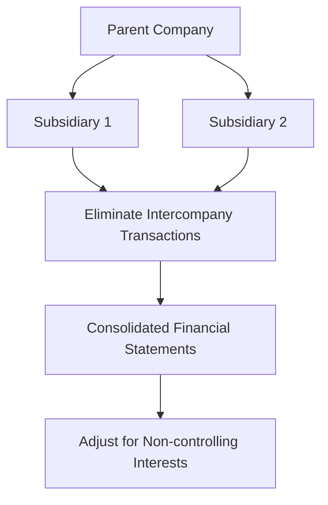

## 13.16 Consolidation under IFRS vs. GAAP

### Introduction

Consolidation is a critical aspect of financial reporting for entities with subsidiaries, joint ventures, or other investments. The International Financial Reporting Standards (IFRS) and Generally Accepted Accounting Principles (GAAP) in the United States provide frameworks for consolidation, each with distinct principles and methodologies. Understanding these differences is essential for accountants, especially those preparing for Canadian accounting exams, as they navigate global financial environments.

### Overview of IFRS and GAAP

**IFRS** is a set of accounting standards developed by the International Accounting Standards Board (IASB) and is used in over 140 countries, including Canada. **U.S. GAAP**, on the other hand, is established by the Financial Accounting Standards Board (FASB) and is primarily used in the United States. Both frameworks aim to provide transparent and comparable financial information but differ in their approach to consolidation.

### Key Differences in Consolidation

#### 1. **Control Definition**

- **IFRS (IFRS 10):** Control is defined as having power over the investee, exposure or rights to variable returns, and the ability to use power to affect those returns.
- **GAAP (ASC 810):** Control is generally based on a majority voting interest, with specific guidance for variable interest entities (VIEs).

#### 2. **Consolidation Models**

- **IFRS:** Uses a single control model applicable to all entities.
- **GAAP:** Employs a dual model, distinguishing between voting interest entities and VIEs.

#### 3. **Potential Voting Rights**

- **IFRS:** Considers potential voting rights in assessing control if they are substantive.
- **GAAP:** Generally does not consider potential voting rights unless they are currently exercisable.

#### 4. **De Facto Control**

- **IFRS:** Recognizes de facto control, where control exists without a majority of voting rights.
- **GAAP:** Does not explicitly recognize de facto control.

#### 5. **Special Purpose Entities (SPEs) and VIEs**

- **IFRS:** Consolidates SPEs based on the control model.
- **GAAP:** Provides specific guidance for VIEs, focusing on the primary beneficiary.

### Practical Implications

#### Financial Statement Presentation

Under both IFRS and GAAP, consolidated financial statements include all subsidiaries controlled by the parent company. However, the determination of control and the entities to be consolidated can differ, affecting the composition of the consolidated group and financial results.

#### Impact on Financial Ratios

The differences in consolidation can lead to variations in financial ratios, such as debt-to-equity and return on assets, impacting stakeholders' perception and decision-making.

#### Case Study: Canadian Multinational Corporation

Consider a Canadian multinational with subsidiaries in both IFRS and GAAP jurisdictions. The choice of consolidation standard can affect reported earnings, tax liabilities, and compliance costs. Understanding these differences is crucial for accurate financial analysis and strategic planning.

### Detailed Comparison of Consolidation Processes

#### Step-by-Step Consolidation under IFRS

1. **Identify the Parent and Subsidiaries:** Determine the entities to be consolidated based on control.
2. **Prepare Consolidated Financial Statements:** Combine the financial statements of the parent and subsidiaries.
3. **Eliminate Intercompany Transactions:** Remove transactions between consolidated entities to avoid double counting.
4. **Adjust for Non-controlling Interests:** Reflect the portion of equity not attributable to the parent.

#### Step-by-Step Consolidation under GAAP

1. **Identify the Parent and Subsidiaries:** Assess control based on voting rights and VIE guidance.
2. **Prepare Consolidated Financial Statements:** Similar to IFRS, but with additional considerations for VIEs.
3. **Eliminate Intercompany Transactions:** Consistent with IFRS, eliminate intercompany balances and transactions.
4. **Adjust for Non-controlling Interests:** Present non-controlling interests separately in equity.

### Diagrams and Visuals

To enhance understanding, consider the following diagram illustrating the consolidation process under IFRS and GAAP:

### Best Practices and Common Pitfalls

- **Best Practices:** Regularly review control assessments, especially for entities with complex structures or potential voting rights.
- **Common Pitfalls:** Failing to recognize de facto control under IFRS or misapplying VIE guidance under GAAP.

### Exam Preparation Tips

- **Focus on Control Criteria:** Understand the nuances of control under both IFRS and GAAP.
- **Practice Consolidation Exercises:** Work through examples to solidify your understanding of the consolidation process.
- **Review Case Studies:** Analyze real-world scenarios to see how consolidation standards are applied.

### Summary

Consolidation under IFRS and GAAP involves distinct approaches to defining control and determining which entities to consolidate. By understanding these differences, accountants can ensure accurate financial reporting and compliance with relevant standards. This knowledge is crucial for success in Canadian accounting exams and professional practice.

### References

- **IFRS 10 Consolidated Financial Statements**
- **ASC 810 Consolidation**
- **CPA Canada Handbook**

## **Ready to Test Your Knowledge?**



### Which standard uses a single control model for consolidation?

- [x] IFRS
- [ ] GAAP
- [ ] Both IFRS and GAAP
- [ ] Neither IFRS nor GAAP

> **Explanation:** IFRS uses a single control model applicable to all entities, whereas GAAP employs a dual model.

### What does GAAP primarily use to determine control?

- [x] Majority voting interest
- [ ] De facto control
- [ ] Potential voting rights
- [ ] Exposure to variable returns

> **Explanation:** GAAP primarily uses a majority voting interest to determine control, with specific guidance for VIEs.

### Under IFRS, what is considered when assessing control?

- [x] Potential voting rights
- [ ] Only current voting rights
- [ ] Only financial returns
- [ ] Only contractual agreements

> **Explanation:** IFRS considers potential voting rights in assessing control if they are substantive.

### Which framework recognizes de facto control?

- [x] IFRS
- [ ] GAAP
- [ ] Both IFRS and GAAP
- [ ] Neither IFRS nor GAAP

> **Explanation:** IFRS recognizes de facto control, where control exists without a majority of voting rights.

### What is the focus of GAAP's guidance on VIEs?

- [x] Primary beneficiary
- [ ] De facto control
- [ ] Potential voting rights
- [ ] Financial returns

> **Explanation:** GAAP focuses on identifying the primary beneficiary in its guidance on VIEs.

### How does IFRS treat potential voting rights?

- [x] Considers them if substantive
- [ ] Ignores them entirely
- [ ] Considers them only if currently exercisable
- [ ] Treats them as equivalent to actual voting rights

> **Explanation:** IFRS considers potential voting rights in assessing control if they are substantive.

### Which standard requires elimination of intercompany transactions in consolidation?

- [x] Both IFRS and GAAP
- [ ] Only IFRS
- [ ] Only GAAP
- [ ] Neither IFRS nor GAAP

> **Explanation:** Both IFRS and GAAP require the elimination of intercompany transactions to avoid double counting.

### What is the primary difference in consolidation models between IFRS and GAAP?

- [x] Single vs. dual model
- [ ] Voting rights vs. financial returns
- [ ] De facto vs. explicit control
- [ ] Potential vs. actual voting rights

> **Explanation:** IFRS uses a single control model, while GAAP employs a dual model distinguishing between voting interest entities and VIEs.

### Which framework includes specific guidance for VIEs?

- [x] GAAP
- [ ] IFRS
- [ ] Both IFRS and GAAP
- [ ] Neither IFRS nor GAAP

> **Explanation:** GAAP includes specific guidance for VIEs, focusing on the primary beneficiary.

### True or False: IFRS and GAAP have identical consolidation requirements.

- [ ] True
- [x] False

> **Explanation:** IFRS and GAAP have different consolidation requirements, particularly in defining control and handling VIEs.


