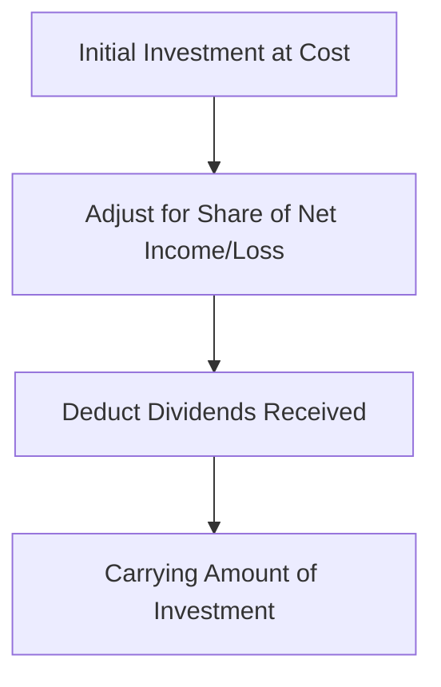

## 13.6 Equity Method Investments

In the realm of accounting, the equity method is a critical approach used to account for investments in other entities where the investor has significant influence but does not exercise full control. This section will delve into the intricacies of equity method investments, providing you with a comprehensive understanding of the principles, standards, and practical applications necessary for mastering this topic in Canadian accounting exams.

### Understanding Significant Influence

**Significant Influence** is the power to participate in the financial and operating policy decisions of the investee but is not control or joint control over those policies. Typically, significant influence is presumed when an investor holds 20% to 50% of the voting power of the investee. However, this is not a strict rule, and other factors such as board representation, participation in policy-making processes, and material transactions between the investor and the investee can also indicate significant influence.

#### Indicators of Significant Influence

- **Representation on the Board of Directors:** Having a seat on the board can provide the investor with the ability to influence decisions.
- **Participation in Policy-Making Processes:** Involvement in decisions related to strategic direction, budgets, and other significant policies.
- **Material Transactions:** Engaging in significant transactions with the investee can indicate influence.
- **Interchange of Managerial Personnel:** Sharing key management personnel between the investor and investee.
- **Provision of Essential Technical Information:** Providing critical technology or expertise to the investee.

### Accounting for Equity Method Investments

Under the equity method, the investment is initially recorded at cost, and subsequently adjusted to reflect the investor's share of the investee's profits or losses. Dividends received from the investee reduce the carrying amount of the investment.

#### Initial Recognition

The initial recognition of an equity method investment is straightforward. The investment is recorded at cost, which includes the purchase price and any directly attributable transaction costs.

#### Subsequent Measurement

After initial recognition, the carrying amount of the investment is adjusted for the investor's share of the investee's net income or loss. This adjustment is recognized in the investor's income statement. Additionally, dividends received from the investee are deducted from the carrying amount of the investment.

**Example:**

Suppose Company A acquires a 30% interest in Company B for $1,000,000. During the year, Company B reports a net income of $200,000 and declares dividends of $50,000.

- **Initial Recognition:** Investment in Company B = $1,000,000
- **Share of Net Income:** 30% of $200,000 = $60,000
- **Dividends Received:** 30% of $50,000 = $15,000

**Carrying Amount at Year-End:**

 \text{Carrying Amount} = \$1,000,000 + \$60,000 - \$15,000 = \$1,045,000 

### Practical Application and Case Studies

To solidify your understanding, let's explore a case study involving equity method investments.

#### Case Study: Tech Innovators Inc.

**Scenario:** Tech Innovators Inc. (TII) acquires a 25% stake in Green Energy Solutions Ltd. (GES) for $500,000. GES reports a net income of $80,000 and declares dividends of $20,000 during the year.

**Solution:**

1. **Initial Recognition:** Record the investment at cost: $500,000.
2. **Share of Net Income:** 25% of $80,000 = $20,000.
3. **Dividends Received:** 25% of $20,000 = $5,000.

**Carrying Amount at Year-End:**

 \text{Carrying Amount} = \$500,000 + \$20,000 - \$5,000 = \$515,000 

This example illustrates how TII adjusts its investment in GES based on its share of net income and dividends received.

### Regulatory Framework and Standards

In Canada, the accounting for equity method investments is governed by the International Financial Reporting Standards (IFRS) as adopted in Canada, specifically IAS 28 "Investments in Associates and Joint Ventures." For private enterprises, the Accounting Standards for Private Enterprises (ASPE) Section 3051 provides guidance.

#### Key IFRS Considerations

- **IAS 28:** Outlines the criteria for applying the equity method and provides guidance on recognizing losses, impairment, and changes in ownership interest.
- **Impairment:** If there is an indication that the investment may be impaired, the investor must assess the recoverable amount and recognize an impairment loss if necessary.
- **Changes in Ownership Interest:** If the level of ownership changes but significant influence is retained, the equity method continues to apply.

#### ASPE Considerations

- **Section 3051:** Similar to IFRS, ASPE provides guidance on the application of the equity method, including initial recognition, subsequent measurement, and impairment considerations.

### Common Challenges and Pitfalls

While the equity method is conceptually straightforward, there are several challenges and pitfalls to be aware of:

- **Determining Significant Influence:** Assessing whether significant influence exists can be subjective and requires careful consideration of qualitative factors.
- **Impairment Assessment:** Identifying impairment indicators and determining the recoverable amount can be complex.
- **Changes in Ownership Interest:** Accounting for changes in ownership interest while retaining significant influence requires careful application of the standards.

### Best Practices and Exam Tips

To excel in your Canadian accounting exams, consider the following best practices and tips:

- **Understand the Indicators:** Familiarize yourself with the indicators of significant influence and be prepared to apply them in exam scenarios.
- **Practice Calculations:** Work through examples and practice calculating the carrying amount of equity method investments.
- **Stay Updated:** Keep abreast of any changes in IFRS and ASPE related to equity method investments.
- **Review Case Studies:** Analyze case studies to understand the practical application of the equity method.

### Real-World Applications

In practice, the equity method is widely used by companies with strategic investments in associates. Understanding how to apply this method is crucial for accountants involved in financial reporting and analysis.

#### Example: Strategic Investment in a Tech Startup

A large corporation invests in a promising tech startup, acquiring a 30% stake. By applying the equity method, the corporation can reflect its share of the startup's success in its financial statements, providing investors with a clearer picture of its strategic investments.

### Diagrams and Visuals

To enhance your understanding, let's visualize the equity method process:

This diagram illustrates the flow of accounting for equity method investments, from initial recognition to the calculation of the carrying amount.

### Conclusion

Mastering the equity method of accounting for investments is essential for success in Canadian accounting exams and professional practice. By understanding the principles, standards, and practical applications, you can confidently navigate this complex area of accounting.

---

## **Ready to Test Your Knowledge?**



### Which of the following is an indicator of significant influence?

- [x] Representation on the Board of Directors
- [ ] Holding less than 10% of the voting power
- [ ] No involvement in policy-making processes
- [ ] No material transactions with the investee

> **Explanation:** Representation on the Board of Directors is a strong indicator of significant influence, as it allows the investor to participate in policy decisions.

### How is the initial investment recorded under the equity method?

- [x] At cost
- [ ] At fair value
- [ ] At the investor's share of net assets
- [ ] At the investee's book value

> **Explanation:** The initial investment is recorded at cost, which includes the purchase price and any directly attributable transaction costs.

### What happens to the carrying amount of an equity method investment when dividends are received?

- [x] It is reduced by the investor's share of dividends
- [ ] It is increased by the investor's share of dividends
- [ ] It remains unchanged
- [ ] It is adjusted to fair value

> **Explanation:** Dividends received reduce the carrying amount of the investment, as they represent a return of capital.

### Under IFRS, which standard governs the accounting for equity method investments?

- [x] IAS 28
- [ ] IFRS 9
- [ ] IAS 16
- [ ] IFRS 15

> **Explanation:** IAS 28 "Investments in Associates and Joint Ventures" provides guidance on accounting for equity method investments.

### What is the presumed percentage of voting power that indicates significant influence?

- [x] 20% to 50%
- [ ] Less than 20%
- [x] More than 50%
- [ ] Exactly 50%

> **Explanation:** Significant influence is typically presumed when an investor holds 20% to 50% of the voting power of the investee.

### How is the investor's share of the investee's net income recognized?

- [x] As an increase in the carrying amount of the investment
- [ ] As a dividend
- [ ] As a liability
- [ ] As a decrease in equity

> **Explanation:** The investor's share of the investee's net income increases the carrying amount of the investment.

### What should an investor do if there is an indication of impairment in an equity method investment?

- [x] Assess the recoverable amount and recognize an impairment loss if necessary
- [ ] Ignore the indication
- [x] Increase the carrying amount
- [ ] Record a liability

> **Explanation:** If there is an indication of impairment, the investor must assess the recoverable amount and recognize an impairment loss if necessary.

### What is the impact of a change in ownership interest on the equity method?

- [x] The equity method continues if significant influence is retained
- [ ] The investment must be consolidated
- [ ] The investment is reclassified to fair value
- [ ] The investment is written off

> **Explanation:** If the level of ownership changes but significant influence is retained, the equity method continues to apply.

### What is the main challenge in applying the equity method?

- [x] Determining significant influence
- [ ] Calculating dividends
- [ ] Recording initial investment
- [ ] Preparing financial statements

> **Explanation:** Determining whether significant influence exists can be subjective and requires careful consideration of qualitative factors.

### True or False: Dividends received under the equity method are recognized as income.

- [ ] True
- [x] False

> **Explanation:** Dividends received are not recognized as income; they reduce the carrying amount of the investment.


