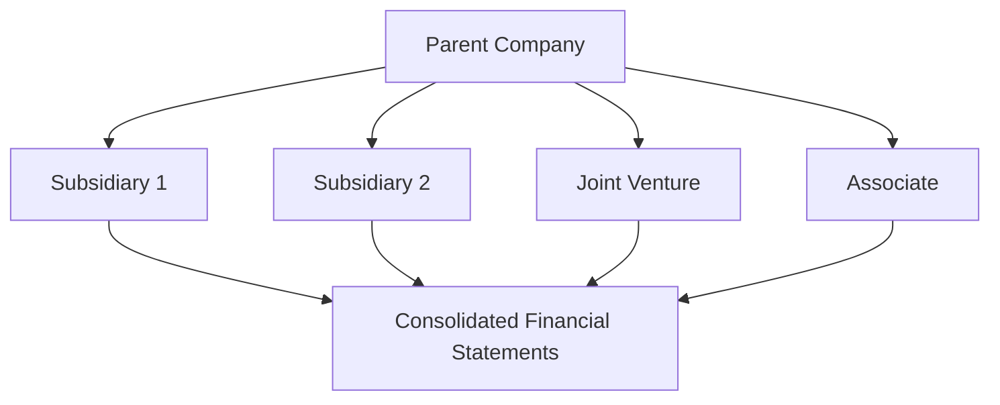

## 13.8 Disclosure Requirements for Consolidated Financial Statements

In the realm of financial accounting, the disclosure requirements for consolidated financial statements are pivotal to ensuring transparency, accountability, and informed decision-making. These disclosures provide stakeholders with a comprehensive view of a company's financial health, performance, and risk exposure. This section delves into the intricacies of disclosure requirements, focusing on Canadian accounting standards, particularly the International Financial Reporting Standards (IFRS) as adopted in Canada, and the Accounting Standards for Private Enterprises (ASPE).

### Understanding Consolidated Financial Statements

Consolidated financial statements present the financial position and results of operations for a parent company and its subsidiaries as a single economic entity. These statements are crucial for stakeholders to understand the overall financial health of a corporate group. The primary components include the consolidated balance sheet, income statement, statement of changes in equity, and cash flow statement.

### Importance of Disclosures

Disclosures in consolidated financial statements are essential for several reasons:

1. **Transparency:** They provide clarity on the financial position and performance of the entire group.
2. **Comparability:** Disclosures enable users to compare financial information across different periods and entities.
3. **Risk Assessment:** They help in identifying potential risks and uncertainties affecting the group.
4. **Regulatory Compliance:** Adhering to disclosure requirements ensures compliance with accounting standards and legal regulations.

### Key Disclosure Requirements

The disclosure requirements for consolidated financial statements are extensive and vary depending on the accounting standards applied. Here, we focus on the requirements under IFRS and ASPE.

#### IFRS Disclosure Requirements

Under IFRS, several standards outline the disclosure requirements for consolidated financial statements. Key standards include IFRS 10 (Consolidated Financial Statements), IFRS 12 (Disclosure of Interests in Other Entities), and IAS 1 (Presentation of Financial Statements).

##### IFRS 10: Consolidated Financial Statements

IFRS 10 requires entities to disclose:

- **The Basis of Consolidation:** The accounting policies applied in consolidating subsidiaries, including the method of consolidation and any changes in ownership interests.
- **Non-controlling Interests:** Information about non-controlling interests in subsidiaries, including their share of profit or loss and equity.
- **Changes in Ownership Interests:** Details of any changes in ownership interests that do not result in a loss of control, including the effect on equity attributable to owners of the parent.

##### IFRS 12: Disclosure of Interests in Other Entities

IFRS 12 mandates disclosures about:

- **Significant Judgments and Assumptions:** Key judgments made in determining control, joint control, or significant influence over other entities.
- **Subsidiaries:** Information about the composition of the group, including the name, principal place of business, and proportion of ownership interest.
- **Joint Arrangements and Associates:** Details of joint arrangements and associates, including their nature, extent of involvement, and financial effects.
- **Structured Entities:** Information about unconsolidated structured entities, including the nature, purpose, and risks associated with these entities.

##### IAS 1: Presentation of Financial Statements

IAS 1 requires entities to disclose:

- **Significant Accounting Policies:** A summary of significant accounting policies used in preparing the financial statements.
- **Sources of Estimation Uncertainty:** Information about assumptions and estimates that have a significant risk of causing material adjustments to the carrying amounts of assets and liabilities.
- **Capital Management:** Details of the entity's objectives, policies, and processes for managing capital.

#### ASPE Disclosure Requirements

For private enterprises in Canada, ASPE provides guidance on disclosure requirements in consolidated financial statements. Key sections include Section 1591 (Subsidiaries) and Section 3051 (Investments).

##### Section 1591: Subsidiaries

ASPE Section 1591 requires disclosures about:

- **The Basis of Consolidation:** The accounting policies used to prepare consolidated financial statements, including the method of consolidation.
- **Non-controlling Interests:** Information about non-controlling interests, including their share of profit or loss and equity.
- **Changes in Ownership Interests:** Details of any changes in ownership interests that do not result in a loss of control.

##### Section 3051: Investments

ASPE Section 3051 mandates disclosures about:

- **Investments in Associates and Joint Ventures:** Information about the nature and extent of investments in associates and joint ventures, including the method of accounting and any significant judgments made.
- **Significant Influence:** Details of any significant influence over investees, including the nature of the relationship and financial effects.

### Practical Examples and Case Studies

To illustrate the application of disclosure requirements, consider the following examples:

#### Example 1: Disclosure of Non-controlling Interests

A parent company, ABC Corp., owns 80% of a subsidiary, XYZ Ltd. In its consolidated financial statements, ABC Corp. discloses the non-controlling interest in XYZ Ltd., including their share of profit or loss and equity. This disclosure provides stakeholders with insight into the financial interests of minority shareholders.

#### Example 2: Disclosure of Significant Judgments

XYZ Corp. has several joint ventures and associates. In its consolidated financial statements, XYZ Corp. discloses the significant judgments made in determining the nature of these relationships and the method of accounting applied. This disclosure helps stakeholders understand the basis for XYZ Corp.'s financial reporting.

### Real-world Applications and Regulatory Scenarios

In practice, companies must navigate complex regulatory environments to ensure compliance with disclosure requirements. For example, Canadian public companies listed on stock exchanges must adhere to both IFRS and additional regulatory requirements set by securities regulators, such as the Canadian Securities Administrators (CSA).

#### Regulatory Scenario: Compliance with CSA Requirements

The CSA requires public companies to provide additional disclosures in their Management's Discussion and Analysis (MD&A), including:

- **Risks and Uncertainties:** A discussion of the risks and uncertainties facing the company and their potential impact on financial performance.
- **Forward-looking Information:** Disclosures about forward-looking information, including assumptions and risk factors.

### Step-by-step Guidance for Preparing Disclosures

To prepare comprehensive disclosures for consolidated financial statements, follow these steps:

1. **Identify the Reporting Entity:** Determine the parent company and its subsidiaries, joint ventures, and associates.
2. **Determine the Basis of Consolidation:** Apply the appropriate accounting policies and methods of consolidation.
3. **Gather Financial Information:** Collect financial data from all entities within the group.
4. **Prepare the Consolidated Financial Statements:** Consolidate the financial information into a single set of financial statements.
5. **Draft the Disclosures:** Prepare the required disclosures, ensuring compliance with IFRS or ASPE.
6. **Review and Finalize:** Review the disclosures for accuracy and completeness, and finalize the consolidated financial statements.

### Diagrams and Visual Aids

To enhance understanding, consider the following diagram illustrating the consolidation process:

### Best Practices, Common Pitfalls, and Strategies

#### Best Practices

- **Consistency:** Ensure consistency in the application of accounting policies across all entities within the group.
- **Clarity:** Provide clear and concise disclosures that are easy for stakeholders to understand.
- **Relevance:** Focus on disclosures that are relevant to stakeholders' decision-making needs.

#### Common Pitfalls

- **Incomplete Disclosures:** Failing to provide all required disclosures can lead to regulatory penalties and loss of stakeholder trust.
- **Inconsistent Application:** Inconsistent application of accounting policies can result in misleading financial information.

#### Strategies

- **Regular Updates:** Regularly update disclosures to reflect changes in accounting standards and regulatory requirements.
- **Stakeholder Engagement:** Engage with stakeholders to understand their information needs and tailor disclosures accordingly.

### References and Additional Resources

For further exploration of disclosure requirements, consider the following resources:

- **CPA Canada:** Provides guidance on Canadian accounting standards and best practices.
- **IFRS Foundation:** Offers comprehensive resources on IFRS standards and interpretations.
- **Canadian Securities Administrators (CSA):** Provides regulatory guidance for public companies in Canada.

### Summary

Disclosure requirements for consolidated financial statements are a critical aspect of financial reporting. By providing transparency, comparability, and risk assessment, these disclosures enable stakeholders to make informed decisions. Adhering to the requirements under IFRS and ASPE ensures compliance with accounting standards and regulatory obligations.

---

## **Ready to Test Your Knowledge?**



### What is the primary purpose of disclosures in consolidated financial statements?

- [x] To provide transparency and comparability
- [ ] To increase the complexity of financial statements
- [ ] To reduce the amount of information available to stakeholders
- [ ] To comply with tax regulations

> **Explanation:** Disclosures in consolidated financial statements aim to provide transparency and comparability, enabling stakeholders to make informed decisions.

### Which IFRS standard specifically addresses the disclosure of interests in other entities?

- [ ] IFRS 10
- [x] IFRS 12
- [ ] IAS 1
- [ ] IFRS 9

> **Explanation:** IFRS 12 focuses on the disclosure of interests in other entities, including subsidiaries, joint arrangements, and associates.

### Under ASPE, which section outlines the disclosure requirements for subsidiaries?

- [ ] Section 3051
- [x] Section 1591
- [ ] Section 3856
- [ ] Section 3465

> **Explanation:** ASPE Section 1591 outlines the disclosure requirements for subsidiaries, including the basis of consolidation and non-controlling interests.

### What is a common pitfall in preparing disclosures for consolidated financial statements?

- [x] Incomplete disclosures
- [ ] Over-disclosure of information
- [ ] Consistent application of accounting policies
- [ ] Engaging with stakeholders

> **Explanation:** Incomplete disclosures can lead to regulatory penalties and loss of stakeholder trust, making it a common pitfall.

### Which of the following is a best practice for preparing disclosures?

- [x] Ensuring consistency in accounting policies
- [ ] Providing excessive detail in disclosures
- [ ] Limiting disclosures to financial information only
- [ ] Avoiding engagement with stakeholders

> **Explanation:** Ensuring consistency in accounting policies across all entities within the group is a best practice for preparing disclosures.

### What is the role of the Canadian Securities Administrators (CSA) in financial disclosures?

- [x] To provide regulatory guidance for public companies
- [ ] To prepare financial statements for companies
- [ ] To audit financial statements
- [ ] To set accounting standards

> **Explanation:** The CSA provides regulatory guidance for public companies in Canada, ensuring compliance with disclosure requirements.

### Which diagram best illustrates the consolidation process?

- [x] A diagram showing the parent company and its subsidiaries, joint ventures, and associates
- [ ] A diagram showing only the parent company
- [ ] A diagram showing only the subsidiaries
- [ ] A diagram showing unrelated entities

> **Explanation:** A diagram illustrating the parent company and its subsidiaries, joint ventures, and associates best represents the consolidation process.

### What is the significance of non-controlling interests in consolidated financial statements?

- [x] They represent the share of profit or loss and equity attributable to minority shareholders
- [ ] They represent the total equity of the parent company
- [ ] They are not significant in financial reporting
- [ ] They only apply to private companies

> **Explanation:** Non-controlling interests represent the share of profit or loss and equity attributable to minority shareholders, providing insight into their financial interests.

### How can companies ensure compliance with disclosure requirements?

- [x] By regularly updating disclosures to reflect changes in standards
- [ ] By reducing the amount of information disclosed
- [ ] By ignoring stakeholder needs
- [ ] By focusing only on financial data

> **Explanation:** Regularly updating disclosures to reflect changes in accounting standards and regulatory requirements ensures compliance.

### True or False: Disclosures in consolidated financial statements are optional for Canadian public companies.

- [ ] True
- [x] False

> **Explanation:** Disclosures in consolidated financial statements are mandatory for Canadian public companies to ensure transparency and compliance with accounting standards.


