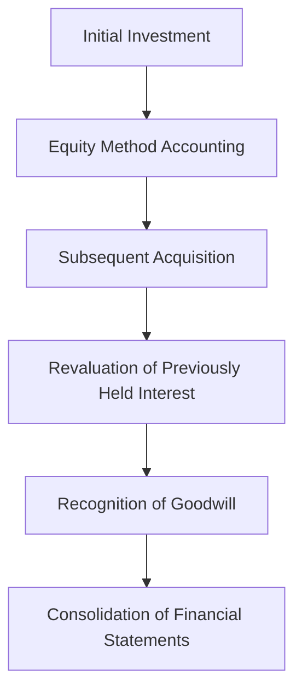

## 13.9 Step Acquisitions

In the realm of accounting for business combinations, step acquisitions represent a unique and complex scenario where control over an entity is achieved in stages over time. This section delves into the accounting treatment of step acquisitions, focusing on the recognition, measurement, and reporting of these transactions in consolidated financial statements. Understanding step acquisitions is crucial for accountants, especially those preparing for Canadian accounting exams, as it involves intricate calculations and compliance with specific accounting standards.

### Understanding Step Acquisitions

Step acquisitions occur when an acquirer obtains control over a target entity through multiple transactions over time, rather than a single transaction. This gradual acquisition of control can involve purchasing additional shares or equity interests in the target company until the acquirer holds a controlling interest. The accounting treatment of step acquisitions is governed by International Financial Reporting Standards (IFRS) and Accounting Standards for Private Enterprises (ASPE) in Canada.

### Key Concepts and Terminology

Before diving into the accounting procedures, it's essential to familiarize yourself with key concepts and terminology related to step acquisitions:

- **Control:** The power to govern the financial and operating policies of an entity to obtain benefits from its activities. Control is typically achieved when an acquirer holds more than 50% of the voting rights in the target entity.

- **Business Combination:** A transaction or event in which an acquirer obtains control over one or more businesses.

- **Fair Value:** The price that would be received to sell an asset or paid to transfer a liability in an orderly transaction between market participants at the measurement date.

- **Non-controlling Interest (NCI):** The equity in a subsidiary not attributable, directly or indirectly, to a parent company.

### Accounting Standards for Step Acquisitions

In Canada, the accounting for step acquisitions is primarily governed by IFRS 3, "Business Combinations," and IAS 27, "Consolidated and Separate Financial Statements." For private enterprises, ASPE Section 1582, "Business Combinations," provides guidance. These standards outline the requirements for recognizing and measuring the assets, liabilities, and non-controlling interests in a business combination achieved in stages.

### Steps in Accounting for Step Acquisitions

1. **Initial Investment Recognition:**
   - When an acquirer makes an initial investment in a target entity, it is recognized as an investment in an associate or joint venture, depending on the level of influence. This investment is accounted for using the equity method.

2. **Subsequent Acquisitions:**
   - As the acquirer purchases additional shares, increasing its ownership interest, it must reassess its level of influence. If control is achieved, the acquirer must consolidate the financial statements of the target entity.

3. **Revaluation of Previously Held Interests:**
   - Upon obtaining control, the acquirer must remeasure its previously held equity interest in the target entity at fair value. Any gain or loss resulting from this remeasurement is recognized in profit or loss.

4. **Recognition of Goodwill:**
   - Goodwill is calculated as the excess of the consideration transferred, the fair value of any previously held equity interest, and the fair value of non-controlling interests over the net identifiable assets acquired.

5. **Consolidation:**
   - Once control is achieved, the acquirer consolidates the financial statements of the target entity, incorporating its assets, liabilities, income, and expenses into the consolidated financial statements.

### Practical Example of Step Acquisitions

Consider a scenario where Company A acquires a 30% interest in Company B, initially accounting for it as an investment in an associate. Later, Company A acquires an additional 25% interest, bringing its total ownership to 55% and achieving control over Company B.

1. **Initial Investment:**
   - Company A accounts for the 30% interest using the equity method.

2. **Subsequent Acquisition:**
   - Upon acquiring the additional 25% interest, Company A reassesses its influence and determines that it now has control over Company B.

3. **Revaluation of Previously Held Interest:**
   - Company A remeasures its initial 30% interest at fair value, recognizing any gain or loss in profit or loss.

4. **Recognition of Goodwill:**
   - Goodwill is calculated based on the total consideration transferred, the fair value of the previously held interest, and the fair value of non-controlling interests.

5. **Consolidation:**
   - Company A consolidates Company B's financial statements, incorporating its assets, liabilities, income, and expenses.

### Regulatory Considerations and Compliance

Accountants must ensure compliance with the relevant accounting standards when dealing with step acquisitions. This includes adhering to the disclosure requirements outlined in IFRS 3 and IAS 27, as well as ASPE Section 1582 for private enterprises. Proper documentation and transparency in reporting are essential to avoid regulatory scrutiny and ensure accurate financial reporting.

### Challenges and Common Pitfalls

Step acquisitions present several challenges and potential pitfalls for accountants:

- **Complex Valuation:** Accurately determining the fair value of previously held interests and acquired assets can be challenging, requiring professional judgment and expertise.

- **Goodwill Calculation:** Calculating goodwill in a step acquisition involves multiple components, including consideration transferred and fair value assessments, which can be complex and prone to errors.

- **Consolidation Adjustments:** Consolidating financial statements after a step acquisition requires careful adjustments to ensure accurate representation of the combined entity's financial position.

### Best Practices for Accounting for Step Acquisitions

To navigate the complexities of step acquisitions, accountants should consider the following best practices:

- **Thorough Due Diligence:** Conduct comprehensive due diligence to accurately assess the fair value of acquired interests and assets.

- **Professional Valuation Services:** Engage professional valuation services to ensure accurate fair value assessments, especially for complex or high-value acquisitions.

- **Detailed Documentation:** Maintain detailed documentation of all transactions, valuations, and calculations to support the accounting treatment and facilitate audits.

- **Regular Training and Updates:** Stay informed about changes in accounting standards and regulations related to business combinations and step acquisitions through regular training and professional development.

### Step-by-Step Guidance for Accounting Procedures

1. **Identify the Acquisition Date:**
   - Determine the date on which control is achieved, as this marks the point at which consolidation is required.

2. **Measure Fair Value of Previously Held Interests:**
   - Reassess the fair value of any previously held equity interests in the target entity and recognize any resulting gain or loss in profit or loss.

3. **Calculate Consideration Transferred:**
   - Determine the total consideration transferred for the acquisition, including cash, shares, or other assets exchanged.

4. **Assess Non-controlling Interests:**
   - Measure the fair value of non-controlling interests in the target entity, considering any potential adjustments for minority discounts.

5. **Recognize Identifiable Assets and Liabilities:**
   - Identify and measure the fair value of all identifiable assets and liabilities acquired in the business combination.

6. **Calculate Goodwill:**
   - Compute goodwill as the excess of the consideration transferred, the fair value of previously held interests, and non-controlling interests over the net identifiable assets acquired.

7. **Consolidate Financial Statements:**
   - Incorporate the target entity's financial statements into the consolidated financial statements, making necessary adjustments for intercompany transactions and balances.

### Real-World Applications and Case Studies

Step acquisitions are prevalent in various industries, including technology, pharmaceuticals, and manufacturing. Companies often pursue step acquisitions to gain strategic advantages, such as expanding market share, acquiring new technologies, or entering new markets. Understanding the accounting implications of these transactions is crucial for financial analysts, auditors, and accountants involved in mergers and acquisitions.

#### Case Study: TechCorp's Acquisition of InnovateTech

TechCorp, a leading technology company, initially acquired a 40% interest in InnovateTech, a promising startup, to gain access to its innovative technology. Over the next two years, TechCorp acquired an additional 20% interest, bringing its total ownership to 60% and achieving control over InnovateTech.

1. **Initial Investment:**
   - TechCorp accounted for the 40% interest using the equity method, recognizing its share of InnovateTech's profits and losses.

2. **Subsequent Acquisition:**
   - Upon acquiring the additional 20% interest, TechCorp reassessed its influence and determined that it now had control over InnovateTech.

3. **Revaluation of Previously Held Interest:**
   - TechCorp remeasured its initial 40% interest at fair value, recognizing a gain in profit due to an increase in InnovateTech's valuation.

4. **Recognition of Goodwill:**
   - Goodwill was calculated based on the total consideration transferred, the fair value of the previously held interest, and the fair value of non-controlling interests.

5. **Consolidation:**
   - TechCorp consolidated InnovateTech's financial statements, incorporating its assets, liabilities, income, and expenses into its own financial statements.

### Diagrams and Visual Aids

To enhance understanding, the following Mermaid.js diagram illustrates the step acquisition process:

### Summary and Key Takeaways

Step acquisitions involve acquiring control over an entity in stages, requiring careful accounting treatment to ensure accurate financial reporting. Key steps include revaluing previously held interests, calculating goodwill, and consolidating financial statements. Compliance with relevant accounting standards, such as IFRS 3 and ASPE Section 1582, is essential for accurate and transparent reporting.

### References and Further Reading

- **International Financial Reporting Standards (IFRS) 3: Business Combinations**
- **International Accounting Standard (IAS) 27: Consolidated and Separate Financial Statements**
- **Accounting Standards for Private Enterprises (ASPE) Section 1582: Business Combinations**
- **CPA Canada Handbook: Accounting**

### Ready to Test Your Knowledge?



### What is a step acquisition?

- [x] A process where control is achieved over an entity in stages over time
- [ ] A single transaction where control is immediately obtained
- [ ] A method of divesting a subsidiary
- [ ] A strategy for reducing tax liabilities

> **Explanation:** A step acquisition involves acquiring control over an entity through multiple transactions over time.

### Which accounting standard governs step acquisitions in Canada?

- [x] IFRS 3
- [ ] IFRS 9
- [ ] ASPE 3400
- [ ] IAS 16

> **Explanation:** IFRS 3 governs the accounting for business combinations, including step acquisitions, in Canada.

### What is the first step in accounting for a step acquisition?

- [x] Recognize the initial investment
- [ ] Calculate goodwill
- [ ] Consolidate financial statements
- [ ] Assess non-controlling interests

> **Explanation:** The first step is to recognize the initial investment, typically using the equity method.

### How is goodwill calculated in a step acquisition?

- [x] As the excess of consideration transferred, fair value of previously held interests, and non-controlling interests over net identifiable assets
- [ ] As the difference between total assets and liabilities
- [ ] As the sum of all acquired assets
- [ ] As the fair value of the acquired entity

> **Explanation:** Goodwill is calculated as the excess of the consideration transferred, fair value of previously held interests, and non-controlling interests over the net identifiable assets acquired.

### What happens to previously held interests when control is achieved?

- [x] They are remeasured at fair value
- [ ] They are written off
- [ ] They are consolidated immediately
- [ ] They are ignored

> **Explanation:** Previously held interests are remeasured at fair value, and any resulting gain or loss is recognized in profit or loss.

### What is a non-controlling interest?

- [x] The equity in a subsidiary not attributable to the parent company
- [ ] The total equity of the parent company
- [ ] The liabilities of a subsidiary
- [ ] The assets of a parent company

> **Explanation:** A non-controlling interest is the equity in a subsidiary not attributable to the parent company.

### Why is fair value measurement important in step acquisitions?

- [x] It ensures accurate valuation of previously held interests and acquired assets
- [ ] It simplifies the accounting process
- [ ] It reduces tax liabilities
- [ ] It increases goodwill

> **Explanation:** Fair value measurement ensures accurate valuation of previously held interests and acquired assets in a step acquisition.

### What is the role of professional valuation services in step acquisitions?

- [x] To ensure accurate fair value assessments
- [ ] To reduce accounting costs
- [ ] To eliminate goodwill
- [ ] To simplify consolidation

> **Explanation:** Professional valuation services ensure accurate fair value assessments, which are crucial for step acquisitions.

### Which of the following is a challenge in step acquisitions?

- [x] Complex valuation of previously held interests
- [ ] Immediate consolidation of financial statements
- [ ] Simplified goodwill calculation
- [ ] Reduced regulatory compliance

> **Explanation:** Complex valuation of previously held interests is a significant challenge in step acquisitions.

### True or False: Step acquisitions require consolidation of financial statements once control is achieved.

- [x] True
- [ ] False

> **Explanation:** True. Once control is achieved in a step acquisition, the financial statements of the acquired entity must be consolidated.


