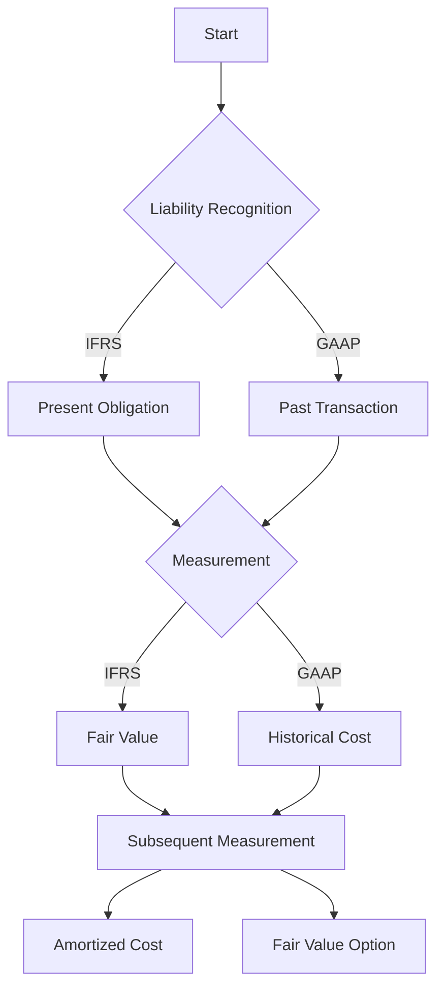

## 14.1 IFRS vs. GAAP on Liabilities

In the realm of financial accounting, understanding the differences between International Financial Reporting Standards (IFRS) and Generally Accepted Accounting Principles (GAAP) is crucial, especially when it comes to liabilities. This section aims to provide a comprehensive comparison of how liabilities are recognized and measured under these two major accounting frameworks. This knowledge is essential for Canadian accounting professionals, as it not only aids in exam preparation but also enhances practical understanding for real-world applications.

### Introduction to IFRS and GAAP

Both IFRS and GAAP serve as frameworks for financial reporting, but they have distinct approaches and principles. IFRS is used in over 140 countries, including Canada, and is known for its principles-based approach, which allows for greater flexibility and interpretation. On the other hand, U.S. GAAP is rules-based, providing detailed guidance and specific criteria for financial reporting.

### Key Differences in Liability Recognition

#### Definition and Recognition

- **IFRS**: Under IFRS, a liability is defined as a present obligation arising from past events, expected to result in an outflow of resources embodying economic benefits. The recognition of a liability occurs when it is probable that an outflow of resources will be required and the amount can be reliably measured.

- **GAAP**: U.S. GAAP defines a liability similarly but emphasizes the need for a past transaction or event to have occurred. Recognition under GAAP requires that the obligation is probable and can be reasonably estimated.

#### Practical Example

Consider a company facing a lawsuit. Under IFRS, the company would recognize a liability if it is more likely than not that they will lose the case and the settlement amount can be estimated. Under GAAP, the threshold is higher, requiring the loss to be probable and the amount to be reasonably estimable.

### Measurement of Liabilities

#### Initial Measurement

- **IFRS**: Liabilities are initially measured at fair value, which is the price that would be paid to transfer a liability in an orderly transaction between market participants at the measurement date.

- **GAAP**: Initial measurement often involves historical cost, which is the amount of cash or cash equivalents paid to acquire the liability.

#### Subsequent Measurement

- **IFRS**: Liabilities are subsequently measured at amortized cost using the effective interest method, unless they are designated at fair value through profit or loss.

- **GAAP**: Similar to IFRS, liabilities can be measured at amortized cost, but GAAP provides more detailed guidance on specific types of liabilities, such as lease obligations and pension liabilities.

### Specific Liabilities: A Comparative Analysis

#### Leases

- **IFRS (IFRS 16)**: All leases are recognized on the balance sheet as a right-of-use asset and a corresponding lease liability, except for short-term and low-value leases.

- **GAAP (ASC 842)**: Similar to IFRS, but with more detailed criteria for lease classification and measurement.

#### Provisions and Contingent Liabilities

- **IFRS (IAS 37)**: Provisions are recognized when there is a present obligation, a probable outflow of resources, and a reliable estimate can be made. Contingent liabilities are not recognized but disclosed unless the possibility of an outflow is remote.

- **GAAP**: Provisions are referred to as liabilities, and the recognition criteria are stricter, requiring the obligation to be probable and the amount to be reasonably estimable.

#### Financial Liabilities

- **IFRS (IAS 39/IFRS 9)**: Financial liabilities are classified as either at fair value through profit or loss or at amortized cost. The classification affects subsequent measurement and recognition of gains and losses.

- **GAAP**: Similar classification exists, but GAAP provides more detailed guidance on derivatives and hedging activities.

### Case Study: Accounting for Environmental Liabilities

Consider a manufacturing company that is required to clean up environmental contamination. Under IFRS, the company would recognize a provision if it is probable that a cleanup will be required and the cost can be estimated. Under GAAP, the company would need to determine if the obligation is probable and can be reasonably estimated, often requiring more detailed analysis and documentation.

### Diagrams and Visual Aids

To further illustrate the differences, consider the following diagram showing the recognition and measurement process under both frameworks:

### Best Practices and Common Pitfalls

#### Best Practices

- **Stay Updated**: Regularly review updates to IFRS and GAAP standards, as changes can impact liability recognition and measurement.
- **Documentation**: Maintain thorough documentation to support the recognition and measurement of liabilities, especially for provisions and contingencies.
- **Professional Judgment**: Apply professional judgment when interpreting principles-based standards like IFRS, ensuring consistency and reliability.

#### Common Pitfalls

- **Overlooking Disclosures**: Both IFRS and GAAP require extensive disclosures for liabilities. Ensure all relevant information is included in financial statements.
- **Misclassification**: Incorrectly classifying liabilities can lead to misstated financial statements. Pay attention to the specific criteria under each framework.

### Exam Preparation Tips

- **Understand Key Differences**: Focus on the fundamental differences in recognition and measurement criteria between IFRS and GAAP.
- **Practice with Examples**: Work through practical examples and case studies to reinforce understanding and application of concepts.
- **Review Standards**: Familiarize yourself with the relevant sections of IFRS and GAAP, such as IAS 37 for provisions and ASC 842 for leases.

### Conclusion

Understanding the differences between IFRS and GAAP in accounting for liabilities is essential for Canadian accounting professionals. This knowledge not only aids in exam preparation but also enhances practical skills for real-world applications. By focusing on key differences, practicing with examples, and staying updated on standards, you can confidently navigate the complexities of financial reporting under both frameworks.

## **Ready to Test Your Knowledge?**



### What is the primary difference in liability recognition between IFRS and GAAP?

- [x] IFRS uses a principles-based approach, while GAAP is rules-based.
- [ ] IFRS requires historical cost, while GAAP uses fair value.
- [ ] IFRS does not recognize contingent liabilities, while GAAP does.
- [ ] IFRS requires a past transaction, while GAAP does not.

> **Explanation:** IFRS is known for its principles-based approach, allowing for more interpretation, whereas GAAP is rules-based with specific criteria.

### Under IFRS, when is a liability recognized?

- [x] When it is probable that an outflow of resources will occur and can be reliably measured.
- [ ] Only when a past transaction has occurred.
- [ ] When the obligation is certain.
- [ ] When the amount is uncertain.

> **Explanation:** IFRS requires that a liability be recognized when it is probable and can be reliably measured, emphasizing the present obligation.

### How are financial liabilities initially measured under IFRS?

- [x] At fair value.
- [ ] At historical cost.
- [ ] At amortized cost.
- [ ] At market value.

> **Explanation:** IFRS requires financial liabilities to be initially measured at fair value, reflecting the price to transfer the liability.

### What is a key feature of GAAP's approach to liability recognition?

- [x] It requires a past transaction or event.
- [ ] It allows for more interpretation.
- [ ] It uses fair value for all liabilities.
- [ ] It does not require estimation.

> **Explanation:** GAAP emphasizes the need for a past transaction or event for liability recognition, aligning with its rules-based nature.

### How does IFRS handle lease liabilities?

- [x] Recognizes all leases on the balance sheet except short-term and low-value leases.
- [ ] Recognizes only finance leases on the balance sheet.
- [ ] Does not require lease recognition.
- [ ] Recognizes all leases as operating leases.

> **Explanation:** IFRS 16 requires all leases to be recognized on the balance sheet, except for short-term and low-value leases.

### What is the measurement basis for liabilities under GAAP?

- [x] Often historical cost.
- [ ] Always fair value.
- [ ] Only amortized cost.
- [ ] Market value.

> **Explanation:** GAAP often uses historical cost for initial measurement, with specific guidance for different types of liabilities.

### How are provisions recognized under IFRS?

- [x] When there is a present obligation, probable outflow, and reliable estimate.
- [ ] Only when the obligation is certain.
- [ ] When the amount is uncertain.
- [ ] When there is a past transaction.

> **Explanation:** IFRS recognizes provisions when there is a present obligation, probable outflow, and reliable estimate, focusing on the likelihood of the obligation.

### What is a common pitfall in liability accounting?

- [x] Misclassifying liabilities.
- [ ] Overestimating liabilities.
- [ ] Using fair value for all liabilities.
- [ ] Ignoring historical cost.

> **Explanation:** Misclassifying liabilities can lead to misstated financial statements, highlighting the importance of correct classification.

### How does GAAP handle contingent liabilities?

- [x] Requires them to be probable and reasonably estimable.
- [ ] Recognizes all contingent liabilities.
- [ ] Does not recognize contingent liabilities.
- [ ] Uses fair value for contingent liabilities.

> **Explanation:** GAAP requires contingent liabilities to be probable and reasonably estimable for recognition, aligning with its detailed guidance.

### True or False: IFRS allows for more flexibility in liability recognition compared to GAAP.

- [x] True
- [ ] False

> **Explanation:** IFRS's principles-based approach allows for more flexibility and interpretation in liability recognition compared to GAAP's rules-based framework.


