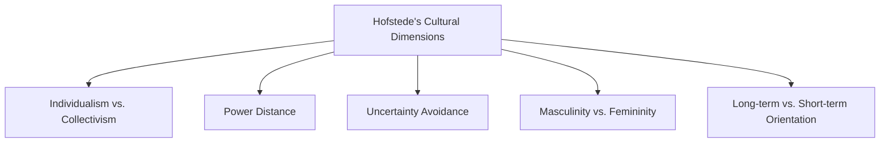

## 14.12 Cultural Influences on Accounting

### Introduction

Accounting is often referred to as the "language of business," yet this language is not universal. Cultural influences play a significant role in shaping accounting practices and disclosures across different regions. Understanding these cultural nuances is crucial for accountants, especially those preparing for Canadian accounting exams, as they navigate both domestic and international financial landscapes. This section explores the impact of cultural differences on accounting, focusing on how these differences manifest in financial reporting, regulatory compliance, and ethical considerations.

### The Role of Culture in Accounting

Culture can be defined as the shared values, beliefs, and norms that influence the behavior of individuals within a society. In accounting, culture affects how financial information is prepared, presented, and interpreted. Here are some key ways culture influences accounting:

1. **Regulatory Environment**: Different countries have varying regulatory frameworks influenced by cultural attitudes towards authority and compliance. For example, countries with a high degree of uncertainty avoidance may have more stringent accounting regulations.

2. **Financial Reporting**: Cultural values can dictate the level of transparency and disclosure in financial reporting. In some cultures, there is a preference for detailed disclosures, while others may prioritize confidentiality.

3. **Ethical Standards**: Cultural norms shape ethical standards in accounting. What is considered ethical in one culture may not be in another, affecting how accountants approach issues like fraud and misreporting.

4. **Decision-Making Processes**: Cultural influences affect decision-making processes within organizations, including how financial decisions are made and who is involved in these decisions.

### Hofstede's Cultural Dimensions and Accounting

Geert Hofstede's cultural dimensions theory provides a framework for understanding cultural differences in accounting. The following dimensions are particularly relevant:

- **Individualism vs. Collectivism**: In individualistic cultures, accounting practices may focus on individual achievements and performance metrics. In contrast, collectivist cultures may emphasize group performance and shared responsibilities.

- **Power Distance**: Cultures with high power distance may have hierarchical organizational structures, impacting how accounting information is communicated and who has access to it.

- **Uncertainty Avoidance**: Cultures with high uncertainty avoidance may prefer conservative accounting practices and detailed disclosures to reduce ambiguity.

- **Masculinity vs. Femininity**: Masculine cultures may prioritize financial performance and competitiveness, while feminine cultures may focus on employee welfare and sustainability.

- **Long-term vs. Short-term Orientation**: Cultures with a long-term orientation may emphasize sustainable financial practices, while those with a short-term orientation may focus on immediate financial results.

### Cultural Influences on Canadian Accounting

Canada's multicultural society brings diverse cultural influences to its accounting practices. The Canadian accounting profession is shaped by both domestic cultural values and international standards, particularly the International Financial Reporting Standards (IFRS). Here are some cultural influences on Canadian accounting:

- **Bilingualism**: Canada's official languages, English and French, influence accounting terminology and communication. Bilingualism also affects the translation and interpretation of financial statements.

- **Indigenous Perspectives**: Indigenous cultures in Canada bring unique perspectives to accounting, emphasizing community well-being and sustainability over individual profit.

- **Globalization**: As a global trading nation, Canada is influenced by international accounting practices and standards. Canadian accountants must be adept at navigating cultural differences in international business transactions.

### Case Study: Cultural Influences in International Mergers and Acquisitions

International mergers and acquisitions (M&A) provide a practical example of cultural influences on accounting. Cultural differences can impact the valuation of assets, negotiation processes, and integration strategies. For instance, a Canadian company acquiring a Japanese firm may face challenges due to differences in accounting standards, corporate governance, and business etiquette.

#### Example: Canadian Firm Acquiring a Japanese Company

- **Valuation Differences**: Japanese firms may use different valuation methods, influenced by cultural attitudes towards risk and uncertainty. Canadian accountants must adapt to these differences to ensure accurate financial reporting.

- **Negotiation Styles**: Japanese business culture emphasizes consensus and long-term relationships, while Canadian culture may prioritize efficiency and direct communication. Understanding these cultural nuances is crucial for successful negotiations.

- **Integration Challenges**: Post-acquisition integration requires sensitivity to cultural differences in management styles, employee expectations, and corporate values.

### Practical Examples and Scenarios

To illustrate the impact of cultural influences on accounting, consider the following scenarios:

1. **Scenario 1: Financial Reporting in a Multinational Corporation**

   A Canadian multinational corporation operates in several countries with diverse cultural backgrounds. The company's financial reporting must comply with both Canadian and international standards. Accountants must navigate cultural differences in disclosure requirements, ethical standards, and regulatory compliance.

2. **Scenario 2: Ethical Dilemmas in Cross-Cultural Contexts**

   An accountant working for a Canadian firm in a foreign country faces an ethical dilemma due to differing cultural norms. The local culture may tolerate practices considered unethical in Canada, such as bribery or tax evasion. The accountant must balance cultural sensitivity with adherence to Canadian ethical standards.

3. **Scenario 3: Cultural Differences in Financial Decision-Making**

   A Canadian company expands into a collectivist culture where group consensus is valued over individual decision-making. The company's financial decisions must align with local cultural norms, requiring adjustments in management practices and communication strategies.

### Real-World Applications and Regulatory Scenarios

Understanding cultural influences on accounting is essential for compliance with international standards and regulations. Canadian accountants must be familiar with the following:

- **IFRS and ASPE**: The International Financial Reporting Standards (IFRS) and Accounting Standards for Private Enterprises (ASPE) provide guidance on accounting practices in Canada. Accountants must understand how cultural differences affect the application of these standards.

- **CPA Canada Guidelines**: The Chartered Professional Accountants of Canada (CPA Canada) offers resources and guidelines for navigating cultural influences in accounting. Accountants should leverage these resources to enhance their understanding of cultural diversity in financial reporting.

- **Global Regulatory Bodies**: Accountants must be aware of global regulatory bodies, such as the International Accounting Standards Board (IASB) and the Financial Accounting Standards Board (FASB), which influence accounting practices worldwide.

### Step-by-Step Guidance for Navigating Cultural Influences

To effectively navigate cultural influences on accounting, consider the following steps:

1. **Conduct Cultural Research**: Understand the cultural context of the countries you are working with. Research cultural norms, values, and business practices to inform your accounting decisions.

2. **Adapt Communication Styles**: Tailor your communication style to align with cultural preferences. For example, use indirect communication in high-context cultures and direct communication in low-context cultures.

3. **Leverage Cultural Diversity**: Embrace cultural diversity within your organization. Encourage cross-cultural collaboration and learning to enhance your accounting practices.

4. **Stay Informed on International Standards**: Keep up-to-date with international accounting standards and regulations. Attend workshops, seminars, and training sessions to deepen your understanding of cultural influences.

5. **Seek Professional Guidance**: Consult with cultural experts or international accounting professionals to gain insights into cultural differences and their impact on accounting.

### Diagrams and Visuals

To enhance your understanding of cultural influences on accounting, consider the following diagram illustrating Hofstede's cultural dimensions:

### Best Practices, Common Pitfalls, and Strategies

**Best Practices:**

- **Cultural Sensitivity**: Approach cultural differences with sensitivity and respect. Acknowledge and appreciate diverse perspectives in accounting practices.

- **Continuous Learning**: Engage in continuous learning to stay informed about cultural influences and their impact on accounting.

**Common Pitfalls:**

- **Cultural Stereotyping**: Avoid making assumptions based on cultural stereotypes. Recognize the diversity within cultures and adapt your approach accordingly.

- **Resistance to Change**: Be open to adapting your accounting practices to align with cultural differences. Resistance to change can hinder effective financial reporting.

**Strategies:**

- **Cross-Cultural Training**: Implement cross-cultural training programs for accountants to enhance their cultural competence and adaptability.

- **Collaborative Decision-Making**: Foster collaborative decision-making processes that incorporate diverse cultural perspectives.

### References and Additional Resources

- **CPA Canada**: Explore resources and guidelines from CPA Canada on cultural influences in accounting.

- **IFRS Foundation**: Access the IFRS Foundation's website for information on international accounting standards.

- **Hofstede Insights**: Visit Hofstede Insights for detailed information on cultural dimensions and their impact on business practices.

### Summary

Cultural influences play a significant role in shaping accounting practices and disclosures. Understanding these influences is crucial for accountants, particularly those preparing for Canadian accounting exams. By embracing cultural diversity and adapting to international standards, accountants can enhance their financial reporting and decision-making processes. This section has provided insights into the impact of cultural differences on accounting, practical examples, and strategies for navigating these influences effectively.

## **Ready to Test Your Knowledge?**



### How does culture influence accounting practices?

- [x] Through regulatory frameworks and ethical standards
- [ ] By determining the currency used in financial statements
- [ ] By setting tax rates
- [ ] By defining the accounting equation

> **Explanation:** Culture influences accounting practices through regulatory frameworks, ethical standards, and decision-making processes.

### Which of Hofstede's cultural dimensions relates to the preference for group performance over individual achievements?

- [ ] Power Distance
- [x] Individualism vs. Collectivism
- [ ] Uncertainty Avoidance
- [ ] Masculinity vs. Femininity

> **Explanation:** The Individualism vs. Collectivism dimension relates to the preference for group performance in collectivist cultures.

### What is a common challenge in international mergers and acquisitions due to cultural differences?

- [x] Valuation differences
- [ ] Currency conversion
- [ ] Language barriers
- [ ] Taxation issues

> **Explanation:** Valuation differences arise due to cultural attitudes towards risk and uncertainty, impacting international M&A.

### How can Canadian accountants enhance their understanding of cultural influences?

- [x] By conducting cultural research and adapting communication styles
- [ ] By focusing solely on Canadian standards
- [ ] By ignoring international regulations
- [ ] By relying on stereotypes

> **Explanation:** Conducting cultural research and adapting communication styles are effective ways to enhance understanding of cultural influences.

### What is a best practice for navigating cultural influences in accounting?

- [x] Cultural sensitivity
- [ ] Cultural stereotyping
- [ ] Resistance to change
- [ ] Ignoring cultural differences

> **Explanation:** Cultural sensitivity involves respecting and acknowledging diverse perspectives in accounting practices.

### Which cultural dimension is associated with a preference for conservative accounting practices?

- [ ] Individualism vs. Collectivism
- [ ] Power Distance
- [x] Uncertainty Avoidance
- [ ] Masculinity vs. Femininity

> **Explanation:** Cultures with high uncertainty avoidance prefer conservative accounting practices to reduce ambiguity.

### How does bilingualism influence Canadian accounting?

- [x] It affects accounting terminology and communication
- [ ] It determines tax rates
- [ ] It sets financial reporting standards
- [ ] It influences currency exchange rates

> **Explanation:** Bilingualism influences accounting terminology and communication in Canada, affecting financial reporting.

### What strategy can enhance cross-cultural competence in accounting?

- [x] Cross-cultural training
- [ ] Ignoring cultural differences
- [ ] Focusing only on domestic standards
- [ ] Relying on stereotypes

> **Explanation:** Cross-cultural training enhances accountants' competence in navigating cultural differences.

### What is a common pitfall when dealing with cultural influences in accounting?

- [x] Cultural stereotyping
- [ ] Cultural sensitivity
- [ ] Continuous learning
- [ ] Collaborative decision-making

> **Explanation:** Cultural stereotyping involves making assumptions based on stereotypes, which can hinder effective accounting practices.

### True or False: Cultural influences have no impact on ethical standards in accounting.

- [ ] True
- [x] False

> **Explanation:** Cultural influences significantly impact ethical standards in accounting, affecting how accountants approach issues like fraud and misreporting.


