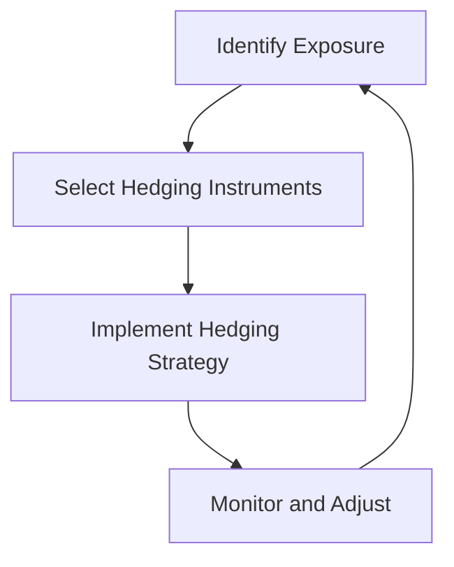

## 14.14 Foreign Exchange Risk Management

Foreign exchange risk, also known as currency risk, arises from the change in price of one currency against another. Companies that operate internationally or engage in cross-border transactions are exposed to this risk, which can significantly impact financial performance and position. Effective foreign exchange risk management is crucial for maintaining financial stability and ensuring accurate financial reporting. This section delves into the strategies and accounting practices for managing foreign exchange risk, with a focus on Canadian accounting standards, including IFRS and ASPE.

### Understanding Foreign Exchange Risk

Foreign exchange risk can be categorized into three main types:

1. **Transaction Risk:** This arises from the effect of exchange rate fluctuations on a company's future cash flows. It occurs when a company has receivables or payables denominated in a foreign currency.

2. **Translation Risk:** This risk affects the reported financial statements of a company with foreign operations. It arises when consolidating foreign subsidiaries into the parent company’s financial statements, which are presented in a different currency.

3. **Economic Risk:** Also known as operating exposure, economic risk affects a company’s market value due to long-term changes in exchange rates. It impacts a company’s competitive position and future cash flows.

### Strategies for Managing Foreign Exchange Risk

Effective management of foreign exchange risk involves identifying, measuring, and hedging exposures. Here are some common strategies:

#### 1. Natural Hedging

Natural hedging involves structuring operations to offset currency exposures without using financial instruments. This can include:

- **Matching Currency Cash Flows:** Aligning revenues and expenses in the same currency to minimize exposure.
- **Diversifying Operations:** Spreading operations across multiple countries to balance currency risks.
- **Pricing Strategies:** Adjusting prices to reflect exchange rate changes.

#### 2. Financial Hedging

Financial hedging involves using financial instruments to mitigate foreign exchange risk. Common instruments include:

- **Forward Contracts:** Agreements to exchange currency at a future date at a predetermined rate. They are used to lock in exchange rates and eliminate uncertainty.

- **Futures Contracts:** Similar to forward contracts but traded on exchanges, providing liquidity and standardization.

- **Options:** Contracts that give the holder the right, but not the obligation, to exchange currency at a specified rate before a certain date. They provide flexibility and protection against adverse movements.

- **Swaps:** Agreements to exchange cash flows in different currencies, often used to manage interest rate and currency risk simultaneously.

#### 3. Operational Strategies

- **Leading and Lagging:** Adjusting the timing of payments and receipts to take advantage of favorable exchange rates.
- **Currency Clauses:** Including terms in contracts that adjust payments based on exchange rate movements.

### Accounting for Foreign Exchange Risk

Accounting for foreign exchange risk involves recognizing and measuring the impact of currency fluctuations on financial statements. Canadian companies follow IFRS or ASPE, depending on their reporting requirements.

#### IFRS Standards

Under IFRS, IAS 21 "The Effects of Changes in Foreign Exchange Rates" provides guidance on accounting for foreign currency transactions and translation of financial statements.

- **Foreign Currency Transactions:** Initially recorded at the spot exchange rate on the transaction date. At each reporting date, monetary items are retranslated at the closing rate, while non-monetary items are measured at historical cost or fair value.

- **Translation of Financial Statements:** For foreign operations, assets and liabilities are translated at the closing rate, while income and expenses are translated at the exchange rates at the dates of the transactions. Exchange differences are recognized in other comprehensive income.

#### ASPE Standards

Under ASPE, Section 1651 "Foreign Currency Translation" outlines the accounting treatment for foreign currency transactions and translation.

- **Foreign Currency Transactions:** Similar to IFRS, transactions are recorded at the exchange rate on the transaction date. Monetary items are retranslated at the closing rate, and non-monetary items are measured at historical cost.

- **Translation of Financial Statements:** The temporal method is used for integrated foreign operations, while the current rate method is used for self-sustaining operations.

### Practical Examples and Case Studies

#### Example 1: Forward Contract Hedging

A Canadian company, ABC Inc., expects to receive €1,000,000 in six months from a European customer. To hedge against currency risk, ABC Inc. enters into a forward contract to sell €1,000,000 at a rate of 1.50 CAD/EUR. By doing so, ABC Inc. locks in a rate and eliminates uncertainty about the future exchange rate.

#### Example 2: Translation Risk Management

XYZ Corp., a Canadian multinational, has a subsidiary in Japan. The subsidiary’s financial statements are prepared in Japanese yen. To consolidate these statements into Canadian dollars, XYZ Corp. uses the current rate method, translating assets and liabilities at the closing rate and recognizing exchange differences in other comprehensive income.

### Real-World Applications and Regulatory Scenarios

Foreign exchange risk management is not only crucial for financial stability but also for regulatory compliance. Companies must adhere to disclosure requirements and provide transparent information about their currency risk management strategies.

- **Disclosure Requirements:** Under IFRS 7 "Financial Instruments: Disclosures," companies must disclose their exposure to foreign exchange risk, the objectives and policies for managing risk, and the methods used to measure risk.

- **Regulatory Compliance:** Companies must ensure compliance with Canadian regulations and guidelines from CPA Canada, which emphasize the importance of effective risk management and accurate financial reporting.

### Best Practices and Common Pitfalls

#### Best Practices

- **Comprehensive Risk Assessment:** Regularly assess and quantify foreign exchange exposures to implement appropriate hedging strategies.
- **Integrated Risk Management:** Align foreign exchange risk management with overall corporate risk management strategies.
- **Continuous Monitoring:** Regularly monitor exchange rate movements and adjust strategies as needed.

#### Common Pitfalls

- **Over-Hedging:** Hedging more than the actual exposure can lead to unnecessary costs and reduced flexibility.
- **Ignoring Economic Risk:** Focusing solely on transaction and translation risk without considering long-term economic exposure can undermine competitiveness.
- **Lack of Expertise:** Inadequate understanding of financial instruments and market dynamics can lead to ineffective risk management.

### Step-by-Step Guidance for Hedging

1. **Identify Exposure:** Determine the type and magnitude of foreign exchange exposure.
2. **Select Hedging Instruments:** Choose appropriate financial instruments based on the exposure and risk tolerance.
3. **Implement Hedging Strategy:** Execute the chosen hedging strategy and document the rationale and expected outcomes.
4. **Monitor and Adjust:** Continuously monitor the effectiveness of the hedging strategy and make adjustments as necessary.

### Diagrams and Charts

To enhance understanding, the following Mermaid.js diagram illustrates the process of foreign exchange risk management:

### Summary

Foreign exchange risk management is a critical component of financial management for companies engaged in international operations. By understanding the types of currency risk and implementing effective strategies, companies can mitigate the impact of exchange rate fluctuations on their financial performance. Adhering to accounting standards and regulatory requirements ensures transparent and accurate financial reporting, enhancing stakeholder confidence.

### References

- IFRS Standards: IAS 21, IFRS 7
- ASPE Standards: Section 1651
- CPA Canada Guidelines

### Additional Study Materials

- CPA Canada Practice Exams
- Online Courses on Foreign Exchange Risk Management
- Books on International Financial Management

## **Ready to Test Your Knowledge?**



### Which of the following is NOT a type of foreign exchange risk?

- [ ] Transaction Risk
- [ ] Translation Risk
- [x] Inflation Risk
- [ ] Economic Risk

> **Explanation:** Inflation risk is not a type of foreign exchange risk. The main types of foreign exchange risk are transaction, translation, and economic risk.

### What is the primary purpose of using forward contracts in foreign exchange risk management?

- [x] To lock in exchange rates and eliminate uncertainty
- [ ] To speculate on currency movements
- [ ] To diversify currency exposure
- [ ] To increase transaction volume

> **Explanation:** Forward contracts are used to lock in exchange rates for future transactions, eliminating uncertainty about future currency movements.

### Under IFRS, where are exchange differences recognized when translating financial statements of foreign operations?

- [ ] In retained earnings
- [x] In other comprehensive income
- [ ] In profit or loss
- [ ] In equity reserves

> **Explanation:** Under IFRS, exchange differences arising from the translation of financial statements of foreign operations are recognized in other comprehensive income.

### Which method is used under ASPE for translating financial statements of self-sustaining foreign operations?

- [x] Current rate method
- [ ] Temporal method
- [ ] Historical cost method
- [ ] Fair value method

> **Explanation:** Under ASPE, the current rate method is used for translating financial statements of self-sustaining foreign operations.

### What is a common pitfall in foreign exchange risk management?

- [ ] Comprehensive risk assessment
- [x] Over-hedging
- [ ] Integrated risk management
- [ ] Continuous monitoring

> **Explanation:** Over-hedging, or hedging more than the actual exposure, is a common pitfall that can lead to unnecessary costs and reduced flexibility.

### Which of the following is a financial instrument used for hedging foreign exchange risk?

- [x] Options
- [ ] Stocks
- [ ] Bonds
- [ ] Real estate

> **Explanation:** Options are financial instruments used for hedging foreign exchange risk, providing flexibility and protection against adverse currency movements.

### What is the first step in the process of foreign exchange risk management?

- [x] Identify Exposure
- [ ] Select Hedging Instruments
- [ ] Implement Hedging Strategy
- [ ] Monitor and Adjust

> **Explanation:** The first step in foreign exchange risk management is to identify the type and magnitude of foreign exchange exposure.

### Which of the following is a strategy to naturally hedge foreign exchange risk?

- [x] Matching Currency Cash Flows
- [ ] Using forward contracts
- [ ] Speculating on currency movements
- [ ] Investing in foreign stocks

> **Explanation:** Matching currency cash flows is a natural hedging strategy that involves aligning revenues and expenses in the same currency to minimize exposure.

### What is the role of IFRS 7 in foreign exchange risk management?

- [x] To provide disclosure requirements for financial instruments
- [ ] To set exchange rates for transactions
- [ ] To determine the method of translation
- [ ] To regulate currency trading

> **Explanation:** IFRS 7 provides disclosure requirements for financial instruments, including foreign exchange risk management strategies and exposures.

### True or False: Economic risk affects a company's market value due to short-term changes in exchange rates.

- [ ] True
- [x] False

> **Explanation:** Economic risk, also known as operating exposure, affects a company's market value due to long-term changes in exchange rates, impacting competitive position and future cash flows.


