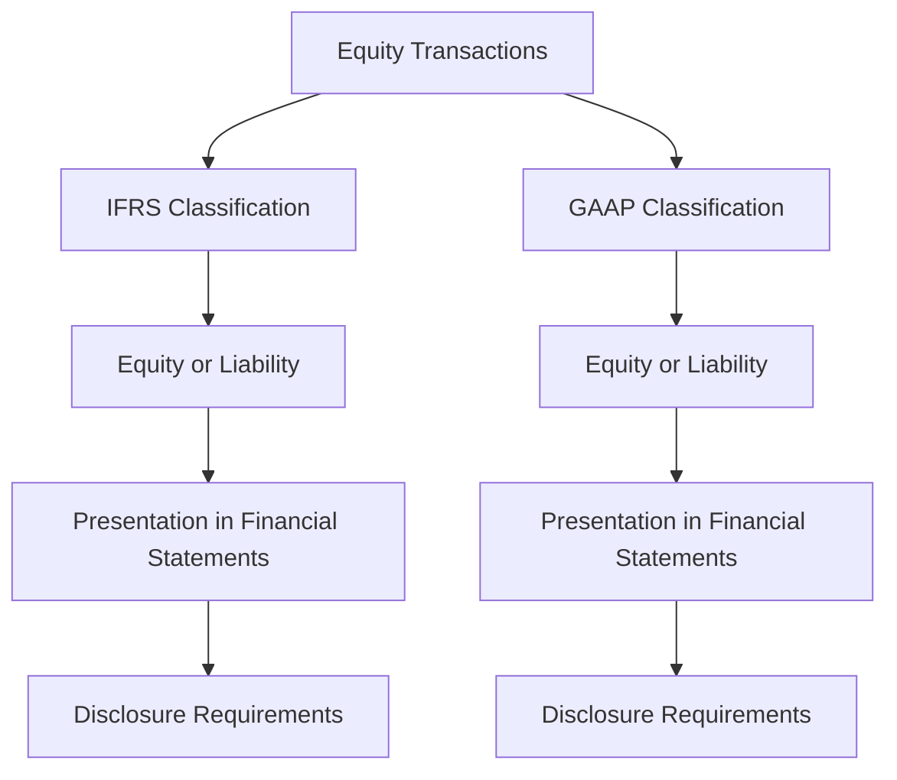

## 14.2 IFRS vs. GAAP on Equity

In the realm of accounting, equity represents the ownership interest of shareholders in a company. The International Financial Reporting Standards (IFRS) and the Generally Accepted Accounting Principles (GAAP) in the United States provide distinct frameworks for accounting for equity. Understanding these differences is crucial for Canadian accountants, especially those preparing for exams or working in multinational environments. This section delves into the key differences between IFRS and GAAP regarding equity, providing practical examples, real-world applications, and guidance for Canadian accountants.

### Understanding Equity in Financial Reporting

Equity is a fundamental component of the financial statements, representing the residual interest in the assets of an entity after deducting liabilities. It includes elements such as common stock, preferred stock, additional paid-in capital, retained earnings, and accumulated other comprehensive income. Both IFRS and GAAP aim to provide a clear representation of equity, but they approach certain aspects differently.

### Key Differences Between IFRS and GAAP on Equity

#### 1. **Presentation of Equity**

- **IFRS**: Under IFRS, equity is presented in the statement of financial position, and the components of equity are clearly delineated. IFRS emphasizes the importance of distinguishing between the different types of equity instruments and provides detailed guidance on their classification.

- **GAAP**: U.S. GAAP also requires the presentation of equity in the balance sheet but tends to be more prescriptive in terms of the order and classification of equity components. GAAP often requires more detailed disclosures regarding equity transactions.

#### 2. **Common Stock and Preferred Stock**

- **IFRS**: IFRS allows for flexibility in the classification of financial instruments as either equity or liability. The classification is based on the substance of the contractual arrangement rather than its legal form. For instance, a preferred stock with a mandatory redemption feature might be classified as a liability under IFRS.

- **GAAP**: GAAP is more rigid in its classification criteria. Preferred stock is typically classified as equity unless it has characteristics that meet the definition of a liability, such as a mandatory redemption feature.

#### 3. **Additional Paid-in Capital**

- **IFRS**: Under IFRS, additional paid-in capital is recognized as part of equity. IFRS focuses on the fair value of consideration received for equity instruments issued.

- **GAAP**: GAAP also recognizes additional paid-in capital as part of equity but provides more detailed guidance on accounting for specific transactions, such as stock options and warrants.

#### 4. **Retained Earnings**

- **IFRS**: Retained earnings under IFRS include the cumulative net income or loss of a company, adjusted for dividends and other distributions. IFRS allows for the revaluation of certain assets, which can impact retained earnings.

- **GAAP**: GAAP requires retained earnings to reflect the cumulative net income or loss, adjusted for dividends. Revaluation of assets is generally not permitted under GAAP, leading to differences in retained earnings compared to IFRS.

#### 5. **Accumulated Other Comprehensive Income**

- **IFRS**: IFRS includes accumulated other comprehensive income (OCI) as a component of equity. OCI includes items such as foreign currency translation adjustments and changes in the fair value of certain financial instruments.

- **GAAP**: GAAP also includes OCI as part of equity, but the specific items included and the manner of presentation can differ from IFRS. GAAP requires more detailed disclosures regarding OCI components.

#### 6. **Equity Method Investments**

- **IFRS**: Under IFRS, equity method investments are accounted for in accordance with IAS 28. The investor recognizes its share of the investee's profit or loss in its financial statements.

- **GAAP**: GAAP provides similar guidance under ASC 323 but includes more specific rules regarding the recognition of losses and the treatment of differences in accounting policies between the investor and investee.

#### 7. **Treasury Stock**

- **IFRS**: IFRS allows for the repurchase of shares to be accounted for as a deduction from equity. The cost of treasury shares is presented as a separate component of equity.

- **GAAP**: GAAP also requires treasury stock to be deducted from equity but provides more detailed guidance on the accounting for treasury stock transactions, including methods such as the cost method and the par value method.

#### 8. **Stock Dividends and Stock Splits**

- **IFRS**: IFRS requires stock dividends and stock splits to be accounted for as equity transactions. The impact on equity is reflected in the financial statements, but IFRS does not provide specific guidance on the accounting treatment.

- **GAAP**: GAAP provides detailed guidance on accounting for stock dividends and stock splits, including the impact on earnings per share and the presentation in the financial statements.

### Practical Examples and Case Studies

To illustrate the differences between IFRS and GAAP on equity, consider the following examples:

#### Example 1: Classification of Preferred Stock

A Canadian company issues preferred stock with a mandatory redemption feature. Under IFRS, this preferred stock would likely be classified as a liability due to the redemption feature. However, under GAAP, it may still be classified as equity if it meets certain criteria.

#### Example 2: Revaluation of Assets

A company revalues its land and buildings under IFRS, resulting in an increase in the revaluation surplus, which is included in other comprehensive income. Under GAAP, such revaluation is not permitted, leading to differences in the equity section of the balance sheet.

#### Example 3: Treasury Stock Transactions

A company repurchases its own shares and accounts for them as treasury stock. Under IFRS, the cost of the repurchased shares is deducted from equity. GAAP provides additional guidance on the accounting method to be used, such as the cost method or the par value method.

### Real-World Applications and Regulatory Scenarios

Understanding the differences between IFRS and GAAP on equity is essential for Canadian accountants working in multinational environments or dealing with cross-border transactions. The choice of accounting framework can significantly impact financial reporting, tax planning, and compliance with regulatory requirements.

#### Regulatory Considerations

- **Canadian Context**: In Canada, publicly accountable enterprises are required to use IFRS for financial reporting. Private enterprises have the option to use either IFRS or Accounting Standards for Private Enterprises (ASPE), which are more aligned with GAAP.

- **Global Perspective**: Companies operating in multiple jurisdictions may need to reconcile differences between IFRS and GAAP to ensure compliance with local regulations and to provide consistent financial information to stakeholders.

### Step-by-Step Guidance for Accounting Procedures

For Canadian accountants preparing for exams or working in practice, it is important to understand the specific accounting procedures under both IFRS and GAAP. The following steps provide guidance on key equity-related transactions:

#### Step 1: Classification of Equity Instruments

- **IFRS**: Evaluate the substance of the contractual arrangement to determine the classification as equity or liability.
- **GAAP**: Follow the prescriptive criteria for classification, considering factors such as redemption features and dividend obligations.

#### Step 2: Recognition and Measurement of Equity Transactions

- **IFRS**: Recognize equity transactions at fair value, considering the fair value of consideration received.
- **GAAP**: Recognize equity transactions based on the specific guidance provided for different types of transactions, such as stock options and warrants.

#### Step 3: Presentation and Disclosure

- **IFRS**: Present equity components in the statement of financial position, ensuring clear distinction between different types of equity instruments.
- **GAAP**: Follow the detailed disclosure requirements for equity transactions, including information on stock dividends, stock splits, and treasury stock.

### Diagrams and Visual Aids

To enhance understanding, the following diagram illustrates the flow of equity transactions under IFRS and GAAP:

### Best Practices and Common Pitfalls

#### Best Practices

- **Stay Informed**: Keep up-to-date with changes in IFRS and GAAP standards, as they can impact equity accounting.
- **Understand the Substance**: Focus on the substance of transactions rather than their legal form, especially under IFRS.
- **Ensure Compliance**: Adhere to disclosure requirements and ensure consistency in financial reporting.

#### Common Pitfalls

- **Misclassification**: Avoid misclassifying equity instruments, which can lead to incorrect financial reporting.
- **Inadequate Disclosures**: Ensure that all required disclosures are made, as failure to do so can result in non-compliance.
- **Ignoring Differences**: Be aware of the differences between IFRS and GAAP, especially when dealing with cross-border transactions.

### References and Additional Resources

- **IFRS Standards**: Access the latest IFRS standards and interpretations from the IFRS Foundation website.
- **CPA Canada**: Explore resources and guidance from CPA Canada on accounting standards and best practices.
- **FASB**: Review the Financial Accounting Standards Board (FASB) website for updates on U.S. GAAP.

### Summary and Key Points

Understanding the differences between IFRS and GAAP on equity is crucial for Canadian accountants, especially those preparing for exams or working in international contexts. Key differences include the classification of equity instruments, recognition and measurement of equity transactions, and presentation and disclosure requirements. By staying informed and adhering to best practices, accountants can ensure accurate and compliant financial reporting.

## **Ready to Test Your Knowledge?**



### Which of the following is a key difference between IFRS and GAAP regarding equity classification?

- [x] IFRS focuses on the substance of the contractual arrangement.
- [ ] GAAP focuses on the substance of the contractual arrangement.
- [ ] Both IFRS and GAAP focus on the legal form of the arrangement.
- [ ] Neither IFRS nor GAAP focus on the substance of the arrangement.

> **Explanation:** IFRS emphasizes the substance of the contractual arrangement, whereas GAAP is more prescriptive and often focuses on the legal form.

### Under IFRS, how is preferred stock with a mandatory redemption feature typically classified?

- [x] As a liability
- [ ] As equity
- [ ] As a contingent liability
- [ ] As other comprehensive income

> **Explanation:** IFRS classifies preferred stock with a mandatory redemption feature as a liability due to the obligation to redeem the shares.

### What is the impact of asset revaluation on equity under IFRS?

- [x] It increases the revaluation surplus in other comprehensive income.
- [ ] It decreases retained earnings.
- [ ] It has no impact on equity.
- [ ] It is recorded as a liability.

> **Explanation:** Under IFRS, asset revaluation increases the revaluation surplus, which is part of other comprehensive income.

### How does GAAP typically account for treasury stock transactions?

- [x] As a deduction from equity
- [ ] As an addition to liabilities
- [ ] As an expense
- [ ] As revenue

> **Explanation:** GAAP requires treasury stock to be deducted from equity, reflecting the cost of repurchased shares.

### Which of the following is included in accumulated other comprehensive income under both IFRS and GAAP?

- [x] Foreign currency translation adjustments
- [ ] Retained earnings
- [ ] Treasury stock
- [ ] Dividends payable

> **Explanation:** Both IFRS and GAAP include foreign currency translation adjustments in accumulated other comprehensive income.

### What is a common pitfall when accounting for equity under IFRS and GAAP?

- [x] Misclassification of equity instruments
- [ ] Overstating liabilities
- [ ] Understating assets
- [ ] Ignoring cash flows

> **Explanation:** Misclassification of equity instruments can lead to incorrect financial reporting and non-compliance.

### Which of the following best describes the approach to equity method investments under IFRS?

- [x] Recognizing the investor's share of the investee's profit or loss
- [ ] Consolidating the investee's financial statements
- [ ] Recording the investment at fair value
- [ ] Treating the investment as a liability

> **Explanation:** IFRS requires recognizing the investor's share of the investee's profit or loss in equity method investments.

### How does GAAP handle stock dividends and stock splits?

- [x] Provides detailed guidance on their accounting treatment
- [ ] Ignores their impact on financial statements
- [ ] Treats them as liabilities
- [ ] Records them as expenses

> **Explanation:** GAAP provides detailed guidance on the accounting treatment of stock dividends and stock splits.

### What is the primary focus of IFRS when recognizing equity transactions?

- [x] Fair value of consideration received
- [ ] Historical cost
- [ ] Legal form of the transaction
- [ ] Tax implications

> **Explanation:** IFRS focuses on the fair value of consideration received when recognizing equity transactions.

### True or False: Under GAAP, revaluation of assets is generally permitted.

- [ ] True
- [x] False

> **Explanation:** Under GAAP, revaluation of assets is generally not permitted, leading to differences in equity compared to IFRS.


