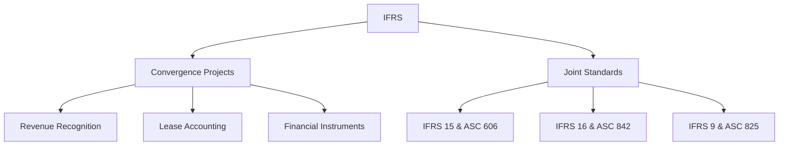

## 14.3 Global Convergence Efforts

The global convergence of accounting standards is a significant movement aimed at harmonizing the diverse accounting practices across the world. This initiative seeks to create a unified set of accounting standards that can be applied consistently across different countries, thereby enhancing the comparability, transparency, and reliability of financial statements. In this section, we will delve into the history, objectives, challenges, and progress of global convergence efforts, with a particular focus on the International Financial Reporting Standards (IFRS) and Generally Accepted Accounting Principles (GAAP). We will also explore the implications of these efforts on Canadian accounting practices and the broader global financial landscape.

### **Historical Context and Objectives of Global Convergence**

The journey towards global convergence began in the late 20th century, driven by the increasing globalization of business and finance. As companies expanded their operations across borders, the need for a common accounting language became apparent. The primary objectives of global convergence include:

- **Enhancing Comparability:** By standardizing accounting practices, financial statements become more comparable across different jurisdictions, aiding investors and stakeholders in making informed decisions.
- **Improving Transparency:** A unified set of standards increases the transparency of financial reporting, reducing the risk of financial misstatements and fraud.
- **Facilitating Cross-border Investments:** Harmonized standards lower the barriers to cross-border investments by providing consistent financial information to investors.
- **Reducing Compliance Costs:** Companies operating in multiple countries can reduce compliance costs by adhering to a single set of accounting standards.

### **Key Players in Global Convergence**

The global convergence of accounting standards is spearheaded by several key organizations:

- **International Accounting Standards Board (IASB):** The IASB is responsible for developing and promoting the adoption of IFRS, which are designed to be a global standard for financial reporting.
- **Financial Accounting Standards Board (FASB):** The FASB sets the accounting standards in the United States, known as GAAP. It has been actively involved in convergence projects with the IASB.
- **International Organization of Securities Commissions (IOSCO):** IOSCO supports the development of international accounting standards to ensure the integrity of global capital markets.
- **Canadian Accounting Standards Board (AcSB):** The AcSB plays a crucial role in adopting and adapting IFRS for use in Canada, ensuring alignment with global standards while considering local economic conditions.

### **IFRS and GAAP: A Comparative Overview**

The convergence efforts primarily focus on aligning IFRS and GAAP, the two most widely used accounting frameworks. While both aim to provide high-quality financial reporting, there are notable differences:

- **Principles vs. Rules:** IFRS is principles-based, offering more flexibility and requiring professional judgment. In contrast, GAAP is rules-based, providing detailed guidance for specific scenarios.
- **Revenue Recognition:** IFRS emphasizes the transfer of control, while GAAP focuses on the realization and earning process.
- **Inventory Valuation:** IFRS prohibits the use of the Last-In, First-Out (LIFO) method, whereas GAAP allows it.
- **Financial Instruments:** Differences exist in the classification and measurement of financial instruments under IFRS and GAAP.

### **Progress and Challenges in Convergence**

Significant progress has been made in converging IFRS and GAAP, with several joint projects completed, including:

- **Revenue Recognition:** The issuance of IFRS 15 and ASC 606 established a common framework for revenue recognition.
- **Leases:** IFRS 16 and ASC 842 introduced similar models for lease accounting, requiring lessees to recognize assets and liabilities for most leases.
- **Financial Instruments:** Efforts to align the classification and measurement of financial instruments have resulted in IFRS 9 and ASC 825.

Despite these achievements, challenges remain:

- **Cultural and Economic Differences:** Variations in economic environments and cultural attitudes towards accounting can hinder convergence.
- **Regulatory and Political Influences:** National regulators and political bodies may resist changes that affect local interests.
- **Complexity and Costs:** Transitioning to a new set of standards can be complex and costly for companies, particularly smaller entities.

### **Impact on Canadian Accounting Practices**

Canada adopted IFRS for publicly accountable enterprises in 2011, aligning its financial reporting with global standards. This move has had several implications:

- **Increased Comparability:** Canadian companies can now be compared more easily with their international counterparts, attracting global investors.
- **Enhanced Transparency:** The adoption of IFRS has improved the transparency and reliability of financial reporting in Canada.
- **Challenges for SMEs:** Small and medium-sized enterprises (SMEs) face challenges in adopting IFRS due to its complexity and cost. The AcSB has developed the Accounting Standards for Private Enterprises (ASPE) as an alternative for these entities.

### **Case Studies and Practical Examples**

To illustrate the impact of global convergence efforts, consider the following case studies:

- **Case Study 1: Revenue Recognition in the Technology Sector**
  A Canadian technology company operating in multiple countries faced challenges in aligning its revenue recognition policies with both IFRS and GAAP. The adoption of IFRS 15 and ASC 606 provided a consistent framework, enabling the company to streamline its financial reporting and enhance comparability.

- **Case Study 2: Lease Accounting in the Retail Industry**
  A multinational retail chain with operations in Canada and the United States had to navigate the differences in lease accounting under IFRS and GAAP. The introduction of IFRS 16 and ASC 842 simplified the process, allowing the company to present a unified financial position to stakeholders.

### **Real-world Applications and Regulatory Scenarios**

Global convergence efforts have practical implications for accountants and auditors:

- **Financial Statement Preparation:** Accountants must be proficient in both IFRS and GAAP to prepare financial statements for multinational companies.
- **Audit and Assurance Services:** Auditors need to understand the nuances of both frameworks to provide accurate assurance services.
- **Regulatory Compliance:** Companies must stay abreast of changes in accounting standards to ensure compliance with regulatory requirements.

### **Step-by-step Guidance for Transitioning to IFRS**

For Canadian companies transitioning to IFRS, the following steps can facilitate a smooth process:

1. **Conduct a Gap Analysis:** Identify the differences between current accounting practices and IFRS requirements.
2. **Develop an Implementation Plan:** Create a detailed plan outlining the steps needed to transition to IFRS, including timelines and resource allocation.
3. **Train Staff:** Provide training to accounting and finance staff to ensure they understand IFRS principles and applications.
4. **Update Systems and Processes:** Modify accounting systems and processes to accommodate IFRS reporting requirements.
5. **Communicate with Stakeholders:** Keep stakeholders informed of the transition process and its impact on financial reporting.

### **Diagrams and Visual Aids**

To enhance understanding, consider the following diagram illustrating the convergence process between IFRS and GAAP:

### **Best Practices, Common Pitfalls, and Strategies**

When navigating global convergence efforts, consider the following best practices:

- **Stay Informed:** Keep up-to-date with changes in accounting standards and convergence projects.
- **Engage with Professional Bodies:** Participate in discussions and training offered by professional accounting organizations.
- **Leverage Technology:** Use accounting software that supports multiple frameworks to streamline financial reporting.

Common pitfalls to avoid include:

- **Underestimating Complexity:** Transitioning to a new set of standards can be complex and time-consuming.
- **Neglecting Stakeholder Communication:** Failing to communicate changes to stakeholders can lead to misunderstandings and mistrust.

### **References and Further Reading**

For more information on global convergence efforts, consider the following resources:

- **IFRS Foundation:** [www.ifrs.org](https://www.ifrs.org)
- **Financial Accounting Standards Board (FASB):** [www.fasb.org](https://www.fasb.org)
- **CPA Canada:** [www.cpacanada.ca](https://www.cpacanada.ca)

### **Summary**

Global convergence efforts in accounting standards aim to harmonize financial reporting across borders, enhancing comparability, transparency, and reliability. While significant progress has been made, challenges remain, particularly in aligning IFRS and GAAP. Canadian accounting practices have been positively impacted by these efforts, though SMEs face unique challenges. By staying informed and engaging with professional bodies, accountants can navigate the complexities of global convergence and contribute to the integrity of financial reporting.

## **Ready to Test Your Knowledge?**



### Which organization is primarily responsible for developing IFRS?

- [x] International Accounting Standards Board (IASB)
- [ ] Financial Accounting Standards Board (FASB)
- [ ] Canadian Accounting Standards Board (AcSB)
- [ ] International Organization of Securities Commissions (IOSCO)

> **Explanation:** The IASB is the organization responsible for developing and promoting the adoption of IFRS globally.

### What is a key difference between IFRS and GAAP?

- [x] IFRS is principles-based, while GAAP is rules-based.
- [ ] IFRS allows LIFO, while GAAP prohibits it.
- [ ] IFRS focuses on the realization process, while GAAP emphasizes control transfer.
- [ ] IFRS requires more detailed guidance than GAAP.

> **Explanation:** IFRS is principles-based, offering flexibility and requiring professional judgment, whereas GAAP is rules-based with detailed guidance.

### What is the objective of global convergence efforts?

- [x] To harmonize accounting standards for comparability and transparency.
- [ ] To create separate standards for each country.
- [ ] To eliminate the need for professional judgment in accounting.
- [ ] To increase compliance costs for multinational companies.

> **Explanation:** Global convergence efforts aim to harmonize accounting standards to enhance comparability, transparency, and reliability of financial statements.

### Which of the following is a completed convergence project between IFRS and GAAP?

- [x] Revenue Recognition
- [ ] Inventory Valuation
- [ ] Financial Instruments
- [ ] Lease Accounting

> **Explanation:** Revenue recognition is a completed convergence project, resulting in IFRS 15 and ASC 606.

### What is a challenge in achieving global convergence?

- [x] Cultural and economic differences
- [ ] Lack of interest from companies
- [ ] Excessive simplicity of standards
- [ ] Overwhelming support from all stakeholders

> **Explanation:** Cultural and economic differences can hinder the convergence process, as accounting practices may vary based on local conditions.

### How has Canada aligned its accounting practices with global standards?

- [x] By adopting IFRS for publicly accountable enterprises
- [ ] By creating a unique set of standards separate from IFRS and GAAP
- [ ] By rejecting IFRS in favor of ASPE
- [ ] By eliminating the use of professional judgment

> **Explanation:** Canada adopted IFRS for publicly accountable enterprises in 2011, aligning its financial reporting with global standards.

### What is a common pitfall when transitioning to IFRS?

- [x] Underestimating the complexity of the transition
- [ ] Overestimating the need for stakeholder communication
- [ ] Simplifying accounting processes excessively
- [ ] Ignoring changes in accounting software

> **Explanation:** Transitioning to IFRS can be complex and time-consuming, and underestimating this complexity is a common pitfall.

### What is the role of the AcSB in global convergence?

- [x] Adopting and adapting IFRS for use in Canada
- [ ] Developing unique Canadian accounting standards
- [ ] Opposing the adoption of IFRS in Canada
- [ ] Eliminating the need for accounting standards

> **Explanation:** The AcSB plays a crucial role in adopting and adapting IFRS for use in Canada, ensuring alignment with global standards.

### Which diagram best illustrates the convergence process between IFRS and GAAP?

- [x] A flowchart showing convergence projects leading to joint standards
- [ ] A pie chart comparing IFRS and GAAP adoption rates
- [ ] A bar graph of compliance costs for IFRS and GAAP
- [ ] A line graph of revenue recognition over time

> **Explanation:** A flowchart showing convergence projects leading to joint standards effectively illustrates the convergence process.

### True or False: Global convergence efforts have eliminated all differences between IFRS and GAAP.

- [ ] True
- [x] False

> **Explanation:** While significant progress has been made, differences between IFRS and GAAP still exist, and complete convergence has not been achieved.


