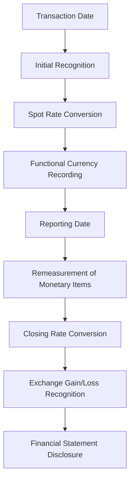

## 14.5 Foreign Currency Transactions

Foreign currency transactions are an integral part of global business operations, affecting companies that engage in cross-border trade, investments, or financing. Understanding how to account for these transactions is crucial for accurate financial reporting and compliance with Canadian accounting standards. In this section, we will delve into the recognition, measurement, and reporting of foreign currency transactions, focusing on the exchange rate effects and the relevant accounting standards applicable in Canada.

### Understanding Foreign Currency Transactions

Foreign currency transactions occur when a business entity engages in transactions denominated in a currency other than its functional currency. The functional currency is the currency of the primary economic environment in which the entity operates. Common examples of foreign currency transactions include:

- **Purchasing goods or services from a foreign supplier** and paying in the supplier's currency.
- **Selling goods or services to a foreign customer** and receiving payment in the customer's currency.
- **Borrowing or lending funds** in a foreign currency.
- **Investing in foreign subsidiaries or associates**.

### Exchange Rates and Their Impact

Exchange rates are the rates at which one currency can be exchanged for another. They fluctuate due to various economic factors, including interest rates, inflation, political stability, and market speculation. These fluctuations can significantly impact the financial statements of entities engaged in foreign currency transactions.

#### Types of Exchange Rates

1. **Spot Rate**: The current exchange rate at which currencies can be exchanged immediately.
2. **Forward Rate**: The agreed-upon exchange rate for a transaction that will occur at a future date.
3. **Average Rate**: The average of exchange rates over a specific period, often used for translating income statement items.

### Accounting for Foreign Currency Transactions

The accounting for foreign currency transactions involves several key steps, including initial recognition, subsequent measurement, and reporting of exchange rate differences. The International Financial Reporting Standards (IFRS) and Accounting Standards for Private Enterprises (ASPE) provide guidance on these processes.

#### Initial Recognition

At the initial recognition of a foreign currency transaction, the entity must record the transaction in its functional currency. The exchange rate used for this conversion is typically the spot rate on the transaction date. For example, if a Canadian company purchases inventory from a U.S. supplier for USD 10,000, and the spot rate on the transaction date is 1.25 CAD/USD, the transaction would be recorded as CAD 12,500 (USD 10,000 x 1.25).

#### Subsequent Measurement

After initial recognition, foreign currency monetary items (such as receivables, payables, and loans) must be remeasured at each reporting date using the closing rate (the spot rate at the reporting date). Non-monetary items (such as inventory and fixed assets) are generally not remeasured unless they are carried at fair value.

##### Example: Remeasurement of Receivables

Consider a Canadian company with a receivable of USD 10,000 from a foreign customer. If the closing rate at the reporting date is 1.30 CAD/USD, the receivable would be remeasured to CAD 13,000 (USD 10,000 x 1.30). The difference of CAD 500 (CAD 13,000 - CAD 12,500) is recognized as an exchange gain or loss in the income statement.

#### Reporting Exchange Rate Differences

Exchange rate differences arise from the settlement of foreign currency transactions and the remeasurement of monetary items. These differences are recognized in the income statement as either exchange gains or losses. It is essential to disclose the nature and amount of these differences in the financial statements to provide transparency to users.

### Practical Examples and Scenarios

#### Case Study: Importing Goods

A Canadian retailer imports electronics from Japan, agreeing to pay JPY 1,000,000. On the transaction date, the exchange rate is 0.012 CAD/JPY. The retailer records the purchase at CAD 12,000 (JPY 1,000,000 x 0.012). By the payment date, the rate changes to 0.011 CAD/JPY, resulting in a payment of CAD 11,000. The CAD 1,000 difference is recorded as an exchange gain.

#### Case Study: Foreign Currency Loan

A Canadian manufacturer takes a loan of EUR 100,000 from a European bank. At the loan date, the rate is 1.50 CAD/EUR, and the loan is recorded at CAD 150,000. At year-end, the rate is 1.55 CAD/EUR, and the loan is remeasured to CAD 155,000, recognizing a CAD 5,000 exchange loss.

### Regulatory Framework and Compliance

In Canada, foreign currency transactions are governed by IFRS for publicly accountable enterprises and ASPE for private enterprises. Key standards include:

- **IFRS 9: Financial Instruments**: Provides guidance on the classification and measurement of financial assets and liabilities, including those denominated in foreign currencies.
- **IAS 21: The Effects of Changes in Foreign Exchange Rates**: Addresses the accounting for foreign currency transactions and the translation of financial statements.
- **ASPE Section 1651: Foreign Currency Translation**: Offers guidance for private enterprises on translating foreign currency transactions and financial statements.

### Best Practices and Common Pitfalls

#### Best Practices

- **Consistent Application of Rates**: Use consistent exchange rates for similar transactions to ensure comparability.
- **Regular Monitoring**: Continuously monitor exchange rate fluctuations and their impact on financial statements.
- **Hedging Strategies**: Consider using hedging instruments to mitigate exchange rate risk.

#### Common Pitfalls

- **Incorrect Rate Application**: Applying the wrong exchange rate can lead to significant misstatements.
- **Ignoring Non-monetary Items**: Failing to recognize that non-monetary items are not remeasured unless carried at fair value.
- **Inadequate Disclosures**: Insufficient disclosure of exchange rate differences can mislead financial statement users.

### Real-World Applications

Foreign currency transactions are prevalent in various industries, including manufacturing, retail, and finance. Companies often engage in hedging activities to manage exchange rate risk, using instruments such as forward contracts, options, and swaps. Understanding these strategies is crucial for accountants and financial analysts.

### Step-by-Step Guidance

1. **Identify the Transaction**: Determine if the transaction involves a foreign currency.
2. **Determine the Functional Currency**: Identify the currency of the primary economic environment.
3. **Record Initial Transaction**: Use the spot rate on the transaction date to convert to the functional currency.
4. **Remeasure Monetary Items**: At each reporting date, remeasure monetary items using the closing rate.
5. **Recognize Exchange Differences**: Record exchange gains or losses in the income statement.
6. **Disclose Information**: Provide clear disclosures in the financial statements.

### Diagrams and Visuals

Below is a diagram illustrating the flow of accounting for foreign currency transactions:

### References to Canadian Accounting Standards

- **CPA Canada Handbook**: Provides comprehensive guidance on accounting standards applicable in Canada.
- **IFRS Foundation**: Offers detailed explanations of IFRS standards, including IAS 21.
- **CPA Canada**: A valuable resource for additional study materials and practice exams.

### Encouragement and Exam Preparation Tips

Understanding foreign currency transactions is vital for success in Canadian accounting exams. Focus on mastering the recognition and measurement principles, and practice with real-world scenarios. Use mnemonic devices to remember key concepts, and regularly review the relevant standards.

### Summary

Foreign currency transactions present unique challenges and opportunities in accounting. By understanding the principles of recognition, measurement, and reporting, you can ensure accurate financial reporting and compliance with Canadian standards. Stay informed about exchange rate fluctuations and consider hedging strategies to manage risk effectively.

## **Ready to Test Your Knowledge?**



### Which exchange rate is used for the initial recognition of a foreign currency transaction?

- [x] Spot rate on the transaction date
- [ ] Forward rate on the transaction date
- [ ] Average rate over the reporting period
- [ ] Closing rate at the reporting date

> **Explanation:** The spot rate on the transaction date is used for the initial recognition of a foreign currency transaction to convert it into the functional currency.

### What is the functional currency of an entity?

- [x] The currency of the primary economic environment in which the entity operates
- [ ] The currency in which the entity presents its financial statements
- [ ] The currency of the country where the entity is incorporated
- [ ] The currency of the entity's largest customer

> **Explanation:** The functional currency is the currency of the primary economic environment in which the entity operates, reflecting the currency that mainly influences sales prices and costs.

### How are exchange rate differences recognized in the financial statements?

- [x] As exchange gains or losses in the income statement
- [ ] As adjustments to retained earnings
- [ ] As other comprehensive income
- [ ] As deferred tax liabilities

> **Explanation:** Exchange rate differences are recognized as exchange gains or losses in the income statement, affecting the entity's net income.

### What is the closing rate?

- [x] The exchange rate at the reporting date
- [ ] The average exchange rate over the reporting period
- [ ] The exchange rate at the transaction date
- [ ] The forward exchange rate agreed upon for a future date

> **Explanation:** The closing rate is the exchange rate at the reporting date, used for remeasuring monetary items in foreign currency.

### Which of the following is a monetary item?

- [x] Accounts receivable
- [ ] Inventory
- [ ] Prepaid expenses
- [ ] Property, plant, and equipment

> **Explanation:** Accounts receivable is a monetary item because it represents a claim to receive a fixed or determinable amount of currency.

### What is the primary standard for foreign currency transactions under IFRS?

- [x] IAS 21
- [ ] IFRS 9
- [ ] IFRS 15
- [ ] IAS 16

> **Explanation:** IAS 21 is the primary standard for accounting for foreign currency transactions and the effects of changes in foreign exchange rates under IFRS.

### How should non-monetary items carried at fair value be measured?

- [x] Using the exchange rate at the date when the fair value was determined
- [ ] Using the spot rate at the transaction date
- [ ] Using the closing rate at the reporting date
- [ ] Using the average rate over the reporting period

> **Explanation:** Non-monetary items carried at fair value should be measured using the exchange rate at the date when the fair value was determined.

### What is a common hedging instrument used to manage exchange rate risk?

- [x] Forward contract
- [ ] Equity swap
- [ ] Commodity future
- [ ] Interest rate swap

> **Explanation:** A forward contract is a common hedging instrument used to lock in an exchange rate for a future transaction, managing exchange rate risk.

### Which exchange rate is typically used for translating income statement items?

- [x] Average rate over the reporting period
- [ ] Spot rate on the transaction date
- [ ] Forward rate on the transaction date
- [ ] Closing rate at the reporting date

> **Explanation:** The average rate over the reporting period is typically used for translating income statement items to reflect the exchange rates applicable throughout the period.

### True or False: Non-monetary items are always remeasured at the closing rate.

- [ ] True
- [x] False

> **Explanation:** False. Non-monetary items are not remeasured at the closing rate unless they are carried at fair value.


