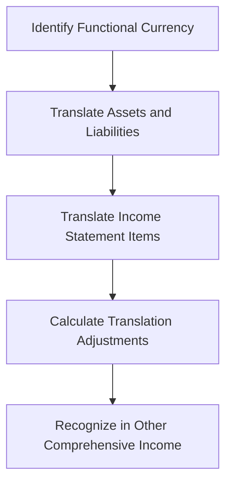

## 14.6 Translation of Foreign Financial Statements

In today's global economy, many companies operate across borders, maintaining subsidiaries in multiple countries. This international presence necessitates the translation of foreign subsidiaries' financial statements into the parent company's reporting currency. This process is crucial for accurate financial reporting and compliance with accounting standards. In this section, we will explore the methods and principles of translating foreign financial statements, focusing on Canadian accounting standards and international practices.

### Understanding the Need for Translation

When a Canadian company has subsidiaries in other countries, the financial statements of these foreign entities are often prepared in the local currency. To consolidate these statements with the parent company's financials, they must be translated into the reporting currency, typically Canadian dollars (CAD). This translation ensures that the financial statements reflect the economic reality of the company's global operations.

### Key Concepts and Terminology

Before diving into the translation methods, it's essential to understand some key concepts and terminology:

- **Functional Currency**: The currency of the primary economic environment in which an entity operates. It is the currency that mainly influences sales prices and costs.
- **Presentation Currency**: The currency in which financial statements are presented. For Canadian companies, this is usually the Canadian dollar.
- **Exchange Rate**: The rate at which one currency can be exchanged for another. It plays a critical role in translating foreign financial statements.
- **Translation Adjustments**: Differences arising from translating financial statements from one currency to another, often recognized in other comprehensive income.

### Translation Methods

The translation of foreign financial statements involves two primary methods: the Current Rate Method and the Temporal Method. Each method is applied based on the functional currency of the foreign entity.

#### Current Rate Method

The Current Rate Method is used when the foreign entity's functional currency is different from the parent company's reporting currency. This method involves translating all assets and liabilities at the current exchange rate at the balance sheet date. Income statement items are translated at the average exchange rate for the period.

**Steps for Current Rate Method:**

1. **Identify the Functional Currency**: Determine the functional currency of the foreign subsidiary.
2. **Translate Assets and Liabilities**: Use the exchange rate at the balance sheet date for all assets and liabilities.
3. **Translate Income Statement Items**: Use the average exchange rate for the period for all income and expense items.
4. **Calculate Translation Adjustments**: Recognize the translation adjustments in other comprehensive income.

**Example:**

Consider a Canadian parent company with a subsidiary in Europe. The subsidiary's functional currency is the Euro (EUR), and the reporting currency is CAD. At the end of the fiscal year, the exchange rate is 1 EUR = 1.5 CAD. The subsidiary's assets are 1,000,000 EUR, and liabilities are 500,000 EUR.

- Translate assets: 1,000,000 EUR × 1.5 CAD/EUR = 1,500,000 CAD
- Translate liabilities: 500,000 EUR × 1.5 CAD/EUR = 750,000 CAD

The translation adjustment is recognized in other comprehensive income.

#### Temporal Method

The Temporal Method is used when the foreign entity's functional currency is the same as the parent company's reporting currency. This method translates monetary items at the current exchange rate and non-monetary items at historical rates.

**Steps for Temporal Method:**

1. **Identify Monetary and Non-Monetary Items**: Classify items as monetary (e.g., cash, receivables) or non-monetary (e.g., inventory, fixed assets).
2. **Translate Monetary Items**: Use the current exchange rate for monetary items.
3. **Translate Non-Monetary Items**: Use historical exchange rates for non-monetary items.
4. **Translate Income Statement Items**: Use historical exchange rates for cost of goods sold and depreciation, and average rates for other items.

**Example:**

Consider a Canadian parent company with a subsidiary in the United States. The subsidiary's functional currency is CAD, and the reporting currency is also CAD. At the end of the fiscal year, the exchange rate is 1 USD = 1.3 CAD. The subsidiary's monetary assets are 200,000 USD, and non-monetary assets are 300,000 USD (historical rate 1 USD = 1.2 CAD).

- Translate monetary assets: 200,000 USD × 1.3 CAD/USD = 260,000 CAD
- Translate non-monetary assets: 300,000 USD × 1.2 CAD/USD = 360,000 CAD

### Regulatory Framework and Standards

In Canada, the translation of foreign financial statements is governed by the International Financial Reporting Standards (IFRS), specifically IAS 21, "The Effects of Changes in Foreign Exchange Rates." This standard outlines the principles for determining the functional currency and translating financial statements.

**Key Points of IAS 21:**

- **Functional Currency Determination**: The functional currency is determined based on the primary economic environment in which the entity operates.
- **Translation of Financial Statements**: The standard provides guidance on using the current rate and temporal methods for translation.
- **Recognition of Exchange Differences**: Exchange differences arising from translation are recognized in other comprehensive income.

### Practical Applications and Challenges

Translating foreign financial statements involves several practical challenges, including fluctuating exchange rates and determining the appropriate functional currency. Companies must also consider the impact of translation adjustments on financial ratios and performance metrics.

**Common Challenges:**

- **Exchange Rate Volatility**: Fluctuating exchange rates can significantly impact the translated financial statements, affecting reported earnings and financial ratios.
- **Functional Currency Assessment**: Determining the correct functional currency requires a thorough understanding of the subsidiary's economic environment.
- **Complexity in Consolidation**: Translating multiple foreign subsidiaries with different functional currencies adds complexity to the consolidation process.

### Best Practices and Strategies

To effectively manage the translation of foreign financial statements, companies can adopt several best practices and strategies:

- **Regular Review of Functional Currency**: Periodically review the functional currency of foreign subsidiaries to ensure it reflects the current economic environment.
- **Hedging Strategies**: Implement hedging strategies to mitigate the impact of exchange rate fluctuations on financial statements.
- **Comprehensive Disclosures**: Provide detailed disclosures on the translation process, exchange rates used, and the impact on financial statements.

### Case Study: Translation in Practice

Let's consider a case study of a Canadian multinational corporation, MapleTech Inc., which operates subsidiaries in Europe and Asia. The European subsidiary's functional currency is the Euro, while the Asian subsidiary uses the Japanese Yen.

**Scenario:**

- **European Subsidiary**: At the end of the fiscal year, the exchange rate is 1 EUR = 1.5 CAD. The subsidiary's assets are 2,000,000 EUR, and liabilities are 1,000,000 EUR.
- **Asian Subsidiary**: The exchange rate is 1 JPY = 0.012 CAD. The subsidiary's assets are 100,000,000 JPY, and liabilities are 50,000,000 JPY.

**Translation Process:**

1. **European Subsidiary**:
   - Translate assets: 2,000,000 EUR × 1.5 CAD/EUR = 3,000,000 CAD
   - Translate liabilities: 1,000,000 EUR × 1.5 CAD/EUR = 1,500,000 CAD

2. **Asian Subsidiary**:
   - Translate assets: 100,000,000 JPY × 0.012 CAD/JPY = 1,200,000 CAD
   - Translate liabilities: 50,000,000 JPY × 0.012 CAD/JPY = 600,000 CAD

**Outcome:**

MapleTech Inc. recognizes the translation adjustments in other comprehensive income, providing a clear picture of its global financial position.

### Diagrams and Visual Aids

To enhance understanding, let's use a diagram to illustrate the translation process using the Current Rate Method:

### Conclusion

The translation of foreign financial statements is a critical aspect of financial reporting for multinational corporations. By understanding the methods and principles outlined in this guide, you can effectively translate foreign subsidiaries' financial statements, ensuring compliance with Canadian accounting standards and providing accurate financial information to stakeholders.

### References and Further Reading

- **International Financial Reporting Standards (IFRS)**: Visit the IFRS Foundation website for the full text of IAS 21 and other relevant standards.
- **CPA Canada**: Explore resources and guidance on foreign currency translation and financial reporting.
- **Additional Study Materials**: Consider practice exams and online courses focusing on international accounting standards and currency translation.

## **Ready to Test Your Knowledge?**



### Which method is used when the foreign entity's functional currency is different from the parent company's reporting currency?

- [x] Current Rate Method
- [ ] Temporal Method
- [ ] Historical Cost Method
- [ ] Fair Value Method

> **Explanation:** The Current Rate Method is used when the foreign entity's functional currency is different from the parent company's reporting currency.

### What is the functional currency?

- [x] The currency of the primary economic environment in which an entity operates
- [ ] The currency in which financial statements are presented
- [ ] The currency used for all international transactions
- [ ] The currency of the parent company's country

> **Explanation:** The functional currency is the currency of the primary economic environment in which an entity operates.

### In the Current Rate Method, at what rate are income statement items translated?

- [x] Average exchange rate for the period
- [ ] Current exchange rate at the balance sheet date
- [ ] Historical exchange rate
- [ ] Spot exchange rate

> **Explanation:** Income statement items are translated at the average exchange rate for the period in the Current Rate Method.

### What is recognized in other comprehensive income during the translation process?

- [x] Translation adjustments
- [ ] Exchange rate differences
- [ ] Foreign currency gains
- [ ] Functional currency changes

> **Explanation:** Translation adjustments are recognized in other comprehensive income during the translation process.

### Which method is used when the foreign entity's functional currency is the same as the parent company's reporting currency?

- [x] Temporal Method
- [ ] Current Rate Method
- [ ] Historical Cost Method
- [ ] Fair Value Method

> **Explanation:** The Temporal Method is used when the foreign entity's functional currency is the same as the parent company's reporting currency.

### What is the primary challenge in translating foreign financial statements?

- [x] Exchange rate volatility
- [ ] Determining the presentation currency
- [ ] Calculating historical costs
- [ ] Reporting tax liabilities

> **Explanation:** Exchange rate volatility is a primary challenge in translating foreign financial statements.

### What is the purpose of hedging strategies in the context of currency translation?

- [x] To mitigate the impact of exchange rate fluctuations on financial statements
- [ ] To increase the value of foreign investments
- [ ] To eliminate all currency risks
- [ ] To enhance profitability

> **Explanation:** Hedging strategies are used to mitigate the impact of exchange rate fluctuations on financial statements.

### What is the role of IAS 21 in currency translation?

- [x] It provides guidance on determining the functional currency and translating financial statements
- [ ] It sets the exchange rates for translation
- [ ] It prescribes the presentation currency for all entities
- [ ] It eliminates the need for translation adjustments

> **Explanation:** IAS 21 provides guidance on determining the functional currency and translating financial statements.

### What is the impact of translation adjustments on financial statements?

- [x] They affect other comprehensive income
- [ ] They directly impact net income
- [ ] They change the functional currency
- [ ] They alter the presentation currency

> **Explanation:** Translation adjustments affect other comprehensive income.

### True or False: The Temporal Method uses the current exchange rate for all items.

- [ ] True
- [x] False

> **Explanation:** The Temporal Method uses the current exchange rate for monetary items and historical rates for non-monetary items.


