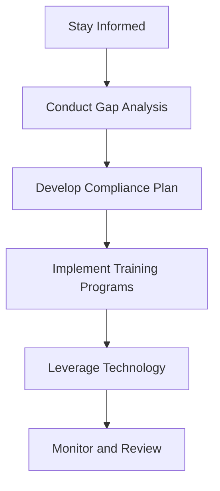

## 14.8 International Disclosures and Compliance

In the globalized business environment, understanding international disclosures and compliance is crucial for accountants, especially those preparing for Canadian accounting exams. This section provides a comprehensive overview of the disclosure requirements unique to international operations and the compliance obligations with foreign regulations. We will delve into the intricacies of International Financial Reporting Standards (IFRS), the differences between IFRS and Generally Accepted Accounting Principles (GAAP), and the compliance challenges faced by multinational corporations.

### Understanding International Disclosures

International disclosures refer to the financial information that companies must provide to comply with international accounting standards and regulations. These disclosures are essential for ensuring transparency and comparability across different jurisdictions. They help investors, regulators, and other stakeholders make informed decisions by providing a clear picture of a company's financial health and performance.

#### Key Disclosure Requirements

1. **Financial Statements**: Companies must prepare financial statements that include the balance sheet, income statement, statement of cash flows, and statement of changes in equity. These statements must be presented in accordance with IFRS or the applicable local GAAP.

2. **Notes to Financial Statements**: Detailed notes are required to explain the accounting policies, estimates, and judgments used in preparing the financial statements. These notes provide additional context and help users understand the financial data.

3. **Segment Reporting**: Companies with multiple business segments must disclose financial information for each segment, including revenue, profit or loss, and assets. This helps stakeholders assess the performance of different parts of the business.

4. **Related Party Transactions**: Disclosures about transactions with related parties, such as subsidiaries, associates, and key management personnel, are crucial for identifying potential conflicts of interest and ensuring transparency.

5. **Risk Management**: Companies must disclose their risk management strategies, including how they manage financial risks such as credit, liquidity, and market risks. This information is vital for assessing the company's risk exposure.

6. **Environmental and Social Disclosures**: Increasingly, companies are required to disclose information about their environmental and social impacts, including sustainability initiatives and corporate social responsibility (CSR) activities.

### Compliance with International Standards

Compliance with international accounting standards involves adhering to the rules and guidelines set by bodies like the International Accounting Standards Board (IASB) and the Financial Accounting Standards Board (FASB). These standards aim to harmonize accounting practices across different countries, facilitating cross-border trade and investment.

#### International Financial Reporting Standards (IFRS)

IFRS are a set of accounting standards developed by the IASB, which provide a global framework for financial reporting. They are designed to bring consistency, transparency, and comparability to financial statements.

- **IFRS Adoption**: Many countries have adopted IFRS, either fully or partially, as their national accounting standards. In Canada, IFRS is mandatory for publicly accountable enterprises, while private enterprises can choose between IFRS and Accounting Standards for Private Enterprises (ASPE).

- **IFRS vs. GAAP**: While IFRS and GAAP share many similarities, there are significant differences in areas such as revenue recognition, inventory valuation, and financial instruments. Accountants must understand these differences to ensure compliance and accurate financial reporting.

#### Compliance Challenges

1. **Cultural and Language Differences**: Multinational companies often face challenges related to cultural and language differences when implementing international accounting standards. These differences can affect the interpretation and application of accounting rules.

2. **Regulatory Variations**: Different countries have varying regulatory requirements, which can complicate compliance efforts. Companies must stay informed about changes in regulations and adapt their accounting practices accordingly.

3. **Technological Advancements**: The rapid pace of technological change presents both opportunities and challenges for compliance. Companies must leverage technology to streamline compliance processes while ensuring data security and integrity.

4. **Ethical Considerations**: Ethical issues, such as fraudulent financial reporting and misrepresentation of financial data, can undermine compliance efforts. Companies must foster a culture of integrity and accountability to mitigate these risks.

### Practical Examples and Case Studies

To illustrate the concepts discussed, let's explore some practical examples and case studies relevant to the Canadian accounting profession.

#### Case Study: Cross-Border Mergers and Acquisitions

In a cross-border merger, a Canadian company acquires a foreign entity. The company must comply with both Canadian and international accounting standards, ensuring that the financial statements reflect the combined entity's financial position accurately. This involves aligning accounting policies, consolidating financial statements, and addressing any differences in reporting requirements.

#### Example: Environmental Disclosures

A Canadian mining company operating in multiple countries must disclose its environmental impact and sustainability initiatives. This includes reporting on greenhouse gas emissions, waste management, and resource conservation efforts. These disclosures help stakeholders assess the company's commitment to environmental stewardship and compliance with international environmental regulations.

### Step-by-Step Guidance for Compliance

To ensure compliance with international disclosures, accountants can follow these steps:

1. **Stay Informed**: Keep up-to-date with changes in international accounting standards and regulations. Subscribe to updates from the IASB, FASB, and other relevant bodies.

2. **Conduct a Gap Analysis**: Identify any gaps between current accounting practices and the requirements of international standards. This analysis helps prioritize areas for improvement.

3. **Develop a Compliance Plan**: Create a detailed plan outlining the steps needed to achieve compliance. This plan should include timelines, responsibilities, and resources required.

4. **Implement Training Programs**: Provide training for accounting staff to ensure they understand the requirements of international standards and can apply them effectively.

5. **Leverage Technology**: Use accounting software and tools to automate compliance processes and ensure accuracy in financial reporting.

6. **Monitor and Review**: Regularly review compliance efforts and make adjustments as needed. This includes conducting internal audits and seeking external assurance where necessary.

### Diagrams and Visuals

To enhance understanding, let's use a Mermaid.js diagram to illustrate the flow of international disclosures and compliance processes.

### Best Practices and Common Pitfalls

#### Best Practices

- **Engage with Stakeholders**: Involve key stakeholders, including management, auditors, and regulators, in the compliance process to ensure alignment and support.

- **Focus on Materiality**: Prioritize disclosures that are material to stakeholders and provide meaningful insights into the company's financial performance and risks.

- **Enhance Transparency**: Strive for transparency in financial reporting by providing clear and comprehensive disclosures that go beyond the minimum requirements.

#### Common Pitfalls

- **Overlooking Local Regulations**: Failing to consider local regulatory requirements can lead to compliance issues and potential penalties.

- **Inadequate Documentation**: Poor documentation of accounting policies and judgments can undermine the credibility of financial statements and disclosures.

- **Resistance to Change**: Resistance from employees and management can hinder the implementation of new accounting standards and compliance processes.

### References and Additional Resources

For further exploration of international disclosures and compliance, consider the following resources:

- **International Financial Reporting Standards (IFRS) Foundation**: [www.ifrs.org](https://www.ifrs.org)
- **CPA Canada**: [www.cpacanada.ca](https://www.cpacanada.ca)
- **Financial Accounting Standards Board (FASB)**: [www.fasb.org](https://www.fasb.org)
- **International Federation of Accountants (IFAC)**: [www.ifac.org](https://www.ifac.org)

### Summary

International disclosures and compliance are critical components of financial reporting in today's globalized economy. By understanding the requirements of international accounting standards and implementing best practices, accountants can ensure transparency, comparability, and credibility in financial reporting. This section has provided a comprehensive overview of the key concepts, challenges, and strategies for achieving compliance, equipping you with the knowledge and tools needed to excel in your accounting exams and professional practice.

## **Ready to Test Your Knowledge?**



### Which of the following is a key disclosure requirement for international financial reporting?

- [x] Segment Reporting
- [ ] Inventory Valuation
- [ ] Cost of Goods Sold
- [ ] Marketing Expenses

> **Explanation:** Segment reporting is a key disclosure requirement, providing financial information for different business segments.

### What is the primary purpose of international disclosures in financial reporting?

- [x] To ensure transparency and comparability
- [ ] To increase company profits
- [ ] To reduce tax liabilities
- [ ] To enhance marketing strategies

> **Explanation:** International disclosures aim to ensure transparency and comparability across different jurisdictions.

### Which standard is developed by the International Accounting Standards Board (IASB)?

- [x] IFRS
- [ ] GAAP
- [ ] ASPE
- [ ] SOX

> **Explanation:** The International Financial Reporting Standards (IFRS) are developed by the IASB.

### What is a common challenge in complying with international accounting standards?

- [x] Cultural and language differences
- [ ] Increased marketing costs
- [ ] Reduced employee turnover
- [ ] Lower production costs

> **Explanation:** Cultural and language differences can affect the interpretation and application of international accounting standards.

### Which of the following is a best practice for ensuring compliance with international standards?

- [x] Engaging with stakeholders
- [ ] Reducing financial disclosures
- [ ] Ignoring local regulations
- [ ] Prioritizing marketing strategies

> **Explanation:** Engaging with stakeholders ensures alignment and support for compliance efforts.

### What is the role of technology in international compliance?

- [x] To automate compliance processes
- [ ] To increase manual data entry
- [ ] To reduce the need for audits
- [ ] To enhance marketing efforts

> **Explanation:** Technology is used to automate compliance processes and ensure accuracy in financial reporting.

### Which organization provides updates on international accounting standards?

- [x] IFRS Foundation
- [ ] World Trade Organization
- [ ] International Monetary Fund
- [ ] United Nations

> **Explanation:** The IFRS Foundation provides updates on international accounting standards.

### What is the significance of related party transaction disclosures?

- [x] To identify potential conflicts of interest
- [ ] To increase company profits
- [ ] To reduce tax liabilities
- [ ] To enhance marketing strategies

> **Explanation:** Related party transaction disclosures help identify potential conflicts of interest and ensure transparency.

### Which of the following is a common pitfall in international compliance?

- [x] Overlooking local regulations
- [ ] Enhancing transparency
- [ ] Engaging with stakeholders
- [ ] Focusing on materiality

> **Explanation:** Overlooking local regulations can lead to compliance issues and potential penalties.

### True or False: IFRS is mandatory for all Canadian enterprises.

- [ ] True
- [x] False

> **Explanation:** IFRS is mandatory for publicly accountable enterprises in Canada, while private enterprises can choose between IFRS and ASPE.


