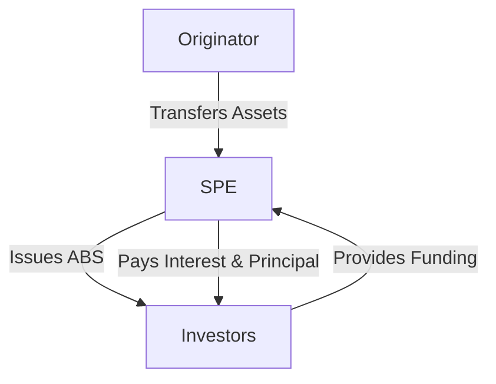

## 15.11 Asset-backed Securities

Asset-backed securities (ABS) are a class of financial instruments that are backed by a pool of underlying assets, typically loans or receivables. These securities are a vital part of the financial markets, offering liquidity and investment opportunities while posing unique accounting challenges. This section provides an in-depth exploration of ABS, focusing on their recognition, measurement, and reporting in accordance with Canadian accounting standards. We will also cover practical examples, regulatory considerations, and exam-focused insights to help you master this topic for the Canadian Accounting Exams.

### Understanding Asset-backed Securities

Asset-backed securities are created by pooling various types of financial assets, such as mortgages, credit card receivables, or auto loans, and issuing securities backed by these assets. The cash flows from the underlying assets are used to pay interest and principal to the holders of the securities.

#### Key Characteristics of ABS

- **Underlying Assets:** Typically consist of loans or receivables that generate predictable cash flows.
- **Tranching:** ABS are often divided into tranches with varying levels of risk and return, catering to different investor preferences.
- **Credit Enhancement:** Techniques such as over-collateralization or insurance are used to improve the credit quality of the securities.
- **Special Purpose Entities (SPEs):** ABS are usually issued by SPEs, which are structured to isolate the assets from the originator's balance sheet.

### Accounting for Asset-backed Securities

Accounting for ABS involves recognizing and measuring the securities on the balance sheet, as well as reporting their impact on financial statements. The accounting treatment depends on whether the entity is the issuer or the investor in the ABS.

#### Recognition and Measurement

1. **Initial Recognition:**
   - **Issuer's Perspective:** When an entity issues ABS, it must determine whether the transaction qualifies as a sale or a secured borrowing. This decision affects whether the assets are derecognized from the balance sheet.
   - **Investor's Perspective:** Investors recognize ABS as financial assets at fair value, typically at the purchase price.

2. **Subsequent Measurement:**
   - **Fair Value through Profit or Loss (FVTPL):** ABS may be measured at fair value, with changes in value recognized in profit or loss.
   - **Amortized Cost:** If the ABS meet certain criteria, they may be measured at amortized cost, recognizing interest income using the effective interest method.

#### Derecognition of Financial Assets

For the issuer, derecognition of the underlying assets occurs when the entity transfers substantially all the risks and rewards of ownership. This is a critical consideration in determining whether the ABS issuance is accounted for as a sale.

- **IFRS 9 Financial Instruments:** Provides guidance on derecognition, emphasizing the transfer of risks and rewards.
- **ASPE Section 3856:** Offers similar guidance for private enterprises in Canada.

### Practical Examples and Case Studies

To illustrate the accounting for ABS, consider the following examples:

#### Example 1: Mortgage-backed Securities (MBS)

A bank originates a pool of residential mortgages and transfers them to an SPE, which issues MBS to investors. The bank must assess whether it has transferred the risks and rewards of the mortgages. If the transfer qualifies as a sale, the bank derecognizes the mortgages and recognizes any gain or loss on the sale.

#### Example 2: Auto Loan-backed Securities

An auto finance company pools its auto loans and issues ABS. The company retains a residual interest in the cash flows. The accounting treatment depends on the extent of risk retention. If the company retains significant risks, the transaction may be accounted for as a secured borrowing.

### Regulatory Considerations

Accounting for ABS is subject to various regulatory frameworks, including:

- **Canadian Securities Administrators (CSA):** Provides guidelines on disclosure requirements for ABS issuers.
- **Office of the Superintendent of Financial Institutions (OSFI):** Oversees the prudential regulation of financial institutions involved in ABS transactions.

### Exam-focused Insights

When preparing for the Canadian Accounting Exams, focus on the following key areas:

- **Recognition and Measurement:** Understand the criteria for recognizing and measuring ABS, including the impact of IFRS 9 and ASPE Section 3856.
- **Derecognition Criteria:** Be able to assess whether a transfer of financial assets qualifies for derecognition.
- **Tranching and Credit Enhancement:** Familiarize yourself with the concepts of tranching and credit enhancement, as these are often tested in exam scenarios.

### Real-world Applications

In practice, ABS are used by financial institutions to manage risk and liquidity. They provide investors with access to diversified pools of assets and can be tailored to meet specific investment objectives.

#### Case Study: Canadian Mortgage-backed Securities Market

The Canadian MBS market is a significant component of the country's financial system. MBS are issued by the Canada Mortgage and Housing Corporation (CMHC) and are backed by government-insured mortgages. This provides a high level of credit quality and attracts a wide range of investors.

### Challenges and Best Practices

Accounting for ABS presents several challenges, including:

- **Complexity of Transactions:** ABS transactions can be complex, involving multiple parties and legal structures.
- **Valuation of Underlying Assets:** Accurate valuation of the underlying assets is crucial for fair value measurement.
- **Regulatory Compliance:** Ensuring compliance with evolving regulatory requirements is essential for issuers and investors.

To address these challenges, consider the following best practices:

- **Thorough Documentation:** Maintain detailed documentation of ABS transactions, including risk assessments and valuation methodologies.
- **Regular Monitoring:** Continuously monitor the performance of the underlying assets and adjust valuations as necessary.
- **Collaboration with Experts:** Engage with legal, tax, and accounting experts to navigate the complexities of ABS transactions.

### Diagrams and Visuals

To enhance your understanding of ABS, consider the following diagram illustrating the structure of an ABS transaction:

This diagram shows the flow of assets and cash between the originator, the SPE, and the investors.

### Summary

Asset-backed securities are a crucial component of modern financial markets, offering benefits such as liquidity and risk diversification. Accounting for ABS requires a thorough understanding of recognition, measurement, and derecognition principles, as well as compliance with relevant regulatory frameworks. By mastering these concepts, you will be well-prepared for the Canadian Accounting Exams and equipped to handle ABS transactions in your professional career.

### References

- **IFRS 9 Financial Instruments:** International Financial Reporting Standards as adopted in Canada.
- **ASPE Section 3856:** Accounting Standards for Private Enterprises in Canada.
- **CPA Canada:** Chartered Professional Accountants of Canada resources and guidelines.

## **Ready to Test Your Knowledge?**



### What are asset-backed securities (ABS)?

- [x] Financial instruments backed by a pool of underlying assets
- [ ] Securities issued by government entities
- [ ] Shares of publicly traded companies
- [ ] Bonds issued by corporations

> **Explanation:** Asset-backed securities are financial instruments backed by a pool of underlying assets, such as loans or receivables.

### Which of the following is a key characteristic of ABS?

- [x] Tranching
- [ ] Common stock issuance
- [ ] Dividend payments
- [ ] Government guarantees

> **Explanation:** Tranching is a key characteristic of ABS, where the securities are divided into different levels of risk and return.

### What is the primary purpose of credit enhancement in ABS?

- [x] To improve the credit quality of the securities
- [ ] To increase the interest rate on the securities
- [ ] To reduce the number of tranches
- [ ] To eliminate all risks associated with the securities

> **Explanation:** Credit enhancement techniques are used to improve the credit quality of ABS, making them more attractive to investors.

### How are ABS typically measured on the balance sheet?

- [x] At fair value or amortized cost
- [ ] At historical cost
- [ ] At replacement cost
- [ ] At liquidation value

> **Explanation:** ABS can be measured at fair value or amortized cost, depending on the criteria they meet.

### What determines whether an ABS issuance is accounted for as a sale or a secured borrowing?

- [x] The transfer of risks and rewards
- [ ] The interest rate on the securities
- [ ] The number of investors
- [ ] The type of underlying assets

> **Explanation:** The transfer of risks and rewards determines whether an ABS issuance is accounted for as a sale or a secured borrowing.

### Which regulatory body provides guidelines on disclosure requirements for ABS issuers in Canada?

- [x] Canadian Securities Administrators (CSA)
- [ ] Financial Accounting Standards Board (FASB)
- [ ] International Accounting Standards Board (IASB)
- [ ] Bank of Canada

> **Explanation:** The Canadian Securities Administrators (CSA) provides guidelines on disclosure requirements for ABS issuers in Canada.

### What is the role of a Special Purpose Entity (SPE) in an ABS transaction?

- [x] To isolate the assets from the originator's balance sheet
- [ ] To issue government-backed securities
- [ ] To manage investor relations
- [ ] To determine interest rates

> **Explanation:** A Special Purpose Entity (SPE) is used in ABS transactions to isolate the assets from the originator's balance sheet.

### Which accounting standard provides guidance on derecognition of financial assets for ABS?

- [x] IFRS 9 Financial Instruments
- [ ] ASPE Section 1000
- [ ] IAS 16 Property, Plant, and Equipment
- [ ] IFRS 15 Revenue from Contracts with Customers

> **Explanation:** IFRS 9 Financial Instruments provides guidance on the derecognition of financial assets, including those involved in ABS transactions.

### What is a common challenge in accounting for ABS?

- [x] Complexity of transactions
- [ ] Simplicity of valuation
- [ ] Lack of regulatory oversight
- [ ] Uniformity of asset types

> **Explanation:** The complexity of transactions is a common challenge in accounting for ABS, requiring careful analysis and documentation.

### True or False: Asset-backed securities are only used in the mortgage industry.

- [ ] True
- [x] False

> **Explanation:** Asset-backed securities are used in various industries, not just the mortgage industry, including auto loans, credit card receivables, and more.


