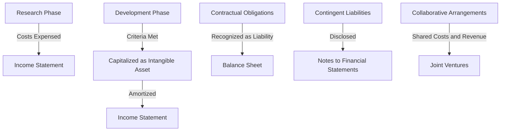

## 15.15 Biotechnology and R&D Arrangements

Biotechnology is a rapidly evolving field that heavily relies on research and development (R&D) to drive innovation and growth. Accounting for R&D activities in the biotechnology sector presents unique challenges due to the high degree of uncertainty, long development timelines, and significant financial investments involved. This section delves into the accounting principles and standards applicable to R&D arrangements in biotechnology, with a focus on Canadian accounting standards, including IFRS and ASPE.

### Understanding R&D in Biotechnology

Research and development in biotechnology involve activities aimed at discovering new knowledge, developing new products, and improving existing products or processes. These activities are crucial for the advancement of medical, agricultural, and environmental applications. The accounting treatment of R&D expenditures can significantly impact a company's financial statements and investor perceptions.

#### Key Characteristics of Biotechnology R&D

1. **High Uncertainty:** The outcome of R&D activities is often uncertain, with no guarantee of commercial success.
2. **Long Development Cycles:** Biotechnology projects can take years or even decades to progress from research to marketable products.
3. **Significant Costs:** R&D activities require substantial financial investments in personnel, equipment, and materials.
4. **Regulatory Hurdles:** Compliance with regulatory standards is essential, adding complexity to the R&D process.

### Accounting Standards for R&D

In Canada, the accounting treatment for R&D activities is guided by International Financial Reporting Standards (IFRS) and Accounting Standards for Private Enterprises (ASPE). Understanding these standards is crucial for accurately reporting R&D expenditures and liabilities.

#### IFRS Guidelines

Under IFRS, particularly IAS 38 "Intangible Assets," R&D expenditures are classified into two phases: research and development.

- **Research Phase:** Costs incurred during the research phase are expensed as incurred. This phase involves activities aimed at obtaining new knowledge without certainty of future economic benefits.
  
- **Development Phase:** Costs incurred during the development phase can be capitalized if certain criteria are met. These criteria include technical feasibility, intention to complete, ability to use or sell, probable future economic benefits, availability of resources, and reliable measurement of costs.

#### ASPE Guidelines

For private enterprises in Canada, ASPE Section 3064 "Goodwill and Intangible Assets" provides guidance on R&D accounting. Similar to IFRS, ASPE distinguishes between research and development phases, with research costs expensed and development costs potentially capitalized if criteria are met.

### Recognition and Measurement of R&D Liabilities

Accounting for R&D liabilities involves recognizing and measuring obligations arising from R&D activities. These liabilities can include contractual obligations, contingent liabilities, and obligations related to collaborative arrangements.

#### Contractual Obligations

Biotechnology companies often enter into contracts with third parties for R&D services, resulting in contractual obligations. These obligations should be recognized as liabilities when the company has a present obligation as a result of past events, and it is probable that an outflow of resources will be required to settle the obligation.

#### Contingent Liabilities

Contingent liabilities arise from uncertain events that may result in future obligations. In biotechnology, these can include potential litigation related to patent infringements or regulatory non-compliance. Contingent liabilities should be disclosed in the financial statements if the likelihood of an outflow of resources is not remote.

#### Collaborative Arrangements

Collaborative arrangements are common in biotechnology, where companies partner with other entities to share R&D costs and risks. The accounting treatment for these arrangements depends on the specific terms and conditions, including revenue sharing, cost-sharing, and profit-sharing agreements.

### Practical Examples and Case Studies

To illustrate the application of accounting standards to biotechnology R&D, consider the following examples:

#### Example 1: Capitalizing Development Costs

A biotechnology company is developing a new drug. During the development phase, the company incurs costs related to clinical trials, regulatory approvals, and manufacturing scale-up. The company assesses whether these costs meet the criteria for capitalization under IAS 38. Upon meeting the criteria, the company capitalizes the costs as an intangible asset, amortizing them over the drug's useful life once it receives regulatory approval.

#### Example 2: Recognizing Contractual Obligations

A biotechnology firm enters into a contract with a research institution to conduct preclinical studies. The contract specifies milestone payments based on the achievement of certain research outcomes. The firm recognizes a liability for the milestone payments as the research progresses and the likelihood of achieving the milestones increases.

### Regulatory Considerations

Biotechnology companies must navigate a complex regulatory environment, which impacts the accounting treatment of R&D activities. Key regulatory considerations include:

- **Intellectual Property (IP) Rights:** Accounting for IP rights, such as patents and licenses, involves recognizing and measuring intangible assets and related liabilities.
- **Government Grants and Incentives:** Companies may receive government grants or tax incentives for R&D activities. These should be accounted for in accordance with IAS 20 "Accounting for Government Grants and Disclosure of Government Assistance" or ASPE Section 3800 "Government Assistance."

### Challenges and Best Practices

Accounting for R&D in biotechnology presents several challenges, including:

- **Uncertainty in Measurement:** Estimating the future economic benefits of R&D activities can be challenging due to the inherent uncertainty in biotechnology projects.
- **Complex Collaborative Arrangements:** The complexity of collaborative arrangements requires careful consideration of the terms and conditions to determine the appropriate accounting treatment.

To address these challenges, companies should adopt best practices such as:

- **Robust Documentation:** Maintain comprehensive documentation of R&D activities, including project plans, budgets, and progress reports.
- **Regular Review and Assessment:** Regularly review and assess the criteria for capitalizing development costs to ensure compliance with accounting standards.
- **Collaboration with Experts:** Engage with accounting and legal experts to navigate complex regulatory requirements and collaborative arrangements.

### Real-World Applications

In practice, biotechnology companies must apply accounting principles to real-world scenarios, considering factors such as:

- **Joint Ventures and Alliances:** Collaborations with other companies or research institutions can impact the recognition and measurement of R&D liabilities and equity.
- **Licensing Agreements:** Licensing agreements for technology or products may involve upfront payments, royalties, and milestone payments, requiring careful accounting treatment.

### Diagrams and Visual Aids

To enhance understanding, consider the following diagram illustrating the flow of R&D activities and related accounting treatments:

### Summary and Key Takeaways

Accounting for R&D in biotechnology requires a thorough understanding of applicable accounting standards and regulatory requirements. Key takeaways include:

- **Distinguish between research and development phases to determine the appropriate accounting treatment for R&D costs.**
- **Recognize and measure R&D liabilities, including contractual obligations and contingent liabilities, in accordance with accounting standards.**
- **Consider the impact of collaborative arrangements and regulatory requirements on the accounting treatment of R&D activities.**

### Exam Preparation Tips

To prepare for questions related to biotechnology and R&D arrangements on the Canadian Accounting Exams, consider the following tips:

- **Familiarize yourself with IFRS and ASPE standards related to R&D accounting, focusing on IAS 38 and ASPE Section 3064.**
- **Practice applying the criteria for capitalizing development costs through sample scenarios and case studies.**
- **Review examples of contractual obligations and contingent liabilities in the biotechnology sector to understand their recognition and measurement.**

### Additional Resources

For further exploration of biotechnology and R&D accounting, consider the following resources:

- **CPA Canada Handbook:** Provides comprehensive guidance on Canadian accounting standards, including IFRS and ASPE.
- **International Financial Reporting Standards (IFRS):** Access the full text of IFRS standards, including IAS 38, for detailed guidance on intangible assets.
- **Accounting Standards for Private Enterprises (ASPE):** Review ASPE Section 3064 for guidance on accounting for goodwill and intangible assets.

## **Ready to Test Your Knowledge?**



### Which phase of R&D costs can be capitalized under IFRS?

- [ ] Research Phase
- [x] Development Phase
- [ ] Both Research and Development Phases
- [ ] Neither Phase

> **Explanation:** Under IFRS, only costs incurred during the development phase can be capitalized if certain criteria are met. Research phase costs are expensed as incurred.

### What is a key characteristic of biotechnology R&D?

- [x] High Uncertainty
- [ ] Short Development Cycles
- [ ] Low Costs
- [ ] Minimal Regulatory Requirements

> **Explanation:** Biotechnology R&D is characterized by high uncertainty, long development cycles, significant costs, and complex regulatory requirements.

### Under ASPE, which section provides guidance on R&D accounting?

- [ ] Section 3400
- [x] Section 3064
- [ ] Section 3856
- [ ] Section 3280

> **Explanation:** ASPE Section 3064 provides guidance on accounting for goodwill and intangible assets, including R&D activities.

### What should be done with contingent liabilities in biotechnology?

- [ ] Recognize them as liabilities
- [ ] Ignore them
- [x] Disclose them in the financial statements
- [ ] Capitalize them

> **Explanation:** Contingent liabilities should be disclosed in the financial statements if the likelihood of an outflow of resources is not remote.

### Which accounting standard addresses government grants for R&D?

- [x] IAS 20
- [ ] IAS 38
- [ ] IFRS 15
- [ ] IFRS 9

> **Explanation:** IAS 20 "Accounting for Government Grants and Disclosure of Government Assistance" provides guidance on accounting for government grants related to R&D.

### What is a common challenge in accounting for R&D in biotechnology?

- [ ] Simple Measurement
- [x] Uncertainty in Measurement
- [ ] Lack of Documentation
- [ ] Short Development Timelines

> **Explanation:** Estimating the future economic benefits of R&D activities is challenging due to the inherent uncertainty in biotechnology projects.

### Which of the following is a best practice for R&D accounting?

- [x] Robust Documentation
- [ ] Ignoring Collaborative Arrangements
- [ ] Expensing All Costs
- [ ] Avoiding Expert Consultation

> **Explanation:** Maintaining comprehensive documentation of R&D activities is a best practice to ensure compliance with accounting standards.

### How are milestone payments in R&D contracts recognized?

- [ ] As Revenue
- [x] As Liabilities
- [ ] As Expenses
- [ ] As Equity

> **Explanation:** Milestone payments in R&D contracts are recognized as liabilities as the research progresses and the likelihood of achieving the milestones increases.

### What is the impact of collaborative arrangements on R&D accounting?

- [ ] No Impact
- [x] Shared Costs and Revenue
- [ ] Increased Liabilities Only
- [ ] Reduced Regulatory Requirements

> **Explanation:** Collaborative arrangements involve shared costs and revenue, impacting the recognition and measurement of R&D liabilities and equity.

### True or False: All R&D costs in biotechnology are capitalized.

- [ ] True
- [x] False

> **Explanation:** Not all R&D costs are capitalized. Research phase costs are expensed, while development phase costs can be capitalized if criteria are met.


