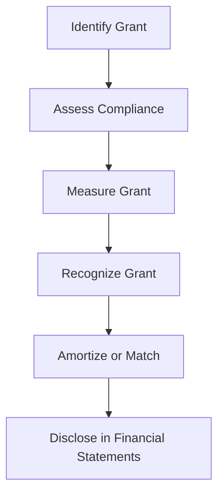

## 15.4 Accounting for Government Grants

Government grants play a crucial role in the financial landscape of many organizations, providing essential funding to support various initiatives, from research and development to environmental sustainability projects. Understanding how to account for these grants is vital for accurate financial reporting and compliance with Canadian accounting standards. This section delves into the recognition, measurement, and reporting of government grants, offering practical insights and examples relevant to Canadian accounting professionals and exam candidates.

### Understanding Government Grants

Government grants are financial awards provided by government bodies to support specific activities or projects. These grants can take various forms, including direct financial assistance, tax incentives, or non-monetary assets. The primary objective of government grants is to encourage behaviors or activities that align with public policy goals, such as innovation, employment, or environmental conservation.

#### Types of Government Grants

1. **Capital Grants:** These are provided for the acquisition or construction of long-term assets, such as buildings or equipment.
2. **Revenue Grants:** These support ongoing operational expenses, such as salaries or research costs.
3. **Tax Incentives:** These reduce the tax liability of an organization, effectively acting as a financial grant.
4. **Non-monetary Grants:** These include assets or services provided at no cost or at a reduced rate.

### Recognition and Measurement of Government Grants

The recognition and measurement of government grants in financial statements are governed by specific accounting standards. In Canada, the International Financial Reporting Standards (IFRS) and Accounting Standards for Private Enterprises (ASPE) provide guidance on how to account for these grants.

#### IFRS Guidelines

Under IFRS, specifically IAS 20 "Accounting for Government Grants and Disclosure of Government Assistance," grants are recognized when there is reasonable assurance that:

1. The entity will comply with the conditions attached to the grant.
2. The grant will be received.

##### Recognition of Government Grants

- **Capital Grants:** Recognized as deferred income and amortized over the useful life of the asset.
- **Revenue Grants:** Recognized as income over the periods necessary to match them with the related costs they are intended to compensate.

##### Measurement of Government Grants

- **Monetary Grants:** Measured at the fair value of the amount received or receivable.
- **Non-monetary Grants:** Measured at fair value or at a nominal amount if fair value cannot be determined.

#### ASPE Guidelines

Under ASPE, Section 3800 "Government Assistance," grants are recognized when there is reasonable assurance that the entity has complied and will continue to comply with the conditions of the grant.

##### Recognition of Government Grants

- **Capital Grants:** Recognized as a reduction of the cost of the asset.
- **Revenue Grants:** Recognized as income in the period in which the related expenses are incurred.

##### Measurement of Government Grants

- **Monetary Grants:** Measured at the amount receivable.
- **Non-monetary Grants:** Measured at fair value or at a nominal amount.

### Practical Examples and Case Studies

#### Example 1: Capital Grant for Equipment Purchase

A Canadian manufacturing company receives a government grant of $500,000 to purchase new machinery. Under IFRS, the grant is recognized as deferred income and amortized over the machinery's useful life. Under ASPE, the grant reduces the cost of the machinery on the balance sheet.

#### Example 2: Revenue Grant for Research and Development

A technology startup receives a $200,000 grant to support its R&D activities. The grant is recognized as income over the period in which the R&D expenses are incurred, aligning the grant with the costs it is intended to offset.

#### Case Study: Non-monetary Grant

A non-profit organization receives a government grant in the form of free office space for three years. The fair value of the rent is $30,000 per year. The organization recognizes the fair value of the rent as income and an equivalent expense each year.

### Real-world Applications and Regulatory Scenarios

Government grants are subject to various regulatory considerations, including compliance with grant conditions and accurate financial reporting. Organizations must ensure they meet all conditions attached to the grants to avoid repayment or penalties.

#### Compliance and Reporting

- **Documentation:** Maintain thorough records of grant agreements, conditions, and compliance efforts.
- **Audit Requirements:** Be prepared for audits by government bodies to verify compliance with grant conditions.
- **Disclosure:** Provide clear disclosures in financial statements about the nature and impact of government grants.

### Step-by-step Guidance for Accounting Procedures

1. **Identify the Grant:** Determine the type of grant and the conditions attached.
2. **Assess Compliance:** Ensure there is reasonable assurance that the conditions will be met.
3. **Measure the Grant:** Determine the fair value or nominal amount of the grant.
4. **Recognize the Grant:** Record the grant in the financial statements according to the relevant accounting standards.
5. **Amortize or Match:** Amortize capital grants over the asset's useful life or match revenue grants with related expenses.

### Diagrams and Visuals

Below is a diagram illustrating the process of recognizing and measuring government grants under IFRS and ASPE:

### Best Practices and Common Pitfalls

#### Best Practices

- **Maintain Accurate Records:** Keep detailed documentation of all grant-related activities and compliance efforts.
- **Regularly Review Conditions:** Continuously monitor compliance with grant conditions to avoid penalties.
- **Engage with Auditors:** Work closely with auditors to ensure accurate reporting and compliance.

#### Common Pitfalls

- **Failure to Meet Conditions:** Not meeting grant conditions can lead to repayment obligations.
- **Inaccurate Measurement:** Incorrectly measuring the fair value of non-monetary grants can lead to financial misstatements.
- **Inadequate Disclosure:** Failing to disclose the nature and impact of grants can result in non-compliance with accounting standards.

### References to Canadian Accounting Standards

- **IFRS:** Refer to IAS 20 for detailed guidance on accounting for government grants.
- **ASPE:** Consult Section 3800 for guidance specific to private enterprises in Canada.
- **CPA Canada:** Utilize resources from CPA Canada for additional insights and examples.

### Encouragement for Practical Application

To reinforce your understanding of accounting for government grants, consider working through practice problems and scenarios. Prepare journal entries for different types of grants, and analyze the impact on financial statements. This hands-on practice will enhance your comprehension and prepare you for exam questions on this topic.

### Summary and Key Points

- Government grants are financial awards from government bodies to support specific activities.
- Recognition and measurement of grants are governed by IFRS and ASPE in Canada.
- Capital grants are amortized or reduce asset costs, while revenue grants match related expenses.
- Accurate measurement, compliance, and disclosure are crucial for proper accounting.
- Practical examples and case studies illustrate the application of accounting standards.

### Sample Exam-style Questions

To test your knowledge and prepare for the Canadian Accounting Exams, try answering the following questions:

## **Ready to Test Your Knowledge?**



### What is the primary objective of government grants?

- [x] To encourage behaviors or activities that align with public policy goals
- [ ] To increase government revenue
- [ ] To reduce government expenses
- [ ] To control private sector activities

> **Explanation:** Government grants aim to support activities that align with public policy goals, such as innovation or environmental conservation.

### Under IFRS, when is a government grant recognized?

- [x] When there is reasonable assurance that the entity will comply with the conditions and the grant will be received
- [ ] When the grant is announced by the government
- [ ] When the grant is received
- [ ] When the related expenses are incurred

> **Explanation:** IFRS requires reasonable assurance of compliance and receipt before recognizing a grant.

### How are capital grants recognized under ASPE?

- [x] As a reduction of the cost of the asset
- [ ] As deferred income
- [ ] As revenue
- [ ] As a liability

> **Explanation:** ASPE recognizes capital grants as a reduction of the asset's cost on the balance sheet.

### What is a common pitfall in accounting for government grants?

- [x] Failure to meet grant conditions
- [ ] Overestimating grant value
- [ ] Underestimating grant value
- [ ] Delayed grant application

> **Explanation:** Not meeting grant conditions can lead to repayment obligations and financial misstatements.

### Which of the following is a type of government grant?

- [x] Capital grants
- [x] Revenue grants
- [ ] Equity grants
- [ ] Loan guarantees

> **Explanation:** Capital and revenue grants are common types of government grants, while equity grants and loan guarantees are not.

### What is the fair value measurement of non-monetary grants?

- [x] The estimated market value of the asset or service provided
- [ ] The nominal amount
- [ ] The historical cost
- [ ] The book value

> **Explanation:** Non-monetary grants are measured at their estimated market value or fair value.

### How should revenue grants be recognized?

- [x] As income over the periods necessary to match them with the related costs
- [ ] As deferred income
- [ ] As a liability
- [ ] As a reduction of expenses

> **Explanation:** Revenue grants are recognized as income over the periods necessary to match them with the related costs they are intended to compensate.

### What is the role of documentation in accounting for government grants?

- [x] To maintain thorough records of grant agreements, conditions, and compliance efforts
- [ ] To reduce tax liabilities
- [ ] To increase grant amounts
- [ ] To simplify financial reporting

> **Explanation:** Documentation is crucial for verifying compliance with grant conditions and accurate financial reporting.

### What is a key difference between IFRS and ASPE in accounting for government grants?

- [x] IFRS recognizes capital grants as deferred income, while ASPE reduces asset costs
- [ ] IFRS requires immediate recognition, while ASPE defers recognition
- [ ] IFRS measures grants at nominal value, while ASPE uses fair value
- [ ] IFRS and ASPE have identical guidelines

> **Explanation:** IFRS recognizes capital grants as deferred income, while ASPE reduces the cost of the asset.

### True or False: Non-monetary grants can be measured at a nominal amount if fair value cannot be determined.

- [x] True
- [ ] False

> **Explanation:** If fair value cannot be determined, non-monetary grants can be measured at a nominal amount.



By mastering the principles of accounting for government grants, you will be well-prepared to handle related questions on the Canadian Accounting Exams and in your professional career. Remember to practice regularly and refer to authoritative resources for deeper insights.
