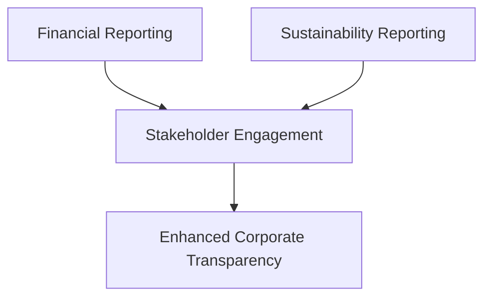

## 15.6 Sustainability and Environmental Reporting

In today's global economy, sustainability and environmental considerations have become integral to corporate strategy and financial reporting. As businesses face increasing pressure from stakeholders, including investors, regulators, and consumers, to demonstrate their commitment to sustainable practices, the role of accounting in capturing and reporting these efforts has never been more critical. This section delves into the accounting for environmental liabilities and the disclosure of sustainability efforts, providing insights into the frameworks and standards that guide these processes.

### Understanding Sustainability and Environmental Reporting

Sustainability reporting involves the disclosure of a company's environmental, social, and governance (ESG) practices and impacts. It provides stakeholders with a comprehensive view of how a company manages its environmental responsibilities and contributes to sustainable development. Environmental reporting, a subset of sustainability reporting, focuses specifically on the environmental aspects, including the recognition and measurement of environmental liabilities.

#### Key Concepts and Terminology

- **Environmental Liabilities:** Obligations arising from a company's past or current activities that have caused environmental damage or require remediation.
- **Sustainability Reporting Frameworks:** Guidelines and standards that help companies report their sustainability efforts, such as the Global Reporting Initiative (GRI) and the Sustainability Accounting Standards Board (SASB).
- **Triple Bottom Line:** A framework that incorporates social, environmental, and financial performance metrics.
- **Corporate Social Responsibility (CSR):** A company's commitment to manage the social, environmental, and economic effects of its operations responsibly.

### Regulatory Framework and Standards

In Canada, sustainability and environmental reporting are influenced by both domestic and international standards. The International Financial Reporting Standards (IFRS) and the Accounting Standards for Private Enterprises (ASPE) provide guidance on the recognition and measurement of environmental liabilities. Additionally, organizations may voluntarily adopt frameworks like the GRI or SASB to enhance their sustainability disclosures.

#### IFRS and Environmental Liabilities

Under IFRS, environmental liabilities are recognized when a company has a present obligation as a result of past events, and it is probable that an outflow of resources will be required to settle the obligation. IAS 37, "Provisions, Contingent Liabilities and Contingent Assets," provides the criteria for recognizing and measuring these liabilities.

#### ASPE and Environmental Reporting

For private enterprises in Canada, ASPE Section 3110, "Asset Retirement Obligations," addresses the accounting for obligations associated with the retirement of tangible long-lived assets. This section requires companies to recognize a liability for the fair value of an asset retirement obligation in the period in which it is incurred.

### The Role of Sustainability Reporting Frameworks

Sustainability reporting frameworks provide a structured approach for companies to disclose their sustainability efforts. These frameworks help ensure consistency, comparability, and transparency in reporting.

#### Global Reporting Initiative (GRI)

The GRI Standards are the most widely used framework for sustainability reporting. They provide a comprehensive set of indicators for companies to report on their environmental, social, and governance impacts. The GRI Standards emphasize stakeholder inclusiveness and materiality, ensuring that reports focus on the most significant impacts.

#### Sustainability Accounting Standards Board (SASB)

The SASB Standards focus on financially material sustainability information that is relevant to investors. They provide industry-specific standards that help companies disclose sustainability information in a way that is comparable and decision-useful for investors.

### Accounting for Environmental Liabilities

Accounting for environmental liabilities involves recognizing, measuring, and disclosing obligations related to environmental remediation and compliance. These liabilities can arise from legal requirements, company policies, or voluntary commitments.

#### Recognition and Measurement

Environmental liabilities are recognized when a company has a legal or constructive obligation to remediate environmental damage. The liability is measured at the best estimate of the expenditure required to settle the obligation. This estimate may involve significant judgment and consideration of factors such as the extent of contamination, the expected method of remediation, and the timing of the expenditure.

#### Disclosure Requirements

Companies are required to disclose information about their environmental liabilities in their financial statements. This includes the nature and extent of the liabilities, the assumptions used in measuring the liabilities, and any uncertainties that may affect the measurement. Transparency in disclosure helps stakeholders understand the potential financial impact of environmental obligations.

### Practical Examples and Case Studies

To illustrate the application of sustainability and environmental reporting, consider the following examples:

#### Case Study: Oil Spill Remediation

An oil company is responsible for an oil spill that has contaminated a nearby waterway. The company is legally obligated to clean up the spill and restore the affected area. Under IFRS, the company recognizes an environmental liability for the estimated cost of the cleanup, based on the expected method of remediation and the extent of the contamination.

#### Example: Voluntary Sustainability Reporting

A manufacturing company voluntarily adopts the GRI Standards to report its sustainability efforts. The company discloses its greenhouse gas emissions, water usage, and waste management practices, providing stakeholders with a comprehensive view of its environmental impact and efforts to mitigate it.

### Challenges and Best Practices

Sustainability and environmental reporting present several challenges, including the complexity of measuring environmental impacts, the need for reliable data, and the evolving regulatory landscape. To address these challenges, companies can adopt best practices such as:

- **Engaging Stakeholders:** Involving stakeholders in the reporting process to ensure that reports address their concerns and expectations.
- **Integrating Reporting:** Combining financial and sustainability reporting to provide a holistic view of the company's performance.
- **Continuous Improvement:** Regularly updating reporting practices to reflect changes in regulations, stakeholder expectations, and industry best practices.

### Real-World Applications and Compliance Considerations

In practice, companies must navigate a complex web of regulations and standards when reporting their sustainability efforts. Compliance with these requirements is essential to maintain stakeholder trust and avoid legal and financial penalties.

#### Canadian Regulatory Environment

In Canada, environmental reporting is influenced by federal and provincial regulations. Companies must comply with laws such as the Canadian Environmental Protection Act (CEPA) and provincial environmental statutes, which may require the disclosure of specific environmental information.

#### International Considerations

For companies operating globally, understanding and complying with international sustainability reporting requirements is crucial. This includes aligning with frameworks like the GRI and SASB, as well as adhering to country-specific regulations.

### Step-by-Step Guidance for Sustainability Reporting

To effectively report on sustainability efforts, companies can follow a structured approach:

1. **Identify Material Issues:** Determine the environmental, social, and governance issues that are most relevant to the company and its stakeholders.
2. **Select a Reporting Framework:** Choose a sustainability reporting framework that aligns with the company's goals and stakeholder expectations.
3. **Collect Data:** Gather reliable data on the company's sustainability performance, including environmental impacts, social initiatives, and governance practices.
4. **Prepare the Report:** Develop a comprehensive sustainability report that communicates the company's efforts and impacts to stakeholders.
5. **Review and Assurance:** Conduct a thorough review of the report to ensure accuracy and completeness, and consider obtaining external assurance to enhance credibility.

### Diagrams and Visuals

To enhance understanding, the following diagram illustrates the relationship between financial reporting, sustainability reporting, and stakeholder engagement:

### Common Pitfalls and Strategies to Overcome Them

When engaging in sustainability and environmental reporting, companies may encounter common pitfalls such as:

- **Inconsistent Data:** Ensure data consistency by establishing robust data collection and management processes.
- **Lack of Stakeholder Engagement:** Foster stakeholder engagement by actively involving them in the reporting process and addressing their concerns.
- **Overlooking Material Issues:** Focus on material issues that are most relevant to the company's operations and stakeholders.

### References and Additional Resources

For further exploration of sustainability and environmental reporting, consider the following resources:

- **CPA Canada:** Offers guidance on sustainability reporting and environmental accounting.
- **GRI Standards:** Provides comprehensive guidelines for sustainability reporting.
- **SASB Standards:** Offers industry-specific standards for disclosing financially material sustainability information.

### Summary and Key Takeaways

Sustainability and environmental reporting are essential components of modern accounting practices. By effectively recognizing and disclosing environmental liabilities and sustainability efforts, companies can enhance transparency, build stakeholder trust, and contribute to sustainable development. As the regulatory landscape continues to evolve, staying informed and adopting best practices will be crucial for success.

## **Ready to Test Your Knowledge?**



### Which framework is most widely used for sustainability reporting?

- [x] Global Reporting Initiative (GRI)
- [ ] Sustainability Accounting Standards Board (SASB)
- [ ] International Financial Reporting Standards (IFRS)
- [ ] Accounting Standards for Private Enterprises (ASPE)

> **Explanation:** The Global Reporting Initiative (GRI) is the most widely used framework for sustainability reporting, providing comprehensive guidelines for companies to disclose their environmental, social, and governance impacts.

### Under which IFRS standard are environmental liabilities recognized?

- [x] IAS 37
- [ ] IFRS 9
- [ ] IFRS 16
- [ ] IAS 16

> **Explanation:** Environmental liabilities are recognized under IAS 37, "Provisions, Contingent Liabilities and Contingent Assets," which provides the criteria for recognizing and measuring these liabilities.

### What is the primary focus of the SASB Standards?

- [x] Financially material sustainability information
- [ ] Comprehensive environmental impact
- [ ] Social responsibility initiatives
- [ ] Governance practices

> **Explanation:** The SASB Standards focus on financially material sustainability information that is relevant to investors, providing industry-specific standards for disclosure.

### What is the Triple Bottom Line framework?

- [x] A framework incorporating social, environmental, and financial performance metrics
- [ ] A framework for financial reporting only
- [ ] A framework for environmental impact assessment
- [ ] A framework for governance practices

> **Explanation:** The Triple Bottom Line framework incorporates social, environmental, and financial performance metrics, providing a holistic view of a company's performance.

### Which Canadian act influences environmental reporting?

- [x] Canadian Environmental Protection Act (CEPA)
- [ ] Sarbanes-Oxley Act
- [ ] Dodd-Frank Act
- [ ] Securities Act

> **Explanation:** The Canadian Environmental Protection Act (CEPA) influences environmental reporting in Canada, requiring companies to disclose specific environmental information.

### What is the first step in the sustainability reporting process?

- [x] Identify Material Issues
- [ ] Select a Reporting Framework
- [ ] Collect Data
- [ ] Prepare the Report

> **Explanation:** The first step in the sustainability reporting process is to identify material issues, determining the environmental, social, and governance issues that are most relevant to the company and its stakeholders.

### Which of the following is a common pitfall in sustainability reporting?

- [x] Inconsistent Data
- [ ] Over-reporting
- [ ] Excessive Stakeholder Engagement
- [ ] Comprehensive Disclosure

> **Explanation:** Inconsistent data is a common pitfall in sustainability reporting, which can be addressed by establishing robust data collection and management processes.

### What does the term "environmental liabilities" refer to?

- [x] Obligations arising from past or current activities causing environmental damage
- [ ] Future investments in sustainable projects
- [ ] Social responsibility initiatives
- [ ] Governance practices

> **Explanation:** Environmental liabilities refer to obligations arising from a company's past or current activities that have caused environmental damage or require remediation.

### What is the role of stakeholder engagement in sustainability reporting?

- [x] Ensures reports address stakeholder concerns and expectations
- [ ] Minimizes the need for comprehensive disclosure
- [ ] Focuses solely on financial performance
- [ ] Reduces the complexity of reporting

> **Explanation:** Stakeholder engagement ensures that sustainability reports address stakeholder concerns and expectations, enhancing the relevance and credibility of the reports.

### True or False: Sustainability reporting is only required for publicly traded companies.

- [ ] True
- [x] False

> **Explanation:** False. Sustainability reporting is not limited to publicly traded companies; many private companies and organizations voluntarily engage in sustainability reporting to demonstrate their commitment to sustainable practices.


