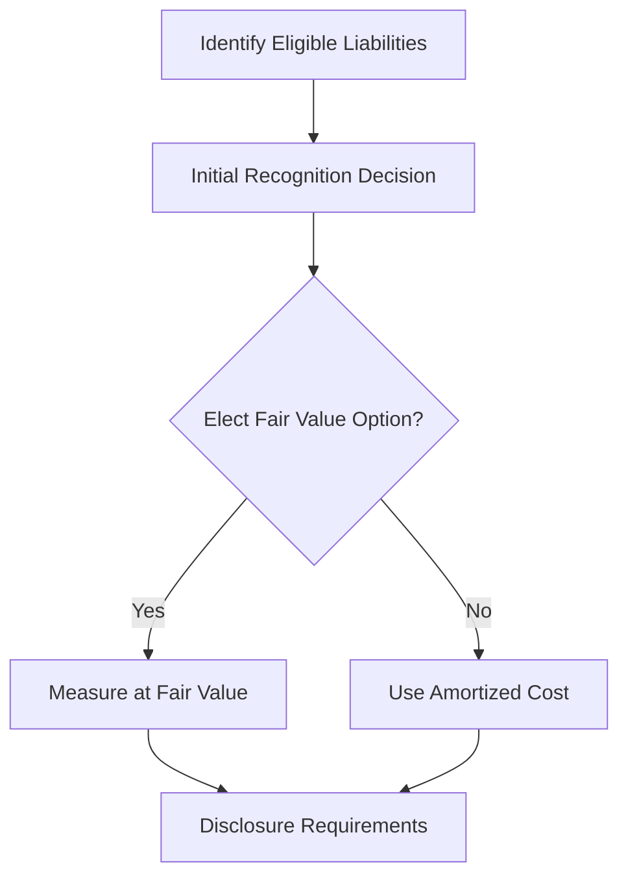

## 15.7 Fair Value Option for Liabilities

The fair value option for liabilities is a significant concept in accounting that allows entities to elect to measure certain financial liabilities at fair value. This section will delve into the intricacies of this option, its regulatory framework, practical applications, and implications for financial reporting. By understanding the fair value option, you will be better equipped to handle related questions on Canadian accounting exams and apply this knowledge in professional practice.

### Understanding Fair Value

Before exploring the fair value option for liabilities, it's crucial to understand what "fair value" means in an accounting context. Fair value is defined as the price that would be received to sell an asset or paid to transfer a liability in an orderly transaction between market participants at the measurement date. This concept is central to various accounting standards, including International Financial Reporting Standards (IFRS) and Accounting Standards for Private Enterprises (ASPE) in Canada.

#### Key Characteristics of Fair Value

- **Market-based Measurement:** Fair value is determined based on market conditions, not entity-specific factors.
- **Orderly Transaction:** Assumes a transaction that is not forced or distressed.
- **Measurement Date:** Reflects conditions at a specific point in time, requiring regular updates.

### Regulatory Framework

The fair value option for liabilities is governed by specific accounting standards. In Canada, entities may refer to IFRS 9 - Financial Instruments, which provides guidance on the application of the fair value option. Under ASPE, Section 3856 - Financial Instruments also addresses the fair value measurement of financial liabilities.

#### IFRS 9 - Financial Instruments

IFRS 9 allows entities to designate financial liabilities at fair value through profit or loss (FVTPL) under certain conditions. This designation is irrevocable and must be made at initial recognition. The standard aims to provide more relevant information by aligning the accounting treatment of financial liabilities with the entity's risk management strategy.

#### ASPE Section 3856

Under ASPE, entities have the option to measure financial liabilities at fair value if they meet specific criteria. This section provides flexibility for private enterprises in Canada, allowing them to choose the most appropriate measurement basis for their financial reporting needs.

### Elective Measurement of Liabilities

The fair value option is elective, meaning entities can choose whether to apply it to eligible liabilities. This choice can significantly impact financial statements, influencing reported earnings, volatility, and stakeholder perceptions.

#### Eligible Liabilities

Not all liabilities are eligible for fair value measurement. Typically, the option applies to:

- **Financial Liabilities Held for Trading:** These include derivatives and other instruments acquired primarily for short-term profit.
- **Liabilities with Embedded Derivatives:** If a liability contains an embedded derivative that significantly modifies its cash flows, it may be eligible for fair value measurement.
- **Liabilities Managed on a Fair Value Basis:** If an entity manages a liability on a fair value basis, it can elect to measure it at fair value.

#### Implications of Electing Fair Value

Choosing to measure liabilities at fair value has several implications:

- **Volatility in Earnings:** Fair value changes can introduce volatility in reported earnings, as gains and losses are recognized in profit or loss.
- **Alignment with Risk Management:** Entities that manage liabilities on a fair value basis can achieve better alignment between accounting and risk management practices.
- **Enhanced Transparency:** Fair value measurement provides more transparent information about the current value of liabilities.

### Practical Examples and Case Studies

To illustrate the application of the fair value option, consider the following examples:

#### Example 1: Derivative Liabilities

A Canadian company issues a bond with an embedded derivative that allows the holder to convert the bond into equity shares. The company elects to measure the entire bond at fair value to reflect the economic reality of the embedded derivative. This decision aligns the accounting treatment with the company's risk management strategy, providing more relevant information to stakeholders.

#### Example 2: Liabilities Managed on a Fair Value Basis

A financial institution manages a portfolio of liabilities, including structured notes, on a fair value basis. By electing the fair value option, the institution can report these liabilities at their current market value, enhancing the transparency of its financial statements and aligning with its risk management practices.

### Real-world Applications and Regulatory Scenarios

In practice, the fair value option is often used by entities with complex financial instruments or those operating in volatile markets. The option allows these entities to provide more relevant and timely information to investors and other stakeholders.

#### Regulatory Considerations

Entities electing the fair value option must comply with disclosure requirements outlined in IFRS 7 - Financial Instruments: Disclosures. These disclosures provide insights into the methods and assumptions used in fair value measurement, helping users of financial statements understand the impact of fair value changes.

### Step-by-step Guidance

Applying the fair value option involves several steps:

1. **Identify Eligible Liabilities:** Determine which liabilities qualify for fair value measurement based on the criteria outlined in IFRS 9 or ASPE Section 3856.
2. **Initial Recognition:** At initial recognition, decide whether to elect the fair value option. This decision is irrevocable and must be documented.
3. **Measurement:** Measure the liability at fair value at each reporting date, considering market conditions and relevant inputs.
4. **Disclosure:** Provide comprehensive disclosures about the fair value measurement, including the methods and assumptions used.

### Diagrams and Visual Aids

To enhance understanding, consider the following diagram illustrating the decision-making process for electing the fair value option:

### Best Practices and Common Pitfalls

When considering the fair value option, keep the following best practices in mind:

- **Align with Risk Management:** Ensure that the election aligns with the entity's risk management strategy and provides relevant information to stakeholders.
- **Regularly Update Fair Values:** Fair value measurements should be updated regularly to reflect current market conditions.
- **Comprehensive Disclosures:** Provide detailed disclosures to enhance transparency and help users understand the impact of fair value changes.

Common pitfalls include:

- **Inconsistent Application:** Applying the fair value option inconsistently across similar liabilities can lead to confusion and misinterpretation.
- **Inadequate Disclosures:** Failing to provide sufficient disclosures can undermine the benefits of fair value measurement.

### References to Canadian Accounting Standards

For further exploration, refer to the following resources:

- **IFRS 9 - Financial Instruments:** Provides comprehensive guidance on the fair value option and related disclosures.
- **ASPE Section 3856 - Financial Instruments:** Offers guidance for private enterprises in Canada on measuring financial liabilities at fair value.
- **CPA Canada Handbook:** Contains authoritative guidance on accounting standards and best practices.

### Summary

The fair value option for liabilities offers entities the flexibility to measure certain financial liabilities at fair value, providing more relevant and transparent information. By understanding the regulatory framework, practical applications, and implications of this option, you can enhance your financial reporting skills and prepare effectively for Canadian accounting exams.

### Ready to Test Your Knowledge?



### Which accounting standard governs the fair value option for liabilities in Canada under IFRS?

- [x] IFRS 9 - Financial Instruments
- [ ] IFRS 7 - Financial Instruments: Disclosures
- [ ] IAS 39 - Financial Instruments: Recognition and Measurement
- [ ] IFRS 13 - Fair Value Measurement

> **Explanation:** IFRS 9 - Financial Instruments provides guidance on the fair value option for liabilities.

### What is a key characteristic of fair value measurement?

- [x] Market-based measurement
- [ ] Entity-specific factors
- [ ] Historical cost
- [ ] Replacement cost

> **Explanation:** Fair value is a market-based measurement, reflecting the price in an orderly transaction between market participants.

### When can an entity elect the fair value option for a liability?

- [x] At initial recognition
- [ ] At any reporting date
- [ ] After a significant market change
- [ ] Upon management's discretion

> **Explanation:** The fair value option must be elected at initial recognition and is irrevocable.

### Which of the following liabilities is typically eligible for fair value measurement?

- [x] Liabilities with embedded derivatives
- [ ] Trade payables
- [ ] Deferred tax liabilities
- [ ] Operating lease liabilities

> **Explanation:** Liabilities with embedded derivatives are often eligible for fair value measurement.

### What is a potential implication of electing the fair value option?

- [x] Volatility in earnings
- [ ] Reduced transparency
- [ ] Simplified accounting
- [ ] Decreased stakeholder confidence

> **Explanation:** Electing the fair value option can introduce volatility in reported earnings due to fair value changes.

### What is required when an entity elects the fair value option?

- [x] Comprehensive disclosures
- [ ] Simplified reporting
- [ ] Reduced audit requirements
- [ ] Elimination of risk management practices

> **Explanation:** Comprehensive disclosures are required to provide insights into fair value measurement.

### Which diagram best illustrates the decision-making process for electing the fair value option?

- [x] A flowchart with decision points
- [ ] A pie chart of liabilities
- [ ] A bar graph of earnings
- [ ] A line chart of market trends

> **Explanation:** A flowchart with decision points effectively illustrates the decision-making process.

### What is a common pitfall when applying the fair value option?

- [x] Inconsistent application
- [ ] Enhanced transparency
- [ ] Improved stakeholder confidence
- [ ] Simplified disclosures

> **Explanation:** Inconsistent application can lead to confusion and misinterpretation.

### Which resource provides authoritative guidance on the fair value option in Canada?

- [x] CPA Canada Handbook
- [ ] Canadian Securities Administrators
- [ ] Financial Accounting Standards Board
- [ ] International Monetary Fund

> **Explanation:** The CPA Canada Handbook contains authoritative guidance on accounting standards.

### True or False: The fair value option can be revoked at any time after initial recognition.

- [ ] True
- [x] False

> **Explanation:** The fair value option is irrevocable once elected at initial recognition.


