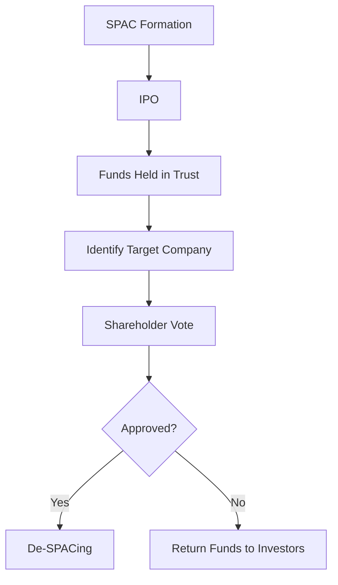

## 15.8 Innovative Equity Financing Techniques

In today's rapidly evolving financial landscape, companies are increasingly turning to innovative equity financing techniques to raise capital. These methods offer flexibility, access to a broader investor base, and often, a faster route to funding compared to traditional methods. This section will delve into some of the most prominent modern equity financing methods, such as crowdfunding and Special Purpose Acquisition Companies (SPACs), and discuss their accounting treatments, particularly in the context of Canadian accounting standards.

### Understanding Equity Financing

Equity financing involves raising capital through the sale of shares in a company. Unlike debt financing, which requires repayment with interest, equity financing provides investors with ownership stakes in the company. This can dilute existing ownership but does not impose the burden of debt repayment. Innovative equity financing techniques have emerged to address the limitations of traditional methods, such as initial public offerings (IPOs) and private placements.

### Crowdfunding

Crowdfunding is a method of raising small amounts of capital from a large number of people, typically via the internet. It has gained popularity as a way for startups and small businesses to access funding without the need for traditional financial intermediaries.

#### Types of Crowdfunding

1. **Equity Crowdfunding**: Investors receive shares in the company in exchange for their investment. This type of crowdfunding is subject to securities regulations and requires careful compliance with legal requirements.

2. **Reward-based Crowdfunding**: Investors receive a product or service in return for their investment, rather than equity. This is common in creative projects and product launches.

3. **Donation-based Crowdfunding**: Contributors donate money without expecting any financial return. This is often used for charitable causes.

4. **Debt Crowdfunding (Peer-to-Peer Lending)**: Investors lend money to a business with the expectation of being repaid with interest.

#### Accounting for Crowdfunding

The accounting treatment for crowdfunding depends on the type of crowdfunding used:

- **Equity Crowdfunding**: Companies must record the issuance of shares in their financial statements. This involves recognizing the cash received and increasing the equity section of the balance sheet. Disclosure of the terms and conditions of the equity issuance is crucial for transparency.

- **Reward-based Crowdfunding**: Funds received are typically recorded as deferred revenue until the promised product or service is delivered. Once delivered, the revenue is recognized in the income statement.

- **Donation-based Crowdfunding**: Contributions are recorded as income when received, as there is no obligation to repay or deliver a product/service.

- **Debt Crowdfunding**: The funds received are recorded as a liability, with interest expense recognized over the term of the loan.

#### Regulatory Considerations in Canada

In Canada, equity crowdfunding is regulated by provincial securities commissions. Companies must comply with specific regulations, such as the offering memorandum exemption, which allows them to raise capital without a prospectus. It is essential for companies to understand these regulations to avoid legal pitfalls.

### Special Purpose Acquisition Companies (SPACs)

SPACs have become a popular vehicle for companies to go public without the traditional IPO process. A SPAC is a shell company that raises capital through an IPO with the intention of acquiring an existing company.

#### Structure of a SPAC

1. **Formation**: A SPAC is formed by a group of investors or sponsors who provide initial capital and file for an IPO.

2. **IPO**: The SPAC raises funds from the public, with the proceeds held in a trust account until a target company is identified.

3. **Acquisition**: The SPAC identifies a target company and proposes a merger or acquisition. Shareholders vote on the proposed transaction.

4. **De-SPACing**: If approved, the merger is completed, and the target company becomes publicly traded.

#### Accounting for SPACs

The accounting treatment for SPACs involves several key considerations:

- **Initial Public Offering**: The proceeds from the IPO are recorded as cash and a corresponding liability, as they are held in trust until an acquisition is completed.

- **Acquisition**: The acquisition is accounted for as a business combination, with the target company's assets and liabilities recorded at fair value. Any excess of the purchase price over the fair value of net assets is recognized as goodwill.

- **De-SPACing**: The financial statements of the combined entity must be prepared, including pro forma financial information to reflect the transaction.

#### Regulatory Considerations in Canada

SPACs in Canada are subject to the rules of the Canadian Securities Administrators (CSA) and the Toronto Stock Exchange (TSX). These regulations govern the formation, IPO process, and acquisition activities of SPACs. Companies must ensure compliance with these rules to maintain their listing and avoid regulatory issues.

### Other Innovative Equity Financing Techniques

#### Initial Coin Offerings (ICOs)

ICOs involve raising capital through the issuance of digital tokens or cryptocurrencies. While they offer a novel way to access funding, they are subject to regulatory scrutiny and require careful consideration of securities laws.

#### Revenue-based Financing

This method involves raising capital in exchange for a percentage of future revenue. It provides flexibility for companies with fluctuating cash flows and aligns investor returns with company performance.

#### Convertible Securities

Convertible securities, such as convertible bonds or preferred shares, offer investors the option to convert their investment into equity at a later date. This can be an attractive option for companies seeking to minimize immediate dilution.

### Practical Examples and Case Studies

#### Case Study: Crowdfunding Success

Consider a Canadian startup that successfully raised $500,000 through an equity crowdfunding platform. The company issued shares to over 1,000 investors, providing them with a stake in the business. The funds were used to develop a new product line, leading to significant growth and increased market share.

#### Case Study: SPAC Acquisition

A Canadian technology company was acquired by a SPAC, allowing it to go public without the traditional IPO process. The transaction provided the company with access to capital markets and increased visibility, leading to further expansion and strategic partnerships.

### Real-world Applications and Compliance

Innovative equity financing techniques offer companies a range of options to raise capital. However, they also require careful consideration of accounting standards and regulatory compliance. Companies must ensure accurate financial reporting and transparency to maintain investor confidence and meet legal requirements.

### Step-by-step Guidance for Accounting Procedures

1. **Identify the Financing Method**: Determine the most suitable equity financing technique based on the company's needs and regulatory environment.

2. **Understand the Accounting Implications**: Familiarize yourself with the accounting standards applicable to the chosen method, such as IFRS or ASPE.

3. **Prepare Financial Statements**: Ensure accurate recording of transactions and prepare financial statements that reflect the impact of the financing method.

4. **Disclose Relevant Information**: Provide comprehensive disclosures in the financial statements to inform investors and stakeholders of the terms and conditions of the financing.

5. **Monitor Compliance**: Stay updated on regulatory changes and ensure ongoing compliance with securities laws and accounting standards.

### Diagrams and Visuals

To enhance understanding, consider the following Mermaid.js diagram illustrating the SPAC process:

### Best Practices and Common Pitfalls

- **Best Practices**: Engage with legal and financial advisors to ensure compliance and optimize the financing process. Maintain clear communication with investors to build trust and transparency.

- **Common Pitfalls**: Failing to comply with securities regulations can lead to legal issues and damage to reputation. Inadequate financial reporting can result in investor dissatisfaction and potential financial penalties.

### References and Additional Resources

- **CPA Canada**: Provides guidance on accounting standards and regulatory requirements for equity financing.
- **International Financial Reporting Standards (IFRS)**: Offers comprehensive standards for financial reporting and disclosure.
- **Canadian Securities Administrators (CSA)**: Governs securities regulations and compliance in Canada.

### Conclusion

Innovative equity financing techniques provide companies with diverse options to raise capital and achieve their strategic objectives. By understanding the accounting treatments and regulatory considerations, companies can effectively leverage these methods to drive growth and success. As you prepare for the Canadian Accounting Exams, focus on the key concepts and practical applications discussed in this section to enhance your understanding and confidence.

## **Ready to Test Your Knowledge?**



### Which of the following is NOT a type of crowdfunding?

- [ ] Equity Crowdfunding
- [ ] Reward-based Crowdfunding
- [x] Debt Issuance
- [ ] Donation-based Crowdfunding

> **Explanation:** Debt issuance is a traditional financing method, not a type of crowdfunding.

### What is a SPAC?

- [x] A shell company that raises capital through an IPO to acquire an existing company
- [ ] A type of crowdfunding platform
- [ ] A regulatory body for securities
- [ ] A financial instrument for debt financing

> **Explanation:** A SPAC is a Special Purpose Acquisition Company that raises funds to acquire a target company.

### In equity crowdfunding, what do investors receive in exchange for their investment?

- [x] Shares in the company
- [ ] Interest payments
- [ ] A product or service
- [ ] A donation receipt

> **Explanation:** In equity crowdfunding, investors receive shares in the company, giving them ownership stakes.

### What is the primary regulatory body for securities in Canada?

- [ ] SEC
- [x] CSA
- [ ] FASB
- [ ] IASB

> **Explanation:** The Canadian Securities Administrators (CSA) is the primary regulatory body for securities in Canada.

### Which of the following is a benefit of using SPACs for going public?

- [x] Faster access to capital markets
- [ ] Lower regulatory requirements
- [ ] Guaranteed investor returns
- [ ] No need for financial reporting

> **Explanation:** SPACs offer a faster route to public markets compared to traditional IPOs.

### How are funds received from reward-based crowdfunding initially recorded?

- [ ] As equity
- [ ] As a liability
- [x] As deferred revenue
- [ ] As a donation

> **Explanation:** Funds from reward-based crowdfunding are recorded as deferred revenue until the promised product or service is delivered.

### What is a common pitfall in innovative equity financing?

- [x] Non-compliance with securities regulations
- [ ] Over-communication with investors
- [ ] Excessive financial disclosures
- [ ] High interest rates

> **Explanation:** Non-compliance with securities regulations can lead to legal issues and reputational damage.

### What is the accounting treatment for funds held in trust by a SPAC?

- [ ] Recognized as equity
- [x] Recorded as a liability
- [ ] Recorded as revenue
- [ ] Recognized as an expense

> **Explanation:** Funds held in trust by a SPAC are recorded as a liability until an acquisition is completed.

### Which of the following is a feature of convertible securities?

- [x] Option to convert into equity
- [ ] Guaranteed fixed returns
- [ ] Immediate dilution of ownership
- [ ] No impact on financial statements

> **Explanation:** Convertible securities offer the option to convert into equity at a later date.

### True or False: Crowdfunding is exempt from all securities regulations in Canada.

- [ ] True
- [x] False

> **Explanation:** Crowdfunding is subject to securities regulations in Canada, and companies must comply with specific legal requirements.


