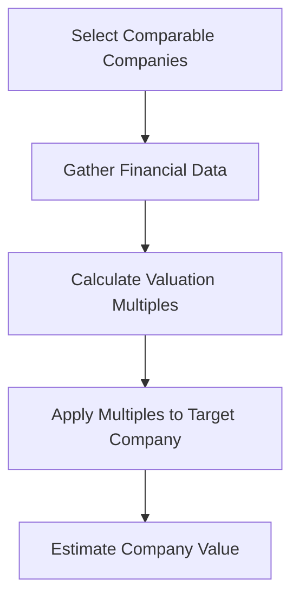

## 16.11 Market-based Valuation Methods

Market-based valuation methods are essential tools in the financial analyst's toolkit, particularly for those preparing for Canadian accounting exams. These methods rely on market data to estimate the value of a company or its equity. Understanding these techniques is crucial for accurately assessing a company's financial health and making informed investment decisions. This section will delve into the key market-based valuation methods, including multiples and comparables, providing detailed explanations, practical examples, and real-world applications.

### Understanding Market-based Valuation

Market-based valuation methods use data from comparable companies or transactions to estimate the value of a target company. These methods are grounded in the principle that similar assets should sell for similar prices. The primary techniques include:

- **Multiples Analysis**: Involves using financial ratios derived from comparable companies to estimate the value of the target company.
- **Comparable Company Analysis (CCA)**: Involves comparing the target company to similar companies in the same industry.
- **Precedent Transactions Analysis**: Involves analyzing past transactions of similar companies to estimate the target company's value.

These methods are widely used due to their simplicity and reliance on observable market data, making them particularly useful in volatile or uncertain markets.

### Multiples Analysis

Multiples analysis is a common valuation technique that involves applying a multiple to a financial metric of the target company to estimate its value. The most commonly used multiples include:

- **Price-to-Earnings (P/E) Ratio**: Compares the company's current share price to its earnings per share (EPS).
- **Enterprise Value-to-EBITDA (EV/EBITDA)**: Compares the company's enterprise value to its earnings before interest, taxes, depreciation, and amortization.
- **Price-to-Book (P/B) Ratio**: Compares the company's market value to its book value.
- **Price-to-Sales (P/S) Ratio**: Compares the company's market value to its revenue.

#### Example of P/E Ratio Calculation

Consider Company A with a share price of CAD 50 and an EPS of CAD 5. The P/E ratio is calculated as:

 \text{P/E Ratio} = \frac{\text{Share Price}}{\text{EPS}} = \frac{50}{5} = 10 

This means investors are willing to pay CAD 10 for every CAD 1 of earnings.

#### Practical Application

Multiples analysis is particularly useful when comparing companies within the same industry. For example, if Company A's P/E ratio is 10 and the industry average is 15, Company A may be undervalued, suggesting a potential investment opportunity.

### Comparable Company Analysis (CCA)

Comparable Company Analysis involves identifying a group of peer companies that are similar to the target company in terms of industry, size, growth, and risk. The steps involved in CCA include:

1. **Selecting Comparable Companies**: Identify companies with similar business models, market positions, and financial characteristics.
2. **Gathering Financial Data**: Collect financial metrics such as revenue, EBITDA, and net income.
3. **Calculating Valuation Multiples**: Compute multiples such as P/E, EV/EBITDA, and P/B for each comparable company.
4. **Applying Multiples to the Target Company**: Use the median or average multiples from the peer group to estimate the target company's value.

#### Example of CCA

Suppose you are valuing Company B, which operates in the technology sector. You identify three comparable companies with the following EV/EBITDA multiples: 8x, 9x, and 10x. The median multiple is 9x. If Company B's EBITDA is CAD 100 million, its estimated enterprise value is:

 \text{Enterprise Value} = \text{EBITDA} \times \text{Median Multiple} = 100 \times 9 = \text{CAD 900 million} 

### Precedent Transactions Analysis

Precedent Transactions Analysis involves analyzing past transactions of similar companies to estimate the target company's value. This method is particularly useful in mergers and acquisitions (M&A) as it reflects the premiums paid for control and synergies.

#### Steps in Precedent Transactions Analysis

1. **Identify Relevant Transactions**: Find transactions involving companies similar to the target company in terms of industry, size, and geography.
2. **Analyze Transaction Details**: Examine the terms of the transactions, including purchase price, payment method, and any synergies.
3. **Calculate Transaction Multiples**: Compute multiples such as EV/EBITDA and P/E based on the transaction data.
4. **Apply Multiples to the Target Company**: Use the derived multiples to estimate the target company's value.

#### Example of Precedent Transactions Analysis

Assume you are valuing Company C, which is in the healthcare sector. You identify three recent transactions with EV/EBITDA multiples of 11x, 12x, and 13x. The average multiple is 12x. If Company C's EBITDA is CAD 80 million, its estimated enterprise value is:

 \text{Enterprise Value} = \text{EBITDA} \times \text{Average Multiple} = 80 \times 12 = \text{CAD 960 million} 

### Real-world Applications and Considerations

Market-based valuation methods are widely used in various contexts, including:

- **Investment Banking**: For advising clients on mergers, acquisitions, and divestitures.
- **Equity Research**: For providing investment recommendations.
- **Corporate Finance**: For strategic planning and capital budgeting.
- **Private Equity**: For evaluating potential investment opportunities.

#### Regulatory Considerations

In Canada, market-based valuation methods must comply with the International Financial Reporting Standards (IFRS) as adopted in Canada. Analysts must ensure that their valuation assumptions and methodologies are transparent and well-documented to meet regulatory requirements.

### Challenges and Best Practices

While market-based valuation methods are powerful tools, they come with challenges:

- **Data Availability**: Finding comparable companies or transactions can be difficult, especially for unique or niche businesses.
- **Market Volatility**: Market conditions can change rapidly, affecting the reliability of valuation multiples.
- **Subjectivity**: Selecting comparable companies and adjusting for differences requires judgment and expertise.

#### Best Practices

- **Use Multiple Methods**: Combine market-based methods with other valuation techniques, such as discounted cash flow (DCF) analysis, to cross-verify results.
- **Regularly Update Data**: Ensure that the financial data and multiples used are current and reflect the latest market conditions.
- **Adjust for Differences**: Make necessary adjustments for differences in growth rates, risk profiles, and capital structures between the target and comparable companies.

### Diagrams and Visual Aids

To enhance understanding, consider the following diagram illustrating the process of Comparable Company Analysis:

### Conclusion

Market-based valuation methods are indispensable for financial analysts and accountants, providing a practical and market-oriented approach to valuing companies. By mastering these techniques, you can enhance your ability to make informed investment decisions and excel in Canadian accounting exams. Remember to apply these methods judiciously, considering the specific context and market conditions.

## **Ready to Test Your Knowledge?**



### Which of the following is a commonly used market-based valuation multiple?

- [x] Price-to-Earnings (P/E) Ratio
- [ ] Discounted Cash Flow (DCF)
- [ ] Net Present Value (NPV)
- [ ] Internal Rate of Return (IRR)

> **Explanation:** The Price-to-Earnings (P/E) Ratio is a commonly used market-based valuation multiple that compares a company's current share price to its earnings per share.

### What is the primary principle behind market-based valuation methods?

- [x] Similar assets should sell for similar prices.
- [ ] Future cash flows determine value.
- [ ] Historical cost is the best indicator of value.
- [ ] Book value equals market value.

> **Explanation:** Market-based valuation methods are based on the principle that similar assets should sell for similar prices, using market data to estimate value.

### In Comparable Company Analysis, what is the first step?

- [x] Selecting Comparable Companies
- [ ] Calculating Valuation Multiples
- [ ] Gathering Financial Data
- [ ] Applying Multiples to the Target Company

> **Explanation:** The first step in Comparable Company Analysis is selecting comparable companies that are similar to the target company in terms of industry, size, and risk.

### What is a key challenge of using market-based valuation methods?

- [x] Data Availability
- [ ] Simplicity of Method
- [ ] Lack of Market Data
- [ ] Complexity of Calculations

> **Explanation:** A key challenge of using market-based valuation methods is data availability, as finding comparable companies or transactions can be difficult.

### Which of the following is NOT a market-based valuation method?

- [ ] Comparable Company Analysis
- [ ] Precedent Transactions Analysis
- [x] Discounted Cash Flow (DCF) Analysis
- [ ] Multiples Analysis

> **Explanation:** Discounted Cash Flow (DCF) Analysis is not a market-based valuation method; it is a cash flow-based method.

### What does the EV/EBITDA multiple compare?

- [x] Enterprise Value to Earnings Before Interest, Taxes, Depreciation, and Amortization
- [ ] Earnings Per Share to Share Price
- [ ] Market Value to Book Value
- [ ] Revenue to Market Value

> **Explanation:** The EV/EBITDA multiple compares a company's enterprise value to its earnings before interest, taxes, depreciation, and amortization.

### Why is it important to adjust for differences in market-based valuation?

- [x] To account for differences in growth rates, risk profiles, and capital structures
- [ ] To simplify the valuation process
- [ ] To ensure compliance with IFRS
- [ ] To increase the valuation result

> **Explanation:** Adjusting for differences is important to account for variations in growth rates, risk profiles, and capital structures between the target and comparable companies.

### What is a benefit of using market-based valuation methods?

- [x] Reliance on observable market data
- [ ] Complexity of calculations
- [ ] Dependence on future cash flows
- [ ] Requirement for extensive historical data

> **Explanation:** A benefit of market-based valuation methods is their reliance on observable market data, making them practical and straightforward.

### Which method involves analyzing past transactions of similar companies?

- [x] Precedent Transactions Analysis
- [ ] Comparable Company Analysis
- [ ] Multiples Analysis
- [ ] Discounted Cash Flow Analysis

> **Explanation:** Precedent Transactions Analysis involves analyzing past transactions of similar companies to estimate the target company's value.

### True or False: Market-based valuation methods are not useful in volatile markets.

- [ ] True
- [x] False

> **Explanation:** False. Market-based valuation methods can be particularly useful in volatile markets as they rely on observable market data, providing a practical approach to valuation.


