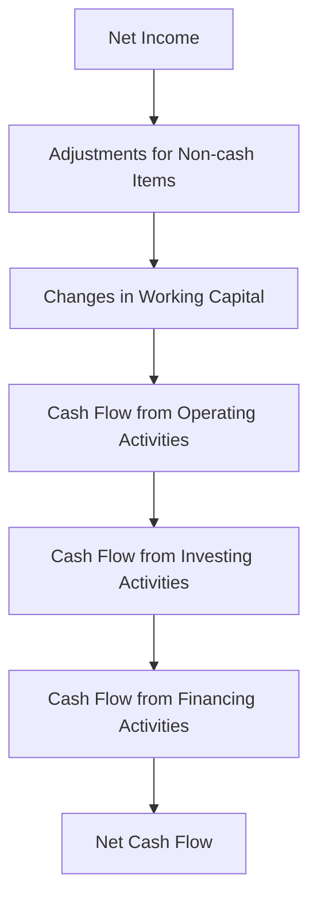

## 16.9 Cash Flow Analysis

Cash flow analysis is a critical component of financial statement analysis, particularly when evaluating liabilities and equity transactions. Understanding cash flows is essential for accountants, financial analysts, and stakeholders to assess a company's financial health, liquidity, and operational efficiency. In this section, we will delve into the intricacies of cash flow analysis, focusing on the implications of liabilities and equity transactions. This comprehensive guide will equip you with the knowledge needed to excel in Canadian accounting exams and apply these principles in professional practice.

### Understanding Cash Flow Statements

The cash flow statement is one of the three primary financial statements, alongside the balance sheet and income statement. It provides a detailed account of cash inflows and outflows over a specific period, categorized into three main sections:

1. **Operating Activities**: Cash flows from the core business operations, including receipts from customers and payments to suppliers and employees.
2. **Investing Activities**: Cash flows related to the acquisition and disposal of long-term assets, such as property, plant, and equipment.
3. **Financing Activities**: Cash flows from transactions with the company's owners and creditors, including issuing equity, borrowing, and repaying debt.

### Importance of Cash Flow Analysis

Cash flow analysis is vital for several reasons:

- **Liquidity Assessment**: It helps determine a company's ability to meet its short-term obligations.
- **Financial Health Evaluation**: It provides insights into the company's operational efficiency and financial stability.
- **Investment Decisions**: Investors and analysts use cash flow analysis to assess the viability of investing in a company.
- **Creditworthiness**: Lenders evaluate cash flows to determine a company's ability to repay loans.

### Cash Flow from Liabilities

Liabilities, both current and long-term, significantly impact cash flows. Understanding how liabilities affect cash flow is crucial for accurate financial analysis.

#### Current Liabilities

Current liabilities are obligations expected to be settled within one year. They include accounts payable, short-term debt, and other accrued expenses. Here's how they influence cash flows:

- **Accounts Payable**: An increase in accounts payable indicates that a company is delaying payments to suppliers, which can improve cash flow in the short term but may affect supplier relationships.
- **Short-term Debt**: Borrowing short-term funds increases cash inflows, while repayments result in cash outflows.
- **Accrued Liabilities**: These are expenses recognized in the income statement but not yet paid in cash, affecting cash flow when settled.

#### Long-term Liabilities

Long-term liabilities are obligations due beyond one year, such as bonds payable and long-term loans. Their impact on cash flows includes:

- **Issuance of Bonds**: Raising funds through bond issuance results in cash inflows, while interest payments and principal repayments lead to cash outflows.
- **Long-term Loans**: Similar to bonds, obtaining long-term loans provides cash inflows, and repayments create outflows.

### Cash Flow from Equity Transactions

Equity transactions also play a significant role in cash flow analysis. These transactions involve the company's owners and affect the financing section of the cash flow statement.

#### Issuance of Equity

Issuing common or preferred stock generates cash inflows, providing capital for business operations or expansion. This is a crucial aspect of financing activities and reflects the company's ability to raise funds from investors.

#### Dividends

Paying dividends to shareholders results in cash outflows. While dividends are a sign of financial health and profitability, excessive payouts can strain cash reserves.

#### Treasury Stock Transactions

When a company repurchases its own shares, it results in cash outflows. This can be a strategic move to increase shareholder value or adjust the capital structure.

### Practical Examples and Case Studies

To illustrate the concepts discussed, let's explore practical examples and case studies relevant to the Canadian accounting profession.

#### Example 1: Cash Flow Impact of Issuing Bonds

Consider a Canadian manufacturing company, MapleTech Inc., that issues $1 million in bonds to finance a new production facility. The issuance results in a $1 million cash inflow under financing activities. Over the bond's term, MapleTech incurs annual interest payments of $50,000, recorded as cash outflows in operating activities.

#### Example 2: Equity Issuance and Dividend Payments

MapleTech Inc. decides to issue additional common stock, raising $500,000. This transaction appears as a cash inflow in the financing section. Subsequently, the company declares dividends totaling $100,000, resulting in a cash outflow.

### Real-world Applications and Regulatory Scenarios

Understanding cash flow analysis is essential for compliance with Canadian accounting standards, such as IFRS and ASPE. These standards provide guidelines for preparing cash flow statements and require disclosures that enhance transparency and comparability.

#### IFRS and ASPE Considerations

- **IFRS**: Under IFRS, cash flow statements must be prepared using either the direct or indirect method. The indirect method is more common, reconciling net income to net cash flow from operating activities.
- **ASPE**: Similar to IFRS, ASPE allows both methods but emphasizes the need for clear disclosures regarding cash flow components.

### Step-by-step Guidance for Cash Flow Analysis

To perform a comprehensive cash flow analysis, follow these steps:

1. **Gather Financial Statements**: Obtain the company's balance sheet, income statement, and cash flow statement.
2. **Analyze Operating Activities**: Adjust net income for non-cash items and changes in working capital to determine cash flow from operations.
3. **Evaluate Investing Activities**: Review cash flows related to asset purchases and sales, ensuring alignment with the company's strategic goals.
4. **Assess Financing Activities**: Examine cash flows from debt and equity transactions, considering their impact on the company's capital structure.
5. **Interpret Results**: Analyze the overall cash flow position, identifying trends and potential areas of concern.

### Diagrams and Visuals

To enhance understanding, let's visualize the flow of cash through a company's financial activities using a Mermaid.js diagram.

### Best Practices and Common Pitfalls

When analyzing cash flows, consider these best practices and avoid common pitfalls:

- **Best Practices**:
  - Regularly review cash flow statements to monitor financial health.
  - Use cash flow analysis to inform strategic decisions and resource allocation.
  - Ensure compliance with relevant accounting standards and disclosure requirements.

- **Common Pitfalls**:
  - Overlooking non-cash items that affect net income but not cash flow.
  - Failing to account for changes in working capital, which can distort cash flow analysis.
  - Ignoring the impact of foreign currency transactions on cash flows.

### References and Additional Resources

For further exploration, refer to the following authoritative resources:

- **CPA Canada**: Offers guidance on accounting standards and best practices.
- **IFRS Foundation**: Provides comprehensive resources on IFRS standards.
- **Financial Accounting Standards Board (FASB)**: Offers insights into ASPE and other accounting frameworks.

### Summary

Cash flow analysis is a vital tool for assessing a company's financial health, particularly in relation to liabilities and equity transactions. By understanding the components of cash flow statements and their implications, you can make informed decisions and excel in Canadian accounting exams. Remember to apply these principles in real-world scenarios, ensuring compliance with relevant standards and regulations.

## **Ready to Test Your Knowledge?**



### What are the three main sections of a cash flow statement?

- [x] Operating, Investing, Financing
- [ ] Operating, Investing, Revenue
- [ ] Revenue, Expenses, Financing
- [ ] Assets, Liabilities, Equity

> **Explanation:** The cash flow statement is divided into three sections: Operating, Investing, and Financing activities.

### Which method is more commonly used under IFRS for preparing cash flow statements?

- [x] Indirect Method
- [ ] Direct Method
- [ ] Cash Method
- [ ] Accrual Method

> **Explanation:** The indirect method is more commonly used under IFRS, as it reconciles net income to net cash flow from operating activities.

### What is the impact of issuing bonds on cash flow?

- [x] Cash inflow under financing activities
- [ ] Cash outflow under investing activities
- [ ] Cash inflow under operating activities
- [ ] Cash outflow under operating activities

> **Explanation:** Issuing bonds results in a cash inflow under financing activities, as it raises funds for the company.

### How do dividend payments affect cash flow?

- [x] Cash outflow under financing activities
- [ ] Cash inflow under investing activities
- [ ] Cash inflow under operating activities
- [ ] Cash outflow under operating activities

> **Explanation:** Dividend payments result in a cash outflow under financing activities, as they involve distributing profits to shareholders.

### What is a common pitfall in cash flow analysis?

- [x] Overlooking non-cash items
- [ ] Overestimating revenue
- [ ] Underestimating liabilities
- [ ] Ignoring equity transactions

> **Explanation:** A common pitfall is overlooking non-cash items that affect net income but not cash flow, which can distort analysis.

### What does an increase in accounts payable indicate in cash flow analysis?

- [x] Delayed payments to suppliers
- [ ] Increased cash inflow from customers
- [ ] Decreased cash outflow for expenses
- [ ] Increased cash outflow for investments

> **Explanation:** An increase in accounts payable indicates delayed payments to suppliers, which can improve short-term cash flow.

### How does repurchasing treasury stock affect cash flow?

- [x] Cash outflow under financing activities
- [ ] Cash inflow under investing activities
- [ ] Cash inflow under operating activities
- [ ] Cash outflow under operating activities

> **Explanation:** Repurchasing treasury stock results in a cash outflow under financing activities, as it involves buying back shares.

### What is the primary purpose of cash flow analysis?

- [x] Assess liquidity and financial health
- [ ] Determine net income
- [ ] Evaluate asset value
- [ ] Calculate tax liability

> **Explanation:** The primary purpose of cash flow analysis is to assess a company's liquidity and financial health.

### Which section of the cash flow statement includes cash flows from asset purchases?

- [x] Investing Activities
- [ ] Operating Activities
- [ ] Financing Activities
- [ ] Revenue Activities

> **Explanation:** Cash flows from asset purchases are included in the Investing Activities section of the cash flow statement.

### True or False: Cash flow analysis is only important for large corporations.

- [ ] True
- [x] False

> **Explanation:** False. Cash flow analysis is important for businesses of all sizes to assess financial health and liquidity.


