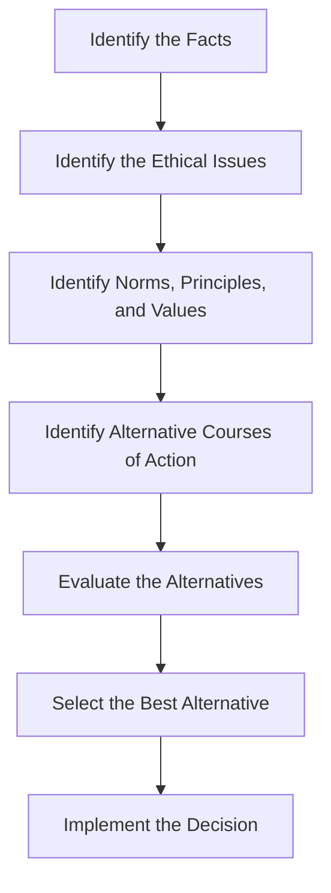

## 17.7 Ethical Decision-making Frameworks

In the complex world of accounting, ethical decision-making is a cornerstone of professional integrity and trust. As you prepare for the Canadian Accounting Exams, understanding ethical decision-making frameworks is crucial. These frameworks provide structured approaches to navigating ethical dilemmas, ensuring that decisions align with professional standards and societal expectations.

### Understanding Ethical Decision-making in Accounting

Ethical decision-making in accounting involves evaluating situations where moral principles and professional standards intersect. Accountants must balance their responsibilities to clients, employers, the public, and regulatory bodies. Ethical frameworks guide accountants in making decisions that uphold the integrity of financial reporting and maintain public trust.

### Key Ethical Principles in Accounting

Before delving into specific frameworks, it's essential to understand the core ethical principles that underpin accounting practices:

- **Integrity:** Accountants must be honest and forthright in all professional and business relationships.
- **Objectivity:** Accountants should not allow bias, conflict of interest, or undue influence to override professional judgments.
- **Professional Competence and Due Care:** Accountants must maintain professional knowledge and skill at the level required to ensure that clients or employers receive competent professional service.
- **Confidentiality:** Accountants must respect the confidentiality of information acquired as a result of professional and business relationships.
- **Professional Behavior:** Accountants must comply with relevant laws and regulations and avoid any action that discredits the profession.

### Ethical Decision-making Frameworks

Several frameworks can assist accountants in making ethical decisions. These frameworks provide a systematic approach to evaluating ethical dilemmas and determining the best course of action.

#### 1. The American Accounting Association (AAA) Model

The AAA model is widely used in accounting education and practice. It involves a seven-step process:

1. **Identify the Facts:** Gather all relevant information about the situation.
2. **Identify the Ethical Issues:** Determine the ethical issues involved.
3. **Identify the Norms, Principles, and Values Related to the Situation:** Consider the ethical principles and values that apply.
4. **Identify the Alternative Courses of Action:** List possible actions.
5. **Evaluate the Alternatives:** Assess the alternatives against ethical principles and values.
6. **Select the Best Alternative:** Choose the action that best aligns with ethical standards.
7. **Implement the Decision:** Take action and monitor the outcomes.

#### 2. The Rest’s Four-Component Model

Developed by psychologist James Rest, this model emphasizes moral psychology and includes four components:

1. **Moral Sensitivity:** Recognizing the presence of an ethical issue.
2. **Moral Judgment:** Determining the right course of action.
3. **Moral Motivation:** Prioritizing ethical values over other values.
4. **Moral Character:** Having the strength to act on ethical decisions.

#### 3. The Tucker’s Five-Question Model

This model involves asking five critical questions to evaluate the ethicality of a decision:

1. **Is it profitable?**
2. **Is it legal?**
3. **Is it fair?**
4. **Is it right?**
5. **Is it sustainable?**

#### 4. The IFAC Code of Ethics Framework

The International Federation of Accountants (IFAC) provides a framework that emphasizes the following steps:

1. **Identify Threats:** Recognize threats to compliance with fundamental principles.
2. **Evaluate Threats:** Assess the significance of the threats.
3. **Apply Safeguards:** Implement safeguards to eliminate or reduce threats to an acceptable level.

### Practical Examples and Case Studies

To illustrate these frameworks, let's explore some practical examples and case studies relevant to Canadian accounting practice.

#### Case Study 1: Revenue Recognition Dilemma

**Scenario:** An accountant discovers that their company is recognizing revenue prematurely to meet quarterly targets. This practice inflates earnings and misleads investors.

**Application of AAA Model:**

1. **Identify the Facts:** The company is recognizing revenue before it is earned.
2. **Identify the Ethical Issues:** Misleading financial reporting, potential harm to investors.
3. **Identify the Norms, Principles, and Values:** Integrity, objectivity, professional behavior.
4. **Identify the Alternative Courses of Action:** Report the issue, adjust the financial statements, ignore the issue.
5. **Evaluate the Alternatives:** Reporting the issue aligns with ethical principles.
6. **Select the Best Alternative:** Report the issue to management and suggest adjustments.
7. **Implement the Decision:** Communicate the findings and monitor the response.

#### Case Study 2: Confidentiality Breach

**Scenario:** An accountant is approached by a competitor offering a lucrative job in exchange for confidential client information.

**Application of IFAC Code of Ethics Framework:**

1. **Identify Threats:** Conflict of interest, breach of confidentiality.
2. **Evaluate Threats:** Significant threat to professional integrity.
3. **Apply Safeguards:** Decline the offer, reinforce commitment to confidentiality.

### Real-world Applications and Regulatory Scenarios

Ethical decision-making frameworks are not just theoretical; they have real-world applications in regulatory scenarios. For instance, accountants must adhere to the Canadian CPA Code of Professional Conduct, which aligns with international standards like the IFAC Code.

#### Regulatory Scenario: Compliance with IFRS

Accountants in Canada must comply with International Financial Reporting Standards (IFRS) as adopted in Canada. Ethical decision-making frameworks help ensure that financial reporting aligns with these standards, promoting transparency and accountability.

### Step-by-step Guidance for Ethical Decision-making

To effectively apply ethical decision-making frameworks, follow these steps:

1. **Develop Ethical Awareness:** Stay informed about ethical standards and emerging issues in accounting.
2. **Foster Ethical Culture:** Encourage ethical behavior within your organization.
3. **Engage in Continuous Learning:** Participate in professional development and ethics training.
4. **Seek Guidance:** Consult with peers, mentors, or ethics committees when faced with dilemmas.
5. **Document Decisions:** Keep records of ethical decisions and the rationale behind them.

### Diagrams and Visual Aids

To enhance understanding, let's visualize the AAA Model using a flowchart:

This flowchart illustrates the sequential steps of the AAA Model, providing a clear visual representation of the decision-making process.

### Best Practices, Common Pitfalls, and Strategies

**Best Practices:**

- **Stay Informed:** Regularly update your knowledge of ethical standards and regulations.
- **Communicate Openly:** Foster an environment where ethical concerns can be discussed without fear of retribution.
- **Lead by Example:** Demonstrate ethical behavior in all professional interactions.

**Common Pitfalls:**

- **Ignoring Ethical Issues:** Failing to recognize or address ethical dilemmas can lead to severe consequences.
- **Rationalizing Unethical Behavior:** Justifying unethical actions due to pressure or perceived benefits undermines integrity.

**Strategies to Overcome Challenges:**

- **Develop Ethical Policies:** Establish clear guidelines and procedures for ethical decision-making.
- **Provide Training:** Offer regular ethics training to reinforce the importance of ethical behavior.
- **Encourage Reporting:** Implement mechanisms for reporting unethical behavior anonymously.

### References to Canadian Accounting Standards and Resources

For further exploration of ethical decision-making in accounting, consider the following resources:

- **CPA Canada Code of Professional Conduct:** Provides comprehensive guidelines for ethical behavior in accounting.
- **IFRS as Adopted in Canada:** Offers standards for financial reporting that align with ethical principles.
- **CPA Canada Ethics Resources:** Includes articles, case studies, and tools for ethical decision-making.

### Summary and Key Points

- Ethical decision-making frameworks provide structured approaches to navigating ethical dilemmas in accounting.
- Core ethical principles include integrity, objectivity, professional competence, confidentiality, and professional behavior.
- Frameworks such as the AAA Model, Rest’s Four-Component Model, Tucker’s Five-Question Model, and IFAC Code of Ethics Framework offer valuable tools for ethical decision-making.
- Practical examples and case studies illustrate the application of these frameworks in real-world scenarios.
- Best practices, common pitfalls, and strategies help accountants maintain ethical standards and avoid unethical behavior.

### Encouragement for Practice and Application

As you prepare for the Canadian Accounting Exams, practice applying ethical decision-making frameworks to various scenarios. Consider how these frameworks can guide your professional practice and enhance your ability to make ethical decisions.

## **Ready to Test Your Knowledge?**



### Which of the following is NOT a component of Rest’s Four-Component Model?

- [ ] Moral Sensitivity
- [ ] Moral Judgment
- [x] Moral Integrity
- [ ] Moral Character

> **Explanation:** Rest’s Four-Component Model includes Moral Sensitivity, Moral Judgment, Moral Motivation, and Moral Character. Moral Integrity is not one of the components.

### What is the first step in the AAA Model of ethical decision-making?

- [x] Identify the Facts
- [ ] Identify the Ethical Issues
- [ ] Evaluate the Alternatives
- [ ] Select the Best Alternative

> **Explanation:** The first step in the AAA Model is to identify the facts of the situation.

### Which ethical principle emphasizes the importance of maintaining professional knowledge and skill?

- [ ] Integrity
- [ ] Objectivity
- [x] Professional Competence and Due Care
- [ ] Confidentiality

> **Explanation:** Professional Competence and Due Care emphasize maintaining professional knowledge and skill.

### In the IFAC Code of Ethics Framework, what is the purpose of applying safeguards?

- [x] To eliminate or reduce threats to an acceptable level
- [ ] To identify ethical issues
- [ ] To select the best alternative
- [ ] To implement the decision

> **Explanation:** Applying safeguards aims to eliminate or reduce threats to compliance with ethical principles to an acceptable level.

### Which question is NOT part of Tucker’s Five-Question Model?

- [ ] Is it profitable?
- [ ] Is it legal?
- [ ] Is it fair?
- [x] Is it ethical?

> **Explanation:** Tucker’s Five-Question Model includes questions about profitability, legality, fairness, rightness, and sustainability, but not explicitly about ethics.

### What is a common pitfall in ethical decision-making?

- [ ] Staying informed about ethical standards
- [x] Ignoring ethical issues
- [ ] Communicating openly
- [ ] Leading by example

> **Explanation:** Ignoring ethical issues is a common pitfall that can lead to severe consequences.

### Which framework focuses on recognizing threats and applying safeguards?

- [ ] AAA Model
- [ ] Rest’s Four-Component Model
- [ ] Tucker’s Five-Question Model
- [x] IFAC Code of Ethics Framework

> **Explanation:** The IFAC Code of Ethics Framework focuses on recognizing threats to ethical principles and applying safeguards.

### Which of the following is a best practice for ethical decision-making?

- [x] Staying informed about ethical standards
- [ ] Rationalizing unethical behavior
- [ ] Ignoring ethical dilemmas
- [ ] Justifying unethical actions

> **Explanation:** Staying informed about ethical standards is a best practice that helps maintain ethical behavior.

### What is the role of moral motivation in Rest’s Four-Component Model?

- [ ] Recognizing the presence of an ethical issue
- [x] Prioritizing ethical values over other values
- [ ] Determining the right course of action
- [ ] Having the strength to act on ethical decisions

> **Explanation:** Moral motivation involves prioritizing ethical values over other values.

### True or False: Ethical decision-making frameworks are only theoretical and have no real-world applications.

- [ ] True
- [x] False

> **Explanation:** Ethical decision-making frameworks have real-world applications and are essential for ensuring ethical behavior in professional practice.


