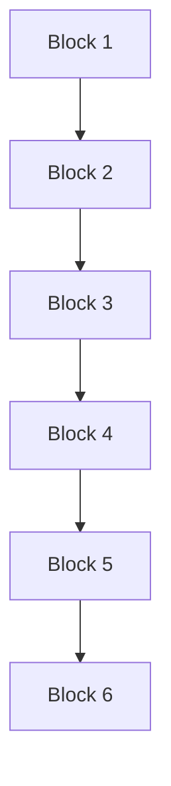
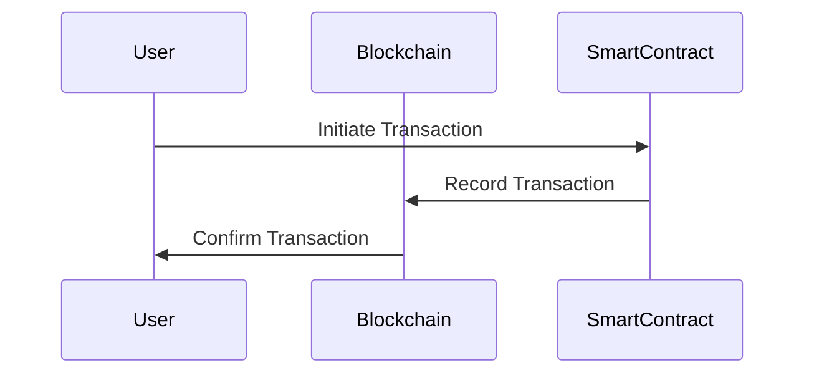

## 18.2 Blockchain and Accounting

Blockchain technology is revolutionizing the accounting landscape by providing a decentralized, transparent, and secure method for recording and verifying financial transactions. This section delves into the transformative potential of blockchain in accounting, particularly in the context of liabilities and equities, and explores its implications for Canadian accounting practices.

### Understanding Blockchain Technology

Blockchain is a distributed ledger technology that records transactions across multiple computers in a way that ensures the data is immutable and transparent. Each block in the blockchain contains a list of transactions, a timestamp, and a cryptographic hash of the previous block, forming a chain. This structure ensures that once a transaction is recorded, it cannot be altered retroactively without altering all subsequent blocks, which requires consensus from the network.

#### Key Features of Blockchain

1. **Decentralization**: Unlike traditional databases controlled by a central authority, blockchain operates on a peer-to-peer network, reducing the risk of centralized control and single points of failure.

2. **Transparency**: All participants in the network have access to the same data, promoting transparency and trust among parties.

3. **Security**: Cryptographic techniques secure the data, making it resistant to unauthorized access and tampering.

4. **Immutability**: Once data is recorded on the blockchain, it cannot be changed, ensuring the integrity of financial records.

5. **Smart Contracts**: These are self-executing contracts with the terms of the agreement directly written into code, allowing for automated and trustless transactions.

### Blockchain Applications in Accounting

Blockchain technology offers numerous applications in accounting, particularly in the areas of financial reporting, auditing, and compliance. Here are some key applications:

#### 1. Real-time Financial Reporting

Blockchain enables real-time financial reporting by providing a continuous and up-to-date view of financial transactions. This capability can significantly enhance the accuracy and timeliness of financial statements, allowing companies to make informed decisions quickly.

#### 2. Enhanced Auditability

The immutable nature of blockchain records provides a clear and verifiable audit trail, simplifying the audit process. Auditors can access transaction data directly from the blockchain, reducing the need for manual verification and increasing the efficiency and reliability of audits.

#### 3. Fraud Prevention

Blockchain's transparency and security features make it an effective tool for preventing fraud. By ensuring that all transactions are recorded and visible to all network participants, blockchain reduces the opportunity for fraudulent activities and enhances the integrity of financial records.

#### 4. Smart Contracts for Automated Transactions

Smart contracts can automate routine accounting processes, such as invoice payments and payroll, reducing the need for manual intervention and minimizing errors. These contracts execute automatically when predefined conditions are met, ensuring compliance and efficiency.

### Blockchain and Liabilities

Blockchain technology can transform the way liabilities are recorded and managed. Here are some potential applications:

#### 1. Debt Issuance and Management

Blockchain can streamline the issuance and management of debt instruments, such as bonds and loans. By recording debt transactions on a blockchain, companies can ensure transparency and traceability, reducing the risk of errors and fraud.

#### 2. Lease Accounting

Blockchain can simplify lease accounting by providing a transparent and immutable record of lease agreements. This can help companies comply with accounting standards, such as IFRS 16, by providing a clear audit trail of lease transactions.

#### 3. Contingent Liabilities

Blockchain can enhance the management of contingent liabilities by providing a transparent and verifiable record of potential obligations. This can help companies assess and manage risks more effectively.

### Blockchain and Equities

Blockchain technology also has significant implications for equity management. Here are some key applications:

#### 1. Equity Issuance and Trading

Blockchain can facilitate the issuance and trading of equity securities by providing a transparent and efficient platform for recording and verifying transactions. This can reduce the need for intermediaries and lower transaction costs.

#### 2. Dividend Distribution

Blockchain can automate the distribution of dividends by using smart contracts to execute payments automatically when certain conditions are met. This can enhance efficiency and reduce administrative costs.

#### 3. Shareholder Voting

Blockchain can improve the transparency and security of shareholder voting by providing a tamper-proof record of votes. This can increase shareholder participation and enhance corporate governance.

### Regulatory Considerations

The adoption of blockchain in accounting raises several regulatory considerations. Here are some key points to consider:

#### 1. Compliance with Accounting Standards

Companies using blockchain technology must ensure compliance with relevant accounting standards, such as IFRS and ASPE. This includes ensuring that blockchain records are accurate and reliable and that they provide a true and fair view of the company's financial position.

#### 2. Data Privacy and Security

Blockchain's transparency can raise concerns about data privacy and security. Companies must implement appropriate measures to protect sensitive financial information and comply with data protection regulations.

#### 3. Legal and Tax Implications

The use of blockchain can have legal and tax implications, particularly in areas such as smart contracts and cross-border transactions. Companies must seek legal and tax advice to ensure compliance with relevant laws and regulations.

### Challenges and Opportunities

While blockchain offers numerous benefits, it also presents several challenges and opportunities for the accounting profession. Here are some key points to consider:

#### Challenges

1. **Technical Complexity**: Implementing blockchain technology requires a high level of technical expertise, which can be a barrier for some companies.

2. **Regulatory Uncertainty**: The regulatory environment for blockchain is still evolving, and companies must navigate a complex and uncertain landscape.

3. **Integration with Existing Systems**: Integrating blockchain with existing accounting systems can be challenging and may require significant investment.

#### Opportunities

1. **Innovation and Efficiency**: Blockchain can drive innovation and efficiency in accounting processes, reducing costs and improving accuracy.

2. **New Business Models**: Blockchain can enable new business models and revenue streams, such as tokenization and decentralized finance.

3. **Enhanced Trust and Transparency**: Blockchain can enhance trust and transparency in financial reporting, improving stakeholder confidence.

### Practical Examples and Case Studies

To illustrate the potential of blockchain in accounting, let's explore some practical examples and case studies:

#### Example 1: Real-time Financial Reporting

A Canadian company implemented a blockchain-based system to record and verify financial transactions in real-time. This enabled the company to produce accurate and up-to-date financial statements, improving decision-making and stakeholder confidence.

#### Example 2: Automated Dividend Distribution

A publicly traded company used smart contracts to automate the distribution of dividends to shareholders. This reduced administrative costs and ensured timely and accurate payments.

#### Case Study: Blockchain in Audit

A major accounting firm piloted a blockchain-based audit platform to enhance the efficiency and reliability of audits. The platform provided auditors with direct access to transaction data, reducing the need for manual verification and improving audit quality.

### Step-by-Step Guidance

For companies considering adopting blockchain technology, here is a step-by-step guide to implementing blockchain in accounting:

1. **Assess the Need**: Evaluate the potential benefits and challenges of blockchain for your organization and identify specific use cases.

2. **Develop a Strategy**: Develop a clear strategy for implementing blockchain, including goals, timelines, and resource requirements.

3. **Select a Platform**: Choose a blockchain platform that meets your organization's needs, considering factors such as scalability, security, and interoperability.

4. **Implement the Solution**: Work with technical experts to implement the blockchain solution, ensuring integration with existing systems and compliance with relevant regulations.

5. **Monitor and Evaluate**: Continuously monitor and evaluate the performance of the blockchain solution, making adjustments as needed to optimize its effectiveness.

### Diagrams and Visuals

To enhance understanding, let's explore some diagrams that illustrate key blockchain concepts:

#### Blockchain Structure

#### Smart Contract Workflow

### Best Practices and Common Pitfalls

When implementing blockchain in accounting, consider the following best practices and common pitfalls:

#### Best Practices

1. **Engage Stakeholders**: Involve key stakeholders in the planning and implementation process to ensure buy-in and support.

2. **Focus on Security**: Implement robust security measures to protect blockchain data and prevent unauthorized access.

3. **Ensure Compliance**: Work with legal and regulatory experts to ensure compliance with relevant laws and standards.

#### Common Pitfalls

1. **Overlooking Integration**: Failing to integrate blockchain with existing systems can lead to inefficiencies and data silos.

2. **Underestimating Costs**: Implementing blockchain can be costly, and companies must budget appropriately for development and maintenance.

3. **Ignoring Change Management**: Successful implementation requires effective change management to address resistance and ensure adoption.

### References and Additional Resources

For further exploration of blockchain and accounting, consider the following resources:

- **CPA Canada**: Provides guidance on the implications of blockchain for the accounting profession.
- **IFRS Foundation**: Offers resources on the application of blockchain in financial reporting.
- **Blockchain Research Institute**: Conducts research on the impact of blockchain technology across various industries.

### Summary

Blockchain technology has the potential to revolutionize accounting by providing a secure, transparent, and efficient method for recording and verifying financial transactions. By embracing blockchain, companies can enhance the accuracy and reliability of financial reporting, improve auditability, and reduce the risk of fraud. However, successful implementation requires careful planning, stakeholder engagement, and compliance with regulatory requirements. As the accounting profession continues to evolve, blockchain will play an increasingly important role in shaping the future of financial reporting.

## **Ready to Test Your Knowledge?**



### What is a key feature of blockchain technology that ensures data integrity?

- [x] Immutability
- [ ] Centralization
- [ ] Anonymity
- [ ] Scalability

> **Explanation:** Immutability ensures that once data is recorded on the blockchain, it cannot be altered, maintaining data integrity.

### How can blockchain enhance the audit process?

- [x] By providing a verifiable audit trail
- [ ] By increasing manual verification
- [ ] By centralizing data control
- [ ] By reducing transparency

> **Explanation:** Blockchain provides a clear and verifiable audit trail, reducing the need for manual verification and enhancing audit efficiency.

### What role do smart contracts play in blockchain accounting?

- [x] Automating transactions
- [ ] Centralizing data storage
- [ ] Increasing manual processes
- [ ] Reducing transparency

> **Explanation:** Smart contracts automate transactions by executing automatically when predefined conditions are met, enhancing efficiency.

### Which of the following is a challenge of implementing blockchain in accounting?

- [x] Technical complexity
- [ ] Increased transparency
- [ ] Enhanced security
- [ ] Reduced costs

> **Explanation:** Implementing blockchain requires a high level of technical expertise, which can be a barrier for some companies.

### How can blockchain improve the management of contingent liabilities?

- [x] By providing a transparent record
- [ ] By centralizing control
- [ ] By reducing data access
- [ ] By increasing manual processes

> **Explanation:** Blockchain provides a transparent and verifiable record of potential obligations, enhancing risk management.

### What is a potential benefit of blockchain for equity management?

- [x] Facilitating equity issuance and trading
- [ ] Increasing transaction costs
- [ ] Reducing transparency
- [ ] Centralizing control

> **Explanation:** Blockchain facilitates the issuance and trading of equity securities by providing a transparent and efficient platform.

### What regulatory consideration must companies address when using blockchain?

- [x] Compliance with accounting standards
- [ ] Centralization of data
- [ ] Reduction of transparency
- [ ] Increase in manual processes

> **Explanation:** Companies must ensure compliance with relevant accounting standards to maintain accurate and reliable financial records.

### What is a common pitfall when implementing blockchain in accounting?

- [x] Overlooking integration with existing systems
- [ ] Enhancing data security
- [ ] Increasing transparency
- [ ] Reducing costs

> **Explanation:** Failing to integrate blockchain with existing systems can lead to inefficiencies and data silos.

### How can blockchain technology drive innovation in accounting?

- [x] By reducing costs and improving accuracy
- [ ] By increasing manual processes
- [ ] By centralizing data control
- [ ] By reducing transparency

> **Explanation:** Blockchain can drive innovation by enhancing efficiency, reducing costs, and improving the accuracy of accounting processes.

### Blockchain technology is inherently decentralized and transparent.

- [x] True
- [ ] False

> **Explanation:** Blockchain operates on a peer-to-peer network, promoting decentralization and transparency among participants.


