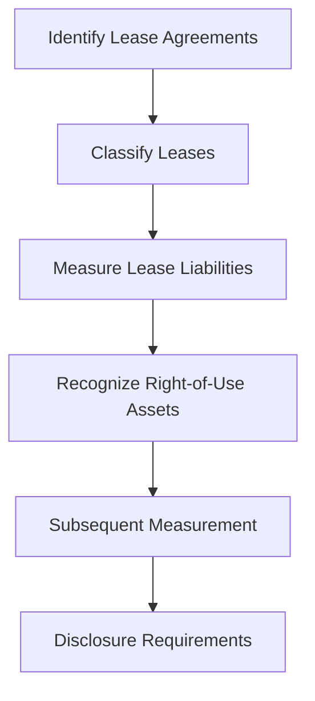

## 18.7 Changes in Regulatory Environments

In the dynamic world of accounting, regulatory environments are constantly evolving, driven by changes in economic conditions, technological advancements, and global integration. Understanding these changes is crucial for accounting professionals, especially those preparing for the Canadian Accounting Exams. This section delves into the impact of evolving laws and standards on accounting practices, focusing on liabilities and equities. We will explore how these changes influence financial reporting, compliance, and strategic decision-making, providing you with the knowledge and tools needed to excel in your exams and future career.

### Understanding Regulatory Changes

Regulatory changes in accounting are often initiated by standard-setting bodies such as the International Accounting Standards Board (IASB) and the Financial Accounting Standards Board (FASB). In Canada, the Accounting Standards Board (AcSB) plays a pivotal role in adopting and adapting these standards to meet the needs of Canadian businesses and stakeholders. These changes aim to enhance transparency, comparability, and reliability in financial reporting.

#### Key Drivers of Regulatory Changes

1. **Globalization**: As businesses operate across borders, there is a need for harmonized accounting standards to facilitate international trade and investment. This has led to the adoption of International Financial Reporting Standards (IFRS) in many countries, including Canada.

2. **Technological Advancements**: The rise of digital technologies, including blockchain and artificial intelligence, has transformed how financial transactions are recorded and reported. Regulators are adapting standards to address these technological changes.

3. **Economic Shifts**: Economic crises, such as the 2008 financial meltdown and the COVID-19 pandemic, have highlighted the need for robust accounting standards that can withstand economic shocks and provide accurate financial information.

4. **Stakeholder Demands**: Investors, regulators, and the public demand greater transparency and accountability from companies. This has led to increased emphasis on environmental, social, and governance (ESG) reporting.

5. **Regulatory Convergence**: Efforts to align accounting standards globally have resulted in convergence projects between IFRS and U.S. Generally Accepted Accounting Principles (GAAP), impacting how liabilities and equities are reported.

### Impact on Liabilities and Equities

Regulatory changes significantly affect how liabilities and equities are recognized, measured, and reported in financial statements. Let's explore some key areas impacted by these changes:

#### Liabilities

1. **Lease Accounting**: The introduction of IFRS 16 and ASC 842 has transformed lease accounting by requiring lessees to recognize most leases on the balance sheet. This change impacts financial ratios and debt covenants, necessitating careful analysis and planning.

2. **Financial Instruments**: IFRS 9 and ASPE Section 3856 have introduced new requirements for classifying and measuring financial instruments, including liabilities. These standards emphasize the use of fair value and expected credit loss models, affecting how liabilities are reported.

3. **Pension Liabilities**: Changes in standards related to employee benefits, such as IAS 19 and ASPE Section 3462, have altered how pension liabilities are measured and disclosed. These changes require actuarial expertise and careful consideration of assumptions.

4. **Contingent Liabilities**: The recognition and measurement of contingent liabilities have been refined under IFRS and ASPE, impacting how companies report potential obligations arising from legal disputes, warranties, and guarantees.

#### Equities

1. **Equity Instruments**: The classification of financial instruments as equity or liability has been a focus of regulatory changes, affecting how companies report convertible debt, preferred shares, and other complex instruments.

2. **Share-based Payments**: IFRS 2 and ASPE Section 3870 have introduced detailed guidance on accounting for share-based payments, impacting how companies recognize and measure equity compensation.

3. **Non-controlling Interests**: Changes in consolidation standards, such as IFRS 10 and ASPE Section 1591, have affected how non-controlling interests are reported in consolidated financial statements.

4. **Disclosure Requirements**: Enhanced disclosure requirements for equity transactions, including stock splits, dividends, and treasury stock, have been introduced to provide greater transparency to stakeholders.

### Practical Examples and Case Studies

To illustrate the impact of regulatory changes on liabilities and equities, let's consider a few practical examples and case studies relevant to the Canadian accounting profession.

#### Case Study 1: Lease Accounting Transformation

**Scenario**: A Canadian retail company, ABC Ltd., has several long-term lease agreements for its store locations. Under the previous lease accounting standard, these leases were classified as operating leases and not recognized on the balance sheet.

**Regulatory Change**: With the adoption of IFRS 16, ABC Ltd. must now recognize these leases as right-of-use assets and corresponding lease liabilities on its balance sheet.

**Impact**: This change significantly increases the company's reported assets and liabilities, affecting key financial ratios such as the debt-to-equity ratio. ABC Ltd. must also reassess its debt covenants and communicate these changes to stakeholders.

#### Case Study 2: Financial Instruments and Fair Value Measurement

**Scenario**: XYZ Corp., a Canadian manufacturing company, holds a portfolio of financial instruments, including derivatives and investments in other companies.

**Regulatory Change**: Under IFRS 9, XYZ Corp. must classify its financial instruments based on the business model and contractual cash flow characteristics, using fair value measurement where applicable.

**Impact**: The company experiences increased volatility in its financial statements due to fair value changes. XYZ Corp. must implement robust risk management practices and enhance its financial disclosures to address stakeholder concerns.

### Real-World Applications and Regulatory Scenarios

Understanding regulatory changes is not just about compliance; it's about leveraging these changes to drive strategic decision-making and enhance financial performance. Here are some real-world applications and scenarios:

1. **Strategic Lease Management**: Companies can optimize their lease portfolios by renegotiating lease terms, considering sale and leaseback transactions, and exploring alternative financing options to manage the impact of IFRS 16.

2. **Risk Management and Hedging**: With the changes in financial instrument accounting, companies can implement effective hedging strategies to mitigate risks associated with interest rate fluctuations, foreign currency exposure, and commodity price volatility.

3. **Pension Plan Optimization**: Companies can work with actuaries to optimize pension plan designs, manage funding levels, and explore de-risking strategies to address changes in pension accounting standards.

4. **Enhanced ESG Reporting**: As stakeholder demands for ESG information grow, companies can integrate ESG considerations into their strategic planning and reporting frameworks, aligning with global sustainability standards.

### Step-by-Step Guidance for Accounting Procedures

To help you navigate the complexities of regulatory changes, here is a step-by-step guide for some key accounting procedures:

#### Lease Accounting under IFRS 16

1. **Identify Lease Agreements**: Review all contracts to identify lease agreements, including embedded leases.

2. **Classify Leases**: Determine whether leases are finance or operating leases based on the criteria outlined in IFRS 16.

3. **Measure Lease Liabilities**: Calculate the present value of lease payments, using the incremental borrowing rate as the discount rate.

4. **Recognize Right-of-Use Assets**: Measure right-of-use assets at the initial lease liability amount, adjusted for any lease incentives or initial direct costs.

5. **Subsequent Measurement**: Reassess lease liabilities and right-of-use assets for any modifications or changes in lease terms.

6. **Disclosure Requirements**: Provide detailed disclosures in the financial statements, including the nature of lease arrangements, maturity analysis, and impact on financial performance.

#### Financial Instruments Classification under IFRS 9

1. **Identify Financial Instruments**: Review all financial assets and liabilities to determine their classification.

2. **Business Model Assessment**: Evaluate the business model for managing financial instruments, considering factors such as trading, holding to collect cash flows, or both.

3. **Cash Flow Characteristics Test**: Assess whether the contractual cash flows are solely payments of principal and interest (SPPI).

4. **Classify and Measure**: Classify financial instruments as amortized cost, fair value through other comprehensive income (FVOCI), or fair value through profit or loss (FVTPL).

5. **Impairment Assessment**: Apply the expected credit loss model to assess impairment for financial assets measured at amortized cost or FVOCI.

6. **Disclosure Requirements**: Provide comprehensive disclosures, including risk management strategies, fair value hierarchy, and sensitivity analysis.

### Diagrams and Visuals

To enhance your understanding of regulatory changes, let's use a Mermaid.js diagram to illustrate the flow of lease accounting under IFRS 16:

This diagram provides a visual representation of the key steps involved in lease accounting, helping you grasp the process more effectively.

### Best Practices, Common Pitfalls, and Strategies

Navigating regulatory changes can be challenging, but by adopting best practices and avoiding common pitfalls, you can ensure compliance and optimize financial performance. Here are some strategies to consider:

#### Best Practices

- **Stay Informed**: Regularly update your knowledge of accounting standards and regulatory changes through professional development courses, webinars, and industry publications.

- **Engage Experts**: Collaborate with accounting professionals, auditors, and legal advisors to ensure compliance and address complex accounting issues.

- **Leverage Technology**: Utilize accounting software and tools to streamline processes, enhance accuracy, and improve financial reporting.

- **Communicate with Stakeholders**: Keep stakeholders informed about regulatory changes and their impact on financial performance, fostering transparency and trust.

#### Common Pitfalls

- **Inadequate Documentation**: Failing to maintain comprehensive documentation of accounting judgments and estimates can lead to compliance issues and audit challenges.

- **Overlooking Embedded Leases**: Neglecting to identify and account for embedded leases can result in misstated financial statements.

- **Underestimating Impact**: Underestimating the impact of regulatory changes on financial ratios and debt covenants can lead to breaches and financial difficulties.

#### Strategies to Overcome Challenges

- **Scenario Analysis**: Conduct scenario analysis to assess the impact of regulatory changes on financial statements and develop contingency plans.

- **Training and Education**: Invest in training and education for accounting staff to ensure they are equipped to handle new standards and regulations.

- **Proactive Planning**: Develop proactive plans to address potential challenges, such as renegotiating debt covenants or restructuring lease agreements.

### References and Additional Resources

To deepen your understanding of regulatory changes and their impact on accounting practices, consider exploring the following resources:

- **CPA Canada**: Offers a wealth of resources, including webinars, publications, and courses on accounting standards and regulatory changes.

- **International Financial Reporting Standards (IFRS)**: Provides comprehensive guidance on IFRS standards, including updates and interpretations.

- **Accounting Standards for Private Enterprises (ASPE)**: Offers detailed information on ASPE standards and their application in Canada.

- **Financial Accounting Standards Board (FASB)**: Provides resources on U.S. GAAP and convergence projects with IFRS.

- **Professional Journals and Publications**: Stay informed by reading professional journals and publications that cover accounting standards, regulatory changes, and industry trends.

### Summary and Key Points

In this section, we have explored the impact of changes in regulatory environments on accounting for liabilities and equities. Key takeaways include:

- Regulatory changes are driven by globalization, technological advancements, economic shifts, stakeholder demands, and regulatory convergence.

- These changes significantly impact how liabilities and equities are recognized, measured, and reported in financial statements.

- Practical examples and case studies illustrate the real-world impact of regulatory changes on Canadian companies.

- Step-by-step guidance and diagrams provide a clear understanding of key accounting procedures.

- Best practices, common pitfalls, and strategies help you navigate regulatory changes effectively.

By staying informed and proactive, you can leverage regulatory changes to enhance financial reporting, compliance, and strategic decision-making.

## **Ready to Test Your Knowledge?**



### Which standard transformed lease accounting by requiring lessees to recognize most leases on the balance sheet?

- [ ] IFRS 9
- [x] IFRS 16
- [ ] IAS 19
- [ ] ASPE Section 3856

> **Explanation:** IFRS 16 requires lessees to recognize most leases on the balance sheet, impacting financial ratios and debt covenants.

### What is a key driver of regulatory changes in accounting?

- [x] Globalization
- [ ] Decreased stakeholder demands
- [ ] Reduced technological advancements
- [ ] Economic stability

> **Explanation:** Globalization drives regulatory changes to harmonize accounting standards for international trade and investment.

### Which standard introduced new requirements for classifying and measuring financial instruments?

- [x] IFRS 9
- [ ] IFRS 16
- [ ] IAS 19
- [ ] ASPE Section 3462

> **Explanation:** IFRS 9 introduced new requirements for classifying and measuring financial instruments, emphasizing fair value and expected credit loss models.

### What is the impact of IFRS 16 on financial statements?

- [ ] Decrease in reported assets
- [x] Increase in reported assets and liabilities
- [ ] No impact on financial ratios
- [ ] Elimination of lease liabilities

> **Explanation:** IFRS 16 increases reported assets and liabilities, affecting financial ratios such as the debt-to-equity ratio.

### Which standard provides guidance on accounting for share-based payments?

- [ ] IFRS 16
- [x] IFRS 2
- [ ] IAS 19
- [ ] ASPE Section 3856

> **Explanation:** IFRS 2 provides guidance on accounting for share-based payments, impacting how companies recognize and measure equity compensation.

### What is a common pitfall in navigating regulatory changes?

- [ ] Adequate documentation
- [x] Inadequate documentation
- [ ] Overestimating impact
- [ ] Identifying embedded leases

> **Explanation:** Inadequate documentation of accounting judgments and estimates can lead to compliance issues and audit challenges.

### Which strategy can help companies manage the impact of IFRS 16?

- [x] Strategic lease management
- [ ] Ignoring lease agreements
- [ ] Reducing financial disclosures
- [ ] Eliminating lease liabilities

> **Explanation:** Strategic lease management, including renegotiating lease terms and exploring alternative financing options, can help manage the impact of IFRS 16.

### What is the focus of enhanced ESG reporting?

- [ ] Financial ratios
- [x] Environmental, social, and governance considerations
- [ ] Lease liabilities
- [ ] Pension plan optimization

> **Explanation:** Enhanced ESG reporting focuses on environmental, social, and governance considerations, aligning with global sustainability standards.

### Which resource offers comprehensive guidance on IFRS standards?

- [ ] CPA Canada
- [x] International Financial Reporting Standards (IFRS)
- [ ] Financial Accounting Standards Board (FASB)
- [ ] Accounting Standards for Private Enterprises (ASPE)

> **Explanation:** The International Financial Reporting Standards (IFRS) provide comprehensive guidance on IFRS standards, including updates and interpretations.

### True or False: Regulatory changes in accounting are only driven by economic stability.

- [ ] True
- [x] False

> **Explanation:** Regulatory changes are driven by globalization, technological advancements, economic shifts, stakeholder demands, and regulatory convergence, not just economic stability.


