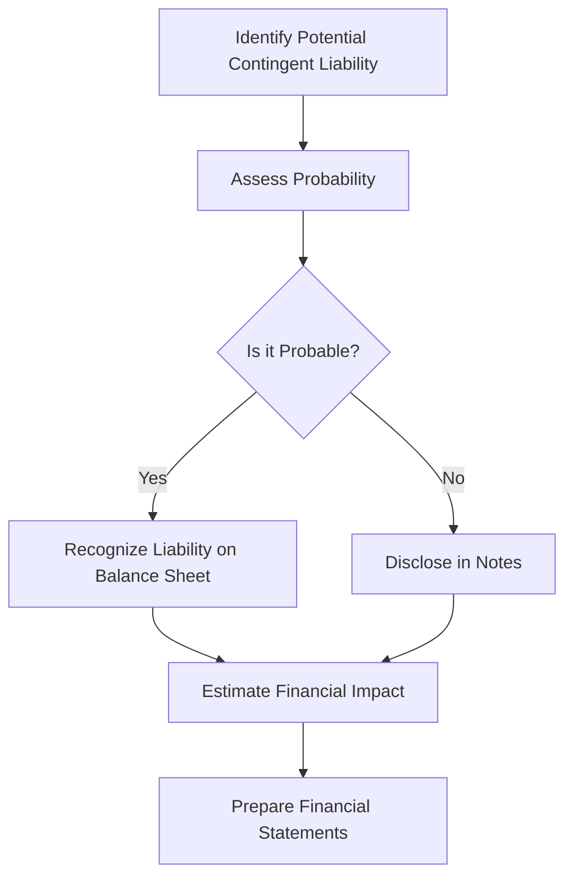

## 2.11 Contingent Liabilities (Current Portion)

Contingent liabilities are potential obligations that may arise depending on the outcome of a future event. In accounting, recognizing and measuring contingent liabilities, particularly their current portion, is crucial for accurate financial reporting. This section delves into the intricacies of contingent liabilities, focusing on their current portion, recognition, measurement, and reporting in financial statements, as per Canadian accounting standards.

### Understanding Contingent Liabilities

Contingent liabilities are not recognized as actual liabilities on the balance sheet until certain conditions are met. They are potential obligations that depend on the occurrence or non-occurrence of one or more future events. These liabilities are significant because they provide insights into potential future cash outflows and risks that a company may face.

#### Key Characteristics of Contingent Liabilities

1. **Uncertainty**: The existence of the liability is uncertain and depends on a future event.
2. **Probability**: The likelihood of the event occurring can range from remote to probable.
3. **Measurement**: The amount of the potential obligation can be estimated with varying degrees of accuracy.

### Recognition and Measurement

The recognition and measurement of contingent liabilities are guided by accounting standards such as the International Financial Reporting Standards (IFRS) and Accounting Standards for Private Enterprises (ASPE) in Canada.

#### Recognition Criteria

Under IFRS, specifically IAS 37 - Provisions, Contingent Liabilities, and Contingent Assets, a contingent liability is recognized when:

- It is probable that an outflow of resources embodying economic benefits will be required to settle the obligation.
- A reliable estimate of the amount can be made.

If these criteria are not met, the liability is disclosed in the notes to the financial statements rather than recognized on the balance sheet.

#### Measurement

When measuring contingent liabilities, the best estimate of the expenditure required to settle the present obligation at the end of the reporting period is used. This estimate considers:

- The risks and uncertainties surrounding the obligation.
- The time value of money, if the effect of the time value is material.

### Current Portion of Contingent Liabilities

The current portion of contingent liabilities refers to those obligations that are expected to be settled within one year from the balance sheet date. These are crucial for assessing a company's short-term financial health and liquidity.

#### Examples of Current Contingent Liabilities

1. **Legal Disputes**: Pending lawsuits where the company is likely to lose and incur a financial obligation.
2. **Product Warranties**: Obligations to repair or replace defective products sold.
3. **Environmental Remediation**: Costs associated with cleaning up environmental damage.
4. **Guarantees**: Financial guarantees provided to third parties that may require payment.

### Disclosure Requirements

Even if a contingent liability is not recognized on the balance sheet, it must be disclosed in the notes to the financial statements if:

- There is a possible obligation that arises from past events, and its existence will be confirmed only by the occurrence or non-occurrence of one or more uncertain future events not wholly within the control of the entity.
- There is a present obligation that arises from past events, but it is not recognized because it is not probable that an outflow of resources will be required or the amount cannot be measured reliably.

#### Disclosure Content

Disclosures should include:

- A brief description of the nature of the contingent liability.
- An estimate of its financial effect, or a statement that such an estimate cannot be made.
- An indication of the uncertainties relating to the amount or timing of any outflow.
- The possibility of any reimbursement.

### Practical Examples and Case Studies

#### Case Study: Legal Dispute

**Scenario**: A Canadian manufacturing company is involved in a lawsuit over alleged patent infringement. The legal team advises that there is a 60% chance of losing the case, with potential damages estimated at CAD 500,000.

**Accounting Treatment**: The company should disclose the contingent liability in the notes to the financial statements, detailing the nature of the lawsuit, the potential financial impact, and the likelihood of the outcome. If the probability of losing the case increases to a level deemed probable, the liability should be recognized on the balance sheet.

#### Example: Product Warranty

**Scenario**: A company offers a one-year warranty on its electronic products. Based on historical data, it estimates that 2% of products sold will require repairs costing approximately CAD 100,000.

**Accounting Treatment**: The company should recognize a provision for warranty costs as a liability on the balance sheet, as the obligation is probable and can be reliably estimated. This provision is considered a current liability since it is expected to be settled within the warranty period.

### Real-World Applications and Regulatory Scenarios

In practice, companies must navigate various regulatory requirements when accounting for contingent liabilities. In Canada, adherence to IFRS or ASPE is essential, depending on whether the entity is publicly accountable or privately held.

#### Regulatory Considerations

- **IFRS Compliance**: Publicly accountable enterprises in Canada must follow IFRS, which provides detailed guidance on recognizing and measuring contingent liabilities.
- **ASPE Compliance**: Private enterprises may follow ASPE, which offers simplified guidance but still requires disclosure of contingent liabilities.

### Step-by-Step Guidance for Accounting Procedures

1. **Identify Potential Contingent Liabilities**: Review all legal, contractual, and business obligations to identify potential contingent liabilities.
2. **Assess Probability**: Evaluate the likelihood of the contingent event occurring, categorizing it as remote, possible, or probable.
3. **Estimate Financial Impact**: Determine the best estimate of the financial obligation, considering risks and uncertainties.
4. **Decide on Recognition or Disclosure**: Based on the probability and measurability, decide whether to recognize the liability on the balance sheet or disclose it in the notes.
5. **Prepare Financial Statements**: Ensure that all recognized and disclosed contingent liabilities are accurately reflected in the financial statements.

### Diagrams and Visual Aids

To enhance understanding, the following diagram illustrates the decision-making process for recognizing and disclosing contingent liabilities:

### Best Practices, Common Pitfalls, and Strategies

#### Best Practices

- **Regular Review**: Continuously review potential contingent liabilities to ensure timely recognition and disclosure.
- **Collaboration**: Work closely with legal and financial advisors to assess the probability and impact of contingent liabilities.
- **Documentation**: Maintain thorough documentation of all assessments and decisions related to contingent liabilities.

#### Common Pitfalls

- **Underestimating Probability**: Failing to accurately assess the likelihood of a contingent event can lead to inadequate disclosure or recognition.
- **Inadequate Disclosure**: Not providing sufficient detail in the notes can mislead stakeholders about the company's financial position.

#### Strategies to Overcome Challenges

- **Use Historical Data**: Leverage historical data and trends to improve the accuracy of probability assessments and financial estimates.
- **Implement Internal Controls**: Establish robust internal controls to ensure consistent and accurate accounting for contingent liabilities.

### References to Canadian Accounting Standards and Additional Resources

- **IFRS Standards**: Refer to IAS 37 for guidance on provisions, contingent liabilities, and contingent assets.
- **CPA Canada**: Access resources and publications from CPA Canada for insights into best practices and regulatory updates.
- **ASPE Guidelines**: Consult ASPE Section 3290 for standards applicable to private enterprises.

### Encouraging Application Through Practice

To reinforce learning, consider the following practice problem:

**Practice Problem**: A company is facing a potential environmental cleanup obligation due to a spill. The cleanup cost is estimated at CAD 200,000, with a 70% probability of occurrence. How should the company account for this contingent liability?

**Solution**: Since the probability of the obligation is high (70%), the company should recognize a provision for the cleanup cost on the balance sheet and disclose the nature and financial impact of the obligation in the notes.

### Summary and Key Points

- Contingent liabilities are potential obligations dependent on future events.
- Recognition and measurement are guided by IFRS and ASPE standards.
- The current portion of contingent liabilities is crucial for assessing short-term financial health.
- Accurate disclosure is essential for transparent financial reporting.
- Best practices include regular reviews and collaboration with advisors.

## **Ready to Test Your Knowledge?**



### What is a contingent liability?

- [x] A potential obligation dependent on a future event
- [ ] A definite obligation recorded on the balance sheet
- [ ] An asset that may increase in value
- [ ] A liability that is always recognized

> **Explanation:** A contingent liability is a potential obligation that depends on the occurrence of a future event.

### When should a contingent liability be recognized on the balance sheet?

- [x] When it is probable and can be reliably estimated
- [ ] When it is possible but not probable
- [ ] When it is remote and cannot be estimated
- [ ] When it is probable but cannot be estimated

> **Explanation:** A contingent liability should be recognized when it is probable that an outflow of resources will occur and the amount can be reliably estimated.

### Which of the following is an example of a contingent liability?

- [x] Pending lawsuit
- [ ] Accounts payable
- [ ] Cash on hand
- [ ] Inventory

> **Explanation:** A pending lawsuit is a contingent liability because it depends on the outcome of a future event.

### What is the current portion of a contingent liability?

- [x] The part expected to be settled within one year
- [ ] The part expected to be settled after one year
- [ ] The entire amount of the liability
- [ ] The portion that is not disclosed

> **Explanation:** The current portion of a contingent liability is the part that is expected to be settled within one year from the balance sheet date.

### How should a company disclose a contingent liability that is not recognized?

- [x] In the notes to the financial statements
- [ ] On the balance sheet
- [ ] In the income statement
- [ ] In the cash flow statement

> **Explanation:** If a contingent liability is not recognized, it should be disclosed in the notes to the financial statements.

### What is the key characteristic of a contingent liability?

- [x] Uncertainty
- [ ] Certainty
- [ ] Profitability
- [ ] Liquidity

> **Explanation:** The key characteristic of a contingent liability is uncertainty, as it depends on future events.

### Which accounting standard provides guidance on contingent liabilities in Canada?

- [x] IAS 37
- [ ] IAS 16
- [ ] IFRS 9
- [ ] ASPE 3290

> **Explanation:** IAS 37 provides guidance on provisions, contingent liabilities, and contingent assets.

### What should be included in the disclosure of a contingent liability?

- [x] Nature, financial effect, uncertainties, and possibility of reimbursement
- [ ] Only the financial effect
- [ ] Only the nature of the liability
- [ ] Only the uncertainties

> **Explanation:** Disclosure should include the nature of the liability, its financial effect, uncertainties, and any possibility of reimbursement.

### What is the best estimate used for in measuring a contingent liability?

- [x] The expenditure required to settle the obligation
- [ ] The profit expected from the obligation
- [ ] The revenue generated by the obligation
- [ ] The asset value of the obligation

> **Explanation:** The best estimate is used to determine the expenditure required to settle the present obligation.

### True or False: A contingent liability is always recognized on the balance sheet.

- [ ] True
- [x] False

> **Explanation:** A contingent liability is not always recognized on the balance sheet; it is recognized only when it is probable and can be reliably estimated.


