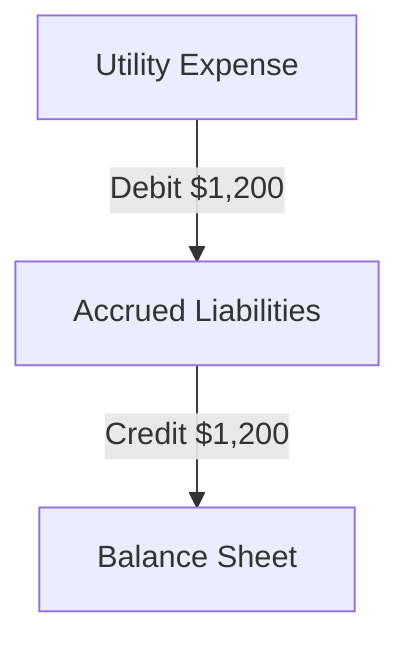

## 2.3 Accrued Expenses and Liabilities

Accrued expenses and liabilities are fundamental concepts in accounting, particularly when preparing financial statements. They represent obligations that a company has incurred but not yet paid by the end of an accounting period. Understanding how to recognize, measure, and report these liabilities is crucial for accurate financial reporting and compliance with Canadian accounting standards.

### Understanding Accrued Expenses and Liabilities

**Accrued Expenses** are expenses that have been incurred but not yet paid. They are recorded in the accounting period in which they occur, regardless of when the cash payment is made. This aligns with the accrual basis of accounting, which recognizes economic events regardless of when cash transactions occur.

**Accrued Liabilities** are the counterpart to accrued expenses on the balance sheet. They represent a company's obligation to pay for goods or services that have been received or used but not yet invoiced or paid for by the end of the accounting period.

#### Common Types of Accrued Expenses

1. **Wages and Salaries Payable**: Employees earn wages that are paid after the end of the pay period. The amount owed for work performed but not yet paid is recorded as an accrued expense.
   
2. **Interest Payable**: Interest on loans or bonds that has accumulated but not yet been paid by the end of the accounting period.

3. **Utilities Payable**: Utility expenses such as electricity, water, and gas that have been consumed but not yet billed or paid.

4. **Taxes Payable**: Taxes that have been incurred but not yet paid, including income taxes, property taxes, and sales taxes.

5. **Rent Payable**: Rent for property or equipment that has been used but not yet paid.

6. **Professional Fees**: Fees for services rendered by consultants, lawyers, or accountants that have been incurred but not yet paid.

### Recognition and Measurement

The recognition of accrued expenses and liabilities involves estimating the amount of expense incurred during the period. This requires careful judgment and often involves estimates based on historical data or contractual terms.

#### Steps for Recognizing Accrued Expenses

1. **Identify the Expense**: Determine which expenses have been incurred but not yet paid by the end of the accounting period.

2. **Estimate the Amount**: Use available data to estimate the amount of the expense. This may involve prorating annual expenses or using historical averages.

3. **Record the Journal Entry**: Debit the appropriate expense account and credit the accrued liabilities account.

**Example**: A company has a monthly utility bill of $1,200, but the bill for December is not received until January. The company would record an accrued expense of $1,200 for December.

### Reporting Accrued Expenses and Liabilities

Accrued expenses are reported on the income statement as part of the total expenses for the period. Accrued liabilities are reported on the balance sheet as current liabilities, reflecting the company's obligation to pay these amounts in the near term.

#### Financial Statement Presentation

- **Income Statement**: Accrued expenses increase the total expenses reported, reducing net income for the period.
- **Balance Sheet**: Accrued liabilities are listed under current liabilities, indicating amounts due within one year.

### Practical Examples and Case Studies

#### Case Study: Accrued Wages

**Scenario**: ABC Corporation has a bi-weekly payroll of $50,000. The payroll period ends on December 31, but the payment is not made until January 5.

**Solution**: ABC Corporation must accrue the wages for the period ending December 31. The journal entry would be:

- **Debit**: Wages Expense $50,000
- **Credit**: Wages Payable $50,000

This ensures that the expense is recognized in the correct period, aligning with the accrual accounting principle.

### Real-World Applications

In practice, accrued expenses and liabilities are crucial for maintaining accurate financial records and ensuring compliance with accounting standards. They provide a more accurate picture of a company's financial position by recognizing obligations as they arise, rather than when cash changes hands.

#### Regulatory Considerations

In Canada, the recognition and measurement of accrued expenses and liabilities are governed by the International Financial Reporting Standards (IFRS) as adopted in Canada. For private enterprises, the Accounting Standards for Private Enterprises (ASPE) provide guidance.

- **IFRS**: Requires the recognition of expenses when they are incurred, regardless of payment timing.
- **ASPE**: Similar to IFRS, but with some differences in measurement and disclosure requirements.

### Common Challenges and Best Practices

#### Challenges

1. **Estimating Accrued Amounts**: Accurately estimating the amount of accrued expenses can be challenging, especially for variable expenses like utilities or professional fees.

2. **Timing of Recognition**: Determining the correct period for recognizing accrued expenses requires careful analysis of when the expense was incurred.

3. **Compliance with Standards**: Ensuring compliance with IFRS or ASPE requires a thorough understanding of the relevant standards and their application.

#### Best Practices

1. **Regular Review**: Regularly review and update estimates for accrued expenses to ensure accuracy.

2. **Documentation**: Maintain thorough documentation of the basis for estimates and the rationale for recognition decisions.

3. **Internal Controls**: Implement strong internal controls to ensure that all accrued expenses are identified and recorded in a timely manner.

### Exam Preparation Tips

1. **Understand Key Concepts**: Focus on understanding the principles of accrual accounting and how they apply to accrued expenses and liabilities.

2. **Practice Journal Entries**: Practice recording journal entries for various types of accrued expenses to reinforce your understanding.

3. **Review Standards**: Familiarize yourself with the relevant sections of IFRS and ASPE that pertain to accrued expenses and liabilities.

4. **Work Through Examples**: Use practical examples and case studies to apply theoretical concepts to real-world scenarios.

5. **Self-Test**: Regularly test your knowledge with practice questions and quizzes to reinforce learning and identify areas for improvement.

### Summary

Accrued expenses and liabilities are essential components of financial accounting, ensuring that expenses are recognized in the period they are incurred. By understanding how to recognize, measure, and report these liabilities, you can ensure accurate financial reporting and compliance with Canadian accounting standards.

---

## **Ready to Test Your Knowledge?**



### Which of the following best describes accrued expenses?

- [x] Expenses incurred but not yet paid
- [ ] Expenses paid in advance
- [ ] Expenses that have been paid and recorded
- [ ] Expenses that are not recognized in the financial statements

> **Explanation:** Accrued expenses are those that have been incurred but not yet paid by the end of the accounting period.

### What is the journal entry to record accrued wages at the end of an accounting period?

- [x] Debit Wages Expense, Credit Wages Payable
- [ ] Debit Wages Payable, Credit Wages Expense
- [ ] Debit Cash, Credit Wages Expense
- [ ] Debit Wages Expense, Credit Cash

> **Explanation:** The correct entry is to debit Wages Expense and credit Wages Payable to recognize the liability.

### How are accrued liabilities reported on the balance sheet?

- [x] As current liabilities
- [ ] As non-current liabilities
- [ ] As equity
- [ ] As assets

> **Explanation:** Accrued liabilities are reported as current liabilities because they represent obligations due within one year.

### Which accounting principle requires the recognition of accrued expenses?

- [x] Accrual basis of accounting
- [ ] Cash basis of accounting
- [ ] Matching principle
- [ ] Revenue recognition principle

> **Explanation:** The accrual basis of accounting requires recognizing expenses when they are incurred, not when they are paid.

### What is the primary challenge in accounting for accrued expenses?

- [x] Estimating the amount of the expense
- [ ] Recording the expense
- [ ] Paying the expense
- [ ] Finding the source of the expense

> **Explanation:** Estimating the amount of the expense is often the most challenging aspect of accounting for accrued expenses.

### Under IFRS, when should an accrued expense be recognized?

- [x] When the expense is incurred
- [ ] When the expense is paid
- [ ] When the invoice is received
- [ ] When the cash is available

> **Explanation:** Under IFRS, expenses should be recognized when they are incurred, regardless of payment timing.

### Which of the following is an example of an accrued liability?

- [x] Interest payable
- [ ] Prepaid rent
- [ ] Inventory
- [ ] Accounts receivable

> **Explanation:** Interest payable is an example of an accrued liability, as it represents interest that has been incurred but not yet paid.

### What is the effect of accrued expenses on the income statement?

- [x] They increase total expenses
- [ ] They decrease total expenses
- [ ] They have no effect
- [ ] They are recorded as revenue

> **Explanation:** Accrued expenses increase total expenses on the income statement, reducing net income.

### True or False: Accrued expenses are recognized only when cash is paid.

- [ ] True
- [x] False

> **Explanation:** False. Accrued expenses are recognized when they are incurred, not when cash is paid.

### What is a best practice for managing accrued expenses?

- [x] Regularly review and update estimates
- [ ] Ignore small amounts
- [ ] Record them only at year-end
- [ ] Wait for invoices before recording

> **Explanation:** Regularly reviewing and updating estimates ensures accuracy and compliance with accounting standards.


