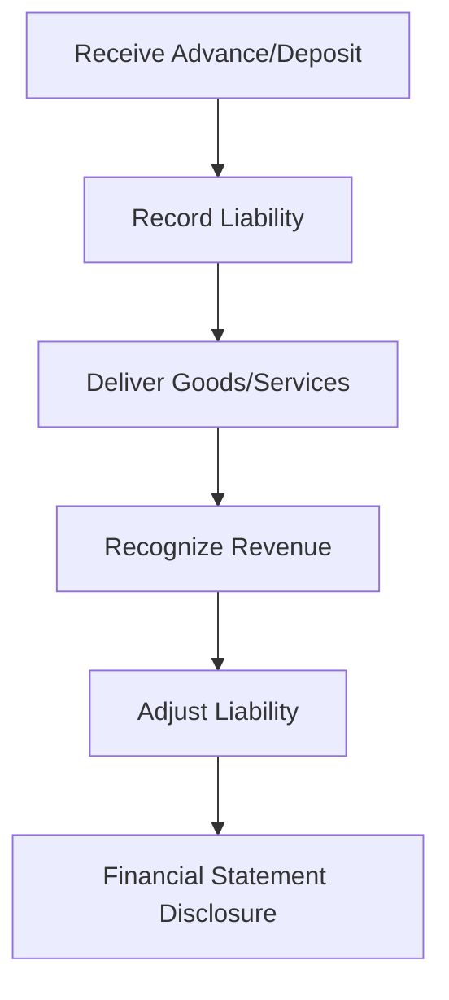

## 2.9 Customer Advances and Deposits

Customer advances and deposits are pivotal components of accounting for current liabilities. They represent funds received from customers before the delivery of goods or services, and are crucial for understanding a company's financial obligations. This section delves into the accounting treatment, recognition, measurement, and reporting of these liabilities, providing a comprehensive guide for those preparing for Canadian accounting exams.

### Understanding Customer Advances and Deposits

**Customer Advances** are payments received from customers for goods or services that are yet to be delivered. These advances are recorded as liabilities because the company has an obligation to either deliver the goods/services or refund the money.

**Customer Deposits** are similar but often refer to security deposits or down payments that may be refundable or applied against future purchases. They serve as a financial assurance for the seller and are also recorded as liabilities until the conditions for their recognition as revenue are met.

### Importance in Financial Reporting

Customer advances and deposits are crucial for several reasons:

- **Cash Flow Management:** They provide liquidity and help in managing cash flow, especially for businesses with long production cycles.
- **Revenue Recognition:** Proper accounting ensures that revenue is recognized in the correct period, adhering to the matching principle.
- **Financial Position:** They affect the balance sheet, reflecting the company's liabilities and financial obligations.

### Recognition and Measurement

#### Recognition

Under both IFRS and ASPE, customer advances and deposits are recognized as liabilities when the payment is received. The liability is derecognized and revenue is recognized when the goods or services are delivered.

#### Measurement

The measurement of customer advances and deposits involves assessing the amount received and any conditions attached. The liability is measured at the amount received, and adjustments are made for any expected refunds or discounts.

### Accounting Treatment

#### Initial Recognition

Upon receipt of an advance or deposit, the following journal entry is made:

```
Debit: Cash/Bank
Credit: Customer Advances/Deposits (Liability)
```

#### Revenue Recognition

When the goods or services are delivered, the liability is reduced, and revenue is recognized:

```
Debit: Customer Advances/Deposits (Liability)
Credit: Revenue
```

#### Refunds

If a refund is necessary, the liability is adjusted accordingly:

```
Debit: Customer Advances/Deposits (Liability)
Credit: Cash/Bank
```

### Practical Examples

#### Example 1: Advance Payment for a Service

A customer pays $5,000 in advance for a service to be provided in the next fiscal quarter. The company records this as a liability:

```
Debit: Cash $5,000
Credit: Customer Advances $5,000
```

Upon service delivery, the entry is reversed, and revenue is recognized:

```
Debit: Customer Advances $5,000
Credit: Revenue $5,000
```

#### Example 2: Security Deposit

A tenant pays a $1,000 security deposit for a rental property. This is recorded as a liability:

```
Debit: Cash $1,000
Credit: Customer Deposits $1,000
```

If the deposit is refunded at the end of the lease, the entry is:

```
Debit: Customer Deposits $1,000
Credit: Cash $1,000
```

### Regulatory Considerations

#### IFRS and ASPE

Both IFRS and ASPE require that customer advances and deposits be recognized as liabilities until the performance obligation is satisfied. Revenue recognition standards, such as IFRS 15, provide guidance on when and how to recognize revenue from these transactions.

#### Compliance and Disclosure

Companies must disclose the nature and amount of customer advances and deposits in their financial statements. This includes any significant terms and conditions, such as refund policies or expected delivery timelines.

### Challenges and Best Practices

#### Common Challenges

- **Timing of Revenue Recognition:** Determining the correct timing for revenue recognition can be complex, especially for long-term contracts.
- **Refund Liabilities:** Estimating potential refunds and adjusting liabilities accordingly can be challenging.
- **Contract Modifications:** Changes in contract terms may require adjustments to liabilities and revenue recognition.

#### Best Practices

- **Clear Contract Terms:** Ensure that contracts clearly define the terms of advances and deposits, including refund conditions.
- **Regular Reconciliation:** Regularly reconcile advances and deposits to ensure accurate financial reporting.
- **Consistent Policies:** Apply consistent accounting policies for similar transactions to maintain comparability.

### Real-World Applications

In industries such as construction, software development, and manufacturing, customer advances and deposits are common. Companies often receive payments before project completion, requiring careful management of these liabilities to ensure accurate financial reporting.

### Case Study: Construction Industry

In the construction industry, customer advances are often received for projects that span multiple accounting periods. Proper accounting ensures that revenue is recognized in line with project completion, adhering to the percentage-of-completion method under IFRS 15.

### Diagrams and Visuals

To better understand the flow of accounting for customer advances and deposits, consider the following diagram:



### Summary

Customer advances and deposits are essential components of accounting for liabilities. Proper recognition, measurement, and reporting ensure accurate financial statements and compliance with accounting standards. By understanding the intricacies of these transactions, you can effectively manage and report them in line with Canadian accounting standards.

### References

- **IFRS 15:** Revenue from Contracts with Customers
- **CPA Canada:** Handbook on Accounting Standards
- **ASPE:** Accounting Standards for Private Enterprises

## **Ready to Test Your Knowledge?**



### What is the primary reason customer advances are recorded as liabilities?

- [x] They represent an obligation to deliver goods or services.
- [ ] They are considered revenue upon receipt.
- [ ] They increase the company's equity.
- [ ] They are refundable deposits.

> **Explanation:** Customer advances are recorded as liabilities because they represent an obligation to deliver goods or services in the future.

### How are customer deposits typically measured?

- [x] At the amount received.
- [ ] At the fair market value.
- [ ] At the discounted present value.
- [ ] At the estimated future value.

> **Explanation:** Customer deposits are measured at the amount received, reflecting the liability until conditions for revenue recognition are met.

### When is revenue recognized for customer advances?

- [x] When goods or services are delivered.
- [ ] When the advance is received.
- [ ] At the end of the fiscal year.
- [ ] When the contract is signed.

> **Explanation:** Revenue is recognized when the goods or services are delivered, satisfying the performance obligation.

### What accounting entry is made upon receiving a customer advance?

- [x] Debit Cash; Credit Customer Advances (Liability)
- [ ] Debit Revenue; Credit Cash
- [ ] Debit Customer Advances; Credit Revenue
- [ ] Debit Cash; Credit Revenue

> **Explanation:** Upon receiving a customer advance, the entry is to debit cash and credit customer advances as a liability.

### Which standard provides guidance on revenue recognition for customer advances?

- [x] IFRS 15
- [ ] IFRS 9
- [ ] ASPE 12
- [ ] CPA Handbook Section 3856

> **Explanation:** IFRS 15 provides guidance on revenue recognition for customer advances, ensuring compliance with performance obligations.

### What is a common challenge in accounting for customer advances?

- [x] Timing of revenue recognition
- [ ] Measuring cash flow
- [ ] Calculating interest expense
- [ ] Determining asset depreciation

> **Explanation:** A common challenge is determining the correct timing for revenue recognition, especially for long-term contracts.

### How should a company disclose customer advances in financial statements?

- [x] As a liability with terms and conditions
- [ ] As revenue with expected delivery timelines
- [ ] As equity with refund policies
- [ ] As an asset with contract modifications

> **Explanation:** Companies should disclose customer advances as a liability, including significant terms and conditions.

### What happens if a customer advance is refunded?

- [x] The liability is adjusted, and cash is credited.
- [ ] Revenue is recognized, and cash is debited.
- [ ] The liability is increased, and cash is debited.
- [ ] Revenue is reduced, and cash is credited.

> **Explanation:** If a customer advance is refunded, the liability is adjusted, and cash is credited to reflect the refund.

### True or False: Customer deposits are always non-refundable.

- [ ] True
- [x] False

> **Explanation:** Customer deposits can be refundable or non-refundable, depending on the contract terms.

### What is a best practice for managing customer advances?

- [x] Regular reconciliation and clear contract terms
- [ ] Immediate revenue recognition
- [ ] Delaying liability recognition
- [ ] Ignoring refund conditions

> **Explanation:** Best practices include regular reconciliation and ensuring clear contract terms to manage customer advances effectively.


