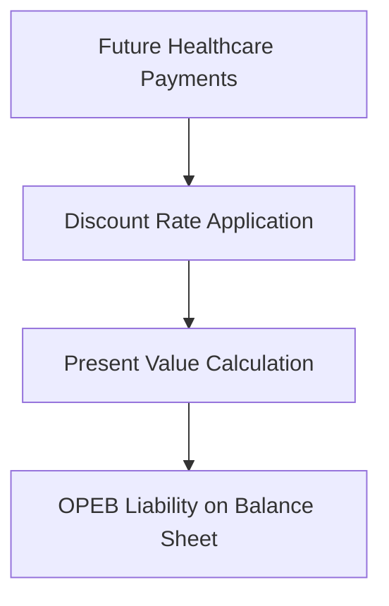

## 3.5 Post-retirement Benefits Other Than Pensions

Post-retirement benefits other than pensions (OPEB) represent a significant financial obligation for many organizations. These benefits, which often include healthcare, dental, vision, and life insurance, are promised to employees after they retire. Understanding how to account for these benefits is crucial for accurate financial reporting and compliance with Canadian accounting standards. This section will guide you through the recognition, measurement, and reporting of OPEB, providing practical examples and insights into the regulatory framework.

### Understanding Post-retirement Benefits Other Than Pensions

#### Definition and Scope

Post-retirement benefits other than pensions are benefits that a company provides to its retirees, excluding pension benefits. These typically include:

- **Healthcare Benefits:** Medical, dental, and vision coverage.
- **Life Insurance:** Coverage that continues post-retirement.
- **Long-term Care:** Services for chronic illness or disability.
- **Other Benefits:** Such as legal services or tuition assistance.

These benefits are often part of an employee's total compensation package and are promised during the employee's working years, to be delivered upon retirement.

#### Importance in Financial Reporting

The obligation to provide OPEB represents a long-term liability on a company's balance sheet. Proper accounting for these benefits is essential for:

- **Accurate Financial Statements:** Reflecting the true financial position of the company.
- **Investor Confidence:** Providing transparency and reliability in financial reporting.
- **Regulatory Compliance:** Adhering to standards set by bodies such as the International Financial Reporting Standards (IFRS) and Accounting Standards for Private Enterprises (ASPE).

### Recognition and Measurement of OPEB Obligations

#### Accounting Standards and Framework

In Canada, the accounting for OPEB is guided by IFRS and ASPE. Key standards include:

- **IAS 19 (Employee Benefits):** Provides guidance on the recognition and measurement of employee benefits, including OPEB.
- **CPA Canada Handbook:** Offers additional insights and interpretations relevant to Canadian entities.

#### Recognition Criteria

To recognize a liability for OPEB, the following criteria must be met:

1. **Obligation Exists:** The company has a present obligation to provide benefits.
2. **Past Event:** The obligation arises from past employee service.
3. **Reliable Measurement:** The cost of the obligation can be reliably measured.

#### Measurement of OPEB Liabilities

The measurement of OPEB liabilities involves estimating the future benefits that will be paid to retirees and discounting them to present value. This process includes:

- **Actuarial Valuation:** Using actuarial methods to estimate the cost of future benefits.
- **Discount Rate:** Applying a discount rate to bring future cash flows to present value.
- **Assumptions:** Making assumptions about factors such as healthcare cost trends, employee turnover, and mortality rates.

### Practical Examples and Case Studies

#### Example: Calculating OPEB Obligation

Consider a company that provides healthcare benefits to its retirees. The company estimates that it will pay $1 million in healthcare benefits over the next 20 years. Using a discount rate of 5%, the present value of this obligation can be calculated as follows:

This diagram illustrates the process of calculating the present value of future healthcare payments, which is then recognized as a liability on the balance sheet.

#### Case Study: Healthcare Cost Trend Analysis

A Canadian manufacturing company offers post-retirement healthcare benefits to its employees. Over the years, the company has observed a steady increase in healthcare costs, impacting its financial statements. By conducting a trend analysis, the company can better estimate future costs and adjust its financial planning accordingly.

### Reporting and Disclosure Requirements

#### Financial Statement Presentation

OPEB liabilities are presented on the balance sheet under long-term liabilities. The income statement reflects the annual expense related to these benefits, which includes:

- **Service Cost:** The present value of benefits earned by employees in the current period.
- **Interest Cost:** The increase in the obligation due to the passage of time.
- **Actuarial Gains/Losses:** Changes in the obligation due to changes in assumptions or experience.

#### Disclosure Requirements

Companies must disclose the following information in their financial statements:

- **Description of the Benefits:** Types of benefits provided and eligibility criteria.
- **Actuarial Assumptions:** Key assumptions used in measuring the obligation.
- **Reconciliation of Obligation:** Changes in the obligation during the period.
- **Sensitivity Analysis:** Impact of changes in key assumptions on the obligation.

### Challenges and Best Practices

#### Common Challenges

- **Estimating Future Costs:** Healthcare cost trends can be volatile and difficult to predict.
- **Complex Actuarial Calculations:** Requires specialized knowledge and expertise.
- **Regulatory Changes:** Keeping up with changes in accounting standards and regulations.

#### Best Practices

- **Regular Actuarial Reviews:** Conduct regular reviews to update assumptions and estimates.
- **Transparent Disclosures:** Provide clear and comprehensive disclosures in financial statements.
- **Proactive Financial Planning:** Incorporate OPEB obligations into long-term financial planning.

### Regulatory Considerations and Compliance

#### Canadian Accounting Standards

In Canada, companies must comply with IFRS or ASPE, depending on their classification. Public companies typically follow IFRS, while private enterprises may choose ASPE. Key differences include:

- **Recognition and Measurement:** IFRS tends to be more prescriptive, while ASPE offers more flexibility.
- **Disclosure Requirements:** IFRS generally requires more extensive disclosures.

#### Global Comparisons

While Canadian standards align closely with IFRS, there are differences compared to U.S. GAAP. For example, U.S. GAAP requires the use of a specific discount rate based on high-quality corporate bonds, while IFRS allows more discretion.

### Real-world Applications and Implications

#### Impact on Financial Ratios

OPEB liabilities can significantly impact a company's financial ratios, such as:

- **Debt-to-Equity Ratio:** Increased liabilities can affect leverage ratios.
- **Return on Assets (ROA):** Higher expenses can reduce profitability metrics.

#### Strategic Considerations

Companies may consider strategies to manage OPEB obligations, such as:

- **Prefunding Benefits:** Setting aside funds to cover future obligations.
- **Benefit Redesign:** Modifying benefit plans to reduce costs.
- **Risk Management:** Using insurance or other financial instruments to mitigate risk.

### Conclusion

Accounting for post-retirement benefits other than pensions is a complex but essential aspect of financial reporting. By understanding the recognition, measurement, and reporting requirements, companies can ensure accurate financial statements and maintain compliance with Canadian accounting standards. As you prepare for the Canadian Accounting Exams, focus on the key concepts and standards discussed in this section, and practice applying them through examples and case studies.

## **Ready to Test Your Knowledge?**



### What are post-retirement benefits other than pensions?

- [x] Benefits provided to retirees, excluding pension benefits
- [ ] Only pension benefits provided to retirees
- [ ] Benefits provided to current employees
- [ ] Short-term benefits for retirees

> **Explanation:** Post-retirement benefits other than pensions include healthcare, life insurance, and other benefits provided to retirees, excluding pension benefits.

### Which accounting standard provides guidance on OPEB in Canada?

- [x] IAS 19
- [ ] IFRS 16
- [ ] ASPE 12
- [ ] CPA 101

> **Explanation:** IAS 19 provides guidance on the recognition and measurement of employee benefits, including OPEB.

### What is the primary challenge in estimating OPEB obligations?

- [x] Estimating future healthcare costs
- [ ] Calculating pension benefits
- [ ] Determining employee salaries
- [ ] Estimating current liabilities

> **Explanation:** Estimating future healthcare costs is challenging due to volatility and unpredictability in healthcare trends.

### What is included in the annual expense related to OPEB?

- [x] Service cost, interest cost, and actuarial gains/losses
- [ ] Only service cost
- [ ] Only interest cost
- [ ] Only actuarial gains/losses

> **Explanation:** The annual expense includes service cost, interest cost, and actuarial gains/losses.

### Which of the following is a best practice for managing OPEB obligations?

- [x] Regular actuarial reviews
- [ ] Ignoring future cost trends
- [x] Transparent disclosures
- [ ] Reducing employee benefits without notice

> **Explanation:** Regular actuarial reviews and transparent disclosures are best practices for managing OPEB obligations.

### How are OPEB liabilities presented on the balance sheet?

- [x] Under long-term liabilities
- [ ] Under current liabilities
- [ ] As equity
- [ ] As revenue

> **Explanation:** OPEB liabilities are presented under long-term liabilities on the balance sheet.

### What impact do OPEB liabilities have on the debt-to-equity ratio?

- [x] Increase the ratio
- [ ] Decrease the ratio
- [x] Affect leverage ratios
- [ ] No impact

> **Explanation:** OPEB liabilities increase the debt-to-equity ratio, affecting leverage ratios.

### What is a strategic consideration for managing OPEB obligations?

- [x] Prefunding benefits
- [ ] Ignoring future obligations
- [ ] Increasing benefit costs
- [ ] Reducing transparency

> **Explanation:** Prefunding benefits is a strategic consideration for managing OPEB obligations.

### What is the role of actuarial valuation in measuring OPEB liabilities?

- [x] Estimating the cost of future benefits
- [ ] Calculating current salaries
- [ ] Determining pension obligations
- [ ] Estimating short-term liabilities

> **Explanation:** Actuarial valuation is used to estimate the cost of future benefits for OPEB liabilities.

### True or False: OPEB includes pension benefits.

- [ ] True
- [x] False

> **Explanation:** OPEB excludes pension benefits and includes other post-retirement benefits like healthcare and life insurance.


