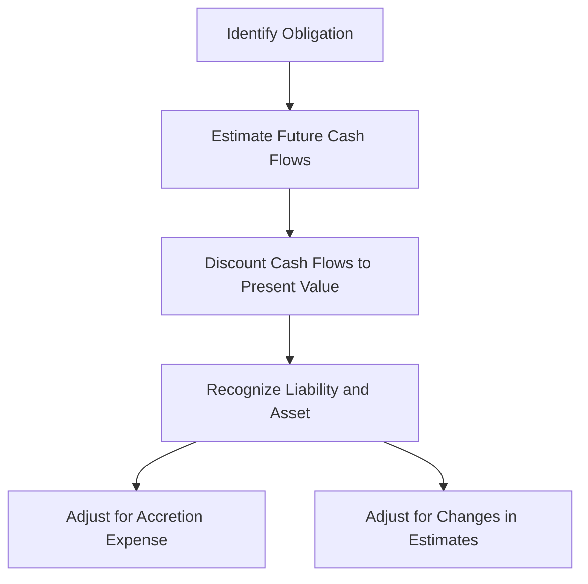

## 3.7 Asset Retirement Obligations

Asset Retirement Obligations (AROs) represent a significant aspect of accounting for long-term liabilities, particularly in industries where the retirement of tangible long-lived assets involves substantial costs. These obligations often arise in sectors such as oil and gas, mining, and utilities, where companies are required to dismantle, remove, or restore assets to comply with environmental regulations or contractual agreements. Understanding AROs is crucial for accurate financial reporting and compliance with Canadian accounting standards, including International Financial Reporting Standards (IFRS) and Accounting Standards for Private Enterprises (ASPE).

### Understanding Asset Retirement Obligations

#### Definition and Scope

An Asset Retirement Obligation is a legal obligation associated with the retirement of a tangible long-lived asset that a company must settle as part of its operations. These obligations typically involve the cost of dismantling, removing, or restoring an asset and are often linked to environmental remediation requirements. The recognition and measurement of AROs are guided by specific accounting standards, ensuring that companies accurately reflect these future costs in their financial statements.

#### Regulatory Framework

In Canada, the accounting treatment of AROs is primarily governed by IFRS for publicly accountable enterprises and ASPE for private enterprises. IFRS 16 and IAS 37 provide guidance on recognizing and measuring AROs, while ASPE Section 3110 outlines the requirements for private enterprises. These standards ensure consistency in reporting and help stakeholders understand the financial implications of asset retirement obligations.

#### Importance in Financial Reporting

Accurate reporting of AROs is essential for several reasons:

- **Financial Statement Accuracy:** Proper recognition and measurement of AROs ensure that financial statements accurately reflect a company's liabilities and future cash outflows.
- **Investor Confidence:** Transparent reporting of AROs enhances investor confidence by providing a clear picture of a company's financial health and long-term sustainability.
- **Regulatory Compliance:** Adhering to accounting standards and environmental regulations helps companies avoid legal penalties and reputational damage.

### Recognition and Measurement of Asset Retirement Obligations

#### Initial Recognition

AROs are recognized when a company has a legal obligation to retire an asset, the obligation can be reasonably estimated, and it is probable that an outflow of resources will be required to settle the obligation. The initial recognition involves recording a liability and a corresponding increase in the carrying amount of the related asset.

#### Measurement

The measurement of an ARO involves estimating the fair value of the obligation at the time of recognition. This process includes:

1. **Estimating Future Cash Flows:** Companies must estimate the future cash flows required to settle the obligation, considering factors such as inflation, technological advancements, and regulatory changes.

2. **Discounting Cash Flows:** The estimated future cash flows are discounted to their present value using a risk-adjusted discount rate. This rate reflects the time value of money and the risks specific to the obligation.

3. **Revisions and Adjustments:** AROs are subject to periodic revisions as new information becomes available. Changes in estimates, discount rates, or the timing of cash flows can lead to adjustments in the liability and the related asset.

#### Subsequent Measurement

After initial recognition, AROs are adjusted for accretion expense and changes in estimates. Accretion expense represents the increase in the liability due to the passage of time and is recognized as an operating expense. Changes in estimates, such as revisions to the timing or amount of future cash flows, are reflected in the carrying amount of the liability and the related asset.

### Practical Examples and Case Studies

#### Example 1: Oil and Gas Industry

Consider an oil company that operates offshore drilling platforms. The company is legally obligated to dismantle and remove the platforms at the end of their useful life, restoring the seabed to its natural state. The estimated cost of dismantling and restoration is $10 million, expected to occur in 20 years. Using a discount rate of 5%, the present value of the ARO is calculated and recognized as a liability on the company's balance sheet.

#### Example 2: Mining Industry

A mining company operates a coal mine with an estimated closure cost of $5 million, expected to occur in 10 years. The company uses a discount rate of 4% to calculate the present value of the ARO. Changes in environmental regulations require the company to revise its estimates, leading to an increase in the liability and a corresponding adjustment to the asset's carrying amount.

### Real-world Applications and Regulatory Scenarios

#### Environmental Remediation Costs

AROs often involve significant environmental remediation costs, particularly in industries with a substantial environmental impact. Companies must comply with environmental regulations and industry standards, ensuring that they adequately account for these costs in their financial statements. Failure to do so can result in legal penalties, reputational damage, and financial losses.

#### Compliance with Canadian Accounting Standards

Canadian companies must adhere to IFRS or ASPE when accounting for AROs, depending on their reporting requirements. These standards provide a framework for recognizing, measuring, and reporting AROs, ensuring consistency and transparency in financial reporting. Companies must stay informed about changes in accounting standards and regulatory requirements to maintain compliance and avoid potential pitfalls.

### Step-by-step Guidance for Accounting Procedures

#### Step 1: Identify the Obligation

The first step in accounting for AROs is identifying the legal obligation associated with the retirement of a tangible long-lived asset. This involves reviewing contracts, regulations, and industry standards to determine the specific requirements for asset retirement.

#### Step 2: Estimate Future Cash Flows

Once the obligation is identified, companies must estimate the future cash flows required to settle the obligation. This involves considering factors such as inflation, technological advancements, and regulatory changes that may impact the cost of asset retirement.

#### Step 3: Discount Cash Flows to Present Value

The estimated future cash flows are discounted to their present value using a risk-adjusted discount rate. This rate reflects the time value of money and the risks specific to the obligation, ensuring that the liability is accurately measured.

#### Step 4: Recognize the Liability and Asset

The present value of the ARO is recognized as a liability on the balance sheet, with a corresponding increase in the carrying amount of the related asset. This ensures that the financial statements accurately reflect the company's obligations and future cash outflows.

#### Step 5: Adjust for Accretion Expense and Changes in Estimates

After initial recognition, AROs are adjusted for accretion expense and changes in estimates. Accretion expense represents the increase in the liability due to the passage of time and is recognized as an operating expense. Changes in estimates, such as revisions to the timing or amount of future cash flows, are reflected in the carrying amount of the liability and the related asset.

### Diagrams and Visuals

To enhance understanding, consider the following diagram illustrating the process of recognizing and measuring an ARO:

### Best Practices, Common Pitfalls, and Strategies

#### Best Practices

- **Regularly Review Estimates:** Companies should regularly review and update their estimates for AROs, considering changes in regulations, technology, and market conditions.
- **Engage Experts:** Engaging environmental and financial experts can help companies accurately estimate future cash flows and assess the risks associated with AROs.
- **Maintain Compliance:** Staying informed about changes in accounting standards and regulatory requirements is crucial for maintaining compliance and avoiding legal penalties.

#### Common Pitfalls

- **Underestimating Costs:** Failing to accurately estimate the costs of asset retirement can lead to significant financial liabilities and reputational damage.
- **Ignoring Regulatory Changes:** Companies that fail to account for changes in environmental regulations may face legal penalties and increased costs.
- **Inadequate Documentation:** Inadequate documentation of AROs can lead to audit challenges and compliance issues.

#### Strategies to Overcome Challenges

- **Implement Robust Processes:** Establishing robust processes for identifying, estimating, and reporting AROs can help companies avoid common pitfalls and maintain compliance.
- **Leverage Technology:** Utilizing technology and data analytics can enhance the accuracy of estimates and streamline the accounting process for AROs.
- **Foster Collaboration:** Encouraging collaboration between finance, operations, and environmental teams can improve the accuracy and completeness of ARO reporting.

### References to Canadian Accounting Standards and Resources

- **IFRS 16 and IAS 37:** These standards provide guidance on recognizing and measuring AROs for publicly accountable enterprises.
- **ASPE Section 3110:** This section outlines the requirements for accounting for AROs in private enterprises.
- **CPA Canada:** The Chartered Professional Accountants of Canada offers resources and guidance on accounting for AROs, including publications, webinars, and professional development courses.

### Encouragement for Practice and Application

To reinforce your understanding of AROs, consider working through practice problems and case studies. These exercises can help you apply the principles and knowledge gained from this guide, preparing you for the Canadian Accounting Exams and your future career in accounting.

### Summary

Asset Retirement Obligations represent a critical aspect of accounting for long-term liabilities, particularly in industries with significant environmental impacts. Understanding the recognition, measurement, and reporting of AROs is essential for accurate financial reporting and compliance with Canadian accounting standards. By following best practices and staying informed about regulatory changes, companies can effectively manage their AROs and maintain investor confidence.

## **Ready to Test Your Knowledge?**



### What is an Asset Retirement Obligation (ARO)?

- [x] A legal obligation associated with the retirement of a tangible long-lived asset.
- [ ] A financial asset that generates income over time.
- [ ] A short-term liability related to inventory purchases.
- [ ] An intangible asset that increases in value over time.

> **Explanation:** An ARO is a legal obligation to retire a tangible long-lived asset, often involving dismantling, removal, or restoration costs.

### Which industries commonly face Asset Retirement Obligations?

- [x] Oil and gas
- [x] Mining
- [ ] Retail
- [ ] Technology

> **Explanation:** Industries like oil and gas and mining often face AROs due to the environmental impact and regulatory requirements associated with asset retirement.

### Under which accounting standards are AROs recognized in Canada?

- [x] IFRS and ASPE
- [ ] GAAP only
- [ ] FASB only
- [ ] None of the above

> **Explanation:** In Canada, AROs are recognized under IFRS for publicly accountable enterprises and ASPE for private enterprises.

### What is the purpose of discounting future cash flows in ARO measurement?

- [x] To calculate the present value of the obligation
- [ ] To increase the liability amount
- [ ] To decrease the asset's carrying amount
- [ ] To eliminate the obligation

> **Explanation:** Discounting future cash flows to their present value ensures that the liability is accurately measured, reflecting the time value of money.

### What is accretion expense in the context of AROs?

- [x] The increase in the liability due to the passage of time
- [ ] The decrease in the asset's carrying amount
- [ ] The cost of acquiring new assets
- [ ] The revenue generated from asset sales

> **Explanation:** Accretion expense represents the increase in the ARO liability over time, recognized as an operating expense.

### Why is it important to regularly review estimates for AROs?

- [x] To ensure accuracy and compliance with changing regulations
- [ ] To reduce the liability amount
- [ ] To increase the asset's carrying amount
- [ ] To eliminate the obligation

> **Explanation:** Regularly reviewing estimates ensures that AROs are accurately reported, considering changes in regulations, technology, and market conditions.

### What role do environmental experts play in estimating AROs?

- [x] They help accurately estimate future cash flows and assess risks.
- [ ] They eliminate the need for financial reporting.
- [ ] They reduce the liability amount.
- [ ] They increase the asset's carrying amount.

> **Explanation:** Environmental experts provide valuable insights into estimating future cash flows and assessing the risks associated with AROs.

### What is the impact of failing to account for changes in environmental regulations?

- [x] Legal penalties and increased costs
- [ ] Reduced liability amounts
- [ ] Increased asset values
- [ ] Elimination of obligations

> **Explanation:** Failing to account for regulatory changes can lead to legal penalties and increased costs for companies.

### How can technology enhance the accuracy of ARO estimates?

- [x] By utilizing data analytics and streamlining the accounting process
- [ ] By eliminating the need for financial reporting
- [ ] By reducing the liability amount
- [ ] By increasing the asset's carrying amount

> **Explanation:** Technology and data analytics can improve the accuracy of ARO estimates and streamline the accounting process.

### True or False: AROs are only relevant for publicly accountable enterprises.

- [ ] True
- [x] False

> **Explanation:** AROs are relevant for both publicly accountable enterprises and private enterprises, governed by IFRS and ASPE respectively.


