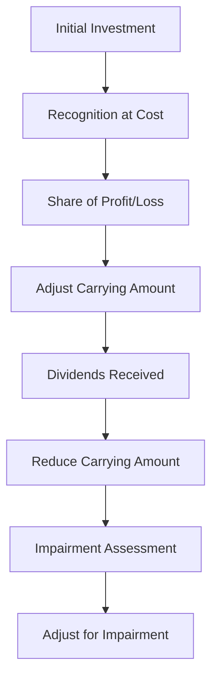

## 4.15 Equity-method Investments

### Introduction to Equity-method Investments

Equity-method investments are an essential aspect of accounting for entities where an investor has significant influence over the investee but does not have full control. This method is crucial for accurately reflecting the investor's share of the investee's financial performance and position in the investor's financial statements. Understanding the equity method is vital for Canadian accounting exams, as it aligns with both International Financial Reporting Standards (IFRS) and Accounting Standards for Private Enterprises (ASPE) in Canada.

### Understanding Significant Influence

Significant influence is the power to participate in the financial and operating policy decisions of the investee but not control or jointly control those policies. Typically, significant influence is presumed when an investor holds 20% to 50% of the voting power of the investee. However, other factors such as representation on the board of directors, participation in policy-making processes, and material transactions between the investor and investee can also indicate significant influence.

### Accounting Standards and Framework

In Canada, the equity method of accounting is governed by IAS 28 "Investments in Associates and Joint Ventures" under IFRS and Section 3051 "Investments" under ASPE. Both standards provide guidance on when and how to apply the equity method, ensuring that the financial statements reflect the economic realities of the investor-investee relationship.

### Initial Recognition and Measurement

When an investment is acquired, it is initially recognized at cost. This includes the purchase price and any directly attributable transaction costs. The cost of the investment is subsequently adjusted to recognize the investor's share of the investee's profits or losses after the acquisition date.

#### Example:

Suppose Company A acquires a 30% interest in Company B for $1,000,000. The initial recognition of the investment would be recorded as follows:

```
Debit: Investment in Company B $1,000,000
Credit: Cash $1,000,000
```

### Subsequent Measurement

Under the equity method, the carrying amount of the investment is adjusted for the investor's share of the investee's profits or losses. Dividends received from the investee reduce the carrying amount of the investment.

#### Example:

If Company B reports a net income of $200,000, Company A would recognize its share of the income (30%) as follows:

```
Debit: Investment in Company B $60,000
Credit: Investment Income $60,000
```

If Company B declares dividends of $50,000, Company A would record its share of the dividends (30%) as follows:

```
Debit: Cash $15,000
Credit: Investment in Company B $15,000
```

### Impairment of Equity-method Investments

Investments accounted for under the equity method must be assessed for impairment. If there is objective evidence of impairment, the investment's carrying amount is reduced to its recoverable amount, and the impairment loss is recognized in profit or loss.

#### Example:

If Company A determines that the recoverable amount of its investment in Company B is $900,000, and the carrying amount is $950,000, an impairment loss of $50,000 would be recorded:

```
Debit: Impairment Loss $50,000
Credit: Investment in Company B $50,000
```

### Changes in Ownership Interest

When an investor's ownership interest changes, the equity method continues to be applied as long as significant influence is maintained. If the investor loses significant influence, the equity method is discontinued, and the investment is accounted for under IFRS 9 "Financial Instruments" or ASPE Section 3856 "Financial Instruments."

### Real-world Application and Case Study

Consider a scenario where a Canadian company, Maple Corp, holds a 25% interest in an associate, Northern Ltd. Maple Corp actively participates in Northern Ltd's strategic decisions, affirming significant influence. Over the year, Northern Ltd reports a profit of $400,000 and declares dividends of $80,000. Maple Corp's share of the profit and dividends would be recorded as follows:

```
Profit Share:
Debit: Investment in Northern Ltd $100,000
Credit: Investment Income $100,000

Dividend Share:
Debit: Cash $20,000
Credit: Investment in Northern Ltd $20,000
```

### Regulatory Considerations

Canadian accountants must adhere to the CPA Canada Handbook, which incorporates IFRS and ASPE standards. Understanding the nuances of these standards is crucial for compliance and accurate financial reporting.

### Practical Challenges and Best Practices

- **Complexity in Determining Significant Influence:** Evaluating significant influence requires judgment and consideration of qualitative factors beyond mere percentage ownership.
- **Impairment Assessment:** Regularly assess investments for impairment and document the rationale for any impairment decisions.
- **Consistent Application:** Ensure consistent application of the equity method across reporting periods and entities.

### Diagrams and Visuals

To enhance understanding, consider the following diagram illustrating the flow of accounting entries for equity-method investments:



### Summary

Equity-method investments are a critical component of financial reporting for entities with significant influence over their investees. Mastery of this topic is essential for Canadian accounting exams and professional practice. By understanding the principles, calculations, and regulatory requirements, you can confidently apply the equity method in real-world scenarios.

### References and Further Reading

- CPA Canada Handbook: IAS 28 "Investments in Associates and Joint Ventures"
- CPA Canada Handbook: ASPE Section 3051 "Investments"
- IFRS 9 "Financial Instruments"
- ASPE Section 3856 "Financial Instruments"

### Practice Questions

To reinforce your understanding, attempt the following practice questions.

## **Ready to Test Your Knowledge?**



### What is the primary criterion for applying the equity method of accounting?

- [x] Significant influence over the investee
- [ ] Control over the investee
- [ ] Joint control over the investee
- [ ] No influence over the investee

> **Explanation:** The equity method is applied when the investor has significant influence over the investee, typically indicated by ownership of 20% to 50% of voting shares.

### How is the initial cost of an equity-method investment recognized?

- [x] At cost, including purchase price and transaction costs
- [ ] At fair value
- [ ] At book value of the investee
- [ ] At market value

> **Explanation:** The initial cost of an equity-method investment is recognized at cost, which includes the purchase price and any directly attributable transaction costs.

### What happens to the carrying amount of an equity-method investment when the investee reports a profit?

- [x] It is increased by the investor's share of the profit
- [ ] It is decreased by the investor's share of the profit
- [ ] It remains unchanged
- [ ] It is adjusted to fair value

> **Explanation:** The carrying amount of an equity-method investment is increased by the investor's share of the investee's profit.

### How are dividends received from an investee accounted for under the equity method?

- [x] They reduce the carrying amount of the investment
- [ ] They increase the carrying amount of the investment
- [ ] They are recognized as dividend income
- [ ] They are ignored

> **Explanation:** Dividends received from an investee reduce the carrying amount of the investment under the equity method.

### When is an impairment loss recognized for an equity-method investment?

- [x] When there is objective evidence of impairment
- [ ] When the market value decreases
- [ ] When the investee reports a loss
- [ ] When dividends are received

> **Explanation:** An impairment loss is recognized when there is objective evidence that the investment is impaired, and its carrying amount exceeds the recoverable amount.

### What should be done if the investor loses significant influence over the investee?

- [x] Discontinue the equity method and apply IFRS 9 or ASPE Section 3856
- [ ] Continue using the equity method
- [ ] Apply the cost method
- [ ] Consolidate the investee's financial statements

> **Explanation:** If the investor loses significant influence, the equity method is discontinued, and the investment is accounted for under IFRS 9 or ASPE Section 3856.

### What percentage of ownership typically indicates significant influence?

- [x] 20% to 50%
- [ ] 10% to 20%
- [ ] 50% to 100%
- [ ] Less than 20%

> **Explanation:** Significant influence is typically indicated by ownership of 20% to 50% of the voting shares of the investee.

### How is the investor's share of the investee's profit or loss recognized?

- [x] As an adjustment to the carrying amount of the investment
- [ ] As dividend income
- [ ] As interest income
- [ ] As a liability

> **Explanation:** The investor's share of the investee's profit or loss is recognized as an adjustment to the carrying amount of the investment.

### What is the impact of dividends declared by the investee on the investor's financial statements?

- [x] They reduce the carrying amount of the investment
- [ ] They increase the carrying amount of the investment
- [ ] They are recognized as revenue
- [ ] They have no impact

> **Explanation:** Dividends declared by the investee reduce the carrying amount of the investment under the equity method.

### True or False: The equity method is used when the investor has control over the investee.

- [ ] True
- [x] False

> **Explanation:** False. The equity method is used when the investor has significant influence, not control, over the investee.


