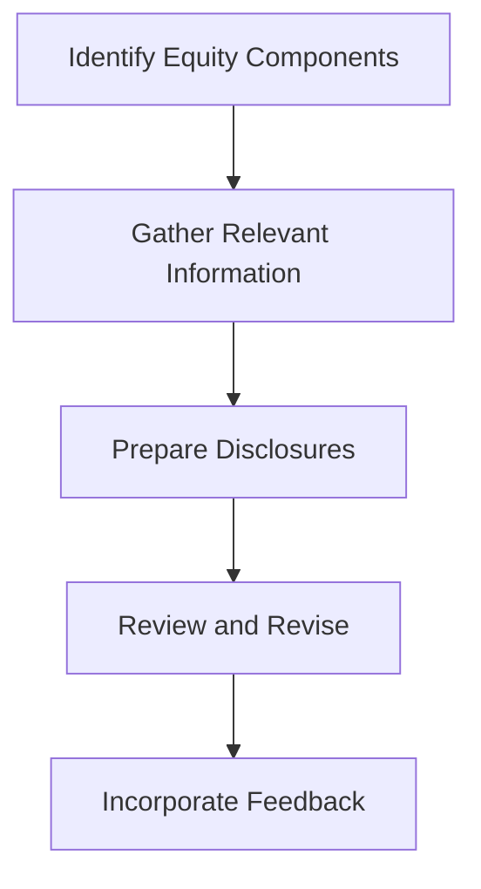

## 4.16 Disclosure Requirements for Equity

Understanding the disclosure requirements for equity is crucial for accurate financial reporting and compliance with accounting standards in Canada. This section provides a comprehensive guide to the necessary disclosures related to equity transactions and balances, focusing on the International Financial Reporting Standards (IFRS) as adopted in Canada and the Accounting Standards for Private Enterprises (ASPE). By mastering these requirements, you will be better prepared for the Canadian accounting exams and equipped to handle real-world financial reporting challenges.

### Introduction to Equity Disclosures

Equity disclosures provide stakeholders with essential information about a company's equity structure, changes in equity, and related transactions. These disclosures enhance transparency and allow investors, creditors, and other users of financial statements to make informed decisions. Key components of equity that require disclosure include common stock, preferred stock, additional paid-in capital, retained earnings, treasury stock, and accumulated other comprehensive income.

### Key Disclosure Components

#### 1. **Common and Preferred Stock**

- **Description and Classification:** Disclosures should include the number of shares authorized, issued, and outstanding for both common and preferred stock. Companies must also disclose the par value per share, if applicable, and any rights, preferences, and restrictions associated with each class of stock.

- **Example:** A company with multiple classes of stock must disclose the rights and privileges of each class, such as voting rights, dividend preferences, and liquidation preferences.

#### 2. **Additional Paid-in Capital**

- **Nature and Source:** This component represents the excess amount paid by investors over the par value of the stock. Disclosures should explain the nature and source of additional paid-in capital, including any transactions that led to changes in this account.

- **Example:** If a company issues stock options, the fair value of the options at the grant date should be disclosed as part of additional paid-in capital.

#### 3. **Retained Earnings**

- **Changes and Restrictions:** Disclosures should detail changes in retained earnings during the reporting period, including net income, dividends declared, and any prior period adjustments. Companies must also disclose any restrictions on retained earnings, such as legal or contractual restrictions.

- **Example:** A company may have restrictions on retained earnings due to loan covenants, which should be disclosed to inform stakeholders of potential limitations on dividend payments.

#### 4. **Treasury Stock**

- **Transactions and Impact:** Disclosures should include information about treasury stock transactions, such as the number of shares repurchased, the cost of repurchase, and the impact on equity. Companies must also disclose the accounting method used for treasury stock transactions.

- **Example:** If a company uses the cost method for treasury stock, it should disclose the cost of shares repurchased and any subsequent reissuance of treasury shares.

#### 5. **Accumulated Other Comprehensive Income (AOCI)**

- **Components and Changes:** AOCI includes items such as foreign currency translation adjustments, unrealized gains and losses on available-for-sale securities, and pension plan adjustments. Disclosures should detail the components of AOCI and any changes during the reporting period.

- **Example:** A company with significant foreign operations should disclose the impact of foreign currency translation adjustments on AOCI.

### Regulatory Framework and Standards

#### **International Financial Reporting Standards (IFRS)**

Under IFRS, equity disclosures are governed by several standards, including IAS 1 (Presentation of Financial Statements), IAS 32 (Financial Instruments: Presentation), and IFRS 7 (Financial Instruments: Disclosures). These standards require comprehensive disclosures about an entity's equity structure, changes in equity, and the nature of equity instruments.

#### **Accounting Standards for Private Enterprises (ASPE)**

ASPE Section 3251 (Equity) outlines the disclosure requirements for equity for private enterprises in Canada. While similar to IFRS, ASPE may have different requirements or allow for simplified disclosures for private companies.

### Practical Examples and Case Studies

#### **Case Study: Equity Disclosures in a Canadian Public Company**

Consider a Canadian public company with multiple classes of stock and significant foreign operations. The company's equity disclosures should include:

- A detailed description of each class of stock, including rights and preferences.
- Changes in additional paid-in capital due to stock options granted during the year.
- A reconciliation of retained earnings, highlighting dividends declared and any restrictions due to loan covenants.
- Treasury stock transactions, including the number of shares repurchased and the cost method used.
- A breakdown of AOCI, with a focus on foreign currency translation adjustments.

#### **Example: Equity Disclosures for a Private Enterprise**

A private enterprise in Canada may have simpler equity disclosures under ASPE. Key disclosures might include:

- The number of shares authorized and issued for common stock, along with any restrictions on retained earnings.
- Changes in equity due to net income and dividends declared.
- A summary of any treasury stock transactions and the accounting method used.

### Real-World Applications and Compliance Considerations

Equity disclosures are not only important for compliance with accounting standards but also for providing valuable information to stakeholders. Companies must ensure that their disclosures are complete, accurate, and transparent to maintain investor confidence and comply with regulatory requirements.

#### **Best Practices for Equity Disclosures**

- **Clarity and Transparency:** Ensure that disclosures are clear and easy to understand, avoiding technical jargon where possible.
- **Consistency:** Maintain consistency in disclosures across reporting periods to facilitate comparability.
- **Relevance:** Focus on providing relevant information that meets the needs of stakeholders.

#### **Common Pitfalls and Challenges**

- **Incomplete Disclosures:** Failing to disclose all required information can lead to regulatory scrutiny and loss of investor confidence.
- **Complex Equity Structures:** Companies with complex equity structures may face challenges in providing clear and comprehensive disclosures.
- **Changes in Accounting Standards:** Staying up-to-date with changes in accounting standards is crucial to ensure compliance with disclosure requirements.

### Step-by-Step Guidance for Preparing Equity Disclosures

1. **Identify Equity Components:** Begin by identifying all components of equity that require disclosure, such as common stock, preferred stock, additional paid-in capital, retained earnings, treasury stock, and AOCI.

2. **Gather Relevant Information:** Collect all necessary information for each equity component, including the number of shares, rights and preferences, changes during the reporting period, and any restrictions.

3. **Prepare Disclosures:** Draft disclosures that provide a clear and comprehensive overview of each equity component. Use tables and charts where appropriate to enhance understanding.

4. **Review and Revise:** Review disclosures for accuracy and completeness. Ensure that they comply with the relevant accounting standards and provide meaningful information to stakeholders.

5. **Incorporate Feedback:** Seek feedback from auditors, legal advisors, and other stakeholders to ensure that disclosures meet regulatory requirements and stakeholder expectations.

### Diagrams and Visual Aids

To enhance understanding, consider using diagrams and visual aids to represent equity structures and changes in equity. For example, a flowchart can illustrate the process of preparing equity disclosures, while a table can summarize key components of equity and their respective disclosures.

### Summary and Key Takeaways

Equity disclosures are a critical aspect of financial reporting, providing stakeholders with valuable information about a company's equity structure and changes. By understanding and complying with the disclosure requirements under IFRS and ASPE, companies can enhance transparency and maintain investor confidence. Key takeaways include:

- The importance of providing clear and comprehensive disclosures for each component of equity.
- The need to stay up-to-date with changes in accounting standards to ensure compliance.
- The value of using visual aids to enhance understanding and communication of equity disclosures.

### References and Additional Resources

For further exploration of equity disclosure requirements, consider the following resources:

- CPA Canada Handbook: Provides detailed guidance on IFRS and ASPE standards.
- International Accounting Standards Board (IASB): Offers resources and updates on IFRS standards.
- Financial Accounting Standards Board (FASB): Provides information on U.S. GAAP, which can offer insights into global accounting practices.

### Practice Questions and Exam Preparation

To reinforce your understanding of equity disclosure requirements, practice with sample exam questions and scenarios. Consider the following questions:

1. What are the key components of equity that require disclosure under IFRS and ASPE?
2. How should a company disclose changes in retained earnings during the reporting period?
3. What information should be included in the disclosure of treasury stock transactions?

By mastering these concepts and practicing with exam-style questions, you will be well-prepared for the Canadian accounting exams and equipped to handle equity disclosures in your professional career.

## **Ready to Test Your Knowledge?**



### What are the key components of equity that require disclosure?

- [x] Common stock, preferred stock, additional paid-in capital, retained earnings, treasury stock, and accumulated other comprehensive income.
- [ ] Only common stock and retained earnings.
- [ ] Only preferred stock and additional paid-in capital.
- [ ] Only treasury stock and accumulated other comprehensive income.

> **Explanation:** The key components of equity that require disclosure include common stock, preferred stock, additional paid-in capital, retained earnings, treasury stock, and accumulated other comprehensive income, as these provide a comprehensive view of a company's equity structure.

### How should a company disclose changes in retained earnings during the reporting period?

- [x] By detailing net income, dividends declared, and any prior period adjustments.
- [ ] By only showing net income.
- [ ] By only showing dividends declared.
- [ ] By only showing prior period adjustments.

> **Explanation:** Changes in retained earnings should be disclosed by detailing net income, dividends declared, and any prior period adjustments, providing a complete picture of changes during the reporting period.

### What information should be included in the disclosure of treasury stock transactions?

- [x] The number of shares repurchased, the cost of repurchase, and the accounting method used.
- [ ] Only the number of shares repurchased.
- [ ] Only the cost of repurchase.
- [ ] Only the accounting method used.

> **Explanation:** Disclosures for treasury stock transactions should include the number of shares repurchased, the cost of repurchase, and the accounting method used to provide comprehensive information to stakeholders.

### Which standard governs equity disclosures under IFRS?

- [x] IAS 1, IAS 32, and IFRS 7.
- [ ] Only IAS 1.
- [ ] Only IAS 32.
- [ ] Only IFRS 7.

> **Explanation:** Under IFRS, equity disclosures are governed by IAS 1, IAS 32, and IFRS 7, which together provide comprehensive guidance on the presentation and disclosure of equity.

### What is the purpose of equity disclosures?

- [x] To provide stakeholders with essential information about a company's equity structure and changes.
- [ ] To only comply with regulatory requirements.
- [ ] To only satisfy auditors.
- [ ] To only provide information to management.

> **Explanation:** The purpose of equity disclosures is to provide stakeholders with essential information about a company's equity structure and changes, enhancing transparency and informed decision-making.

### What should be disclosed about preferred stock?

- [x] The number of shares authorized, issued, and outstanding, along with rights, preferences, and restrictions.
- [ ] Only the number of shares authorized.
- [ ] Only the rights and preferences.
- [ ] Only the restrictions.

> **Explanation:** Disclosures about preferred stock should include the number of shares authorized, issued, and outstanding, along with rights, preferences, and restrictions to provide a complete understanding of the stock's characteristics.

### What is the role of accumulated other comprehensive income (AOCI) in equity disclosures?

- [x] To detail components such as foreign currency translation adjustments and unrealized gains and losses.
- [ ] To only show foreign currency translation adjustments.
- [ ] To only show unrealized gains and losses.
- [ ] To only show pension plan adjustments.

> **Explanation:** AOCI plays a role in equity disclosures by detailing components such as foreign currency translation adjustments and unrealized gains and losses, providing insight into comprehensive income.

### How can companies enhance the clarity of their equity disclosures?

- [x] By using clear language, consistency, and visual aids.
- [ ] By using technical jargon.
- [ ] By providing minimal information.
- [ ] By focusing only on regulatory compliance.

> **Explanation:** Companies can enhance the clarity of their equity disclosures by using clear language, consistency, and visual aids, making the information accessible and understandable to stakeholders.

### What is a common challenge in equity disclosures?

- [x] Complex equity structures.
- [ ] Simple equity structures.
- [ ] Lack of equity transactions.
- [ ] Minimal regulatory requirements.

> **Explanation:** A common challenge in equity disclosures is dealing with complex equity structures, which can complicate the presentation and understanding of equity information.

### True or False: Equity disclosures are only important for public companies.

- [ ] True
- [x] False

> **Explanation:** False. Equity disclosures are important for both public and private companies, as they provide valuable information to stakeholders and ensure compliance with accounting standards.


