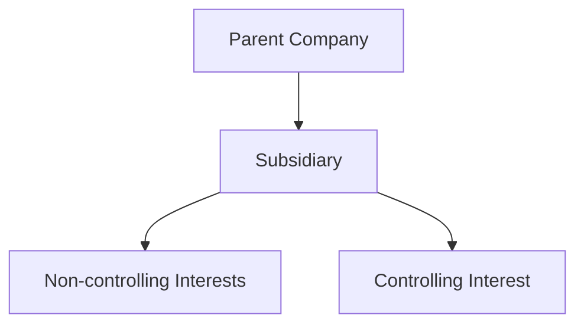

## 4.9 Non-controlling Interests

### Introduction to Non-controlling Interests

Non-controlling interests (NCI), also known as minority interests, represent the equity interests in a subsidiary that are not attributable to the parent company. In the context of consolidated financial statements, NCIs are crucial as they reflect the portion of equity in a subsidiary not owned by the parent company. Understanding NCIs is vital for accounting professionals, especially those preparing for Canadian accounting exams, as they play a significant role in the accurate presentation of financial statements.

### Importance in Financial Reporting

NCIs are essential for providing a complete picture of a parent company's financial position and performance. They ensure that the interests of minority shareholders in subsidiaries are recognized and reported. This recognition is crucial for transparency and accountability, as it affects the allocation of net income and equity between the parent and non-controlling shareholders.

### Regulatory Framework

In Canada, the accounting for NCIs is primarily governed by International Financial Reporting Standards (IFRS), specifically IFRS 10 - Consolidated Financial Statements. For private enterprises, the Accounting Standards for Private Enterprises (ASPE) provide guidance. Both frameworks emphasize the fair presentation of financial information and the importance of recognizing NCIs in consolidated financial statements.

### Recognition and Measurement of Non-controlling Interests

#### Initial Recognition

At the acquisition date, NCIs are recognized in the consolidated financial statements. The measurement of NCIs can be done using either the fair value method or the proportionate share of the acquiree's identifiable net assets. The choice between these methods can significantly impact the reported amounts of goodwill and NCIs.

- **Fair Value Method:** This approach measures NCIs at their fair value at the acquisition date. It reflects the market's perception of the value of the NCI and provides a comprehensive view of the subsidiary's value.
- **Proportionate Share Method:** This method measures NCIs based on their share of the acquiree's identifiable net assets. It is often used when the fair value of NCIs cannot be reliably measured.

#### Subsequent Measurement

After initial recognition, NCIs are adjusted for their share of the subsidiary's net income or loss and other comprehensive income. Dividends paid to NCIs also affect their carrying amount. The subsequent measurement ensures that changes in the subsidiary's equity are appropriately reflected in the consolidated financial statements.

### Presentation in Consolidated Financial Statements

NCIs are presented in the equity section of the consolidated balance sheet, separate from the equity attributable to the parent company's shareholders. In the consolidated income statement, the share of net income attributable to NCIs is deducted from the total net income to arrive at the net income attributable to the parent company.

### Practical Examples and Case Studies

#### Example 1: Acquisition and Initial Recognition

Consider a parent company, ABC Corp, acquiring 80% of XYZ Ltd. for $1,000,000. The fair value of XYZ Ltd.'s identifiable net assets is $1,200,000. The fair value of the NCI (20%) is determined to be $250,000.

- **Fair Value Method:** NCIs are recognized at $250,000.
- **Proportionate Share Method:** NCIs are recognized at 20% of $1,200,000, which is $240,000.

The choice of method affects the goodwill calculation and the reported equity in the consolidated financial statements.

#### Example 2: Subsequent Measurement

Assume XYZ Ltd. reports a net income of $200,000 for the year. Under the fair value method, the share of net income attributable to NCIs (20%) is $40,000. This amount is added to the NCI balance in the equity section of the balance sheet.

### Real-world Applications and Regulatory Scenarios

In practice, accounting for NCIs involves several complexities, especially in multi-tiered group structures where subsidiaries themselves have subsidiaries. Canadian accounting professionals must ensure compliance with IFRS and ASPE, considering factors such as changes in ownership interests and the impact of transactions with NCIs.

### Step-by-step Guidance for Accounting Procedures

1. **Determine the Acquisition Date:** Identify the date when the parent company gains control over the subsidiary.
2. **Measure NCIs:** Choose between the fair value method and the proportionate share method based on the availability of reliable fair value measurements.
3. **Adjust for Subsequent Changes:** Update the NCI balance for its share of the subsidiary's net income or loss and other comprehensive income.
4. **Present in Financial Statements:** Ensure NCIs are accurately presented in the equity section of the balance sheet and the income statement.

### Diagrams and Visual Aids

Below is a mermaid diagram illustrating the relationship between the parent company, subsidiary, and NCIs:

### Best Practices and Common Pitfalls

#### Best Practices

- **Consistent Measurement:** Ensure consistency in the measurement method for NCIs across reporting periods.
- **Clear Disclosure:** Provide clear disclosures regarding the measurement and presentation of NCIs in the financial statements.
- **Regular Review:** Regularly review the carrying amount of NCIs for any indicators of impairment or changes in ownership interests.

#### Common Pitfalls

- **Incorrect Measurement:** Avoid errors in measuring NCIs, especially when fair value cannot be reliably determined.
- **Inadequate Disclosure:** Ensure comprehensive disclosures to prevent misunderstandings regarding the nature and impact of NCIs.

### References to Canadian Accounting Standards

- **IFRS 10 - Consolidated Financial Statements:** Provides guidance on the consolidation of financial statements and the recognition of NCIs.
- **ASPE Section 1591 - Subsidiaries:** Offers guidance for private enterprises on accounting for subsidiaries and NCIs.

### Encouraging Practice and Application

To master the accounting for NCIs, practice preparing consolidated financial statements with varying ownership interests. Consider scenarios where ownership interests change over time, and understand the impact on NCIs and the overall financial statements.

### Summary of Key Points

- NCIs represent the equity interests in a subsidiary not owned by the parent company.
- They are recognized at the acquisition date and measured using either the fair value method or the proportionate share method.
- NCIs are presented in the equity section of the balance sheet and affect the allocation of net income in the income statement.
- Consistent measurement and clear disclosure are essential for accurate financial reporting.

### Sample Exam-style Questions

1. **What are Non-controlling Interests?**
   - Non-controlling interests represent the equity interests in a subsidiary not attributable to the parent company.

2. **How are NCIs measured at the acquisition date?**
   - NCIs can be measured using the fair value method or the proportionate share of the acquiree's identifiable net assets.

3. **Where are NCIs presented in the financial statements?**
   - NCIs are presented in the equity section of the consolidated balance sheet, separate from the parent company's equity.

4. **What is the impact of NCIs on net income allocation?**
   - The share of net income attributable to NCIs is deducted from the total net income to arrive at the net income attributable to the parent company.

5. **Why is clear disclosure important for NCIs?**
   - Clear disclosure ensures transparency and helps stakeholders understand the nature and impact of NCIs on the financial statements.

### Ready to Test Your Knowledge?



### What are Non-controlling Interests?

- [x] Equity interests in a subsidiary not attributable to the parent company
- [ ] Equity interests in a subsidiary attributable to the parent company
- [ ] Debt interests in a subsidiary not attributable to the parent company
- [ ] Debt interests in a subsidiary attributable to the parent company

> **Explanation:** Non-controlling interests represent the portion of equity in a subsidiary not owned by the parent company.

### How can NCIs be measured at the acquisition date?

- [x] Fair value method
- [x] Proportionate share of the acquiree's identifiable net assets
- [ ] Historical cost method
- [ ] Amortized cost method

> **Explanation:** NCIs can be measured using either the fair value method or the proportionate share of the acquiree's identifiable net assets.

### Where are NCIs presented in the financial statements?

- [x] Equity section of the consolidated balance sheet
- [ ] Liabilities section of the consolidated balance sheet
- [ ] Income statement
- [ ] Cash flow statement

> **Explanation:** NCIs are presented in the equity section of the consolidated balance sheet, separate from the parent company's equity.

### What is the impact of NCIs on net income allocation?

- [x] Deducted from total net income to arrive at net income attributable to the parent company
- [ ] Added to total net income to arrive at net income attributable to the parent company
- [ ] Ignored in the net income allocation
- [ ] Only considered in the cash flow statement

> **Explanation:** The share of net income attributable to NCIs is deducted from the total net income to arrive at the net income attributable to the parent company.

### Why is clear disclosure important for NCIs?

- [x] Ensures transparency and helps stakeholders understand the nature and impact of NCIs
- [ ] Reduces the complexity of financial statements
- [ ] Eliminates the need for consolidated financial statements
- [ ] Increases the reported net income

> **Explanation:** Clear disclosure ensures transparency and helps stakeholders understand the nature and impact of NCIs on the financial statements.

### What is the fair value method for measuring NCIs?

- [x] Measuring NCIs at their fair value at the acquisition date
- [ ] Measuring NCIs at historical cost
- [ ] Measuring NCIs at the book value of the subsidiary
- [ ] Measuring NCIs at the market value of the parent company

> **Explanation:** The fair value method measures NCIs at their fair value at the acquisition date, reflecting the market's perception of their value.

### What is the proportionate share method for measuring NCIs?

- [x] Measuring NCIs based on their share of the acquiree's identifiable net assets
- [ ] Measuring NCIs based on the parent company's net assets
- [ ] Measuring NCIs based on the subsidiary's liabilities
- [ ] Measuring NCIs based on the market value of the parent company

> **Explanation:** The proportionate share method measures NCIs based on their share of the acquiree's identifiable net assets.

### How are dividends paid to NCIs accounted for?

- [x] They reduce the carrying amount of NCIs in the equity section
- [ ] They increase the carrying amount of NCIs in the equity section
- [ ] They are ignored in the financial statements
- [ ] They are recorded as an expense in the income statement

> **Explanation:** Dividends paid to NCIs reduce the carrying amount of NCIs in the equity section of the balance sheet.

### What is the role of IFRS 10 in accounting for NCIs?

- [x] Provides guidance on the consolidation of financial statements and recognition of NCIs
- [ ] Provides guidance on the measurement of liabilities
- [ ] Provides guidance on the recognition of revenue
- [ ] Provides guidance on the accounting for intangible assets

> **Explanation:** IFRS 10 provides guidance on the consolidation of financial statements and the recognition of NCIs.

### True or False: NCIs are only relevant for public companies.

- [ ] True
- [x] False

> **Explanation:** NCIs are relevant for both public and private companies that have subsidiaries, as they impact the presentation of consolidated financial statements.



