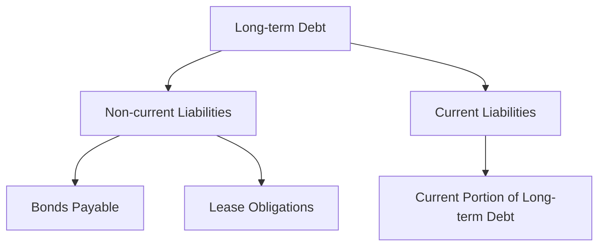

## 5.14 Financial Statement Presentation of Long-term Debt Instruments

### Introduction

The presentation of long-term debt instruments on financial statements is a critical aspect of accounting that affects how stakeholders perceive a company's financial health. Proper classification and presentation ensure transparency, compliance with accounting standards, and provide valuable insights into a company's leverage and financial obligations. This section will delve into the intricacies of presenting long-term debt on financial statements, focusing on the balance sheet, and will provide practical examples and regulatory considerations relevant to Canadian accounting exams.

### Understanding Long-term Debt

Long-term debt refers to financial obligations that are due beyond one year or the operating cycle of the business, whichever is longer. These obligations can include bonds payable, long-term notes payable, lease obligations, and other similar liabilities. Understanding the nature of these debts is crucial for their accurate presentation on financial statements.

### Balance Sheet Presentation

The balance sheet, also known as the statement of financial position, provides a snapshot of a company's financial standing at a specific point in time. Long-term debt is typically classified under non-current liabilities, reflecting the company's future obligations. Proper presentation involves:

- **Classification:** Long-term debt should be classified based on its nature and terms. This includes distinguishing between secured and unsecured debt, fixed and variable interest rates, and any covenants or restrictions associated with the debt.
  
- **Disclosure:** Detailed disclosures are required to provide clarity on the terms and conditions of the debt, including interest rates, maturity dates, covenants, and any collateral pledged.

- **Current Portion of Long-term Debt:** The portion of long-term debt that is due within the next year should be reclassified as a current liability. This reclassification provides a more accurate picture of the company's short-term obligations.

### Regulatory Framework

In Canada, the presentation of long-term debt on financial statements must comply with the International Financial Reporting Standards (IFRS) as adopted in Canada, or the Accounting Standards for Private Enterprises (ASPE) for private companies. Key standards include:

- **IFRS 9 - Financial Instruments:** This standard addresses the recognition and measurement of financial instruments, including long-term debt, and requires entities to classify and measure financial liabilities at amortized cost or fair value.

- **IAS 1 - Presentation of Financial Statements:** Provides guidelines on the structure and content of financial statements, including the classification of liabilities as current or non-current.

- **ASPE Section 3856 - Financial Instruments:** For private enterprises, this section provides guidance on the recognition, measurement, and presentation of financial instruments.

### Practical Examples and Case Studies

#### Example 1: Bond Issuance

Consider a company that issues bonds with a face value of $1,000,000, an interest rate of 5%, and a maturity of 10 years. The bonds are issued at a discount, with proceeds of $950,000. The balance sheet presentation would include:

- **Non-current Liabilities:** Bonds payable of $1,000,000, less the unamortized discount of $50,000, resulting in a net carrying amount of $950,000.
  
- **Current Liabilities:** If the bonds have a sinking fund requirement or a portion is due within the next year, that portion should be classified under current liabilities.

#### Example 2: Lease Obligations

A company enters into a lease agreement for equipment with a term of 5 years. Under IFRS 16, the company recognizes a lease liability and a corresponding right-of-use asset. The presentation would include:

- **Non-current Liabilities:** The lease liability, representing the present value of future lease payments, is classified as a non-current liability.

- **Current Liabilities:** The portion of the lease liability due within the next year is reclassified as a current liability.

### Real-world Applications

In practice, companies must ensure that their financial statement presentation aligns with regulatory requirements and provides stakeholders with a clear understanding of their financial obligations. This involves:

- **Regular Review and Reclassification:** Companies should regularly review their debt obligations to ensure proper classification and reclassification of the current portion of long-term debt.

- **Compliance with Covenants:** Many long-term debt agreements include covenants that require the company to maintain certain financial ratios. Non-compliance can lead to reclassification of debt as current, impacting the company's liquidity ratios.

- **Use of Notes and Disclosures:** Detailed notes and disclosures are essential for providing transparency and context to the financial statements. These should include information on interest rates, maturity dates, covenants, and any collateral.

### Step-by-step Guidance

1. **Identify Long-term Debt:** Begin by identifying all long-term debt obligations, including bonds, notes, and lease liabilities.

2. **Classify Debt:** Classify each obligation as either secured or unsecured, fixed or variable rate, and identify any covenants or restrictions.

3. **Calculate Current Portion:** Determine the portion of each long-term debt that is due within the next year and reclassify it as a current liability.

4. **Prepare Disclosures:** Draft detailed notes and disclosures that provide clarity on the terms and conditions of the debt, including interest rates, maturity dates, and any covenants.

5. **Review and Adjust:** Regularly review the classification and presentation of long-term debt to ensure compliance with accounting standards and accurate reflection of the company's financial position.

### Diagrams and Visuals

To enhance understanding, the following Mermaid.js diagram illustrates the classification and presentation of long-term debt on the balance sheet:

### Best Practices and Common Pitfalls

- **Best Practices:**
  - Ensure accurate classification and reclassification of debt.
  - Provide detailed disclosures to enhance transparency.
  - Regularly review debt covenants and compliance.

- **Common Pitfalls:**
  - Failing to reclassify the current portion of long-term debt.
  - Inadequate disclosures, leading to a lack of transparency.
  - Non-compliance with debt covenants, leading to reclassification as current liabilities.

### References and Additional Resources

- **CPA Canada Handbook:** Provides comprehensive guidance on accounting standards and practices in Canada.
- **IFRS Foundation:** Offers resources and updates on international accounting standards.
- **ASPE Guidelines:** Detailed guidance for private enterprises in Canada.

### Conclusion

The presentation of long-term debt on financial statements is a critical component of financial reporting that requires careful consideration and compliance with accounting standards. By understanding the classification, disclosure requirements, and regulatory framework, you can ensure accurate and transparent financial statements that provide valuable insights into a company's financial health.

---

## **Ready to Test Your Knowledge?**



### What is the primary classification for long-term debt on the balance sheet?

- [x] Non-current Liabilities
- [ ] Current Assets
- [ ] Equity
- [ ] Current Liabilities

> **Explanation:** Long-term debt is primarily classified as non-current liabilities on the balance sheet, reflecting obligations due beyond one year.

### Which standard provides guidelines on the presentation of financial statements?

- [x] IAS 1
- [ ] IFRS 9
- [ ] ASPE Section 3856
- [ ] IFRS 16

> **Explanation:** IAS 1 provides guidelines on the structure and content of financial statements, including the classification of liabilities.

### What portion of long-term debt should be reclassified as a current liability?

- [x] The portion due within the next year
- [ ] The entire amount
- [ ] The portion with variable interest rates
- [ ] The portion with fixed interest rates

> **Explanation:** The portion of long-term debt due within the next year should be reclassified as a current liability.

### What is a common pitfall in presenting long-term debt?

- [x] Failing to reclassify the current portion
- [ ] Over-disclosing terms and conditions
- [ ] Classifying all debt as non-current
- [ ] Ignoring interest rates

> **Explanation:** A common pitfall is failing to reclassify the current portion of long-term debt, which can misrepresent the company's short-term obligations.

### Which of the following is a best practice for presenting long-term debt?

- [x] Providing detailed disclosures
- [ ] Minimizing notes and disclosures
- [ ] Classifying all debt as current
- [ ] Ignoring debt covenants

> **Explanation:** Providing detailed disclosures is a best practice that enhances transparency and provides stakeholders with valuable information.

### What is the purpose of debt covenants?

- [x] To maintain certain financial ratios
- [ ] To increase interest rates
- [ ] To reduce the maturity period
- [ ] To eliminate the need for disclosures

> **Explanation:** Debt covenants are agreements that require the company to maintain certain financial ratios, ensuring financial stability and compliance.

### Which accounting standard is applicable for lease obligations?

- [x] IFRS 16
- [ ] IAS 1
- [ ] IFRS 9
- [ ] ASPE Section 3856

> **Explanation:** IFRS 16 addresses the recognition, measurement, and presentation of lease obligations on financial statements.

### What should be included in the disclosures for long-term debt?

- [x] Interest rates and maturity dates
- [ ] Only the total amount
- [ ] Only the current portion
- [ ] Only the non-current portion

> **Explanation:** Disclosures for long-term debt should include interest rates, maturity dates, covenants, and any collateral pledged.

### How often should companies review their debt obligations?

- [x] Regularly
- [ ] Annually
- [ ] Bi-annually
- [ ] Never

> **Explanation:** Companies should regularly review their debt obligations to ensure proper classification and compliance with covenants.

### True or False: All long-term debt must be classified as non-current liabilities.

- [ ] True
- [x] False

> **Explanation:** Not all long-term debt is classified as non-current liabilities; the portion due within the next year should be reclassified as current liabilities.


