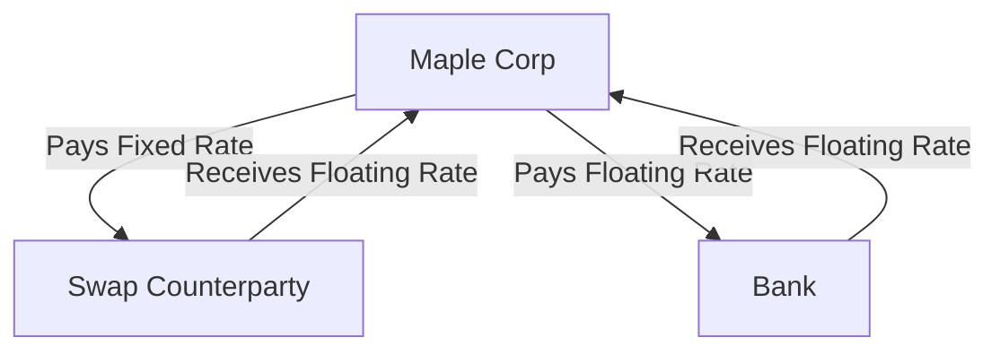

## 5.15 Interest Rate Swaps and Debt Management

Interest rate swaps are a pivotal tool in the arsenal of financial instruments used for debt management. They allow organizations to manage interest rate exposure and align their debt portfolios with their financial strategies. This section delves into the mechanics of interest rate swaps, their role in debt management, and the accounting practices associated with them, particularly within the context of Canadian accounting standards.

### Understanding Interest Rate Swaps

An interest rate swap is a financial derivative contract between two parties to exchange interest rate cash flows, based on a specified principal amount, over a set period. Typically, one party pays a fixed interest rate, while the other pays a floating rate, often linked to a benchmark like the Canadian Dollar Offered Rate (CDOR) or the London Interbank Offered Rate (LIBOR).

#### Key Components of Interest Rate Swaps

1. **Notional Principal Amount:** The hypothetical principal amount on which the swap payments are calculated. It is not exchanged between parties.
2. **Fixed Rate Payer:** The party that pays a predetermined fixed interest rate.
3. **Floating Rate Payer:** The party that pays a variable interest rate, which is reset periodically.
4. **Swap Term:** The duration over which the swap agreement is active.
5. **Settlement Dates:** The dates on which the interest payments are exchanged.

### Role of Interest Rate Swaps in Debt Management

Interest rate swaps are primarily used to manage interest rate risk, which is the risk that changes in interest rates will negatively affect an organization's financial position. By using swaps, companies can transform their interest rate exposure to better align with their financial objectives.

#### Benefits of Interest Rate Swaps

- **Hedging Interest Rate Risk:** Swaps allow companies to hedge against fluctuations in interest rates, stabilizing cash flows and protecting against adverse rate movements.
- **Cost Reduction:** By swapping to a more favorable interest rate, companies can reduce their overall interest expenses.
- **Flexibility:** Swaps provide flexibility in managing the interest rate profile of debt without altering the underlying debt structure.
- **Strategic Alignment:** They enable alignment of debt structures with strategic financial goals, such as matching the interest rate profile with revenue streams.

### Accounting for Interest Rate Swaps

The accounting treatment of interest rate swaps is governed by International Financial Reporting Standards (IFRS) as adopted in Canada, particularly IFRS 9, which deals with financial instruments. The key aspects of accounting for interest rate swaps include recognition, measurement, and disclosure.

#### Recognition and Measurement

1. **Initial Recognition:** At inception, interest rate swaps are recognized at fair value on the balance sheet.
2. **Subsequent Measurement:** After initial recognition, swaps are measured at fair value. Changes in fair value are recognized in profit or loss unless the swap qualifies for hedge accounting.

#### Hedge Accounting

Hedge accounting allows the matching of the timing of gain or loss recognition on the hedging instrument with the hedged item. To qualify for hedge accounting under IFRS 9, a swap must meet specific criteria:

- **Hedging Relationship:** There must be a formal designation and documentation of the hedging relationship and the entity's risk management objective and strategy.
- **Effectiveness:** The hedge must be expected to be highly effective in achieving offsetting changes in fair value or cash flows attributable to the hedged risk.
- **Hedge Effectiveness Testing:** Ongoing assessment of hedge effectiveness is required.

#### Types of Hedges

1. **Fair Value Hedge:** Used to hedge exposure to changes in the fair value of a recognized asset or liability or an unrecognized firm commitment.
2. **Cash Flow Hedge:** Used to hedge exposure to variability in cash flows attributable to a particular risk associated with a recognized asset or liability or a highly probable forecast transaction.

### Practical Example of an Interest Rate Swap

Consider a Canadian company, Maple Corp, which has a CAD 10 million floating-rate loan linked to the CDOR. To manage its interest rate risk, Maple Corp enters into an interest rate swap agreement to pay a fixed rate of 3% and receive a floating rate equivalent to CDOR.

#### Swap Mechanics

- **Notional Principal:** CAD 10 million
- **Fixed Rate:** 3%
- **Floating Rate:** CDOR
- **Swap Term:** 5 years

By entering into this swap, Maple Corp effectively converts its floating-rate liability into a fixed-rate liability, stabilizing its interest payments over the swap term.

### Real-World Applications and Regulatory Scenarios

Interest rate swaps are widely used in various industries, including banking, manufacturing, and utilities, to manage interest rate exposure. In Canada, the regulatory framework for derivatives, including swaps, is overseen by the Canadian Securities Administrators (CSA) and the Office of the Superintendent of Financial Institutions (OSFI).

#### Compliance Considerations

- **Derivative Reporting:** Entities must report derivative transactions to a trade repository as per CSA regulations.
- **Risk Management Policies:** Companies should have robust risk management policies and procedures to manage derivative exposures.
- **Disclosure Requirements:** Comprehensive disclosure of derivative activities, including swaps, is required in financial statements.

### Step-by-Step Guidance for Accounting Procedures

1. **Identify the Hedged Item and Risk:** Determine the specific exposure to be hedged and the risk associated with it.
2. **Select the Appropriate Swap:** Choose a swap that aligns with the hedging strategy and risk management objectives.
3. **Document the Hedging Relationship:** Prepare formal documentation outlining the hedging relationship, risk management objectives, and strategy.
4. **Perform Hedge Effectiveness Testing:** Conduct initial and ongoing effectiveness testing to ensure the hedge meets the criteria for hedge accounting.
5. **Record Swap Transactions:** Recognize the swap at fair value and record changes in fair value in accordance with the hedge accounting model.
6. **Disclose Swap Activities:** Provide detailed disclosures in financial statements, including the nature and extent of risks arising from derivatives.

### Diagrams and Visuals

To enhance understanding, let's visualize the flow of cash flows in an interest rate swap:

### Best Practices and Common Pitfalls

#### Best Practices

- **Align Swaps with Business Strategy:** Ensure swaps align with the overall business strategy and risk management objectives.
- **Regular Monitoring:** Continuously monitor swap positions and market conditions to adjust strategies as needed.
- **Comprehensive Documentation:** Maintain thorough documentation of all swap transactions and hedging relationships.

#### Common Pitfalls

- **Ineffective Hedges:** Failing to meet hedge effectiveness criteria can result in volatility in financial statements.
- **Inadequate Disclosure:** Insufficient disclosure of swap activities can lead to regulatory scrutiny and investor concerns.
- **Over-reliance on Swaps:** Excessive reliance on swaps without a clear strategy can lead to increased risk exposure.

### References and Additional Resources

- **IFRS 9 Financial Instruments:** Provides guidance on the accounting for financial instruments, including swaps.
- **CPA Canada Handbook:** Offers comprehensive guidance on Canadian accounting standards and practices.
- **Canadian Securities Administrators (CSA):** Regulates derivatives markets and provides compliance guidelines.
- **Office of the Superintendent of Financial Institutions (OSFI):** Oversees financial institutions and their risk management practices.

### Conclusion

Interest rate swaps are a powerful tool for managing interest rate risk and optimizing debt portfolios. By understanding the mechanics, accounting practices, and regulatory requirements, organizations can effectively leverage swaps to achieve their financial objectives. As you prepare for the Canadian Accounting Exams, focus on the key concepts, practical applications, and compliance considerations outlined in this section.

## **Ready to Test Your Knowledge?**



### What is the primary purpose of an interest rate swap?

- [x] To manage interest rate risk
- [ ] To increase debt levels
- [ ] To reduce principal amounts
- [ ] To eliminate all financial risks

> **Explanation:** Interest rate swaps are primarily used to manage interest rate risk by allowing parties to exchange interest rate cash flows.

### Which of the following is NOT a component of an interest rate swap?

- [ ] Notional principal amount
- [x] Actual principal exchange
- [ ] Fixed rate payer
- [ ] Floating rate payer

> **Explanation:** In an interest rate swap, the notional principal amount is used for calculations, but there is no actual exchange of principal.

### Under IFRS 9, what is required for a swap to qualify for hedge accounting?

- [x] Formal designation and documentation of the hedging relationship
- [ ] A minimum swap term of 10 years
- [ ] A fixed interest rate
- [ ] A floating interest rate

> **Explanation:** To qualify for hedge accounting under IFRS 9, there must be formal designation and documentation of the hedging relationship.

### What is the benefit of a cash flow hedge?

- [x] It stabilizes cash flows by hedging variability in cash flows.
- [ ] It increases the variability of cash flows.
- [ ] It eliminates all financial risks.
- [ ] It increases interest expenses.

> **Explanation:** A cash flow hedge is used to stabilize cash flows by hedging against variability in cash flows attributable to a particular risk.

### Which regulatory body oversees derivative transactions in Canada?

- [x] Canadian Securities Administrators (CSA)
- [ ] Financial Accounting Standards Board (FASB)
- [ ] International Accounting Standards Board (IASB)
- [ ] Securities and Exchange Commission (SEC)

> **Explanation:** The Canadian Securities Administrators (CSA) oversee derivative transactions in Canada.

### What is the role of the fixed rate payer in an interest rate swap?

- [x] To pay a predetermined fixed interest rate
- [ ] To pay a variable interest rate
- [ ] To exchange principal amounts
- [ ] To eliminate interest rate risk

> **Explanation:** The fixed rate payer in an interest rate swap pays a predetermined fixed interest rate.

### What is a common pitfall in using interest rate swaps?

- [x] Failing to meet hedge effectiveness criteria
- [ ] Increasing principal amounts
- [ ] Eliminating all financial risks
- [ ] Reducing interest expenses

> **Explanation:** A common pitfall is failing to meet hedge effectiveness criteria, which can lead to volatility in financial statements.

### What is the purpose of hedge effectiveness testing?

- [x] To ensure the hedge meets criteria for hedge accounting
- [ ] To increase interest rate risk
- [ ] To eliminate all financial risks
- [ ] To exchange principal amounts

> **Explanation:** Hedge effectiveness testing ensures the hedge meets the criteria for hedge accounting.

### What is the significance of the notional principal amount in a swap?

- [x] It is the basis for calculating interest payments.
- [ ] It is exchanged between parties.
- [ ] It determines the swap term.
- [ ] It eliminates interest rate risk.

> **Explanation:** The notional principal amount is used as the basis for calculating interest payments in a swap.

### Interest rate swaps are primarily used for managing which type of risk?

- [x] True
- [ ] False

> **Explanation:** Interest rate swaps are primarily used for managing interest rate risk.


