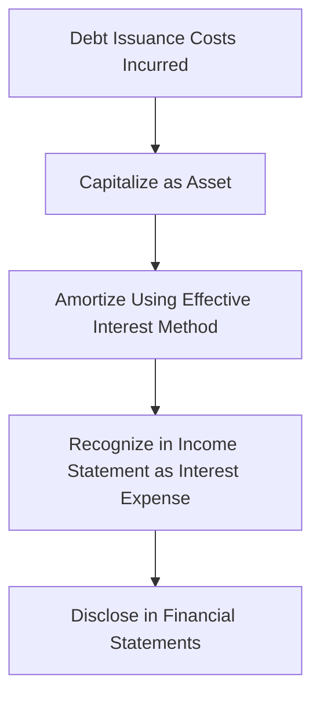

## 5.2 Debt Issuance Costs

Debt issuance costs are a critical aspect of financial accounting for long-term debt instruments. These costs, incurred during the process of issuing debt, include underwriting fees, legal fees, registration fees, and other related expenses. Understanding how to account for these costs is essential for accurate financial reporting and compliance with Canadian accounting standards. This section provides a comprehensive guide to the recognition, measurement, and amortization of debt issuance costs, offering practical examples and insights into regulatory frameworks.

### Understanding Debt Issuance Costs

Debt issuance costs are the expenses directly attributable to issuing debt securities. These costs are capitalized and amortized over the life of the debt instrument, aligning with the matching principle in accounting. The primary objective is to ensure that the costs are recognized in the same period as the benefits derived from the debt.

#### Common Types of Debt Issuance Costs

1. **Underwriting Fees:** Payments made to investment banks or underwriters for their services in managing the issuance process.
2. **Legal Fees:** Costs incurred for legal services related to drafting and reviewing contracts and compliance documents.
3. **Registration Fees:** Expenses associated with registering the debt securities with regulatory bodies.
4. **Printing and Engraving Costs:** Costs for printing prospectuses and other necessary documents.
5. **Accounting and Auditing Fees:** Fees for accounting services and audits related to the issuance.
6. **Rating Agency Fees:** Payments to credit rating agencies for assessing the creditworthiness of the debt.

### Accounting for Debt Issuance Costs

#### Initial Recognition

Debt issuance costs are initially recognized as an asset on the balance sheet. According to International Financial Reporting Standards (IFRS) as adopted in Canada, these costs are not expensed immediately but are instead deferred and amortized over the term of the debt.

#### Measurement

The costs are measured at their fair value at the date of issuance. The total amount of debt issuance costs is deducted from the carrying amount of the debt liability on the balance sheet.

#### Amortization of Debt Issuance Costs

The amortization of debt issuance costs is done using the effective interest method. This method ensures that the costs are spread evenly over the life of the debt, reflecting the time value of money. The amortization expense is recognized in the income statement as part of interest expense.

**Example:**

Consider a company that issues a $1,000,000 bond with a 5-year term and incurs $50,000 in debt issuance costs. The effective interest rate method will be used to amortize these costs over the bond's life.

- **Initial Recognition:** The bond is recorded at $950,000 ($1,000,000 - $50,000).
- **Amortization:** Each year, a portion of the $50,000 is amortized and added to the interest expense.

#### Journal Entries for Debt Issuance Costs

1. **Initial Recognition:**

   ```
   Debit: Debt Issuance Costs (Asset) $50,000
   Credit: Cash $50,000
   ```

2. **Amortization (Yearly):**

   ```
   Debit: Interest Expense $10,000
   Credit: Debt Issuance Costs (Asset) $10,000
   ```

### Regulatory Framework and Compliance

#### IFRS and ASPE Guidelines

Under IFRS, debt issuance costs are treated as a reduction of the carrying amount of the debt. The amortization of these costs is included in the interest expense. The Accounting Standards for Private Enterprises (ASPE) in Canada also provide similar guidelines, emphasizing the importance of matching expenses with the periods they benefit.

#### Disclosure Requirements

Companies must disclose the total amount of debt issuance costs and the method of amortization in their financial statements. This transparency ensures that stakeholders have a clear understanding of the financial impact of these costs.

### Practical Examples and Case Studies

#### Case Study: ABC Corporation

ABC Corporation issued a 10-year bond worth $5,000,000 with $200,000 in debt issuance costs. The company used the effective interest method for amortization.

- **Initial Entry:**

  ```
  Debit: Debt Issuance Costs $200,000
  Credit: Cash $200,000
  ```

- **Amortization (Yearly):**

  ```
  Debit: Interest Expense $20,000
  Credit: Debt Issuance Costs $20,000
  ```

This approach ensures that the costs are systematically expensed over the bond's life, aligning with the periods in which the company benefits from the debt.

### Challenges and Best Practices

#### Common Pitfalls

1. **Incorrect Amortization Method:** Using a straight-line method instead of the effective interest method can lead to inaccurate financial reporting.
2. **Incomplete Disclosure:** Failing to disclose the nature and amount of debt issuance costs can result in compliance issues.

#### Best Practices

1. **Accurate Record-Keeping:** Maintain detailed records of all costs associated with debt issuance.
2. **Regular Review:** Periodically review the amortization schedule to ensure compliance with accounting standards.
3. **Consultation with Experts:** Engage with accounting professionals to navigate complex regulatory requirements.

### Real-World Applications

Debt issuance costs have significant implications for a company's financial health and reporting. Proper accounting for these costs can impact a company's leverage ratios, interest coverage ratios, and overall financial performance. Understanding these implications is crucial for accountants and financial analysts.

### Step-by-Step Guidance

1. **Identify Debt Issuance Costs:** Determine all costs directly attributable to the issuance of debt.
2. **Record Initial Costs:** Capitalize these costs as an asset on the balance sheet.
3. **Amortize Costs:** Use the effective interest method to amortize the costs over the debt's life.
4. **Disclose Information:** Ensure all relevant information is disclosed in the financial statements.

### Diagrams and Visual Aids

Below is a diagram illustrating the flow of accounting for debt issuance costs:



### References and Additional Resources

- **CPA Canada Handbook:** Provides authoritative guidance on accounting standards in Canada.
- **IFRS Standards:** Offers detailed explanations of international accounting practices.
- **ASPE Guidelines:** Specific to private enterprises in Canada, outlining relevant accounting treatments.

### Summary

Debt issuance costs are an integral part of financial accounting for long-term debt. Proper recognition, measurement, and amortization of these costs ensure compliance with accounting standards and provide stakeholders with accurate financial information. By following best practices and understanding regulatory requirements, accountants can effectively manage these costs and enhance financial reporting.

## **Ready to Test Your Knowledge?**



### What are debt issuance costs?

- [x] Costs incurred during the process of issuing debt
- [ ] Costs associated with repaying debt
- [ ] Costs related to equity issuance
- [ ] Costs for asset acquisition

> **Explanation:** Debt issuance costs are expenses directly related to the process of issuing debt securities, such as underwriting and legal fees.

### How are debt issuance costs initially recognized?

- [x] As an asset on the balance sheet
- [ ] As an expense in the income statement
- [ ] As a liability on the balance sheet
- [ ] As equity in the statement of changes in equity

> **Explanation:** Debt issuance costs are initially recognized as an asset and amortized over the life of the debt.

### Which method is used to amortize debt issuance costs?

- [x] Effective interest method
- [ ] Straight-line method
- [ ] Declining balance method
- [ ] Units of production method

> **Explanation:** The effective interest method is used to amortize debt issuance costs, aligning with the matching principle.

### What is the impact of debt issuance costs on the carrying amount of debt?

- [x] They reduce the carrying amount of the debt
- [ ] They increase the carrying amount of the debt
- [ ] They have no impact on the carrying amount
- [ ] They are recorded as a separate liability

> **Explanation:** Debt issuance costs are deducted from the carrying amount of the debt on the balance sheet.

### Which of the following is a common type of debt issuance cost?

- [x] Underwriting fees
- [ ] Depreciation expense
- [ ] Inventory costs
- [ ] Marketing expenses

> **Explanation:** Underwriting fees are a common type of debt issuance cost incurred during the issuance process.

### What must companies disclose regarding debt issuance costs?

- [x] Total amount and method of amortization
- [ ] Only the total amount
- [ ] Only the method of amortization
- [ ] No disclosure is required

> **Explanation:** Companies must disclose both the total amount of debt issuance costs and the method of amortization in their financial statements.

### What is the primary objective of amortizing debt issuance costs?

- [x] To match expenses with the periods they benefit
- [ ] To reduce tax liability
- [ ] To increase net income
- [ ] To comply with legal requirements

> **Explanation:** Amortizing debt issuance costs ensures that expenses are matched with the periods in which the related benefits are realized.

### How are debt issuance costs treated under IFRS?

- [x] As a reduction of the carrying amount of the debt
- [ ] As an increase in the carrying amount of the debt
- [ ] As a separate liability
- [ ] As an immediate expense

> **Explanation:** Under IFRS, debt issuance costs are treated as a reduction of the carrying amount of the debt and amortized over its life.

### What is a potential pitfall in accounting for debt issuance costs?

- [x] Using the incorrect amortization method
- [ ] Overstating revenue
- [ ] Understating liabilities
- [ ] Misclassifying assets

> **Explanation:** Using an incorrect amortization method, such as straight-line instead of effective interest, can lead to inaccurate financial reporting.

### True or False: Debt issuance costs are expensed immediately upon incurring.

- [ ] True
- [x] False

> **Explanation:** Debt issuance costs are not expensed immediately; they are capitalized and amortized over the life of the debt.


